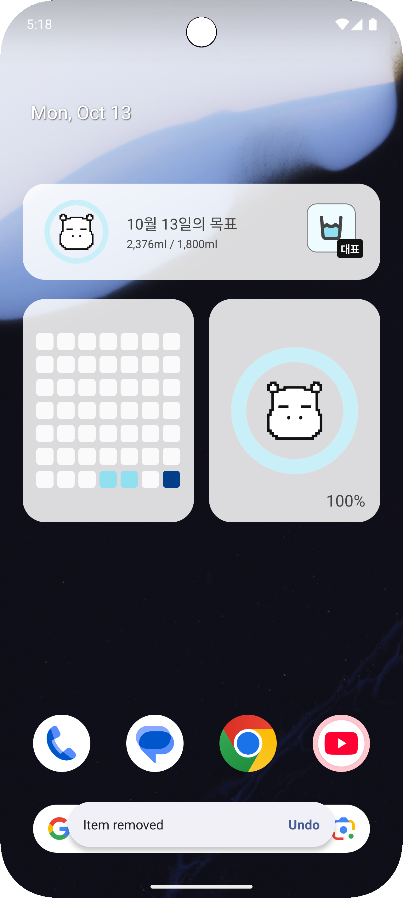
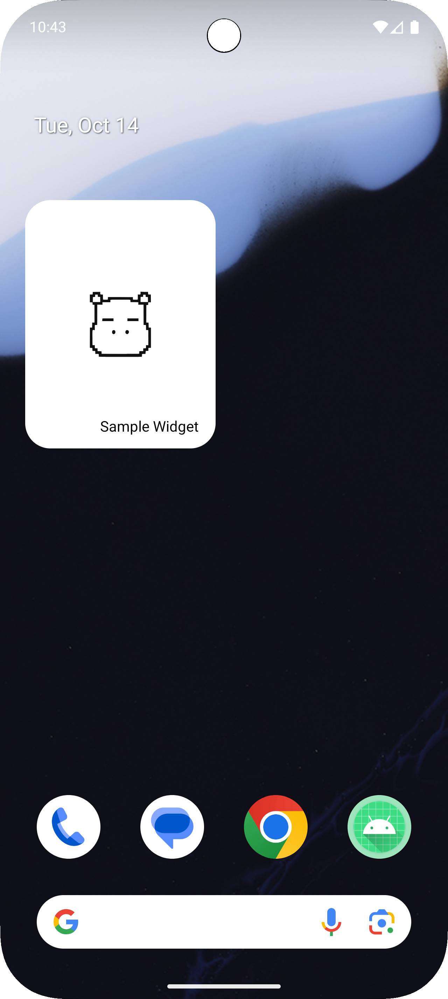

# Android 위젯, 홈 화면에서 확장되는 사용자 경험

## 안드로이드 위젯 개요

## 🙋‍♀️ 위젯을 도입한 이유

우리 팀이 개발한 `물깜`은 사용자의 하루 음용량을 기록하고, 물을 더 자주 마시도록 도와주는 앱입니다.
하지만 실제 사용자 피드백에서 “더 간단하게, 한번의 클릭으로 물을 마시고 싶다”라는 의견이 많았습니다.
단순히 물을 마신 횟수를 기록하는 행위조차 앱 진입 과정을 거치면 사용성이 떨어지고 있었습니다.

그래서 우리는
**“앱을 열지 않고도 한 번의 클릭으로 물을 기록할 수 있다면 어떨까?”**
라는 생각에서 위젯 기능을 도입했습니다.

위젯을 통해 사용자는 홈 화면에서 바로 ‘컵’ 버튼을 눌러 음용량을 기록할 수 있고,
오늘의 달성률도 한눈에 확인할 수 있습니다.
그 결과, 물깜은 단순한 기록 앱을 넘어 습관 형성을 돕는 직관적인 경험을 제공하게 되었습니다.



### 위젯이란?

위젯은 사용자의 홈 화면이나 잠금 화면 등에서 직접 상호작용할 수 있는 작고 인터랙티브한 UI 컴포넌트입니다.
흔히 '미니 앱'처럼 생각할 수 있으며, 애플리케이션을 실행하지 않고도 주요 정보에 접근하거나 자주 사용하는 기능(예: 음악 재생, 날씨 확인, 일정 보기)을 빠르게 조작할 수 있도록 도와줍니다.

위젯은 단순히 정보를 표시하는 것을 넘어, 사용자와 상호작용할 수 있는 버튼, 목록, 이미지 등을 포함할 수 있어 앱의 유용성과 접근성을 크게 높여 줍니다.

### 홈 화면에서 사용자와 상호작용할 수 있는 작은 UI 컴포넌트

위젯은 애플리케이션의 핵심 기능을 홈 화면에 직접 노출하여, 사용자가 앱을 열지 않고도 정보를 한눈에 파악하고 빠르게 조작할 수 있도록 설계된 작은 사용자 인터페이스(UI) 구성 요소입니다.
이러한 특성 덕분에 위젯은 다음과 같은 중요한 역할을 수행합니다.

1. 정보 접근성 향상: 실시간 날씨, 주식 시세, 받은 편지함의 새 메일 수 등 지속적으로 업데이트되는 정보를 즉시 보여줍니다.

2. 빠른 기능 실행: 음악 재생/정지 버튼, 할 일 목록 체크박스, 카메라 바로 가기 등 자주 사용하는 액션을 클릭 한 번으로 실행할 수 있게 합니다.

3. 앱 경험 확장: 단순한 아이콘을 넘어, 앱의 브랜드 아이덴티티와 핵심 콘텐츠를 홈 화면에 녹여내 사용자 경험을 풍부하게 만듭니다.

즉, 위젯은 앱의 미리보기이자 리모컨처럼 작동해, 사용자가 Android 기기를 더욱 효율적으로 활용하도록 돕는 핵심 요소입니다.

## 🔩 위젯 구성 요소

Android 위젯은 사용자의 홈 화면에서 동작해야 하므로, 일반적인 Activity 기반의 UI 구성 방식과는 다소 다릅니다.
위젯은 앱 프로세스가 아닌 홈 화면(Launcher) 프로세스에서 실행되기 때문에, UI를 원격으로 제어하기 위한 특별한 구성 요소들이 필요합니다.

### 📌 AppWidgetProvider

`AppWidgetProvider`는 위젯의 브로드캐스트 리시버(Broadcast Receiver) 역할을 수행하는 핵심 클래스입니다.

- 역할: 홈 화면에서 발생하는 위젯 관련 이벤트(예: 위젯 추가, 업데이트 주기 도달, 삭제)를 수신하고 처리합니다.

- 기능: 위젯의 생명주기 콜백 메서드들을 구현하며, 이 메서드들 내에서 위젯의 UI를 업데이트하거나 데이터를 초기화하는 등의 작업을 수행합니다.

- 특징: 이 클래스는 위젯의 "컨트롤러"와 같으며, 위젯의 수명 동안 발생하는 모든 주요 상호작용의 게이트웨이 역할을 담당합니다.

```kotlin
class Widget : AppWidgetProvider() {

    override fun onAppWidgetOptionsChanged(context: Context?, appWidgetManager: AppWidgetManager?, appWidgetId: Int, newOptions: Bundle?) {
        super.onAppWidgetOptionsChanged(context, appWidgetManager, appWidgetId, newOptions)
    }

    override fun onDeleted(context: Context?, appWidgetIds: IntArray?) {
        super.onDeleted(context, appWidgetIds)
    }

    override fun onEnabled(context: Context?) {
        super.onEnabled(context)
    }

    override fun onDisabled(context: Context?) {
        super.onDisabled(context)
    }

    override fun onUpdate(context: Context?, appWidgetManager: AppWidgetManager?, appWidgetIds: IntArray?) {
        super.onUpdate(context, appWidgetManager, appWidgetIds)
    }

    override fun onReceive(context: Context?, intent: Intent?) {
        super.onReceive(context, intent)
    }
}
```

### 📌 RemoteViews

`RemoteViews`는 위젯의 **사용자 인터페이스(UI)** 를 정의하고 관리하는 클래스입니다.

- 필요성: 위젯의 UI는 앱의 프로세스가 아닌 홈 화면 프로세스에서 렌더링 되므로, 직접적인 뷰(View) 객체 조작이 불가능합니다. RemoteViews는 이 문제를 해결하기 위해 도입되었습니다.

- 역할: 레이아웃 파일(XML)을 기반으로 위젯의 UI 계층 구조와 내용을 정의합니다.

- 원리: RemoteViews는 XML 레이아웃을 설명하는 명령어의 꾸러미이며, 이 명령어를 홈 화면 프로세스로 전달(직렬화) 하여, 홈 화면이 원격으로 위젯 UI를 생성하고 업데이트하도록 합니다.

- 제한: 보안상의 이유로 RemoteViews에서 사용할 수 있는 뷰의 종류는 TextView, ImageView, Button 등 제한적입니다. 복잡한 커스텀 뷰는 사용할 수 없습니다.

```xml
<?xml version="1.0" encoding="utf-8"?>
<FrameLayout xmlns:android="http://schemas.android.com/apk/res/android"
             android:id="@+id/main"
             android:layout_width="match_parent"
             android:layout_height="match_parent"
             android:background="@drawable/bg_common_rectangle_12dp"
             android:backgroundTint="@color/white"
             android:orientation="vertical">

    <FrameLayout
            android:layout_width="match_parent"
            android:layout_height="match_parent"
            android:layout_gravity="center"
            android:layout_marginHorizontal="16dp">

        <ImageView
                android:id="@+id/iv_donut_chart"
                android:layout_width="match_parent"
                android:layout_height="match_parent" />

        <ImageView
                android:id="@+id/iv_character"
                android:layout_width="match_parent"
                android:layout_height="match_parent"
                android:layout_marginHorizontal="18dp"
                android:src="@drawable/img_widget_character" />

    </FrameLayout>

    <TextView
            android:id="@+id/tv_achievement_rate"
            android:text="Sample Widget"
            android:layout_width="wrap_content"
            android:layout_height="wrap_content"
            android:layout_gravity="end|bottom"
            android:layout_marginEnd="16dp"
            android:layout_marginBottom="12dp"
            android:textColor="@color/black" />
</FrameLayout>
```

### 📌 AppWidgetProviderInfo(XML)

`AppWidgetProviderInfo`는 위젯의 메타데이터를 담고 있는 XML 파일이며, 위젯이 시스템에 자신을 소개하는 **"설명서"** 와 같습니다.

- **위치:** 일반적으로 res/xml/ 폴더에 위치하며, 매니페스트(AndroidManifest.xml)의 `<receiver>` 태그 내에서 참조됩니다.

- **역할:** 홈 화면에 위젯을 추가할 때 필요한 모든 설정 정보를 제공합니다.

- **주요 속성:**

  - minWidth, minHeight: 위젯이 차지할 최소 크기 (셀 단위가 아닌 dp 단위).

  - updatePeriodMillis: 위젯이 onUpdate() 콜백을 통해 자동으로 업데이트될 주기.

  - initialLayout: 위젯의 UI를 정의하는 RemoteViews 레이아웃 파일.

  - configure: 위젯 추가 시 사용자 설정을 위한 설정 Activity의 이름 (선택 사항).

- **요약:** 위젯은 **AppWidgetProvider(컨트롤러)** 가 이벤트를 받아 **RemoteViews(원격 UI 설명서)** 를 만들어 홈 화면에 전달하고, **AppWidgetProviderInfo(메타데이터)** 는 위젯의 속성을 정의하는 구조로 동작합니다.

```xml
<?xml version="1.0" encoding="utf-8"?>
<appwidget-provider xmlns:android="http://schemas.android.com/apk/res/android"
                    android:initialKeyguardLayout="@layout/layout_widget"
                    android:initialLayout="@layout/layout_widget"
                    android:minWidth="110dp"
                    android:minHeight="110dp"
                    android:updatePeriodMillis="7200000"
                    android:widgetCategory="home_screen" />

```

## 🫀 위젯 생명주기와 콜백 메서드

`AppWidgetProvider` 클래스는 위젯의 생명주기 동안 발생하는 주요 이벤트에 응답하기 위한 콜백 메서드들을 제공합니다. 개발자는 이 메서드들을 오버라이드 하여 위젯의 초기 설정, 데이터 업데이트, 리소스 정리 등의 작업을 수행합니다.

### onUpdate()

```kotlin
public void onUpdate(Context context, AppWidgetManager appWidgetManager, int[] appWidgetIds)
```

`onUpdate()` 메서드는 위젯 생명주기에서 가장 중요하고 자주 호출되는 콜백입니다.

호출 시점:

- 사용자가 홈 화면에 위젯을 처음 추가할 때 (최초 한 번).

- `AppWidgetProviderInfo XML`에 정의된 **업데이트 주기(updatePeriodMillis)** 에 도달했을 때.

- 앱에서 명시적으로 업데이트를 요청했을 때.

주요 역할:

- 위젯의 UI를 업데이트하고 데이터를 새로 고칩니다.

- `RemoteViews` 객체를 구성하고 `AppWidgetManager`를 통해 홈 화면에 변경 사항을 적용하는 핵심 로직이 들어갑니다.

주의: **업데이트 주기(updatePeriodMillis)** 를 너무 짧게 설정하면 배터리 소모가 커질 수 있으므로, 시스템은 최소 30분 간격으로만 업데이트를 보장합니다.

### onEnabled() / onDisabled()

```kotlin
public void onEnabled(Context context)

public void onDisabled(Context context)
```

이 두 메서드는 위젯의 전체 인스턴스 수와 관련된 전역 생명주기 이벤트입니다.

#### onEnabled()

호출 시점: 해당 위젯 타입의 첫 번째 인스턴스가 홈 화면에 추가될 때 딱 한 번 호출됩니다.

주요 역할: 모든 인스턴스에 공통적으로 적용되는 리소스(예: 데이터베이스 연결, 백그라운드 스레드 시작, 전역 캐시 초기화)를 초기 설정하는 데 사용됩니다.

#### onDisabled()

호출 시점: 홈 화면에 있던 해당 위젯 타입의 마지막 인스턴스마저 삭제될 때 호출됩니다.

주요 역할: `onEnabled()`에서 할당했던 모든 전역 리소스(예: 데이터베이스 닫기, 스레드 정리, 리스너 해제)를 해제하고 정리하는 데 사용됩니다.

### onDeleted()

```kotlin
public void onDeleted(Context context, int[] appWidgetIds)
```

`onDeleted()` 메서드는 위젯의 개별 인스턴스가 삭제될 때 호출됩니다.

호출 시점: 사용자가 특정 위젯 인스턴스 하나를 홈 화면에서 제거할 때마다 호출됩니다.

주요 역할: 해당 특정 위젯 인스턴스에만 연결된 리소스나 설정 정보(예: 위젯별 저장된 데이터, 설정값)를 정리하는 데 사용됩니다.

### onAppWidgetOptionsChanged()

```kotlin
public void onAppWidgetOptionsChanged(Context context, AppWidgetManager appWidgetManager, int appWidgetId, Bundle newOptions)
```

이 콜백은 위젯의 크기나 옵션이 변경되었을 때 유용하게 사용됩니다.

호출 시점:

- 위젯이 처음 배치될 때(최초 한 번).

- 사용자가 위젯의 크기를 조절했을 때.

- 위젯을 잠금 화면 등 다른 컨테이너로 옮겼을 때.

주요 역할:

- 메서드 내에서 변경된 위젯의 현재 크기 정보(options)를 확인할 수 있습니다.

- 위젯 크기에 따라 다른 레이아웃을 적용하거나 콘텐츠를 재배열하는 반응형 위젯을 구현할 때 핵심적으로 사용됩니다.

### onReceived()

```kotlin
public abstract void onReceive(Context var1, Intent var2)
```

`onReceived()`는 `AppWidgetProvider`가 브로드캐스트 리시버임을 증명하는 기본 메서드입니다.

역할:

위에서 설명한 모든 콜백 메서드(onUpdate, onDeleted 등)가 사실 시스템 브로드캐스트를 통해 `onReceived()`로 전달됩니다.
`AppWidgetProvider`는 이 브로드캐스트의 **액션(Action)** 을 분석하여 적절한 콜백 메서드를 호출하도록 구현되어 있습니다.

개발자 사용: 일반적으로 개발자는 이 메서드를 직접 오버라이드 할 필요는 없지만, 커스텀 브로드캐스트를 받아 처리해야 할 때 이 메서드를 오버라이드 하여 `super.onReceived()`를 호출하기 전에 커스텀 로직을 추가할 수 있습니다

## 📝 AndroidManifest 등록

위젯을 구현하는 클래스(AppWidgetProvider)를 정의했다면,
이제 시스템이 해당 클래스를 인식하도록 `AndroidManifest.xml`에 등록해야 합니다.

다음 코드를 `AndroidManifest.xml`의 `<application> 태그` 내부에 추가합니다.

```xml
<receiver
    android:name=".Widget"
    android:exported="false">
    <intent-filter>
        <action android:name="android.appwidget.action.APPWIDGET_UPDATE" />
    </intent-filter>

    <meta-data
        android:name="android.appwidget.provider"
        android:resource="@xml/widget_info" />
</receiver>
```
이 설정은 안드로이드 시스템에
`“Widget"`이라는 `AppWidgetProvider`가 있고,
그 메타데이터는 `res/xml/widget_info.xml`에 정의되어 있다는 것을 알려줍니다.

이제 이 구성을 통해 시스템이 위젯을 인식하고 홈 화면에 추가할 수 있게 됩니다.



## 마무리: 위젯이 만드는 더 가까운 사용자 경험

안드로이드 위젯은 단순히 정보를 표시하는 ‘작은 창’이 아닙니다.
사용자가 앱을 열지 않아도 홈 화면에서 바로 주요 기능을 이용할 수 있게 하는, 가장 직관적이고 접근성 높은 인터페이스입니다.

잘 설계된 위젯은 사용자의 일상 속에 자연스럽게 스며들어
앱을 여는 과정을 줄이고, 자주 사용하는 기능에 더 빠르게 접근할 수 있게 합니다.
또한 브랜드의 정체성과 앱의 가치를 홈 화면 위에서 지속적으로 드러내며,
앱과 사용자 사이의 연결을 더욱 단단하게 만들어 줍니다.

결국 위젯은 사용자의 편의성을 높이는 동시에
앱의 존재감을 강화하고, ‘가깝고 친숙한’ 사용자 경험을 완성합니다.
사용자가 앱을 더 자주, 더 자연스럽게 떠올리게 하는 힘 — 그것이 바로 위젯의 가치입니다.

따라서 개발자는 단순히 기능을 구현하는 데 그치지 않고,
“이 위젯이 사용자에게 어떤 편안함을 줄 수 있을까?” 를 고민해야 합니다.
그 질문에서부터 진짜 ‘좋은 위젯 경험’이 시작됩니다.
