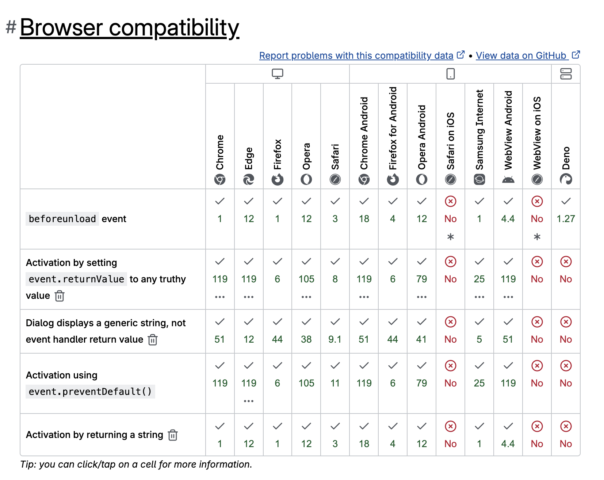
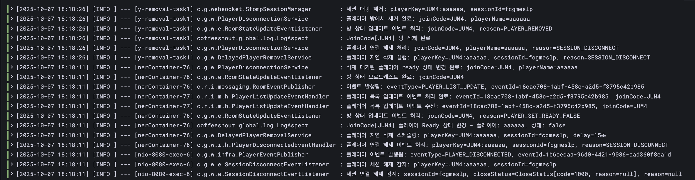
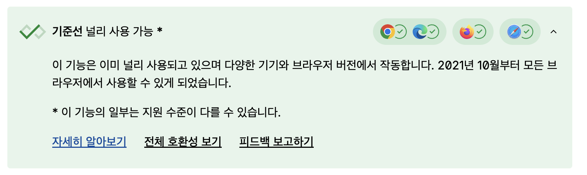
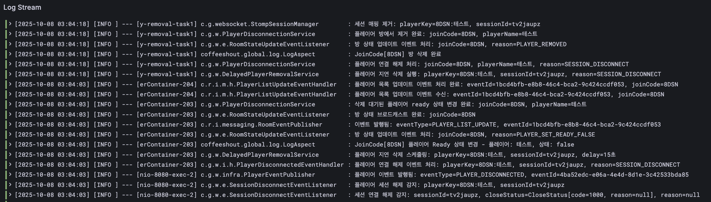
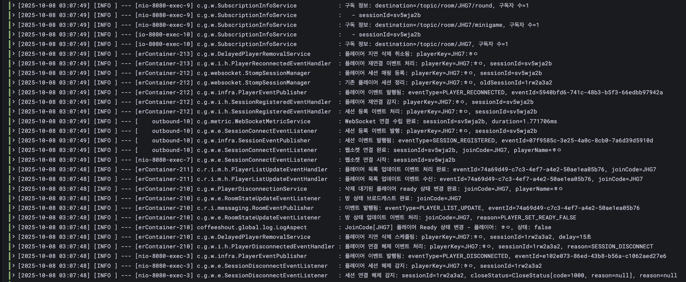

# 웹소켓 새로고침 이슈 해결기 — STOMP 재연결이 안 되는 이유와 대처 방법

안녕하세요, 우아한테크코스 7기 FE 니야입니다!

저는 현재 우아한테크코스에서 **'커피빵'** 이라는 멀티플레이어 게임 서비스를 개발하고 있습니다. 커피빵은 여러 사용자가 실시간으로 함께 즐기는 웹 기반 게임 플랫폼입니다. 게임 로비에서 참여자들이 모이면, 실시간으로 게임을 진행하고 당첨자를 추첨할 수 있습니다.

이러한 실시간 통신을 구현하기 위해 저희는 **웹소켓(WebSocket)** 을 사용하고 있는데요. 웹소켓을 통해 서버와 클라이언트가 양방향으로 메시지를 주고받으며, 플레이어의 입장/퇴장, 게임 준비, 미니게임 선택, 게임 진행 상태 등을 실시간으로 동기화하고 있습니다.

그런데 서비스를 운영하던 중, **특정 상황에서 웹소켓 연결이 끊어지고 자동 재연결이 되지 않는 문제**가 발생했습니다. 이 글에서는 그 문제를 어떻게 해결했는지 공유하고자 합니다.

## 1. 문제 상황 정의

### 웹소켓이 끊어지는 다양한 상황

실시간 통신을 사용하는 서비스를 운영하다 보면, 웹소켓 연결이 끊어지는 다양한 상황에 직면하게 됩니다.

**웹소켓이 끊어지는 주요 상황:**

1. **앱을 전환하여 백그라운드로 나간 경우** - 모바일 환경에서 다른 앱으로 전환
2. **네트워크 연결 방식이 변경된 경우** - Wi-Fi ↔ 모바일 데이터 전환
3. **네트워크가 불안정하여 끊어진 경우** - 신호가 약하거나 일시적 장애
4. **새로고침한 경우** - 사용자가 브라우저 새로고침 버튼을 누르거나 F5 키를 입력

여기서 **4번, 새로고침 상황에서 저희가 설정한 자동 재연결이 동작하지 않는 현상**이 발생했습니다.

### 핵심 문제

**로비 화면에서 사용자가 새로고침을 하면 웹소켓 연결이 끊어지고, 자동으로 재연결되지 않았습니다.**

그 결과 새로고침 후에는:

- 다른 플레이어의 입장/퇴장 알림을 받을 수 없고
- 호스트가 선택한 미니게임을 확인할 수 없으며
- 게스트들이 준비된 상태도 확인할 수 없고
- 결과적으로 게임을 참여할 수 없게 되었습니다

사용자는 결국 로비를 나갔다가 다시 들어와야 하는 불편함을 겪게 되었습니다.

"분명 재연결 설정을 해뒀는데, 왜 새로고침 시에는 작동하지 않는 걸까요?"

이 의문에서 시작된 문제 해결 과정을 지금부터 소개하겠습니다.

## 2. 왜 STOMP 자동 재연결이 동작하지 않았을까?

### 시도 1) 웹소켓 자동 재연결 활용

저희 커피빵 서비스는 `createStompClient` 함수로 웹소켓 Client 객체를 생성합니다.
이 함수 내부에서 웹소켓 재연결 관련 속성을 설정하고 있기 때문에, 당연히 재연결이 될 것이라고 예상했습니다.

```typescript
import { Client, ReconnectionTimeMode } from "@stomp/stompjs";
import SockJS from "sockjs-client";
import { getWebSocketUrl } from "./getWebSocketUrl";

type Props = {
  joinCode: string;
  playerName: string;
};

export const createStompClient = ({ joinCode, playerName }: Props) => {
  const wsUrl = getWebSocketUrl();

  const client = new Client({
    webSocketFactory: () => new SockJS(wsUrl),
    debug: (msg) => console.log("[STOMP]", msg),
    reconnectDelay: 1000, // 재연결 지연 시간
    reconnectTimeMode: ReconnectionTimeMode.EXPONENTIAL, // 재연결 지연 방식 (지수적 증가)
    maxReconnectDelay: 30000, // 최대 지연 시간 (최대 30초로 설정)
    heartbeatIncoming: 4000,
    heartbeatOutgoing: 4000,
    connectHeaders: { joinCode, playerName },
  });

  return client;
};
```

### Client 객체 저장의 문제점

다만, 여기서 유의해야 할 부분은 Client 객체를 저장하는 과정입니다.

```typescript
import { Client, IFrame } from "@stomp/stompjs";
import { useCallback, useState } from "react";
import { createStompClient } from "../utils/createStompClient";
import WebSocketErrorHandler from "../utils/WebSocketErrorHandler";

export const useWebSocketConnection = () => {
  const [client, setClient] = useState<Client | null>(null);

  // ...

  const setupStompClient = useCallback(
    (joinCode: string, myName: string): Client => {
      const stompClient = createStompClient({
        joinCode,
        playerName: myName,
      });

      stompClient.onConnect = handleConnect;
      stompClient.onDisconnect = handleDisconnect;
      stompClient.onStompError = handleStompError;
      stompClient.onWebSocketError = (event: Event) =>
        handleWebSocketError(event, stompClient);

      return stompClient;
    },
    [handleConnect, handleDisconnect, handleStompError, handleWebSocketError]
  );

  // ...
};
```

`useWebSocketConnection` 훅은 웹소켓 연결을 담당하며, client 객체를 React state로 관리합니다.

**새로고침 시 발생하는 문제:**
새로고침하면 JavaScript 메모리가 모두 초기화되면서 state가 리셋되고, 이전에 생성한 웹소켓 클라이언트 객체도 완전히 사라집니다.

처음에는 `client` 객체를 브라우저 스토리지에 저장하면 새로고침 후에도 재사용할 수 있을 것이라 기대했습니다.
하지만 실제로 시도해보니 다음과 같은 오류가 발생했습니다.

```
TypeError: Converting circular structure to JSON
--> starting at object with constructor 'Client'
| property '_stompHandler' -> object with constructor 'StompHandler'
--- property '_client' closes the circle
at JSON.stringify (<anonymous>)
at useWebSocketConnection (useWebSocketConnection.ts:7:19)
at WebSocketProvider (WebSocketProvider.tsx:7:84)
```

### 직렬화 불가능한 객체

`client` 객체는 **직렬화할 수 없는 객체**였습니다.

브라우저 스토리지는 기본적으로 모든 값을 **문자열 형태로만** 저장할 수 있습니다.
일반적으로 객체는 `JSON.stringify()`로 문자열로 변환하고, `JSON.parse()`로 복원합니다.

하지만 **STOMP Client 객체는 이 과정 자체가 불가능**합니다.

**직렬화할 수 없는 대표적인 객체:**

- WebSocket 연결 객체
- 함수(콜백)
- setTimeout / setInterval 타이머
- Promise 객체

**직렬화가 불가능한 이유:**
이런 객체들은 모두 **런타임 상태에 의존**하고 있기 때문입니다.

`Client`도 내부적으로 `StompHandler`, `WebSocket`, 재연결 타이머 등의 상태를 실시간으로 관리하고 있습니다.
WebSocket 객체는 운영체제의 네트워크 소켓과 연결된 상태 정보를 포함하며, 이는 문자열로 변환할 수 없는 시스템 리소스입니다.
콜백 함수 역시 실행 가능한 코드 블록이며, 직렬화 시 스코프와 클로저 정보가 사라져 복원이 불가능합니다.

따라서 만약 저장이 가능하더라도, 복원되는 것은 이미 연결이 끊긴 **'죽은 객체'**에 불과하여 정상적으로 동작할 수 없습니다.

### STOMP 재연결 메커니즘의 한계

새로고침 시 웹소켓 자동 재연결이 동작하지 않는 이유를 STOMP 재연결 메커니즘의 동작 방식과 함께 살펴보겠습니다.

STOMP Client의 `activate()` 메서드를 호출하면, 연결이 끊어졌을 때 `reconnectDelay` 설정에 따라 자동으로 재연결을 시도합니다.

```typescript
const startSocket = useCallback(
  (joinCode: string, myName: string) => {
    if (!validateClient() || !validateConnectionParams(joinCode, myName))
      return;

    const stompClient = setupStompClient(joinCode, myName);
    setClient(stompClient);
    stompClient.activate();
  },
  [validateClient, validateConnectionParams, setupStompClient]
);
```

저희 서비스에서는 웹소켓 연결 시작 시 `stompClient.activate()`를 호출하며, 이를 통해 `reconnectDelay` 설정값에 따라 자동 재연결이 시도됩니다.

**핵심:** STOMP의 자동 재연결은 **같은 브라우저 세션 내에서만 작동**합니다.

**자동 재연결이 작동하는 경우:**

- **네트워크 장애** (네트워크 변경, 네트워크 끊김)
- **Heartbeat 실패** (모바일 환경에서 앱 전환으로 백그라운드 전환 시, ping/pong 불가)
- **WebSocket 연결 끊김** (서버 문제 등)

→ 이러한 경우들은 **Client 인스턴스가 브라우저 메모리에 살아있는 상태**에서 발생합니다.

**자동 재연결이 작동하지 않는 경우:**

- **페이지 새로고침** (메모리 초기화)
- **탭 닫기/열기** (새 브라우저 컨텍스트)
- **브라우저 재시작**

→ 이러한 경우들은 **Client 인스턴스가 소멸**되므로 자동 재연결이 불가능합니다.

**결론:** 새로고침으로 인한 웹소켓 끊김은 자동 재연결 방식으로는 해결할 수 없으며, `useEffect`에서 새 Client를 직접 생성해야 합니다.

### 서비스 정책 수립: 새로고침을 어떻게 다룰 것인가?

새로고침 시 웹소켓을 반드시 재연결해야 하는가는 서비스 정책에 따라 달라집니다.
다른 유사 서비스를 참고하여 저희 커피빵 서비스만의 정책을 수립했습니다.

**서비스 환경 특성:**
커피빵 서비스는 모바일 사용자를 주요 타겟으로 하지만, 웹 브라우저에서 동작하기 때문에 데스크탑 사용자도 고려해야 합니다.
특히 데스크탑 환경에서는 새로고침이 더 자유롭기 때문에 이에 대한 대응이 필요했습니다.

웹소켓 재연결 관리는 크게 **로비**와 **게임 진행 중** 두 시점으로 나누어 접근했습니다.

**1. 게임 진행 중:**
게임 진행 중에는 실시간으로 턴이 바뀌고 상호작용이 빠르게 이루어지므로, 사용자가 의도적으로 새로고침을 시도할 가능성이 거의 없습니다.
따라서 **'의도치 않은 새로고침'을 막는 수준으로만 대응**하기로 했습니다.

> 참고: 게임 중 의도적인 새로고침이 발생하면, 현재 게임 진행 상태와 사용자 정보를 모두 서버에서 다시 불러와야 합니다. 이는 새로고침뿐만 아니라 모든 웹소켓 재연결 상황에서 동일하게 처리해야 합니다.

**2. 로비:**
로비는 게임 시작 전 대기 공간으로, 사용자가 자유롭게 들어오고 나갈 수 있으며 조작에 제약이 거의 없습니다.
따라서 이 구간에서는 새로고침이 발생할 가능성이 있다고 판단했습니다.

## 3. 새로고침 감지를 위한 다양한 시도

### 적용 1) CSS로 '당겨서 새로고침' 기능 막기

우선 **CSS를 통해 '당겨서 새로고침' 기능을 비활성화**했습니다.

```css
html,
body {
  /* 당겨서 새로고침 막기 */
  overscroll-behavior: none;
}
```

이 설정을 통해 모바일 사용자가 웹 브라우저(Chrome, Safari, Samsung Internet 등)로 접속하더라도,
**기본 제공되는 '당겨서 새로고침' 기능이 동작하지 않습니다.**

화면을 아래로 끌어도 새로고침이 발생하지 않아, 로비와 게임 중 모두 실수로 인한 새로고침을 방지할 수 있습니다.

다만, **사용자가 직접 브라우저의 메뉴 버튼을 눌러 새로고침을 선택하는 경우는 막을 수 없습니다.**
이는 브라우저 차원의 동작이기 때문입니다.

따라서 사용자가 새로고침을 직접 시도할 가능성이 존재하는 **로비**에서의 대응 방안을 추가로 고민했습니다.

### 시도 2) `beforeunload` 이벤트 활용

[`beforeunload` 이벤트](https://developer.mozilla.org/en-US/docs/Web/API/Window/beforeunload_event)를 활용하는 방법을 검토했습니다.
이 이벤트는 사용자가 페이지를 떠나려는 시점에 `window` 객체에서 발생합니다.

처음에는 이 이벤트를 이용해 **새로고침 시 경고창을 띄우는 방식**을 고려했으나, 사용자 경험 측면에서 좋지 않다고 판단했습니다.

**UX 측면의 문제:**

- 게임 진행 중 알림창은 게임 상호작용을 방해합니다.
- 로비에서도 불필요한 상호작용은 사용자에게 피로감을 줍니다.
- 새로고침 시 자동으로 재연결되는 흐름이 사용자가 추가 동작 없이 서비스를 이용할 수 있어 UX 면에서 더 우수합니다.

**기술적 한계:**

**1) 이벤트 범위의 문제**
`beforeunload`는 새로고침뿐 아니라 페이지 이탈 전반에 걸쳐 발생합니다.

트리거되는 경우:

- 브라우저 새로고침
- 탭 닫기
- 다른 URL로 이동 (`window.location.href` 변경 등)
- 뒤로가기 / 앞으로가기
- 브라우저 종료

따라서 **새로고침만 감지하기엔 부적합**합니다.

**2) 브라우저 호환성 문제**
iOS Safari에서 `beforeunload`가 아예 지원되지 않습니다.



저희 서비스는 모바일 Safari 환경도 반드시 지원해야 하므로, 이 이벤트는 후보에서 제외되었습니다.

**대체 이벤트 검토:**

새로고침 시 발생하는 다른 이벤트를 살펴보았습니다.
저희 서비스는 페이지 이탈 직전(beforeunload)보다 새로고침 이후 시점에서 웹소켓을 재연결하면 되므로, 반드시 이 이벤트에 의존할 필요가 없었습니다.

Chrome 기준으로 새로고침 시 다음 순서로 이벤트가 발생했습니다:

**`beforeunload → pagehide → unload → pageshow`**

각 이벤트의 한계:

- [unload 이벤트](https://developer.mozilla.org/en-US/docs/Web/API/Window/unload_event): Deprecated되어 최신 브라우저에서 권장하지 않음
- [pagehide](https://developer.mozilla.org/en-US/docs/Web/API/Window/pagehide_event), [pageshow](https://developer.mozilla.org/en-US/docs/Web/API/Window/pageshow_event): 브라우저 호환성은 우수하나, '새로고침' 전용 이벤트가 아님
  - 특히 `pageshow`는 새로운 페이지 로드 시에도 항상 발생하여 처음 페이지 접속 시에도 트리거됨

**결론:** 위 이벤트들은 새로고침 전용으로 사용하기에는 범위가 너무 넓고 정확도가 떨어집니다.

### 시도 3) 서버의 세션 연결 해제 코드로 식별

백엔드 팀원인 엠제이와 함께 논의한 결과, **서버에서 세션 연결 해제 시 발생하는 코드(closeStatus.code)** 를 이용해 새로고침을 식별하는 방식을 검토했습니다.



위 로그를 보면, 새로고침 발생 시 '세션 연결 해제 감지'가 발생하며
`closeStatus=CloseStatus[code=1000, reason=null]`이 출력됩니다.

엠제이의 제안은 **code 값(1000)** 으로 새로고침 여부를 구분하자는 것이었습니다.

**하지만 이 방식의 한계:**
code=1000은 **'새로고침만을 특정할 수 있는 고유한 식별자'로 사용하기 어려웠습니다.**
다른 정상 종료 상황에서도 동일한 코드가 발생했기 때문입니다.

[WebSocket 프로토콜 표준 명세](https://datatracker.ietf.org/doc/html/rfc6455#section-7.4.1)에 따르면:

> **1000 indicates a normal closure, meaning that the purpose for which the connection was established has been fulfilled.**

즉, code=1000은 단순히 **정상 종료**를 의미하는 상태코드입니다.

**연결 종료 시 상태 코드 테스트 결과:**

| 상황                                    | 상태 코드 | 의미          |
| --------------------------------------- | --------- | ------------- |
| 백그라운드로 나간 경우 (모바일 앱 전환) | 1000      | 정상 종료     |
| 브라우저 앱 종료                        | 1006      | 비정상 종료   |
| 네트워크 끊김                           | 1002      | 프로토콜 에러 |
| 네트워크 변경                           | 1002      | 프로토콜 에러 |
| 새로고침                                | 1000      | 정상 종료     |

**결론:** 새로고침도 백그라운드 전환과 동일하게 1000 코드가 발생하므로, 이 방식으로는 구분이 불가능합니다.

## 4. 최종 해결: PerformanceNavigationTiming으로 새로고침 감지

### PerformanceNavigationTiming 인터페이스

최종적으로 발견한 해결책은 **PerformanceNavigationTiming** 인터페이스였습니다.

**PerformanceNavigationTiming이란?**
브라우저가 페이지를 탐색(navigation)하는 과정에서 발생한 모든 성능 관련 정보를 담고 있는 **Web Performance API의 인터페이스**입니다.

이 인터페이스를 통해 다음을 알 수 있습니다:

- 브라우저가 이 문서를 어떻게 불러왔는지 (새로고침, 뒤로 가기, 처음 방문 등)
- 그 과정에서 얼마만큼의 시간이 걸렸는지



**브라우저 호환성:**
PerformanceNavigationTiming은 2021년 10월 이후로 다양한 기기와 거의 모든 브라우저에서 지원되어 호환성 측면에서 안정적입니다.

### 사용 방법

이 객체는 `performance.getEntriesByType('navigation')` 호출 시 배열 형태로 반환되며,
배열의 첫 번째 요소에 `PerformanceNavigationTiming` 객체가 들어있습니다.

```typescript
const [navigation] = performance.getEntriesByType("navigation");
console.log(navigation);
```

위 코드를 브라우저 콘솔창에 실행하면 `PerformanceNavigationTiming` 객체가 출력됩니다.

### type 속성으로 새로고침 감지

핵심은 [`type` 속성](https://developer.mozilla.org/en-US/docs/Web/API/PerformanceNavigationTiming/type)입니다.

```typescript
type NavigationTimingType =
  | "back_forward" // 뒤로/앞으로 가기
  | "navigate" // 일반적인 페이지 탐색
  | "prerender" // 사전 렌더링
  | "reload"; // 새로고침
```

이 `type` 속성은 탐색 유형을 반환하며, 크게 4가지로 분류됩니다.

MDN 문서에 따르면 `"reload"` 값은 다음과 같이 정의됩니다:

> [`"reload"`](https://developer.mozilla.org/en-US/docs/Web/API/PerformanceNavigationTiming/type#reload) Navigation is through the browser's reload operation, [`location.reload()`](https://developer.mozilla.org/en-US/docs/Web/API/Location/reload) or a Refresh pragma directive like `<meta http-equiv="refresh" content="300">`.

즉, `"reload"`는 다음의 경우를 의미합니다:

- 사용자가 직접 새로고침 버튼을 누른 경우
- `location.reload()` 메서드를 호출한 경우
- `<meta http-equiv="refresh" content="300">` 같은 Refresh 지시문에 의한 경우

**따라서 `type` 속성이 `"reload"`일 경우, 해당 페이지가 사용자에 의해 새로고침된 경우임을 확실히 알 수 있습니다.**

```typescript
const navigation = performance.getEntriesByType("navigation")[0];

if (navigation.type === "reload") {
  console.log("새로고침 감지!");
}
```

## 5. 코드 구현과 동작 방식

이 속성을 활용하여 새로고침을 감지하고 웹소켓을 재연결하는 로직을 구현했습니다.

```typescript
useEffect(() => {
  if (hasCheckedRefresh.current) return;

  let isReload = false;

  try {
    const navigationEntries = performance.getEntriesByType(
      "navigation"
    ) as PerformanceNavigationTiming[];
    isReload =
      navigationEntries.length > 0 && navigationEntries[0].type === "reload";
  } catch (error) {
    console.warn("performance.getEntriesByType not supported:", error);
    isReload = document.referrer === window.location.href;
  }

  if (isReload && !isConnected && joinCode && myName && startSocket) {
    hasCheckedRefresh.current = true;
    startSocket(joinCode, myName);
  }
}, [myName, joinCode, isConnected, startSocket]);
```

### 코드 상세 설명

#### 1. 새로고침 중복 체크

```typescript
if (hasCheckedRefresh.current) return;
```

- 이미 새로고침 여부를 확인했다면 다시 실행하지 않도록 early return 처리합니다.
- `hasCheckedRefresh`는 `useRef`로 관리되는 플래그로, **중복 재연결을 방지**합니다.

#### 2. 기본 변수 초기화

```typescript
let isReload = false;
```

- 새로고침 여부를 저장할 `isReload` 변수를 `false`로 초기화합니다.
- 실제 감지 로직에서 `true`로 변경될 수 있습니다.

#### 3. 새로고침 감지 시도

```typescript
try {
  const navigationEntries = performance.getEntriesByType(
    'navigation'
  ) as PerformanceNavigationTiming[];
  isReload = navigationEntries.length > 0 && navigationEntries[0].type === 'reload';
}
```

- `performance.getEntriesByType('navigation')`을 통해 **현재 페이지의 탐색 방식**을 가져옵니다.
- 반환된 `PerformanceNavigationTiming` 객체의 `type`이 `'reload'`인 경우, 사용자가 **새로고침**으로 진입했다는 의미입니다.
- 이때 `isReload` 값을 `true`로 설정합니다.

#### 4. 브라우저 미지원 대비 (Fallback)

```typescript
catch (error) {
  console.warn('performance.getEntriesByType not supported:', error);
  isReload = document.referrer === window.location.href;
}
```

- `PerformanceNavigationTiming.type`은 대부분의 브라우저에서 지원되지만, 예외 상황에 대비하여 fallback을 추가했습니다.
- `document.referrer`와 현재 URL이 같다면, 이전 페이지도 현재 페이지였다는 의미로 새로고침으로 간주합니다.

#### 5. 새로고침 시 웹소켓 재연결

```typescript
if (isReload && !isConnected && joinCode && myName && startSocket) {
  hasCheckedRefresh.current = true;
  startSocket(joinCode, myName);
}
```

모든 조건이 충족되면 실제로 웹소켓 재연결을 수행합니다.

**조건:**

- `isReload`: 새로고침으로 진입한 경우
- `!isConnected`: 현재 웹소켓이 연결되지 않은 상태
- `joinCode`, `myName`, `startSocket`: 재연결에 필요한 정보가 모두 존재

재연결을 한 번만 수행하도록 `hasCheckedRefresh.current`를 `true`로 설정하여 중복 실행을 방지합니다.

## 6. 적용 결과

이와 같이 구현하여 새로고침 시에도 웹소켓이 자동으로 재연결되는 것을 확인할 수 있었습니다.

### 구현 전




### 구현 후




## 7. 마무리하며

새로고침을 감지하고 웹소켓을 재연결하는 과정을 고민하는 데 생각보다 많은 시간이 소요되었습니다.

하지만 그 과정에서 **`PerformanceNavigationTiming`** 이라는 새롭고 유용한 인터페이스를 알게 된 점은 큰 수확이었습니다.

또한 다양한 시도를 통해 웹소켓의 상태 코드와 각 끊김 상황에 따라 어떤 코드가 발생하는지에 대해서도 깊이 있게 이해할 수 있었습니다.

**`PerformanceNavigationTiming`** 에는 다양한 속성이 존재하므로, 앞으로 더 살펴보면서 활용 범위를 넓혀볼 계획입니다.

무엇보다 중요한 점은, 이 개선으로 **사용자 경험이 눈에 띄게 향상**되었다는 것입니다.

이제 새로고침 후에도 자동으로 재연결이 이루어지므로, 사용자는 끊김을 거의 인지하지 못하고 서비스를 계속 이용할 수 있게 되었습니다.

## 관련 자료

- [PR: 여러 조건에 따른 웹소켓 재연결 로직 처리](https://github.com/woowacourse-teams/2025-coffee-shout/pull/680)
- [STOMP.js 공식 가이드](https://stomp-js.github.io/guide/stompjs/using-stompjs-v5.html)
- [Spring WebSocket CloseStatus 문서](https://docs.spring.io/spring-framework/docs/current/javadoc-api/org/springframework/web/socket/CloseStatus.html)
- [WebSocket 프로토콜 RFC 6455](https://datatracker.ietf.org/doc/html/rfc6455#section-7.4.1)
- [MDN: PerformanceNavigationTiming](https://developer.mozilla.org/en-US/docs/Web/API/PerformanceNavigationTiming)
- [MDN: PerformanceNavigationTiming.type](https://developer.mozilla.org/en-US/docs/Web/API/PerformanceNavigationTiming/type)
- [페이지 탐색 감지 참고 자료](https://leteu.tistory.com/29)
