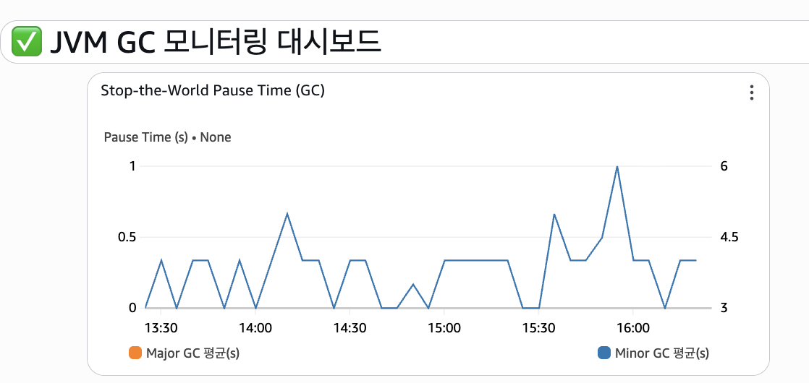
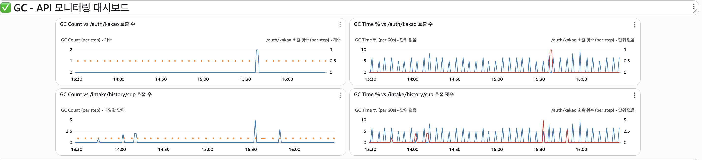
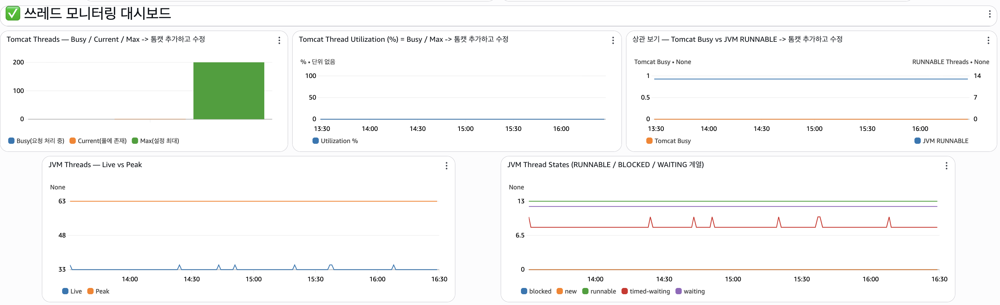

# 장애 대응이 가능한 모니터링 대시보드와 알림 체계 구축하기

### **1. 서론**

'물깜' 팀에서는 실제 앱 서비스를 플레이 스토어에 게시해 사용자들이 사용하고 있다. 이러한 상황에서 장애가 발생하게 되면, **얼마나 빠르게 원인을 탐지하고 복구하느냐** 가 중요해진다.

이 글에서는 Spring Boot 애플리케이션에 **Spring Actuator** 와 **AWS CloudWatch** 를 연계하여 실시간 대시보드를 구축한 과정을 다룬다. 대시 보드 구축에서의 목표는 단순한
메트릭 수집이 아닌 **장애 대응 수준의 관찰성과 자동 알림 체계**를 확보하는 것이었다.

---

### **2. 모니터링의 필요성**

#### **2.1 서버 신뢰성 확보**

모니터링은 **서버 신뢰성의 핵심**이다. 시스템이 정상 동작하는 것처럼 보이더라도, 내부에서는 다음과 같은 병목이 발생할 수 있다.

- **GC 의 Stop the World**: GC 동작 중 애플리케이션이 멈춰 요청 처리가 중단된다.

- **스레드 풀 포화**: 실행 가능한 스레드가 모두 바쁘면 새 요청이 대기열에 쌓인다.

- **DB 커넥션 풀 포화**: 연결 반환이 지연되면 전체 API 응답 속도가 느려진다.

이 지표들은 외부에서 잘 드러나지 않더라도 사용자 경험을 크게 저하시킨다.

신뢰성은 정상 상태를 유지하는 능력이 아니라, **비정상 상태를 빠르게 감지하고 대응하는 능력**에서 결정된다.

---

#### **2.2 장애 대응 속도 향상**

대시보드는 장애 상황을 시각적으로 빠르게 파악하도록 돕는다. 로그 분석만으로는 원인 추적에 오랜 시간을 투자해야 하지만, 실시간 지표를 통해 아래와 같은 변화를 즉시 인지할 수 있다.

| **관찰 항목**                | **시각적 변화**    | **의미**             |
|--------------------------|---------------|--------------------|
| GC 정지 시간 0.8초 이상 지속      | 그래프 급상승       | 메모리 회수 지연          |
| Busy Thread 비율 95% 초과    | Thread 그래프 포화 | 요청 과부하 또는 DB 대기    |
| GC Time%와 API 응답시간 동시 상승 | 시점 일치         | CPU 경쟁 또는 객체 생성 과다 |

지표 간 상관관계를 즉시 확인하면 병목 지점을 빠르게 파악할 수 있다. 더 나아가, 이상 징후 감지 시 CloudWatch 경보를 발송하도록 설정해 평균 복구 시간, 이른바 MTTR 을 단축할 수 있다.

---

#### **2.3 지표 중심의 문제 해결 문화**

모니터링은 추측이 아닌 **데이터 기반의 판단**을 가능하게 한다. 정량적 지표를 사용해 개발자 간 해석의 차이를 줄이고, 문제의 근거를 명확히 제시할 수 있다.

| **추측에 의한 표현** | **지표 기반 표현**                    |
|---------------|---------------------------------|
| 느려졌다.         | GC Pause Time이 평균 대비 300% 증가했다. |
| CPU가 높다.      | Runnable Thread 비율이 80% 이상이다.   |
| 캐시가 느리다.      | Redis 적중률이 85%에서 60%로 하락했다.     |

이런 방식은 팀 내 에서의 언어 및 용어 통일을 통해 **객관성, 속도 및 일관성**을 높인다.

---

### **3. 시스템 구성 개요**

| **구성 요소**            | **역할**           | **비고**                 |
|----------------------|------------------|------------------------|
| Spring Actuator      | 애플리케이션 내부 메트릭 수집 | Micrometer 기반 Exporter |
| AWS CloudWatch Agent | 메트릭 전달 및 대시보드 구성 | EC2 인스턴스 단위            |
| CloudWatch Dashboard | 지표 시각화 및 알림 트리거  | GC, Thread, API 모듈별 패널 |

---

### **4. 주요 대시보드 설계**

#### **4.1 JVM GC 모니터링 대시보드**

- **목적:** GC로 인한 응답 정지 시간 감시

- **지표:** Major/Minor GC 횟수, 평균 GC 정지 시간

- **활용:** GC 정지 시간이 0.5초 이상 지속되면 경고 알림 발송

**이 지표의 필요성**

GC는 Major GC(Stop-the-World) 과정에서 모든 스레드를 멈춘다. 정지 시간은 곧 서비스 응답 중단 시간이다.

따라서 GC 빈도와 정지 시간을 추적하면 **비정상적인 메모리 사용 패턴을 조기 탐지**할 수 있다. Minor GC 증가 시 객체 생성 과다를, Full GC 반복 시 JVM 옵션 관련 설정 오류를 재고해봐야
한다.



---

#### **4.2 GC - API 모니터링 대시보드**

- **목적:** 주요 엔드포인트의 성능 변동과 GC 동작의 상관관계 분석

- **구성:**

    - `/auth/kakao`, `/intake/history/cup` 등 핵심 API 호출 횟수

    - 요청당 평균 응답 시간

    - GC Time% 및 Heap 사용률

**이 지표의 필요성**

API는 사용자가 직접적으로 느끼는 응답 속도와 직결된다. 그러나 응답 지연은 비즈니스 로직보다 **GC나 Thread Pool**과 같은 내부 리소스 병목에서 시작되는 경우가 많다.

이를 구분하기 위해 CloudWatch에서 **API 호출량, 응답 시간, GC Time%를 오버레이** 형태로 표시한다.

예를 들어,

- `/auth/kakao` 호출이 급증하며 GC Time%가 함께 상승하면 해당 API 내부에서의 객체 생성량이 과도하다는 의미다.

- GC Time%는 일정한데 `/intake/history/cup` 응답만 지연된다면, GC 를 제외한 로직이나 DB 쿼리의 문제일 가능성이 높다.

이 분석을 통해 **특정 API로 인한 병목인지, 시스템 전체의 자원 문제인지**를 명확히 구분할 수 있다. 잘못된 추정 확률을 낮추고, 원인별로 최적화 우선순위를 정할 수 있다.



---

#### **4.3 스레드 모니터링 대시보드**

- **목적:** Tomcat Thread Pool의 활용률과 JVM Thread 상태 추적

- **지표:** Busy / Current / Max Thread 수, Thread 상태(Runnable, Waiting, Timed-Waiting)

**이 지표의 필요성**

스레드는 서버의 **동시 처리 용량**을 결정한다. Thread Pool이 포화되면 새 요청은 대기하거나, DB 대기와 GC 정지로 시스템이 정체된다.

- Busy Thread가 Max에 도달하면 처리 용량 한계
- Waiting Thread가 급증하면 외부 API나 DB 호출 지연
- Runnable Thread가 과도하면 CPU 경쟁 가능성

이 지표는 GC·API 지표와 함께 분석할 때 병목의 전체 경로를 파악할 수 있다.



---

### 5. 장애 대응 자동화 및 실시간 알림 체계

#### 5.1 구축 배경

대시보드로 상태를 확인하는 것만으로는 대응이 늦다.
우리는 AWS CloudWatch 경보(Alarm), AWS SNS(Simple Notification Service),
AWS Lambda, Slack Webhook을 연계해 즉각적인 장애 인지와 조치 안내가 가능한 자동화 경보 체계를 구축했다.
목표는 `이상이 감지되면 즉시 누구나 대응할 수 있게 하는 것`이었다.

---

#### 5.2 알림 동작 구조

```
① 감지 CloudWatch Alarm GC Pause Time, API 오류율, Busy Thread 등 임계값 초과 감지
② 전달 AWS SNS 경보 이벤트를 Lambda로 전달
③ 처리 AWS Lambda 메시지 포맷 변환 및 Slack Webhook 호출
④ 통보 Slack 실시간 알림 발송 및 대응 담당자 확인
```

```
[CloudWatch Metrics]
↓ (임계값 초과)
[Alarm Trigger]
↓
[AWS SNS → Lambda]
↓
[Slack Channel Notification]
```

---

#### 5.3 알림 메시지 구조

경보 메시지는 단순 알림이 아니라,
**누가, 무엇을, 어떻게 확인해야 하는가**가 명확히 드러나도록 설계했다.

```
✅ API 성능 지연 경보 예시

🚨 API 성능 지연 경보
⚠️ 최근 1분 10회 / 임계치 1.0회 (조건: ≥)
🕒 2025-09-16T13:53:54.909+0000

👉 조치 안내

- CloudWatch 그래프 확인 요망 (Mulkkam/Prod/Logs · Slow-Api-Count)
- 로그에서 WARN + API_Performance 키워드로 확인 요망
```

```
✅ 애플리케이션 오류 경보 예시

🚨 애플리케이션 오류 경보
❗ 최근 1분 3건 이상 오류 발생
임계치: 1.0건 (조건: ≥)
발생 시각: 2025-09-16T14:07:33.249+0000

📝 확인 필요

- CloudWatch 그래프 확인 요망 (Mulkkam/Prod/Logs · Mulkkam-Error-Log)
- ERROR 로그에서 traceId 기준으로 원인 추적
- DB/네트워크/외부 서비스 연결 상태 점검
```

설계 포인트:

1. 핵심 정보 요약: 최근 발생량, 임계치, 발생 시각
2. 즉시 조치해야 하는 항목: 로그 탐색 기준(traceId, WARN 등)
3. 통일된 포맷: 모든 경보 메시지를 같은 구조로 관리

이로써 개발자가 알림을 받은 즉시, 별도 문서 없이 조치를 수행할 수 있다.

---

### 6. 개선 및 확장 방안

#### 6.1 알림 체계 고도화

- 자동 복구(Self-Healing)
  Lambda가 특정 조건(GC Time ≥ 1.2초)을 감지하면
  EC2 인스턴스를 자동 재기동하거나 ECS 태스크를 재시작하도록 확장 가능.
- 다중 알림 채널
  SNS 주제를 이메일, SMS, Slack으로 병렬 구독시켜 중복 경보 방지.

---

#### 6.2 모니터링 시스템 개선

- CloudWatch + Grafana 통합
  기간별 비교와 커스텀 템플릿을 통한 서비스별 지표 분리.
- 로그 연계 강화
  CloudWatch Logs Insights를 통해 오류 유형(Timeout, 5xx 등)별 패턴 분석.
  경보 발생 시 관련 로그 snippet을 Slack 메시지에 자동 포함.

---

### 7. 결론

이번 구축의 핵심은 **모니터링을 실시간 대응 체계로 발전시키는 것**이었다.
Spring Actuator와 AWS CloudWatch의 메트릭 수집 기능을 활용해
서버 내부의 상태(GC, Thread, API)를 실시간으로 감시하고,
이상 상황은 Slack을 통해 즉시 알림으로 전달되도록 했다.

이를 통해 단순 시각화 수준의 모니터링을 넘어,
장애 인지–분석–조치까지 이어지는 완전한 대응 루프를 확보할 수 있었다.

---

### **참고문헌 및 출처**

- [Spring Boot Actuator Documentation](https://docs.spring.io/spring-boot/docs/current/reference/html/actuator.html)

- [AWS CloudWatch Metrics and Dashboards](https://docs.aws.amazon.com/AmazonCloudWatch/latest/monitoring/working_with_metrics.html)

- [Apache JMeter User Manual](https://jmeter.apache.org/usermanual/index.html)

- [Java Performance Tuning (O’Reilly)](https://www.oreilly.com/library/view/java-performance/9781449363512/)