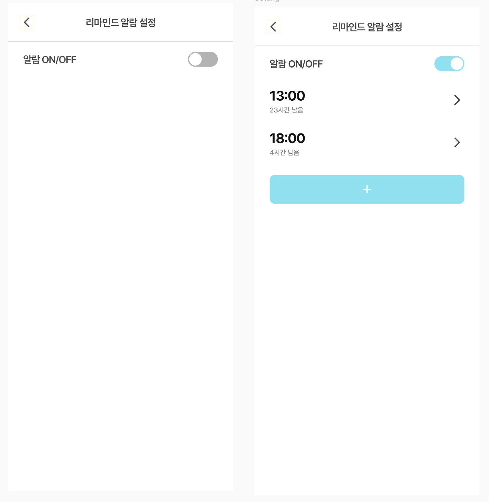
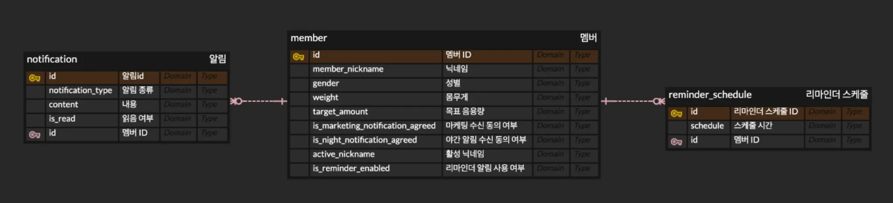
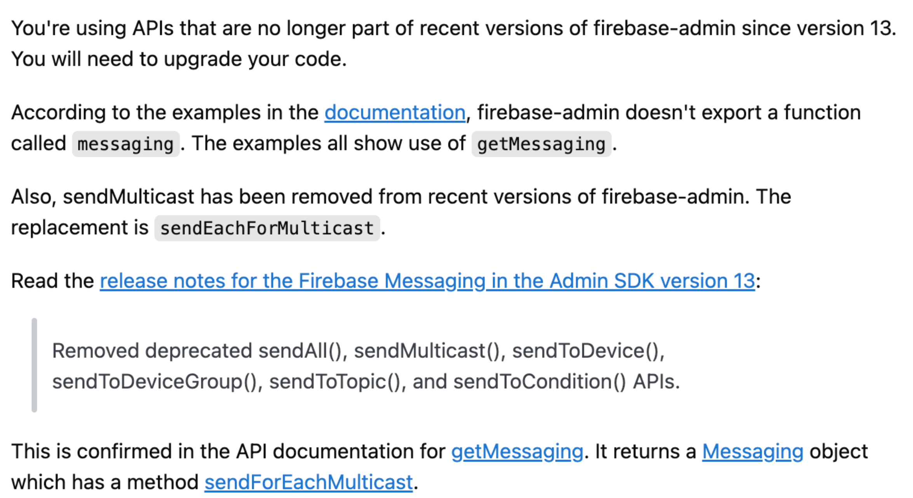
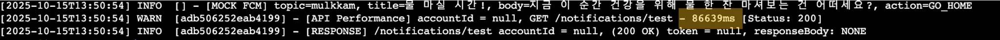

<table>
<tr>
<td>

<p>☑️ 본 글은 실제 프로젝트에서 FCM 대량 알림 처리를 개선한 과정을 기록한 트러블슈팅 아티클입니다.</p>

<p>이론보다는 실전 경험과 해결 과정을 중심으로 작성되었습니다.</p>

**📎 관련 자료**

- 프로젝트: [mulkkam](https://github.com/woowacourse-teams/2025-mul-kkam)
- PR: [리마인드 알림 개인화](https://github.com/woowacourse-teams/2025-mul-kkam/pull/913)

</td>
</tr>
</table>


# 1. 문제 인식

## 1.1. 상황


> 물 섭취 리마인드 알림 발송 서비스
>

프로젝트 mulkkam 은 사용자의 물 섭취 트래킹을 지원하는 서비스이다.

물을 마시고 기록하는 습관을 형성할 수 있도록 하루 두 번(14시, 19시) 리마인드 알림을 발송하고 있다.

그러나 서비스를 운영하며 몇 가지 의문이 들었다.

> 1. 모든 유저가 알림을 받고 싶어할까?
> 2. 알림을 원하는 유저라도, 정해진 시간대(14시, 19시)가 적합할까?
>

원하지 않는 유저에게, 그리고 원하지 않는 시간대에 알림을 발송하는 것은 오히려 사용자 경험을 저하시킬 수 있다고 판단했다.

이러한 문제를 개선하기 위해 **개인화된 알림 설정 기능**을 개발하게 되었다.

## 1.2. 요구 사항 변경



회원 가입 시 기본 알림 시간(14시, 19시)이 자동으로 설정되지만, 사용자는 설정 화면에서 리마인드 알림을 켜고 끌 수 있으며, 원하는 시간대를 분 단위까지 자유롭게 조정할 수 있다.

> [!NOTE]
> **요구사항 변경 요약**
>
> - **AS-IS**: 모든 member에게 정해진 시간(14시, 19시)에 일괄 알림
> - **TO-BE**: 원하는 사용자에게만, 원하는 시간대에 개인화 알림

이러한 요구사항 변경에 따라 알림 발송 로직도 전면 수정이 필요했다.

# 2. 기존 방식과 한계

## 2.1. ERD 구조



알림 관련 엔티티는 `Notification(N) : Member(1) : RemindSchedule(N)` 의 연관 관계로 설계되어 있다.

이는 한 명의 사용자(Member)가 여러 개의 리마인드 스케줄(RemindSchedule)을 설정할 수 있고, 여러 개의 알림(Notification)을 받을 수 있음을 의미한다.

## 2.2. Service 계층 로직 (AS-IS)

기존 방식은 **모든 멤버를 대상**으로 정해진 시간(14시, 19시)에 **Topic 기반**으로 일괄 발송하는 구조였다.

```java
// [ 기존 NotificationService.java - AS-IS ]

@Transactional
// - 정해진 시간대 스케줄링 : 14시, 19시 고정
@Scheduled(cron = DAILY_2PM_CRON)
@Scheduled(cron = DAILY_7PM_CRON)
public void notifyRemindNotification() {
    
    // - 알림 템플릿 준비 : 리마인드 알림 메시지 선택
    NotificationMessageTemplate template = RemindNotificationMessageTemplateProvider
            .getRandomMessageTemplate();
    
    // - 모든 멤버 조회 : findAll로 전체 조회 (⚠️ 메모리 부담)
    List<Member> members = memberRepository.findAll();
    
    // - 알림 데이터 생성 : 멤버 목록을 Notification 엔티티로 변환
    List<Notification> notifications = members.stream()
            .map(member -> template.toNotification(member, LocalDateTime.now()))
            .toList();
    
    // - 알림 데이터 저장 : JPA saveAll 사용 (⚠️ 개별 INSERT 쿼리 발생)
    notificationRepository.saveAll(notifications);
    
    // - FCM 알림 발송 : Topic 기반 일괄 발송
    publisher.publishEvent(template.toSendMessageByFcmTopicRequest());
}
```

## 2.3. Query 성능 이슈

### **2.3.1. JPA saveAll의 한계**

**JPA의 `saveAll()` 메서드**를 사용하면 대량의 데이터를 효율적으로 저장할 수 있을 것으로 기대했다.

```java
// 과거 코드 - 반복적인 save 호출
for (Notification notification : notifications) {
    notificationRepository.save(notification);  // ❌ DB에 여러 번 접근
}

// 개선 시도 - saveAll 사용
notificationRepository.saveAll(notifications);  // ⚠️ 여전히 개별 쿼리 발생

```

처음에는 `save()` 대신 `saveAll()`을 사용하면 Bulk Insert로 한 번에 처리될 것이라 생각했다.
**그러나 실제로는 개별 INSERT 쿼리가 여러 번 실행**되었고, 결국 다중 쿼리로 인한 속도 저하가 발생했다.

### **2.3.2. IDENTITY 전략의 제약**

**IDENTITY 전략**이란, 데이터베이스의 `auto_increment` 기능을 통해 기본키(PK) 값을 자동으로 증가시키는 방식이다. MySQL과 JPA를 함께 사용할 때 일반적으로 사용되는 전략이다.

```java
// [ Notification.java ]

@Id
@GeneratedValue(strategy = GenerationType.IDENTITY)  // IDENTITY 전략 사용
@Column(name = "notification_id")
private Long id;
```

**문제는 IDENTITY 전략을 사용할 경우**, JPA는 각 엔티티를 저장할 때마다 DB에 INSERT 쿼리를 전송하고, 생성된 키 값을 받아오는 추가적인 과정을 거쳐야 한다는 점이다.

### **실행 과정:**

1. IDENTITY 전략이 적용된 Notification 엔티티들에 대해 JPA `saveAll()` 실행
2. JPA는 각 Notification 엔티티에 대해 **개별적으로 INSERT 쿼리**를 데이터베이스에 전송
3. 데이터베이스는 각 INSERT 쿼리를 실행하여 데이터를 저장
4. 각 INSERT 쿼리에 대해 고유한 기본키 값을 생성하고, 이를 JPA에 반환
5. JPA는 반환된 기본키 값을 각 Notification 엔티티에 설정

**→ 즉, IDENTITY 전략과 JPA saveAll() 조합이 Bulk Insert를 방해하는 근본 원인이었다.**

### 2.3.3. Topic 기반 발송의 한계

```java
// [ FcmEventListener.java ]
@EventListener
public void onTopic(SendMessageByFcmTopicRequest sendMessageByFcmTopicRequest) {
    fcmClient.sendMessageByTopic(sendMessageByFcmTopicRequest);
}

// [ FcmClient.java ]

public void sendMessageByTopic(SendMessageByFcmTopicRequest sendFcmTokenMessageRequest) {
    try {
        firebaseMessaging.send(Message.builder()
                .setNotification(Notification.builder()
                        .setTitle(sendFcmTokenMessageRequest.title())
                        .setBody(sendFcmTokenMessageRequest.body())
                        .build())
                .setTopic(sendFcmTokenMessageRequest.topic())
                .putData(ACTION, sendFcmTokenMessageRequest.action().name())
                .build());
    } catch (FirebaseMessagingException e) {
        throw new AlarmException(e);
    }
}
```

기존 방식은 회원가입 시 기본 topic에 구독시켜 **모든 사용자에게 한 번에 발송**하는 구조였다.

하지만 개인화된 시간대 알림을 위해서는 **특정 사용자들에게만 선택적으로 발송**해야 했고, 이를 위해 **Token 기반 MultiCast 방식**으로 전환이 필요했다.

# 3. 개선 방안

## 3.1. JDBC Batch Insert

**JDBC Batch Insert**는 대량 데이터 저장 시 발생하는 성능 문제를 해결하는 기법이다.
개별 INSERT 쿼리를 반복 실행하는 대신, **여러 쿼리를 하나의 배치로 묶어 한 번에 전송**함으로써 데이터베이스 왕복 횟수를 최소화하고 처리 속도를 크게 향상시킬 수 있다.

### 3.1.1. 구성 요소

- **JdbcTemplate** : JDBC를 통해 직접 SQL 쿼리를 직접 실행
- **batchUpdate()** : 대량 데이터의 여러 쿼리를 묶어 한 번에 처리 → DB 접근 최소화 & 쿼리 개선
- **PreparedStatement** : SQL 쿼리를 미리 컴파일하여 재사용 → 오버헤드 감소 & 성능 개선

### 3.1.2. Repository 구현

```java
// [ NotificationBatchRepository.java ]

private final JdbcTemplate jdbcTemplate;
private static final int BATCH_SIZE = 1000; // 배치 크기 설정 (메모리 오버헤드 방지)

public void batchInsert(List<NotificationInsertDto> notificationInsertDtos) {
    // - SQL 템플릿 준비 : INSERT 쿼리 정의
    String sql = "INSERT INTO notification (notification_type, is_read, created_at, member_id, content, deleted_at) values (?, ?, ?, ?, ?, ?)";
    
    // - 생성 시각 통일 : 모든 알림에 동일한 생성 시각 적용
    Timestamp currentTimestamp = Timestamp.valueOf(LocalDateTime.now());

    // - 배치 단위 처리 : BATCH_SIZE만큼 나누어 처리
    for (int i = 0; i < notificationInsertDtos.size(); i += BATCH_SIZE) {
        // - 배치 데이터 추출 : 현재 처리할 청크 데이터 분리
        List<NotificationInsertDto> batchNotificationInsertDtos = notificationInsertDtos.subList(i,
                Math.min(i + BATCH_SIZE, notificationInsertDtos.size()));

        // - Bulk Insert 실행 : 배치 단위로 한 번에 INSERT
        jdbcTemplate.batchUpdate(sql, new BatchPreparedStatementSetter() {
            @Override
            public void setValues(PreparedStatement ps, int i) throws SQLException {
                // - PreparedStatement 값 설정 : 각 필드에 데이터 바인딩
                NotificationInsertDto dto = batchNotificationInsertDtos.get(i);
                ps.setString(1, dto.notificationType().name());
                ps.setBoolean(2, Boolean.FALSE);
                ps.setTimestamp(3, currentTimestamp);
                ps.setLong(4, dto.memberId());
                ps.setString(5, dto.content());
                ps.setTimestamp(6, null);
            }

            @Override
            public int getBatchSize() {
                // - 배치 크기 반환 : 현재 처리할 데이터 개수
                return batchNotificationInsertDtos.size();
            }
        });
    }
}
```

### **3.1.3. 동작 과정**

1. **SQL 템플릿 준비**: JDBC를 통해 INSERT 쿼리를 미리 정의
2. **배치 분할**: 전체 데이터를 BATCH_SIZE 단위로 분할
3. **데이터 바인딩**: PreparedStatement로 각 배치의 필드값 설정
4. **Bulk 전송**: `batchUpdate()`로 여러 INSERT를 한 번에 DB 전송
5. **일괄 실행**: DB가 전송받은 쿼리들을 일괄 처리

이를 통해 개별 INSERT 대비 **DB 접근 횟수를 획기적으로 줄이고**, 성능을 크게 개선할 수 있다.

## 3.2. 배치 Read 최적화

기존에는 `findAll()`로 모든 멤버를 조회했지만, 개인화된 시간대 알림을 위해서는 **특정 시간에 알림을 받아야 하는 멤버만 선택적으로 조회**해야 했다.

또한 대량의 데이터를 한 번에 조회하면 DB와 메모리에 부담이 크기 때문에, 다음과 같은 최적화 전략을 적용했다:

- **청크 단위 조회**: 데이터를 나누어 조회하여 DB 부하 분산
- **ID만 저장**: 전체 엔티티가 아닌 ID만 메모리에 보관하여 메모리 사용량 최소화

### 3.2.1. 문제 인식

초기에는 특정 repository의 쿼리 메서드에 의존하는 배치 읽기 로직을 작성했다. 하지만 이 방식은 다른 엔티티를 조회할 때 재사용할 수 없어 **범용성이 떨어진다**는 문제가 있었다.

따라서 **제네릭을 활용한 범용 배치 읽기 메서드**로 리팩터링하였다.

### 3.2.2. 제네릭 배치 읽기 메서드

```java
// [ ChunkRead.java ]
public static <T> List<T> readChunk(
        ChunkQueryFunction<T> queryFunction,
        Long lastId,
        int chunkSize
) {
    return queryFunction.query(
            lastId,
            PageRequest.of(0, chunkSize, Sort.by("id"))
    );
}
```

### 3.2.3. 사용 예시

```java
// [ NotificationBatchService.java ]
public void processReminderNotifications(LocalDateTime now) {
    NotificationMessageTemplate template = RemindNotificationMessageTemplateProvider.getRandomMessageTemplate();

    Long lastId = null;

    while (true) {
        List<Long> memberIds = getMemberIdsForSendingNotification(now, lastId);

        if (memberIds.isEmpty()) {
            break;
        }

        saveAndSendNotifications(memberIds, template);

        if (isLastChunk(memberIds)) {
            break;
        }

        lastId = memberIds.getLast();
    }
}

private List<Long> getMemberIdsForSendingNotification(LocalDateTime now, Long lastId) {
    return ChunkReader.readChunk(
            (id, pageable) -> reminderScheduleRepository
                    .findAllActiveMemberIdsBySchedule(
                            now.toLocalTime(),
                            id,
                            pageable
                    ),
            lastId,
            CHUNK_SIZE
    );
}
```

### 3.2.4. 장점

1. **재사용성**: 어떤 엔티티 조회에도 사용 가능
2. **유연성**: 쿼리 함수와 ID 추출 로직을 외부에서 주입 가능
3. **메모리 효율**: 청크 단위로 나누어 조회하여 메모리 부담 감소

## 3.3. FCM MultiCast 적용

### 3.3.1. FCM MultiCast란?

**FCM MultiCast**는 여러 기기에 동일한 메시지를 효율적으로 전송하는 방식이다. Token 목록을 받아 한 번의 API 호출로 여러 기기에 알림을 발송할 수 있다.

### 3.3.2. Topic 방식의 한계

Topic 방식도 특정 사용자 그룹에게 발송할 수 있지만, **사용자가 미리 Topic을 구독**해야 한다는 제약이 있다.

이 프로젝트에서는 **매분마다 알림을 받아야 하는 사용자 목록이 동적으로 변경**되기 때문에 Topic 방식을 사용할 수 없었다.

```yaml
예시:
- 14:00 → A, B, C 사용자에게 발송
- 14:01 → D, E 사용자에게 발송
- 14:02 → A, F, G 사용자에게 발송
```

Topic 방식을 사용하려면 매분마다:

1. 해당 시간의 Topic에 사용자 구독
2. 알림 발송
3. 사용자 구독 해제

이러한 **동적인 구독/구독 해제 작업**은 매우 비효율적이고 관리가 복잡하다.

### 3.3.3. MultiCast 방식의 장점

반면 **Token 기반 MultiCast**는:

- 구독 설정 없이 즉시 발송 가능
- 매번 다른 사용자 목록에 유연하게 대응
- 동적으로 변하는 대상에게 적합

따라서 **시간별로 동적으로 변하는 사용자 목록**에 알림을 보내야 하는 이 프로젝트에서는 MultiCast 방식이 필수적이었다.

### 3.3.4. 구현 과정 및 트러블슈팅

```java
// [ FcmClient.java ] 

public void sendMulticast(SendMessageByFcmTokensRequest sendMessageByFcmTokensRequest) {
    try {
        BatchResponse batchResponse = firebaseMessaging.sendEachForMulticast(MulticastMessage.builder()
                .addAllTokens(sendMessageByFcmTokensRequest.allTokens())
                .putData("title", sendMessageByFcmTokensRequest.title())
                .putData("body", sendMessageByFcmTokensRequest.body())
                .putData(ACTION, sendMessageByFcmTokensRequest.action().name())
                .build());

    } catch (FirebaseMessagingException e) {
        throw new AlarmException(e);
    }
}
```

**초기에는 `sendMulticast()` 메서드를 사용**했으나, 팀 QA 시간에 알림 전송이 되지 않는 문제를 발견했다.

`FirebaseMessagingException`에서도 명확한 오류 메시지가 반환되지 않아 원인 파악이 어려웠는데, 알고 보니 **해당 메서드가 지원 종료**된 것이 원인이었다.



> 최신 버전의 `firebase-admin`에서는 `sendMulitcast`가 제거되었음
>
>
> 따라서 `sendEachForMulticast`를 사용해야 함
>

### 3.3.5. Token 기반 vs Topic 기반

| 구분 | Token 기반 (MultiCast) | Topic 기반 |
| --- | --- | --- |
| 대상 | 특정 사용자 선택 가능 | 구독한 모든 사용자 |
| 유연성 | 높음 (개인화 가능) | 낮음 (일괄 발송만 가능) |
| 사용 사례 | 개인화된 알림, 특정 그룹 알림 | 공지사항, 전체 알림 |

개인화된 시간대 알림을 위해서는 **Token 기반 MultiCast 방식**이 필수적이었다.

## 3.4. 비동기 & 트랜잭션 분리

### 3.4.1. 문제 상황

FCM 알림 전송 실패 시, **DB에 저장된 알림 데이터까지 롤백**되는 문제가 발생했다.

지원 종료된 `sendMulticast` 메서드 사용으로 FCM push 알림이 전송되지 않는 상황에서, 앱 내 알림도 DB에 저장되지 않는다는 사실을 확인할 수 있었다.

즉, **FCM의 실패가 DB 저장에 영향을 주는 상황**이었다.

### 3.4.2. 해결 방안

**1. 트랜잭션 분리**

FCM 발송과 DB 저장을 **별도의 트랜잭션**으로 분리하여, FCM 실패가 DB 저장에 영향을 주지 않도록 했다.

**2. @TransactionalEventListener 적용**

`@TransactionalEventListener(phase = TransactionPhase.AFTER_COMMIT)`를 사용하여, **DB 커밋이 완료된 후에 FCM 알림을 발송**하도록 변경했다.

```java
// [ FcmEventListener.java ]

@TransactionalEventListener(phase = TransactionPhase.AFTER_COMMIT)
@EventListener
public void onTokens(SendMessageByFcmTokensRequest sendMessageByFcmTokensRequest) {
    Lists.partition(sendMessageByFcmTokensRequest.allTokens(), FCM_BATCH_SIZE)
            .forEach(tokens -> {
                fcmClient.sendMulticast(sendMessageByFcmTokensRequest.withTokens(tokens));
            });
}
```

**3. @Async 적용**

FCM은 외부 API로 응답 시간을 제어할 수 없고, 시간이 오래 걸릴 수 있다. 따라서 **비동기 처리**를 적용하여 메인 로직의 응답 속도에 영향을 주지 않도록 했다.

```java
// [ FcmEventListener.java ]

@Async
@TransactionalEventListener(phase = TransactionPhase.AFTER_COMMIT)
@EventListener
public void onTokens(SendMessageByFcmTokensRequest sendMessageByFcmTokensRequest) {
    Lists.partition(sendMessageByFcmTokensRequest.allTokens(), FCM_BATCH_SIZE)
            .forEach(tokens -> {
                fcmClient.sendMulticast(sendMessageByFcmTokensRequest.withTokens(tokens));
            });
}
```

### 3.4.3. 최종 로직

이러한 변경사항을 적용하여 기존 서비스는 다음과 같이 수정되었다.

```java
// [ ReminderScheduleService.java ]

@Transactional
@Scheduled(cron = MINUTELY_CRON)
public void scheduleReminderNotification() {
    LocalDateTime now = LocalDateTime.now();
    processReminderNotifications(now);
}

public void processReminderNotifications(LocalDateTime now) {
    NotificationMessageTemplate template = RemindNotificationMessageTemplateProvider.getRandomMessageTemplate();

    Long lastId = null;

    while (true) {
        List<Long> memberIds = getMemberIdsForSendingNotification(now, lastId);

        if (memberIds.isEmpty()) {
            break;
        }

        saveAndSendNotifications(memberIds, template);

        if (isLastChunk(memberIds)) {
            break;
        }

        lastId = memberIds.getLast();
    }
}

private List<Long> getMemberIdsForSendingNotification(LocalDateTime now, Long lastId) {
    return ChunkReader.readChunk(
            (id, pageable) -> reminderScheduleRepository
                    .findAllActiveMemberIdsBySchedule(
                            now.toLocalTime(),
                            id,
                            pageable
                    ),
            lastId,
            CHUNK_SIZE
    );
}
```

```java
// [ NotificationService.java ]

@Transactional
public void processReminderNotifications(LocalDateTime now) {
    NotificationMessageTemplate template = RemindNotificationMessageTemplateProvider.getRandomMessageTemplate();

    Long lastId = null;

    while (true) {
        List<Long> memberIds = getMemberIdsForSendingNotification(now, lastId);

        if (memberIds.isEmpty()) {
            break;
        }

        saveAndSendNotifications(memberIds, template);

        if (isLastChunk(memberIds)) {
            break;
        }

        lastId = memberIds.getLast();
    }
}

private void saveAndSendNotifications(
        List<Long> memberIds,
        NotificationMessageTemplate template
) {
    savedNotifications(memberIds, template);
    sendNotifications(memberIds, template);
}

private void saveNotifications(List<Long> allMemberIds, NotificationMessageTemplate template) {
    List<NotificationInsertDto> notificationInsertDtos = allMemberIds.stream()
            .map(memberId -> new NotificationInsertDto(template, memberId))
            .toList();
    notificationBatchRepository.batchInsert(notificationInsertDtos);
}

private void sendNotifications(
        List<Long> memberIds,
        NotificationMessageTemplate template
) {
    List<String> tokens = readDeviceTokens(memberIds);
    publisher.publishEvent(template.toSendMessageByFcmTokensRequest(tokens));
}
```

### 3.4.4. 트랜잭션 흐름

1. **알림 데이터 저장** (트랜잭션 A)
2. **트랜잭션 커밋**
3. **FCM 알림 발송** (비동기, 별도 처리)

이를 통해 **FCM 실패 시에도 DB 저장은 보장**되며, **응답 속도도 개선**되었다.

# 4. 성능 비교

## 4.1. AS-IS vs TO-BE 성능 측정
### AS-IS ( - 처리 속도 : 1m 26s )


<br>

### TO-BE ( - 처리 속도 : 0.23s ) 


<br>

batch 부분 10만명 기준 처리 속도가 1m 26s 에서 229ms로 **99.734 % 감소**했다.

메모리 사용량은 95% 개선되었다. (100만 기준, 400MB 》 24MB)

# 5. 느낀점

## 5.1. 프로젝트를 통해 배운 점

- **제네릭의 실전 활용**: 이론으로만 알고 있던 제네릭을 실제 프로젝트에서 범용 배치 읽기 메서드에 적용하며, 재사용성과 유연성의 가치를 체감할 수 있었다.
- **대량 데이터 처리 전략**: 많은 데이터를 다루는 상황을 가정하고 코드를 작성하다 보니, DB에서 꺼내오는 데이터를 최소화하는 것이 얼마나 중요한지 깨달았다. 특히 **전체 엔티티 대신 ID만 조회**하는 방식이 인상깊었다.
- **트랜잭션 경계의 중요성**: FCM 실패가 DB 저장까지 롤백시키는 문제를 겪으며, **트랜잭션을 적절히 분리**하고 **@TransactionalEventListener**를 활용하는 것의 중요성을 배웠다.

## 5.2. 아쉬운 점 및 향후 개선 방향

### **5.2.1. MultiCast 응답 처리**

- 현재는 FCM MultiCast 발송 후 성공/실패 여부를 별도로 처리하지 않는다.
- `BatchResponse`를 활용하여 실패한 Token에 대해 재전송하는 로직을 추가할 예정이다.

```java
BatchResponse response = firebaseMessaging.sendEachForMulticast(multicastMessage);
    if (response.getFailureCount() > 0) {
        List<SendResponse> responses = response.getResponses();
        // 실패한 토큰 재처리 로직
    }
```

### **5.2.2. 스케줄링 최적화**

- 현재 1분마다 스케줄링을 실행하고 있어 부담이 있다.
- Redis 등을 활용한 **분산 스케줄링** 또는 **이벤트 기반 알림 발송**으로 개선을 검토 중이다.

## 6. 참고 링크

- https://stackoverflow.com/questions/79418415/firebase-messaging-sendmulticast-sendmulticast-does-not-exist-on
- [https://velog.io/@tkguswls1106/대용량-데이터-Insert-JPA-saveAll-vs-JDBC-Batch-Insert](https://velog.io/@tkguswls1106/%EB%8C%80%EC%9A%A9%EB%9F%89-%EB%8D%B0%EC%9D%B4%ED%84%B0-Insert-JPA-saveAll-vs-JDBC-Batch-Insert)
