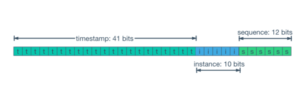
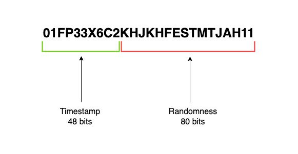

# 분산 시스템 환경에서의 고유 식별자 생성 전략 비교 분석

https://docs.tosspayments.com/resources/glossary/uuid

## 모놀리식의 유산: 중앙 집중형 ID 생성

전통적인 모놀리식 아키텍처에서 기본 키(Primary Key) 생성은 데이터베이스 관리 시스템(DBMS)의 고유 기능에 의존하는, 비교적 단순한 문제였습니다.
MySQL의 AUTO_INCREMENT 속성이나 PostgreSQL, Oracle의 SEQUENCE 객체는 중앙화된 단일 데이터베이스 인스턴스 내에서 
고유하고 순차적인 식별자를 보장하는 효율적이고 직관적인 메커니즘을 제공했습니다.

1. 이 방식의 핵심은 데이터베이스가 직접 관리하는 원자적 카운터(atomic counter)에 있습니다.
모든 삽입(INSERT) 요청은 이 중앙 카운터에 접근하여 다음 값을 할당받으며, 
이 과정은 트랜잭션적으로 안전하게 처리되어 데이터의 유일성과 엄격한 순차적 증가를 보장합니다.

2. INT나 BIGINT와 같은 정수형 데이터 타입을 사용하므로 저장 공간 효율성이 높고, 인덱싱 및 조인(JOIN) 연산에서 뛰어난 성능을 보입니다.

이처럼 단일 노드 환경에서 중앙 집중형 ID 생성 방식은 성능, 단순성, 신뢰성 측면에서 거의 완벽에 가까운 해결책이었습니다.

## 분산 환경의 균열: 중앙 집중 모델의 실패

그러나 마이크로서비스 아키텍처와 수평적 확장(scale-out)이 대두되면서, 중앙 집중형 ID 생성 모델은 심각한 한계에 직면하게 되었습니다.
분산 시스템의 본질인 '단일 제어 지점의 부재'는 AUTO_INCREMENT와 같은 중앙화된 메커니즘의 근간을 흔들었습니다.

* 확장성 병목과 단일 장애점 (SPOF): 
  * 여러 애플리케이션 노드가 ID 생성을 위해 단일 데이터베이스나 '티켓 서버(Ticket Server)'에 의존하게 되면, 해당 지점은 시스템 전체의 성능을 저해하는 병목 현상을 유발합니다.
  * 더 치명적인 문제는 이 중앙 서버가 장애를 일으킬 경우 시스템 전체의 쓰기 작업이 중단되는 단일 장애점(Single Point of Failure, SPOF)이 된다는 것입니다.
  * 이는 분산 시스템이 추구하는 고가용성 원칙에 정면으로 위배됩니다.
* 동기화 오버헤드: 
  * 다중 마스터(Multi-Master) 복제 환경에서 각 노드가 독립적으로 ID를 생성하면 키 중복 문제가 발생합니다.
  * 이를 해결하기 위해 auto-increment-increment와 auto-increment-offset 설정을 노드별로 다르게 구성하는 전략이 있지만, 이는 노드를 추가하거나 제거할 때마다 복잡한 재설정이 필요하며 시스템의 유연성을 크게 저해합니다.
  * 노드 간 ID 충돌을 막기 위한 동기화 통신은 필연적으로 높은 네트워크 지연 시간과 성능 저하를 수반합니다.
* 시간 순서 보장의 상실: 
  * 설령 복잡한 설정을 통해 ID의 유일성을 보장하더라도, 시스템 전체 관점에서 ID가 생성 시간 순서대로 증가한다는 보장은 사라집니다.
  * A 서버에서 생성된 ID 100이 B 서버에서 생성된 ID 101보다 시간적으로 나중에 생성될 수 있는 것입니다.
  * 이는 데이터 정렬, 디버깅, 시간 기반 분석을 어렵게 만듭니다.
* JPA/ORM 통합 문제:
  * JPA와 같은 객체-관계 매핑(ORM) 프레임워크는 '쓰기 지연(write-behind)' 기능을 통해 여러 INSERT 쿼리를 모아 한 번에 처리하는 배치(batch) 최적화를 수행합니다.
  * 하지만 AUTO_INCREMENT 전략을 사용하면, 영속성 컨텍스트가 엔티티를 관리하기 위해 ID 값을 필요로 하므로 persist() 호출 즉시 INSERT 쿼리를 실행하여 ID를 받아와야만 합니다.
  * 이는 쓰기 지연 최적화를 무력화시켜 성능에 악영향을 미칩니다.
  
이러한 중앙 집중 모델의 실패는 아키텍처 패러다임의 근본적인 변화를 시사합니다.
모놀리식 애플리케이션은 단일 데이터베이스와 강하게 결합되어 AUTO_INCREMENT를 자연스럽고 최적의 선택으로 만들었습니다.
그러나 마이크로서비스와 글로벌 규모 애플리케이션의 등장은 데이터와 연산의 분산을 필수로 만들었고,
이는 AUTO_INCREMENT가 의존하던 '단일 진실 공급원(Single Source of Truth)'이라는 가정을 파괴했습니다.

데이터베이스는 더 이상 글로벌 조정자가 아닌, 샤딩되고 복제된 하나의 구성 요소가 되었습니다.
결과적으로 ID 생성의 책임은 데이터베이스 계층에서 애플리케이션 계층(또는 전용 분산 서비스)으로 이동할 수밖에 없게 되었고,
이는 모놀리식 세계에서는 존재하지 않았던 새로운 차원의 복잡한 요구사항들을 낳았습니다.
이것이 바로 분산 시스템이 마주한 '정체성의 위기'입니다.

## 현대 분산 식별자를 위한 공리 수립

중앙 집중 모델의 한계를 극복하기 위해, 현대 분산 시스템의 식별자는 다음과 같은 핵심 속성들을 반드시 만족해야 합니다.
* 전역 고유성 (Global Uniqueness): 
  * 식별자는 모든 노드, 데이터센터, 시간을 통틀어 전역적으로 고유해야 하며, 충돌 확률은 실질적으로 무시할 수 있을 만큼 낮아야 합니다.
* 고가용성 및 확장성 (High Availability & Scalability): 
  * ID 생성은 특정 노드나 중앙 시스템에 의존하지 않는 분산된 방식으로 이루어져야 합니다. 이를 통해 노드 장애에 대한 내성을 갖고 수평적 확장을 원활하게 지원할 수 있어야 합니다.
* 고성능 (Performance):
  * ID 생성 과정은 매우 낮은 지연 시간(low-latency)을 가져야 하며, 초당 수만 개 이상의 ID를 생성할 수 있는 높은 처리량(high-throughput)을 지원하여 시스템의 병목 지점이 되지 않아야 합니다.
* 정렬 가능성 (Sortability):
  * ID는 생성 시간에 따라 대략적으로 정렬(K-sortable)될 수 있어야 합니다. 이는 데이터베이스 인덱싱 효율을 극대화하고, 범위 기반 쿼리(range query) 성능을 향상시키며, 디버깅을 용이하게 합니다.
* 컴팩트함 (Compactness):
  * 식별자의 크기는 합리적으로 작아야 저장 공간, 메모리, 네트워크 대역폭 사용량을 최소화할 수 있습니다.

### UUID 표준: 버전별 심층 해부

범용 고유 식별자(Universally Unique Identifier, UUID)는 분산 환경에서 중앙 기관 없이 고유한 ID를 생성하기 위해 고안된 128비트 표준입니다. 여러 버전이 존재하며, 각 버전은 서로 다른 생성 방식과 특징을 가집니다.

세부내용 : [RFC 9562](https://www.rfc-editor.org/rfc/rfc9562.html) 참고 :)

### UUID v1

```
 0                   1                   2                   3
 0 1 2 3 4 5 6 7 8 9 0 1 2 3 4 5 6 7 8 9 0 1 2 3 4 5 6 7 8 9 0 1
+-+-+-+-+-+-+-+-+-+-+-+-+-+-+-+-+-+-+-+-+-+-+-+-+-+-+-+-+-+-+-+-+
|                           time_low                            |
+-+-+-+-+-+-+-+-+-+-+-+-+-+-+-+-+-+-+-+-+-+-+-+-+-+-+-+-+-+-+-+-+
|           time_mid            |  ver  |       time_high       |
+-+-+-+-+-+-+-+-+-+-+-+-+-+-+-+-+-+-+-+-+-+-+-+-+-+-+-+-+-+-+-+-+
|var|         clock_seq         |             node              |
+-+-+-+-+-+-+-+-+-+-+-+-+-+-+-+-+-+-+-+-+-+-+-+-+-+-+-+-+-+-+-+-+
|                              node                             |
+-+-+-+-+-+-+-+-+-+-+-+-+-+-+-+-+-+-+-+-+-+-+-+-+-+-+-+-+-+-+-+-+
```

```
time_low - time_mid - (ver)time_high - (var)clock_seq - node

예시: 6ba7b810-9dad-11d1-80b4-00c04fd430c8

특히, 세번째 블록 (11d1) 의 첫글자가 1인 것으로 버전 1임을 확인할 수 있다.
```
UUID 버전 1은 시간과 공간적 고유성을 결합하여 ID를 생성하는 초기 표준입니다. RFC 9562(기존 RFC 4122를 대체)에 정의된 128비트 구조는 다음과 같습니다.
* 타임스탬프 (60비트): 그레고리력 개혁일(1582년 10월 15일) (UTC) 자정부터 경과한 시간을 100나노초 간격으로 표현한 값입니다.
* 클락 시퀀스 (14비트): 시스템 시계가 과거로 조정되거나 노드 ID가 변경될 때 발생할 수 있는 중복을 방지하기 위한 값입니다.
* 노드 ID (48비트): ID를 생성한 장비의 MAC 주소를 사용하여 공간적 고유성을 보장합니다.
* version (4비트), variant (2비트): 레이아웃을 규정하는 메타 비트로, UUID 형식을 나타내는 제어 비트 입니다.

UUIDv1의 가장 큰 장점은 중앙 조정 없이도 시간과 공간에 걸쳐 유일성이 보장된다는 점입니다.
하지만 이 초기 설계는 두 가지 치명적인 결함을 안고 있었습니다.
* 개인정보 유출: MAC 주소를 ID에 포함시키는 것은 해당 장비의 하드웨어 정보를 외부에 노출하는 심각한 개인정보 보호 및 보안 문제를 야기합니다.
* 비사전순 정렬 (Non-Lexicographical Sort Order): 가장 결정적인 설계 결함으로, 60비트의 타임스탬프가 time_low, time_mid, time_high 필드에 분산되어 비순차적으로 저장됩니다.
* 이로 인해 UUIDv1 값을 문자열이나 바이트 배열로 사전순 정렬하더라도 시간 순서대로 정렬되지 않습니다. 이는 시간 정보를 포함하고 있음에도 불구하고 데이터베이스 인덱싱 성능 향상이라는 핵심 이점을 전혀 활용할 수 없게 만듭니다.

### UUID v4

```
 0                   1                   2                   3
 0 1 2 3 4 5 6 7 8 9 0 1 2 3 4 5 6 7 8 9 0 1 2 3 4 5 6 7 8 9 0 1
+-+-+-+-+-+-+-+-+-+-+-+-+-+-+-+-+-+-+-+-+-+-+-+-+-+-+-+-+-+-+-+-+
|                           random_a                            |
+-+-+-+-+-+-+-+-+-+-+-+-+-+-+-+-+-+-+-+-+-+-+-+-+-+-+-+-+-+-+-+-+
|          random_a             |  ver  |       random_b        |
+-+-+-+-+-+-+-+-+-+-+-+-+-+-+-+-+-+-+-+-+-+-+-+-+-+-+-+-+-+-+-+-+
|var|                       random_c                            |
+-+-+-+-+-+-+-+-+-+-+-+-+-+-+-+-+-+-+-+-+-+-+-+-+-+-+-+-+-+-+-+-+
|                           random_c                            |
+-+-+-+-+-+-+-+-+-+-+-+-+-+-+-+-+-+-+-+-+-+-+-+-+-+-+-+-+-+-+-+-+
```

```
random_a - (ver)random_b - (var)random_c

예시: 93e41c6e-2091-41b9-b36b-c7ce94edc677

특히, 세번째 블록 (41b9) 의 첫 글자 (ver) 가 4인 것으로 버전 4임을 확인할 수 있고,
네 번째 블록 (b36b) 의 첫 글자 (var) 가 {8, 9, a, b} 중 하나로 나타난다. 

이때, random_a, random_b, random_c를 각각 8-4-4-4-12 형태로 변형한 것 
```

UUID 버전 4는 v1의 복잡성과 개인정보 문제를 해결하기 위해 순수한 무작위성에 기반하여 설계되었습니다.
* 구조: 128비트 중 6비트는 버전(4)과 변형(variant)을 나타내기 위해 고정되며, 나머지 122비트는 암호학적으로 안전한 의사 난수 생성기(CSPRNG)를 통해 생성된 무작위 값으로 채워집니다.
* 장점:
    * 단순성과 완전한 분산: 상태나 외부 의존성 없이 어떤 환경에서든 매우 간단하게 생성할 수 있습니다.
    * 보안성: ID 값이 예측 불가능하므로, 순차적 ID를 추측하여 시스템의 규모를 파악하거나 데이터를 열거하려는 공격(enumeration attack)을 방지하는 데 효과적입니다.
* 치명적 결함:
    * 인덱싱 재앙 (The Indexing Catastrophe): 완전한 무작위성은 B-트리(B-Tree) 기반 인덱스를 사용하는 관계형 데이터베이스(예: MySQL InnoDB, PostgreSQL)에서 기본 키로 사용될 때 최악의 성능을 초래합니다.
    * 정렬 불가능: 시간 정보를 전혀 포함하지 않으므로 생성 시간 순으로 정렬하는 것이 불가능합니다. 이는 디버깅과 데이터 분석을 복잡하게 만듭니다.

### UUID v7

```
 0                   1                   2                   3
 0 1 2 3 4 5 6 7 8 9 0 1 2 3 4 5 6 7 8 9 0 1 2 3 4 5 6 7 8 9 0 1
+-+-+-+-+-+-+-+-+-+-+-+-+-+-+-+-+-+-+-+-+-+-+-+-+-+-+-+-+-+-+-+-+
|                           unix_ts_ms                          |
+-+-+-+-+-+-+-+-+-+-+-+-+-+-+-+-+-+-+-+-+-+-+-+-+-+-+-+-+-+-+-+-+
|          unix_ts_ms           |  ver  |       rand_a          |
+-+-+-+-+-+-+-+-+-+-+-+-+-+-+-+-+-+-+-+-+-+-+-+-+-+-+-+-+-+-+-+-+
|var|                        rand_b                             |
+-+-+-+-+-+-+-+-+-+-+-+-+-+-+-+-+-+-+-+-+-+-+-+-+-+-+-+-+-+-+-+-+
|                            rand_b                             |
+-+-+-+-+-+-+-+-+-+-+-+-+-+-+-+-+-+-+-+-+-+-+-+-+-+-+-+-+-+-+-+-+
```
UUID 버전 7은 v1과 v4의 단점을 모두 해결하기 위해 고안된 최신 표준(RFC 9562)입니다.
시간 순서와 무작위성을 현명하게 결합한 구조를 가집니다.
* 구조:
    * 타임스탬프 (48비트): 유닉스 시간(Unix epoch, 1970년 1월 1일)부터 경과한 시간을 밀리초 단위로 표현합니다. 이 값을 ID의 최상위 비트(most significant bits)에 배치한 것이 정렬 가능성의 핵심입니다.
    * 무작위성 (74비트): 버전 및 변형 비트를 제외한 나머지 비트는 무작위 데이터로 채워져, 동일 밀리초 내에 생성되거나 서로 다른 노드에서 생성된 ID들의 고유성을 보장합니다.
* 장점:
    * 사전순 정렬 가능: 설계상 UUIDv7 값은 문자열이나 바이트 배열로 정렬하면 자연스럽게 시간 순서대로 정렬됩니다. 이는 UUIDv4의 가장 큰 성능 문제를 해결합니다.
    * 고유성 및 개인정보 보호: 128비트의 넓은 공간을 활용하여 높은 충돌 저항성을 유지하며, UUIDv1과 같은 MAC 주소 노출 문제가 없습니다.
    * 생태계 호환성: 표준 128비트 UUID 형식을 따르므로, 기존 데이터베이스의 UUID 타입이나 관련 도구들과 완벽하게 호환됩니다.

### 표준 트위터 스노우플레이크

UUID 표준이 128비트 공간에서 해답을 찾는 동안, 트위터(현 X)는 64비트 정수 기반의 독자적인 고성능 ID 생성 알고리즘인 '스노우플레이크(Snowflake)'를 개발하여 새로운 패러다임을 제시했습니다.



```
예시: 1976556353233092608
```
세부내용 : [Snowflake ID](https://en.wikipedia.org/wiki/Snowflake_ID) 참고 :)

스노우플레이크는 고도로 분산된 환경에서 초당 수만 개의 ID를 생성하면서도 시간 순서 정렬이 가능하도록 설계된 64비트 정수 기반 알고리즘입니다.
* 구조:
    * 부호 비트 (1비트): 항상 0으로 설정되어 생성된 ID가 양수임을 보장합니다.
    * 타임스탬프 (41비트): 특정 기준 시점(custom epoch)부터 경과한 시간을 밀리초 단위로 나타냅니다. 41비트는 약 69년의 시간을 표현할 수 있으며, ID 정렬 가능성의 핵심 요소입니다.
    * 워커 ID (10비트): ID를 생성하는 프로세스나 머신을 식별하는 고유 번호입니다. 일반적으로 데이터센터 ID(5비트)와 머신 ID(5비트)로 분할하여, 최대 32개의 데이터센터와 각 센터당 32개의 워커를 지원하도록 구성됩니다.
    * 시퀀스 번호 (12비트): 동일한 워커에서 동일한 밀리초 내에 여러 ID가 생성될 경우, 1씩 증가하는 카운터입니다. 12비트는 밀리초당 4096개의 ID 생성을 지원합니다(2^12 = 4096)
* 운영 요구사항 및 복잡성:
    * 워커 ID 관리: 스노우플레이크의 가장 큰 운영상 부담입니다. 모든 생성 프로세스는 충돌을 피하기 위해 고유한 워커 ID를 할당받아야 합니다. 이는 종종 주키퍼(Zookeeper)와 같은 조정 서비스를 통해 관리되거나, 시스템 시작 시 ID를 할당하는 별도의 메커니즘을 필요로 합니다.
    * 시계 동기화: 시스템은 네트워크 시간 프로토콜(NTP)을 통해 모든 노드의 시계가 동기화되어 있다고 가정합니다. 알고리즘 자체는 시계가 과거로 이동하는 경우(non-monotonic clock)에 대비해, 시간이 따라잡힐 때까지 ID 생성을 일시 중단하는 보호 장치를 포함하고 있습니다. 그러나 상당한 시계 불일치(clock skew)는 여전히 잠재적 위험 요소로 남아있습니다.

* 실제 적용 사례 (인스타그램): 
  * 인스타그램은 스노우플레이크의 개념을 자신들의 PostgreSQL 기반 시스템에 맞게 변형하여 적용했습니다. 별도의 ID 생성 서비스를 두는 대신, 데이터베이스 내부에서 PL/PGSQL을 사용하여 ID를 생성합니다. ID는 타임스탬프(41비트), 논리적 샤드 ID(13비트), 그리고 테이블별 시퀀스(10비트)로 구성됩니다. 이 방식은 외부 서비스 의존성을 제거하여 아키텍처를 단순화한 좋은 사례입니다. 
  * 출처: https://instagram-engineering.com/sharding-ids-at-instagram-1cf5a71e5a5c

## 경량화를 위한 다양한 시도들: ULID와 TSID

UUID, 스노우플레이크의 운영 복잡성을 해결하고 장점을 계승하려는 시도로 ULID와 TSID 같은 새로운 식별자들이 등장했습니다.

### ULID (Universally Unique Lexicographically Sortable Identifier):
```
0                   1                   2                   3
 0 1 2 3 4 5 6 7 8 9 0 1 2 3 4 5 6 7 8 9 0 1 2 3 4 5 6 7 8 9 0 1
+-+-+-+-+-+-+-+-+-+-+-+-+-+-+-+-+-+-+-+-+-+-+-+-+-+-+-+-+-+-+-+-+
|                      32_bit_uint_time_high                    |
+-+-+-+-+-+-+-+-+-+-+-+-+-+-+-+-+-+-+-+-+-+-+-+-+-+-+-+-+-+-+-+-+
|     16_bit_uint_time_low      |       16_bit_uint_random      |
+-+-+-+-+-+-+-+-+-+-+-+-+-+-+-+-+-+-+-+-+-+-+-+-+-+-+-+-+-+-+-+-+
|                       32_bit_uint_random                      |
+-+-+-+-+-+-+-+-+-+-+-+-+-+-+-+-+-+-+-+-+-+-+-+-+-+-+-+-+-+-+-+-+
|                       32_bit_uint_random                      |
+-+-+-+-+-+-+-+-+-+-+-+-+-+-+-+-+-+-+-+-+-+-+-+-+-+-+-+-+-+-+-+-+
```

* 출처1: https://blog.tericcabrel.com/discover-ulid-the-sortable-version-of-uuid/
* 출처2: https://github.com/ulid/spec
    * 구조: UUID의 정렬 문제를 해결하는 128비트 호환 대체재로 설계되었습니다.
        * 타임스탬프 (48비트): 유닉스 시간 기준의 밀리초 타임스탬프가 최상위 비트에 위치합니다.
        * 무작위성 (80비트): 나머지 80비트는 무작위 값으로 채워집니다.
    * 주요 특징:
        * 사전순 정렬 가능성: 설계적으로 시간 순서 정렬이 보장됩니다.
        * 크록포드의 Base32 인코딩: 26자리의 URL-safe하고 대소문자를 구분하지 않는 문자열로 표현되어, 36자리의 16진수 UUID보다 간결하고 가독성이 높습니다.
        * 단조성(Monotonicity): 사양에 따르면 동일 밀리초 내에 여러 ULID가 생성될 경우, 무작위 부분을 1씩 증가시켜 엄격한 순서를 보장하도록 권장합니다. 

### TSID (Time-Sorted Unique Identifier):

```
                                            adjustable
                                           <---------->
|------------------------------------------|----------|------------|
       time (msecs since 2020-01-01)           node       counter
                42 bits                       10 bits     12 bits

- time:    2^42 = ~69 years or ~139 years (with adjustable epoch)
- node:    2^10 = 1,024 (with adjustable bits)
- counter: 2^12 = 4,096 (initially random)

Notes:
The node is adjustable from 0 to 20 bits.
The node bits affect the counter bits.
The time component can be used for ~69 years if stored in a SIGNED 64 bits integer field.
The time component can be used for ~139 years if stored in a UNSIGNED 64 bits integer field.
```
* 출처1: https://github.com/f4b6a3/tsid-creator/
* 출처2: https://github.com/vladmihalcea/hypersistence-tsid (forked from 출처1)
    * 구조: 스노우플레이크와 ULID의 아이디어를 결합하여 64비트의 컴팩트함과 성능을 목표로 하는 식별자입니다.
        * 시간 구성 요소 (42비트): 특정 기준 시점부터의 밀리초 타임스탬프입니다.
        * 무작위 구성 요소 (22비트): 설정 가능한 노드 ID(0-20비트)와 카운터(2-22비트)로 나뉩니다.
    * 주요 특징:
        * 컴팩트함: 64비트 long 정수형으로 저장되어 네이티브 정수 타입의 저장 및 인덱싱 이점을 가집니다.
        * 설정 가능성: 노드 ID에 할당되는 비트 수를 조절하여, 지원할 노드의 수와 밀리초당 생성 가능한 ID 수 사이의 트레이드오프를 사용자가 직접 결정할 수 있습니다.
        * 단순화된 노드 관리: 여전히 노드 ID를 사용하지만, 환경 변수나 임의의 값을 통해 설정할 수 있도록 하여 주키퍼와 같은 복잡한 조정 시스템 없이도 사용할 수 있도록 진입 장벽을 낮췄습니다.


## 부하 상태에서의 성능: 정량적 및 정성적 비교

다양한 ID 생성 전략의 이론적 장단점을 넘어, 실제 시스템 부하 하에서 어떤 성능 차이를 보이는지 분석하는 것은 매우 중요합니다. 특히 데이터베이스 인덱싱 방식과의 상호작용은 ID 전략 선택에 결정적인 영향을 미칩니다.

### 데이터베이스 인덱싱의 물리학: B-트리의 스트레스 테스트

관계형 데이터베이스에서 가장 널리 사용되는 인덱스 구조인 B-트리는 데이터가 정렬되어 있을 때 최상의 성능을 발휘합니다. ID 생성 전략이 B-트리 인덱스에 미치는 영향은 극명하게 갈립니다.
* 순차적 쓰기 (UUIDv7, Snowflake, ULID, TSID): 단조롭게 증가하는(monotonically increasing) 키는 B-트리의 가장 오른쪽 리프 노드에 순차적으로 데이터를 추가(append)하는 효율적인 작업을 유발합니다. 이는 높은 데이터 지역성(data locality)을 보장하고, 페이지 분할(page split)을 최소화하며, 종종 '핫(hot)' 데이터셋인 최신 데이터에 대한 캐시 히트율을 극대화합니다. 새로운 데이터가 항상 인덱스의 특정 영역에 집중되므로, 데이터베이스 버퍼 캐시를 효율적으로 사용할 수 있습니다.
* 무작위 쓰기 (UUIDv4): 반면, 순서가 없는 무작위 키는 매 INSERT마다 인덱스의 임의의 위치를 목표로 합니다. 이는 데이터베이스가 해당 데이터를 삽입하기 위해 디스크에서 임의의 페이지를 버퍼 캐시로 읽어와야 함을 의미합니다. 만약 해당 페이지가 가득 차 있다면, 페이지를 두 개로 분할해야 하며, 이는 연쇄적인 I/O 작업을 유발하는 쓰기 증폭(write amplification) 현상을 초래합니다. 이 과정은 버퍼 캐시를 상대적으로 '차가운(cold)' 페이지들로 오염시키고, 정작 필요한 다른 데이터들을 캐시에서 밀어내어 시스템 전반의 성능을 극적으로 저하시킵니다.

### 벤치마크 종합: 실증적 증거

여러 벤치마크 결과는 이러한 이론적 분석을 명확히 뒷받침합니다.
* ID 생성 속도: 벤치마크에 따르면, 64비트 정수 기반의 스노우플레이크와 같은 생성기는 시스템 엔트로피를 필요로 하는 128비트 무작위 UUIDv4 생성보다 훨씬 빠릅니다.
* 데이터베이스 삽입 성능: 가장 중요한 지표인 삽입 처리량(TPS, transactions per second)에서 시간 순서 정렬이 가능한 식별자(UUIDv7, 스노우플레이크)는 UUIDv4에 비해 압도적으로 높은 성능을 보입니다. 한 벤치마크에서는 UUIDv7이 UUIDv4보다 삽입 속도가 30% 더 빠르다는 결과가 나타났습니다.
* 쿼리 성능:
    * 정렬 쿼리 (ORDER BY): 시간 순서 정렬이 가능한 키는 기본 키를 기준으로 정렬하는 쿼리에서 엄청난 이점을 보입니다. 데이터가 이미 물리적으로 정렬되어 있기 때문입니다.
    * 점 조회 및 업데이트 (WHERE id =?): 단일 ID를 조회하거나 업데이트하는 경우, 성능 차이는 상대적으로 적지만 여전히 캐시 지역성이 좋은 정렬 가능 키가 유리한 경향을 보입니다. 일부 벤치마크에서는 이 차이가 통계적으로 유의미하지 않다고 보고하기도 합니다.
      
다음 표는 여러 벤치마크 결과를 종합하여 주요 전략들의 성능을 비교한 것입니다.
[측정 직접 해 볼 예정]

| 전략       | ID 생성 (평균 시간)   | DB 삽입 (평균 시간)        | 정렬 조회 (평균 시간) |
|------------|----------------------|---------------------------|-----------------------|
| UUIDv4     | 103.4 µs           | 375 s (1M 행)           | 277.0 ms           |
| UUIDv7     | 데이터 없음           | 290 s (1M 행)           | 데이터 없음           |
| Snowflake  | 49.1 µs            | 58,455 ms (200k 행)     | 179.8 ms           |

* 출처1: https://dev.to/josethz00/benchmark-snowflake-vs-uuidv4-2h80
* 출처2: https://ardentperf.com/2024/02/03/uuid-benchmark-war/ 

크기 요소: 64비트 대 128비트

식별자의 크기는 성능과 저장 효율에 직접적인 영향을 미칩니다.
* 저장 공간 오버헤드: 128비트 UUID/ULID는 64비트 스노우플레이크/TSID에 비해 두 배의 저장 공간을 차지합니다. 이는 테이블 자체뿐만 아니라 기본 키를 포함하는 모든 보조 인덱스에도 영향을 미쳐, 대규모 데이터셋에서는 상당한 저장 비용 증가로 이어집니다.
* 메모리 및 캐시 효율: 키가 작을수록 더 많은 인덱스 노드가 메모리(버퍼 캐시)에 상주할 수 있어 캐시 히트율이 향상되고 전반적인 쿼리 성능이 개선됩니다.
* 네트워크 대역폭: 작은 키는 API 응답이나 데이터 복제 스트림에서 사용하는 네트워크 대역폭을 줄여줍니다.
* 64비트의 한계: 64비트 형식의 주된 단점은 41-42비트 타임스탬프가 가지는 유한한 수명(약 69년)과 제한된 워커 ID 공간입니다. 반면 128비트 형식은 사실상 무한한 수명을 가집니다.

UUIDv4의 성능 저하는 선형적이지 않습니다. 이는 데이터 크기와 쓰기 동시성이 증가함에 따라 기하급수적으로 커지는 시스템적 '세금'과 같습니다. 즉, 시스템 아키텍처에 숨겨진 시한폭탄과도 같습니다.
작은 규모의 저부하 데이터베이스에서는 무작위 삽입 비용이 미미하며, 대부분의 인덱스를 버퍼 캐시에 유지할 수 있습니다.
그러나 테이블 크기가 가용 RAM을 초과하기 시작하면, 무작위 INSERT는 페이지를 가져오기 위해 지속적인 디스크 I/O를 요구하며 성능이 저하되기 시작합니다.
높은 동시 쓰기 부하 상황에서는 여러 스레드가 페이지 분할을 위해 경쟁하면서 B-트리에 대한 잠금 경합(lock contention)이 발생하여 성능은 더욱 악화됩니다.
결국 UUIDv4를 사용한 쓰기 작업을 지속하기 위해 캐시에 필요한 '작업 집합(working set)'의 크기는 전체 인덱스가 되는 반면, 순차 키의 경우 마지막 몇 페이지에 불과합니다.
따라서 쓰기 중심의 시스템에서 UUIDv4를 기본 키로 선택하는 것은 상당한 기술 부채를 축적하는 행위와 같습니다.
시스템은 초기에 잘 작동할 수 있지만, 필연적으로 성능의 벽에 부딪히게 되며, 이를 해결하기 위해서는 나중에 막대한 비용과 노력을 들여 새로운 키 전략으로 테이블과 인덱스 전체를 재구성해야 합니다.
기본 키의 선택은 이처럼 장기적이고 예측하기 어려운 결과를 초래하는 핵심적인 아키텍처 결정입니다.

## 의사결정 프레임워크 및 전략적 권장사항

### 종합 비교 표

| 전략       | 크기 (비트) | 정렬 가능성 | DB 인덱스 성능 | 고유성 보장              | 복잡성/의존성                           | 문자열 표현        | 주요 강점                      | 주요 약점          |
|------------|--------------|--------------|----------------|---------------------------|------------------------------------------|---------------------|-------------------------------|----------------|
| UUID v1    | 128          | 시간 기반 (비사전순) | 낮음           | 높음 (MAC 의존)           | 낮음                                     | 36자 (16진수)       | 시공간 고유성                 | 개인정보 유출, 정렬 불가 |
| UUID v4    | 128          | 아니요        | 매우 낮음       | 통계적으로 매우 높음       | 매우 낮음                                | 36자 (16진수)       | 단순성, 예측 불가능           | 인덱스 성능 나쁨      |
| UUID v7    | 128          | 예            | 매우 높음       | 통계적으로 매우 높음       | 낮음                                     | 36자 (16진수)       | 정렬 가능, UUID 호환성         | 128비트 크기       |
| Snowflake  | 64           | 예            | 매우 높음       | 높음 (워커 ID 관리 필요)   | 높음 (워커 ID 관리, 시계 동기화 필요)   | 19자리 (숫자)       | 64비트 크기, 고성능            | 운영 복잡성         |
| ULID       | 128          | 예            | 매우 높음       | 통계적으로 매우 높음       | 낮음                                     | 26자 (Base32)        | 정렬 가능, 가독성 높은 문자열  | 128비트 크기, 비표준  |
| TSID       | 64           | 예            | 매우 높음       | 높음 (노드 ID 관리)        | 중간 (유연한 노드 관리)                 | 13자 (Base32)        | 64비트 크기, 유연성            | 64비트의 한계 (수명)  |


### 특정 사용 사례에 가장 적합한 ID 생성 전략 예시

사용 사례 1: 고처리량, 쓰기 중심 시스템 (예: 이벤트 로그, 메트릭, 감사 추적)

* 권장 전략: 스노우플레이크(Snowflake) 또는 TSID
* 근거: 이 시스템들은 쓰기 성능과 저장 효율성을 최우선으로 합니다. 64비트 정수 형식은 인덱싱과 저장에 최적이며, 시간 순서 정렬 특성은 효율적인 추가 전용(append-only) 쓰기를 보장합니다. 스노우플레이크의 운영 복잡성은 극한의 성능 요구사항 하에서 정당화될 수 있습니다. TSID는 스노우플레이크 수준의 절대적인 처리량이 필요하지 않은 경우 더 간단한 대안을 제공합니다.

사용 사례 2: 범용 분산 애플리케이션의 기본 키

* 권장 전략: UUIDv7 또는 ULID
* 근거: 이 두 전략은 가장 균형 잡힌 특징을 제공합니다. 데이터베이스 성능을 위한 시간 순서 정렬이 가능하면서도, 스노우플레이크와 달리 워커 ID를 위한 중앙 조정이 필요 없습니다. 둘 사이의 선택은 생태계 지원(UUID가 데이터베이스에서 더 네이티브하게 지원됨)과 개발자 경험(ULID의 Base32 문자열이 더 사용자 친화적임)에 따라 달라질 수 있습니다.

사용 사례 3: 외부에 노출되는 예측 불가능한 식별자 (예: API 리소스 ID, 공유 링크)

* 권장 전략: UUIDv4
* 근거: 이 맥락에서는 예측 불가능성이 열거 공격을 방지하는 보안 기능으로 작용합니다. 기본 키로서의 성능보다는 외부 식별자로서의 역할이 더 중요합니다. 이 경우, UUIDv4의 단순성과 무작위성은 강점이 됩니다. 대안으로, 내부적으로는 UUIDv7과 같은 정렬 가능한 기본 키를 사용하고, 외부 노출용으로는 별도의 인덱싱된 UUIDv4 컬럼을 두는 하이브리드 전략도 유효합니다.

사용 사례 4: 저장 공간에 제약이 있거나 레거시 시스템과의 호환성이 중요한 경우

* 권장 전략: TSID 또는 맞춤형 스노우플레이크 구현
* 근거: 기존 BIGINT ID에서 마이그레이션하거나 128비트 값의 지원이 미비하거나 비용이 큰 환경에서는 64비트 솔루션이 필수적입니다. 특히 TSID는 long 타입처럼 동작하면서도 분산 ID의 이점을 제공하므로 매력적인 선택지입니다.
  단 하나의 '최고의' ID는 존재하지 않습니다. 최적의 선택은 시스템의 특정 제약 조건과 우선순위의 함수입니다. 그러나 현대 분산 시스템의 기본값은 명백히 시간 순서 정렬이 가능한 식별자로 이동했습니다. UUIDv4는 성능을 희생하여 단순성을 극대화하고, 스노우플레이크는 단순성을 희생하여 성능을 극대화합니다. ULID는 컴팩트함(128비트)을 일부 포기하는 대신 단순성(워커 ID 불필요)을 얻음으로써 균형을 찾습니다. 이러한 트레이드오프를 구체적인 사용 사례에 매핑함으로써, 아키텍트는 "나의 주된 병목은 무엇인가? 쓰기 성능인가? 저장 비용인가? 운영 복잡성인가?"와 같은 올바른 질문을 통해 정보에 입각한 결정을 내릴 수 있습니다. 확장 가능한 시스템을 설계할 때, 비판적 사고 없이 AUTO_INCREMENT나 UUIDv4를 기본값으로 선택하던 시대는 끝났습니다. 새로운 기본값은 시간 순서 정렬 키가 되어야 하며, 구체적인 선택은 이러한 질문들에 대한 답에 따라 달라져야 합니다.

# 결론
분산 시스템 환경에서 고유 식별자를 생성하는 다양한 전략을 심층적으로 비교 분석했습니다. 분석 결과, 몇 가지 핵심적인 결론을 도출할 수 있습니다.
첫째, AUTO_INCREMENT와 같은 중앙 집중형 ID 생성 방식은 분산 아키텍처의 확장성과 가용성 요구사항을 충족시키지 못하며, 근본적인 한계를 가집니다. 이는 ID 생성의 책임이 데이터베이스에서 애플리케이션 계층으로 이동하는 패러다임 전환을 촉발했습니다.
둘째, 이 전환 과정에서 널리 채택되었던 UUIDv4는 완전한 무작위성으로 인해 데이터베이스 인덱싱 성능에 심각한 문제를 야기합니다. 이는 특히 쓰기 부하가 높은 대규모 시스템에서 숨겨진 기술 부채로 작용하며, 시스템의 확장성을 저해하는 주요 원인이 됩니다.
셋째, 이러한 문제에 대한 해결책으로 UUIDv7, ULID, 스노우플레이크, TSID와 같은 시간 순서 정렬이 가능한(time-ordered) 식별자들이 새로운 표준으로 부상하고 있습니다. 이 전략들은 ID의 최상위 비트에 타임스탬프를 배치함으로써, 데이터베이스 B-트리 인덱스의 물리적 특성과 조화롭게 작동하여 쓰기 성능을 극대화합니다.
결론적으로, 업계의 기술적 궤적은 데이터베이스의 물리적 동작 원리에 역행하는 방식이 아닌, 순응하는 방식으로 설계된 식별자를 선호하는 방향으로 명확하게 움직이고 있습니다. UUIDv7과 ULID는 범용성과 단순성 사이의 균형을 제공하며, 스노우플레이크와 TSID는 64비트의 컴팩트함과 극한의 성능을 제공합니다.
따라서 분산 시스템을 설계할 때 기본 키를 선택하는 것은 단순한 결정이 아니라, 시스템의 성능, 확장성, 그리고 장기적인 운영 비용에 지대한 영향을 미치는 핵심적인 아키텍처 결정임을 인지해야 합니다. 각 전략의 트레이드오프를 명확히 이해하고, 시스템의 고유한 요구사항에 맞춰 가장 적합한 시간 순서 정렬 식별자를 선택하는 것이 현대적인 분산 시스템 설계의 핵심 과제라 할 수 있습니다.
