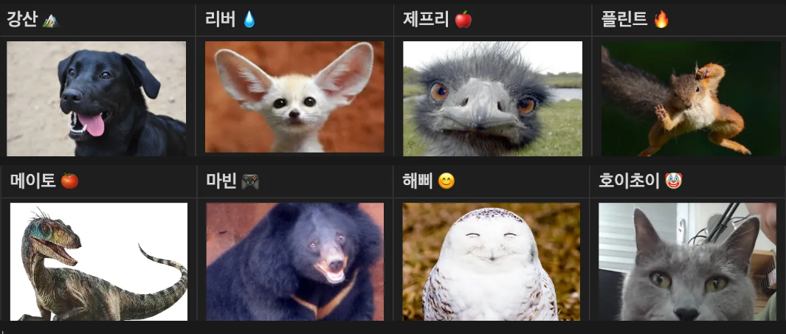

# 🎉아인슈타임 인터뷰 북🎉
함께 일하는 동료에 대해 얼마나 알고 계신가요? 우리는 종종 결과물 뒤에 숨겨진 사람들의 진짜 이야기를 놓치곤 합니다. 하나의 목표를 향해 달려온 팀에게 업무와 관련된 질문부터 지극히 사소하고 개인적인 궁금증까지, 다양한 질문을 던져보았습니다.

텅 빈 탕비실을 채울 각양각색의 간식 취향부터, 없으면 큰일 날 뻔했던 필수 협업 툴, 서로에게서 훔치고 싶은 부러운 능력, 그리고 프로젝트에 대한 속 깊은 이야기까지. 때로는 유쾌하고 때로는 진지한 그들의 답변을 통해 팀의 진짜 케미스트리와 매력을 발견해 보세요.

## 🐶 **팀원을 동물로 비유하자면?**

## 🥨 팀 탕비실 간식이 떨어졌다! 무엇으로 채울까요?

한 팀에서 똑같은 질문을 던졌는데, 돌아온 대답은 정말 제각각이었습니다. 누군가는 달콤한 간식을, 누군가는 음료를, 또 어떤 이는 아예 채우지 말자는 현실적인 의견까지 내놓았죠.

* **제프리**: **하리보 젤리**
    > “하리보 젤리 없으면 못 살아요.”

* **마빈**: **제로콜라**
    > “제로콜라요. 음료가 필요해요. 자몽에이드랑 섞어 마셔도 맛있어요.”

* **리버**: **안 채운다**
    > “안 채우는 게 낫죠. 다이어트 중이고, 비용 절감에도 좋아요.”

* **호이초이**: **프로틴 쉐이크**
    > “프로틴 쉐이크요. 비싸니까 회사 돈으로 사면 최고죠.”

* **메이토**: **홈런볼 메론우유맛**
    > “홈런볼 메론우유맛! 다들 좋아했고 제가 제일 좋아해요.”
    >> **강산**: “그거 곧 단종되는 거 아니에요?”

* **강산**: **카카오 99%**
    > “카카오 99%. 이만한 매력은 없습니다.”

* **해삐**: **쿠크다스 (빨간색)**
    > “쿠크다스 빨간색이요! 너무 맛있고 끊임없이 들어갑니다.”

* **플린트**: **비쵸비**
    > “비쵸비요. 여기 와서 처음 먹어봤는데 진짜 맛있었어요. 양은 좀 적지만요.”
---

## 💻 우리 팀의 필수 협업 툴은?

**우리 팀의 협업 툴(슬랙, 노션, 깃허브 등) 중에, 없었으면 멘붕 왔을 것 같은 툴은 무엇인가요?**

* **메이토**: **피그마**
  > “디자인을 해서 그걸 이미지로 따서 주고받거나, 포토샵을 썼어야 했다면… 와, 너무 어지러웠을 것 같아요. 비용도 그렇고, 이미지 파일 공유하는 것도 귀찮고. 하여튼 복잡했을 걸요!”

* **플린트**: **노션**
  > “문서화할 때 진짜 좋은 툴이에요. 그리고 파일 공유하기도 편하고요. 노션 없었으면 기록 관리가 많이 힘들었을 거 같아요.”

* **제프리**: **깃허브**
  > “서로 코드 관리가 안 됐을 거 같아요. 깃허브 없었으면 각자 코드 합치는 게 진짜 난리 났을 걸요.”

* **호이초이**: **책상**
  > “책상 없었으면요? 다 서서 하고 싶으세요? 허리 망가지고 싶으세요? 😒”

* **마빈**: **캠퍼스**
  > “비대면으로만 했다면… 아찔합니다. 진짜 상상하기도 싫어요.”

* **리버**: **디스코드**
  > “슬랙도 많이 쓰지만, 디스코드는 90일 제한이 없어서 좋아요. 오래 남아있으니까 훨씬 편해요.”

* **강산**: **한국어**
  > “한국어 없었으면 영어로 해야 하잖아요? 나 영어 못해요.”
  >
  >> **마빈**: “만약 한국어 사용이 유료화되면?”
  >>
  >> **강산**: “무슨 소리야 😡”

* **해삐**: **노션**
  > “프로젝트 진행 전반에 대한 모든 문서화를 노션을 사용하고 있습니다. 개인적으로 문서화는 노션이 최고라고 생각해요.”

---

## ✨ 서로에게서 뺏고 싶은 능력은?

**각 팀원으로부터 뺏고 싶은 능력이 있다면 무엇인가요?**

* **메이토**: **호초의 아이디어**
  > “아인슈타임, 앙부일구… 심지어 마빈맨까지! 이런 창의력은 못 참죠.”

* **강산**: **리버의 영어 실력(990)**
  > “이건 그냥 어학능력 자체가 부럽습니다.”

* **호초**: **플린트의 수학적 사고력**
  > “알고리즘 감각이랑 문제 푸는 방식이 진짜 멋져요.”

* **제프리**: **마빈의 열정**
  > “게임보다 개발에서 도파민을 느끼는 사람이라니… 대단합니다.”
  >
  >> **강산**: “사실 게임을 못하는 게 아닐까요? 😉”

* **리버**: **제프리의 뽑기 실력**
  > “피그민 띠부씰 뽑기 운이 장난 아닙니다.”
  >
  >> **제프리**: “운이 아니라 실력입니다 😎”

* **플린트**: **메이토의 진행 능력**
  > “MC메, 메형이라고 불릴 만합니다.”

* **마빈**: **제프리의 아이스브레이킹 능력**
  > “머리를 참 많이 굴려요.”
  >
  >> **제프리**: “제가요? 🙃”

* **제프리**: **강산의 청취 능력**
  > “흥미롭지 않은 얘기도 끝까지 들어주는 게 고맙습니다.”

* **해삐**: **호이초이의 창의력**
  > “저도 호이초이의 창의력이 탐나요. 뭔가 웃기면서 기억에 남는 아이디어들이 많았던 것 같아요.”

---

## ⚖️ 결과 VS 과정, 당신의 선택은?

**프로젝트를 한다면 결과 중심이 맞을까요, 아니면 과정 중심이 더 중요할까요? 팀원들에게 물어봤습니다.**

* **제프리**
  > "어차피 회사 가면 실적 압박은 매일 들어올 거예요. 지금은 즐거워야 합니다."

* **리버**
  > "결과가 좋지 않아도 배워가는 게 있으면 충분히 가치 있다고 생각해요."

* **플린트**
  > "지금은 배우는 과정이니까 성과가 최우선은 아니지 않을까요. 물론 나오면 좋지만요."

* **강산**
  > "다 같이 으쌰으쌰해서 좋은 기억 남기는 것도 좋지만, 사용자가 2명이라면… 그냥 배그 스쿼드하는 게 낫지 않을까요?"

* **호초**
  > "결과 중심 프로젝트는 앞으로도 자주 경험할 수 있죠. 하지만 과정 중심 프로젝트는 인생에서 흔치 않을지도 몰라요. 저는 다 받아줍니다."

* **마빈**
  > "솔직히 피토할 것 같아요. 그냥 4개월만 버텨봅시다…"

* **메이토**
  > "전 싸우는 게 제일 싫어요. 사람 때문에 스트레스 받고 싶지 않아요. 좋은 기억 남기는 게 더 중요합니다."

* **해삐**
  > “결과에 상관없이 그 안에서 배워가고 얻어가는 게 있으면 의미 있다고 생각합니다.”

---

## 📸 이번 프로젝트에서 가장 기억에 남는 순간은?

* **플린트**: **첫 QA 때**
  > 초반에는 주로 분야 별로 작업을 진행했는데 이후에 합치니까 머릿속으로만 흐릿하게 있었던 우리 서비스의 모습이 QA를 보고 난 뒤에 명확해져서 신기했어요.

* **호초**: **서비스명 아이디어 '앙부일구'가 거절당했을 때**
  > 회심의 일격이라고 생각했는데, 모두의 호응을 얻지 못해 아쉬웠지만 '아인슈타임'으로 좋은 팀 호응을 얻어 다시 일어섰어요.

* **강산**: **심가네 차돌박이 숙주 찜 칼국수 먹고 오버워치 하러 가던 길**
  > 그 때 그 향기는 잊을 수 없어요.

* **메이토**: **디버깅 하다가 '앙부일구'를 마주쳤을 때**
  > 진짜 미쳐버리는 줄 알았어요... 내가 분명 없다고 생각한 값이 콘솔에 계속 찍힐 때 진짜 스트레스 받는데 웃겼어요.

* **제프리**: **유강스 시트에서 귀신을 마주쳤을 때**
  > 가장 기억에 남네요.

* **마빈**: **회식하면서 푸시업 한 일**
  > 술 게임할 때마다 술을 더 마실 수 없어서 푸시업으로 대체했었죠.

* **리버**: **파이어폭스에서 우리 서비스 화면이 뒤집혀서 나올 때**
  > 이 때 이후로 웨일으로 갈아탔습니다…

* **해삐**: **처음 UT(사용성 테스트) 받았을 때**
  > 팀원들과 함께 만든 서비스에 대해서 직접 사용자의 피드백을 처음 받아보는 시간이었어서 좀 긴장되면서도 뿌듯했던 순간이에요!

---

## 🏢 우리 팀이 회사라면? (직급 배정 결과)

* **대표**: **강산**
  > (횡령하지 않는) Positive한 스타트업 CEO 느낌. 열정적으로 대외적인 일을 잘 처리할 것이라는 평을 받았습니다. (*“아… 페이퍼컴퍼니”*)

* **임원**: **마빈**
  > 제프리는 "나이가 많아서"라고 추천했고, 강산은 "종종 재미없는 얘기를 하는 TMT 임원의 느낌이 가득하다"고 덧붙였습니다.

* **부장**: **리버**
  > 호초는 "결재판에 사인만 할 것 같다"고 평했고, 제프리는 "나 다이어트 할 거니까 이번 주 탕비실 없다"고 선언할 것 같은 부장님이라고 말했습니다.

* **대리**: **메이토**
  > 일에 찌들고 늘 사직서를 품고 사는 듯한 날카로운 이미지. 정서불안이라는 평에 본인은 "예?"라며 반문했습니다.

* **사원**: **플린트**
  > 해삐를 능가하는 열정맨이자, 문서화를 꼼꼼하고 빡세게 처리하는 에이스 사원감이라는 평입니다.

* **인턴**: **해삐**
  > 한결같이 열심히 하는 모습이 인턴에 제격이라는 의견이었습니다.

* **경비**: **호초, 제프리**
  > 강산은 "경비 업무는 하겠지만, 들어오는 사람에게 계속 개그를 칠 것 같다"고 예측했습니다.
