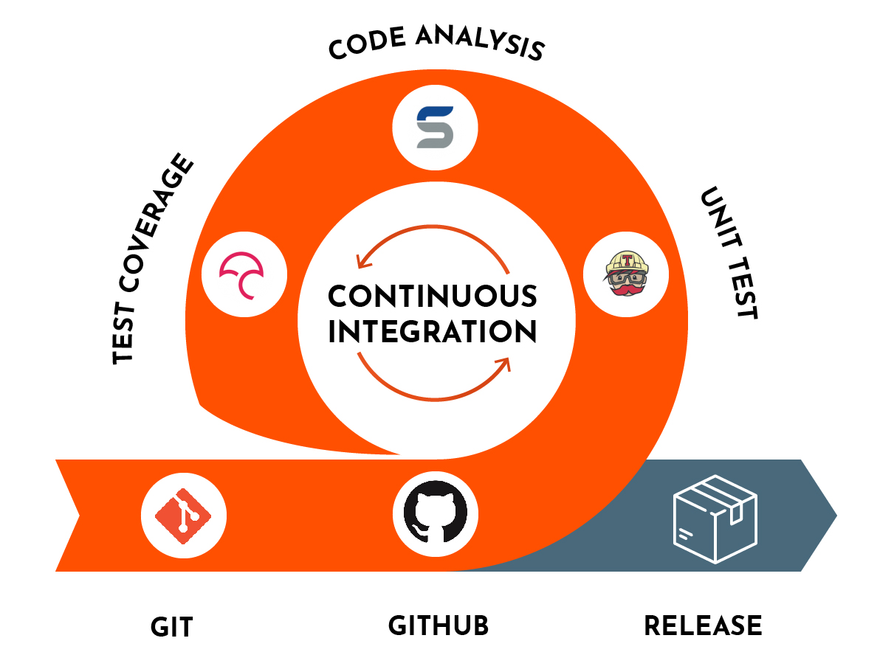
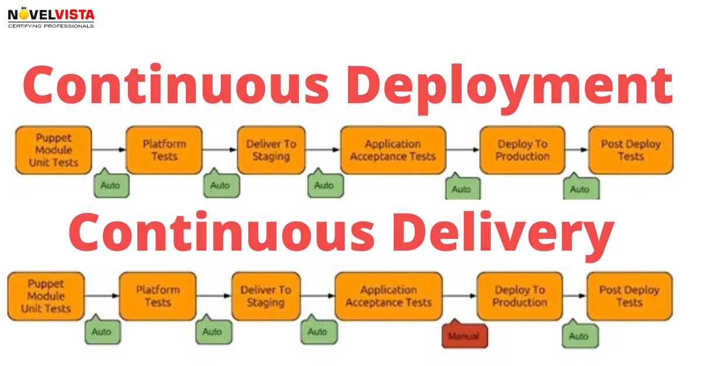
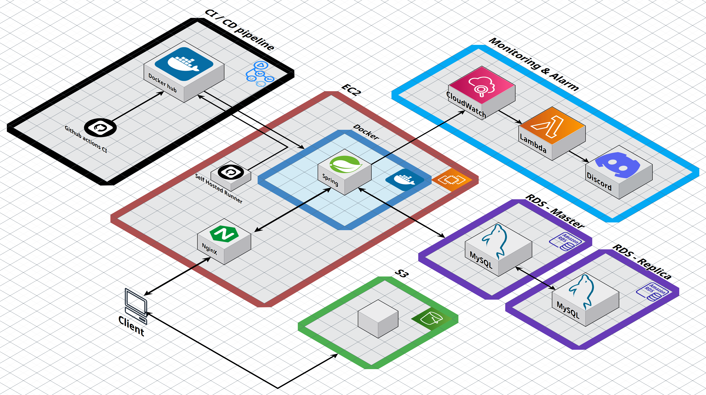

# 0. 목차

1. 개요 (독자에게 대략적인 청사진 제공)
2. 왜 CI / CD 자동화가 필요할까요? (가치 제공)
    1. 수동 CI / CD 과정이 불편한 이유 (시나리오로 제공)
    2. 자동 CI / CD를 도입했을때의 이점
3. CI 와 CD (개념 설명)
4. 실전: Github Actions 에서 자동 CI / CD 구현
5. 트러블 & 슈팅
6. 무중단 배포 환경이라면?

# 1. 개요

팀 프로젝트를 진행하면서 자동화된 CI / CD의 필요성을 느끼게 됐다.

이번에 수동 CI / CD 에서 Github Actions를 통한 자동 CI / CD 파이프라인을 구축했습니다. 그 과정에서 얻은 노하우와 트러블 슈팅도 공유한다.

# 2. 왜 CI / CD 자동화가 필요할까?

## 2.1 수동 CI / CD가 불편한 이유

1. 깃허브에서 통합이 된 코드를 로컬로 불러와 빌드한다.
    
    문제점:
    
    - 개발자마다 다른 코드를 가지고 이미지를 빌드할 수도 있다!
    - 테스트나 빌드 실패 시, 다른 개발자들과 공유가 어렵다.
2. 로컬에서 빌드한 이미지를 도커 허브로 업로드한다.
3. ec2 서버에 접속해 도커 허브에서 이미지를 다운로드 한다.
    
    문제점:
    
    - 특정 버전의 이미지가 아닌, 다른 버전의 이미지를 가져올 수도 있다.
    - 불필요하게 서버에 접속해야해서 관리 포인트가 늘어난다.
4. 이미지로 컨테이너를 실행한다.
    
    문제점:
    
    - 기존 서버를 내리지 않는다면 포트 충돌 에러가 난다.
    - 만약 최신 이미지가 아닌 다른 버전의 이미지라면 배포가 되더라도 파악하기가 어렵다.
    

이 모든 과정에서 일어나는 문제점:

- 반복적인 작업을 계속 수행해야 해서 시간을 낭비하고 사람의 관리 포인트가 늘어나 실수할 확률이 늘어난다.
- 긴급 버그 수정에서도 이 긴 과정을 또 반복해야 한다.
- 롤백 과정에서도 이 긴 과정을 또 반복해야 한다.

## 2.2 자동 CI / CD를 도입했을때의 이점

- 하나의 가상환경에서 CI를 진행하기 때문에 모든 개발자가 진행 상황을 동시에 공유 가능하다.
- 반드시 하나의 코드 베이스에서만 이미지가 만들어진다.
- 배포 서버에 직접 접속할 필요가 없다.
- 배포, 롤백, 핫픽스 모두 아주 빠르게 한 번에 가능!

# CI: Continuous Integration



CI의 목적: 여러 개발자가 작성한 코드를 하나의 코드베이스에 지속적으로 통합시키고, 해당 코드를 바탕으로 문제 없는 실행 파일을 만드는 과정.

- 지속적인 통합이라는 뜻
    - 여러 개발자가 지속적으로 하나의 코드 베이스에 코드를 통합하는 것.
- 우리는 코드를 테스트하고 이미지로 빌드하는 과정 까지를 CI에 넣었음.
    - 왜? 우리가 지속적으로 `통합`  해야 하는 것은 ec2 서버에서 사용할 도커 이미지이기 때문이다.
    - 근데 실제로 통합되는건 코드고, 그 코드로 만들어진 도커 이미지는 계속 교체됨
    - 테스트까지 하는 이유는? 문제 없는 코드를 이미지로 만들기 위해서 ㅇㅇ

# CD: Continuous Deployment(or Delivery)

CD의 목적: CI 과정에서 만든 결과물 (실행파일이나 도커 이미지)를 서버로 배달한 후, 배포하는 과정.

## Deployment 와 Delivery의 차이



Deployment가 더 큰 개념. Delivery를 포함하고 있다.

둘의 차이를 만드는 것은 “최종적으로 배포 허가는 누가 내주는가?”

Deployment의 경우, 산출물을 전달받고 실행하여 배포하는 것 까지 원큐에 실행.

Delivery의 경우 산출물을 전달받는 것 까지만 실행. 배포는 사람(결정권자)가 확인후 결정한다.

## ***우리팀은 왜? 이미지를 만드는 과정을 CD에 포함하지 않았나***

- 효율성
    - CI 과정에서 한번 빌드한 실행파일을 여러 서버에서 CD과정을 통해 실행 가능함. 만약 CD 과정에서 이미지를 만든다면, 각 서버마다 이미지를 계속 빌드해야 해서 시간 낭비가 생긴다.
- 일관성 및 신뢰성
    - 테스트를 통과한 통합 코드를 이미지로 만들지 않고 각각의 CD 과정마다 만들게 되면, 인스턴스마다 실행되는 서버가 모두 같다는 보장이 없어진다.

# 우리 팀의 CI / CD (`main` 브랜치 기준)


다음은 우리 팀의 ci / cd 플로우 로직이다.
## CI

코드
```yaml
name: Prod Server CI

on:
  pull_request:
    types: [ opened, synchronize, reopened ]
    branches: [ main ]
    paths: [ 'app/**' ]
  push:
    branches: [ main ]
    paths: [ 'app/**' ]

jobs:
  test:
    if: github.event_name == 'pull_request'
    runs-on: ubuntu-latest
    defaults:
      run:
        working-directory: ./app
    steps:
      - name: Checkout
        uses: actions/checkout@v4
      - name: Set up JDK 21
        uses: actions/setup-java@v4
        with:
          java-version: '21'
          distribution: 'temurin'
      - name: Cache Gradle dependencies
        uses: actions/cache@v3
        with:
          path: |
            ~/.gradle/caches
            ~/.gradle/wrapper
          key: ${{ runner.os }}-gradle-${{ hashFiles('**/*.gradle*', '**/gradle-wrapper.properties') }}
          restore-keys: |
            ${{ runner.os }}-gradle-
      - name: Setup Gradle
        uses: gradle/gradle-build-action@v2
      - name: build with Gradle
        run: ./gradlew clean test

  build-and-push:
    if: github.event_name == 'push'
    runs-on: ubuntu-latest
    defaults:
      run:
        working-directory: ./app
    steps:
      - name: Checkout
        uses: actions/checkout@v4
      - name: Set up JDK 21
        uses: actions/setup-java@v4
        with:
          java-version: '21'
          distribution: 'temurin'
      - name: Cache Gradle dependencies
        uses: actions/cache@v3
        with:
          path: |
            ~/.gradle/caches
            ~/.gradle/wrapper
          key: ${{ runner.os }}-gradle-${{ hashFiles('**/*.gradle*', '**/gradle-wrapper.properties') }}
          restore-keys: |
            ${{ runner.os }}-gradle-
      - name: Setup Gradle
        uses: gradle/gradle-build-action@v2
      - name: build with Gradle
        run: ./gradlew clean build
      - name: Set up Docker Buildx
        uses: docker/setup-buildx-action@v3

      - name: Login to Docker Hub
        uses: docker/login-action@v3
        with:
          username: ${{ secrets.DOCKERHUB_USERNAME }}
          password: ${{ secrets.DOCKERHUB_TOKEN }}

      - name: Build and push Docker image
        id: build-and-push
        uses: docker/build-push-action@v5
        with:

          context: ./app
          file: ./app/Dockerfile
          push: true
          platforms: linux/arm64
          tags: |
            # 🚨 Docker Hub 리포지토리 이름 일반화 (가장 중요!)
            ${{ secrets.DOCKERHUB_USERNAME }}/your-prod-repo:${{ github.sha }}
          cache-from: type=registry,ref=${{ secrets.DOCKERHUB_USERNAME }}/your-prod-repo:buildcache
          cache-to: type=registry,ref=${{ secrets.DOCKERHUB_USERNAME }}/your-prod-repo:buildcache,mode=max

      - name: Save image tag to file
        run: echo ${{ github.sha }} > ./image-tag.txt

      - name: Upload artifact
        uses: actions/upload-artifact@v4
        with:
          name: build-artifact
          path: app/image-tag.txt

```

- 트리거
    - main ← 을 향하는 PR 발생 시: main에 합쳐지기 전에, 기존 코드를 망치지 않는지 테스트하고, 검증한다.
    - main 브랜치에 push(merge) 발생 시: main에 합쳐졌을 때, 배포 가능한 최종 결과물(도커 이미지)를 생성한다.
- **main ← 을 향하는 PR 발생 시 = `test` job 실행**
    1. 깃허브가 제공하는 최신 우분투 가상 환경에서 실행
    2. `Checkout`: 현재 워크플로우가 실행 중인 레포의 소스 코드를 가상 환경으로 내려받는다.
    3. `Cache Gradle dependencies`: 빌드 속도 최적화를 위한 단계. 
        1. 깃허브에서 제공하는 캐시 저장소에 .gradle을 저장함.
        2. 같은 키의 .gradle이 존재한다면 이 저장소에서 받아옴
        3. 우리 ci에서 키는 운영체제 + 문자열 + build.gradle 내용으로 만듦. 즉, build.gradle의 내용이 달라질 때 마다 키가 바뀐다.
    4. `Setup Gradle` : 빌드 환경 설정, 불필요한 캐시 정리
    5. `build with Gradle` : `./gradlew clean test` 를 사용해 테스트”만” 실시
- **main 브랜치에 push(merge) 발생 시 = `build and push` job 실행**
    1. 4번까지는 동일
    2. `build with Gradle` : `./gradlew clean build` 로 실행 파일 생성. 참고로 build 명령어를 실행하면 테스트를 먼저 실행한다.
    3. `Set up Docker Buildx` & `Login to Docker Hub` : 도커 이미지를 빌드한 후, 도커허브에 푸시하기 위한 환경 설정
    4. `Build and push Docker image` : 이미지를 빌드한 후, 도커 허브에 푸시한다.
        1. 이때 플랫폼은 서버와 같은 os를 지정
        2. 태그는 latest와 버전 관리용 sha 태그를 만들어서 달아줌.
    5. `Save image tag to file` : 위에서 만든 이미지 태그를 저장 후 아티팩트(저장소)에 넣어두고 CD 과정에서 활용할 수 있도록 한다.

## CD

코드
```yaml
# 💻 Example: CD Workflow for Production

name: Prod Server CD

on:
  workflow_run:
    workflows: [ "Prod Server CI" ]
    types: [ completed ]
    branches: [ main ]

jobs:
  deploy:
    if: >
      github.event.workflow_run.conclusion == 'success' &&
      github.event.workflow_run.event == 'push'
    runs-on: [your-self-hosted] 

    permissions:
      actions: read

    steps:
      - name: Login to Docker Hub
        uses: docker/login-action@v3
        with:
          username: ${{ secrets.DOCKERHUB_USERNAME }} 
          password: ${{ secrets.DOCKERHUB_TOKEN }}

      - name: Stop and remove existing container
        run: |
          # 컨테이너 이름 일반화
          if [ "$(sudo docker ps -a -q -f name=your-container-name)" ]; then
            sudo docker stop your-container-name
            sudo docker rm -f your-container-name
          fi

      - name: Download artifact
        uses: actions/download-artifact@v4
        with:
          name: build-artifact
          run-id: ${{ github.event.workflow_run.id }}
          github-token: ${{ secrets.GITHUB_TOKEN }}


      - name: Extract deploy tag
        run: |
          echo "DEPLOY_TAG=$(cat image-tag.txt)" >> $GITHUB_ENV
          echo "Deploying version: $(cat image-tag.txt)"

      - name: Pull image
        run: |
          sudo docker pull your-dockerhub-username/your-prod-repo:${{ env.DEPLOY_TAG }}

      - name: Deploy with Docker Compose
        env:
          IMAGE_TAG: ${{ env.DEPLOY_TAG }}
        run: |
          cd /path/to/your/project
          
          echo "Deploying with image tag: $IMAGE_TAG"
          sudo -E docker compose up --no-deps -d app

      - name: Prune old images
        run: sudo docker image prune -f

```

- 트리거:
    - “`Prod Server CI`” 라는 이름을 가진 워크플로우가 실행이 끝났을 때.
    - 해당 워크플로우가 완료되었을 때.
    - CI 워크플로우가 main 브랜치에서 실행되었을 때.
- `deploy` job
    - "Prod Server CI”가 성공적으로 완료되었을 때만 job 실행. 테스트가 깨지거나 빌드가 안되면 실행 안 함.
    - pr 이 아닌, main에 push 된 경우만 배포.
    - self hosted runner로 실행함. 해당 runner는 우리 ec2에서 이미 열려있고, 그쪽에서 cd 과정을 직접 수행한다.
    1. `Login to Docker Hub`: 도커 허브에 로그인함.
    2. `Stop and remove existing container`: 기존에 실행중이던 구버전 컨테이너를 내리고 삭제함.
    3. `Download artifact`: 이미지 태그를 가져오기 위해 위에서 만든 아티팩트 다운.
    4. `Extract deploy tag`: 태그를 읽어서 ec2 서버에 환경변수로 삽입한다.
    5. `Pull latest image`: 태그를 가진 이미지를 다운로드한다.
    6. `Deploy with Docker Compose`: 다운로드한 이미지로 컨테이너를 실행한다.
    7. `Prune old images`: 구 버전 이미지들을 삭제한다.

# 트러블 & 슈팅

- CI 경합상태 문제
    - 두 개의 CI가 같은 시점에 돌아가고 있을 때, 다른 코드를 덮어쓰기 하는 문제 발생
        - 발생 이유: dev 에서 갈라져나온 feat/#A 와 feat/#B는 서로의 코드가 반영되어 있지 않음.
        - 해결 방법: PR 브랜치 기준으로 이미지를 만드는 것이 아닌, dev 브랜치 기준으로 이미지를 만들었다.
- 플랫폼 문제
    - 이미지는 amd64 기반, ec2 서버는 arm64 기반이라 플랫폼 불일치 문제 발생
        - 발생 이유: 도커는 이미지를 빌드하는 서버의 아키텍쳐를 기본으로 따라감. 이때 깃허브 러너는 특별한 설정을 해주지 않는 한, amd64로 실행되어서 이미지가 amd64로 빌드됨
        - 해결 방법: 플랫폼을 직접 명시해주어서 해결
            
            ```yaml
                  - name: Build and push Docker image
                    id: build-and-push
                    uses: docker/build-push-action@v5
                    with:
                      context: ./server
                      file: ./server/Dockerfile
                      push: true
                      platforms: linux/arm64
                      ...
            ```
            
- CI 시간이 너무 길던 문제
    - CI 가 8분 이상 걸려 시간이 많이 낭비되던 문제
        - 발생 이유:
            1. 별 이유 없이 멀티 플랫폼(amd64, arm64로 빌드하고 있었음)
            2. 테스트와 빌드를 하는 과정에서 두 번 의존성 다운로드를 하고 있었음.
        - 해결
            1. arm64 아키텍쳐로만 빌드하도록 변경
            2. 테스트하는데 사용한 .gradle을 빌드할 때 캐싱하도록 변경
    
    # 도커를 사용한 이유.
    
1. 개발자 환경 - github action 서버 - ec2 개발 서버 환경이 다르기 때문에
2. 내 환경에서는 코드가 잘 작동되지만, 다른 환경에서는 작동하지 않을 수도 있음.
    
    왜? 각각 설치된 OS나 jdk, 라이브러리 버전이 다를 수도 있어서. 즉 환경이 다를 수도 있어서
    
3. 도커 이미지를 사용하면 os, jdk, 라이브러리(gradle)을 통합할 수 있어서 해당 걱정을 줄여준다.
4. 실행 과정에서 도커 이미지만 실행하면 돼서 굉장히 편리하다.
5. 서버가 여러 대로 늘어날 때, 이미지만 가지고 실행하면 모두 같은 환경임을 보장할 수 있다.
6. 이전 버전으로 돌아갈 때도, 이전 버전의 이미지만 실행하면 돼서 편리하다.

# 무중단 배포 환경에서는?


지금까지는 단일 서버 환경에서의 CI / CD 에 대해 설명했다.

CI / CD가 새로운 책임을 갖게 됐다: 서버 상태 관리와 트래픽 제어를 해야 한다.

## **CI/CD 파이프라인의 진화: 왜 스크립트가 더 복잡해져야 하는가?**

무중단 배포가 들어오면서, ci cd 파이프라인은 더 정교하고 복잡하게 변화해야 한다.

하지만 당신이 CI CD 파이프라인을 잘 분리해놨다면, CI 과정은 거의 변할게 없어진다. 

CI의 역할은 산출물을 만드는 것 까지이기 때문에, 여기까지의 과정은 동일하다.

CD에 역할이 추가된다.

기존역할 + 서버 상태 관리 + 트래픽 제어

(이 부분은 무중단 배포를 직접 적용해보고 변경점을 추가할 예정입니다.)

## **무중단 배포 CI/CD의 핵심: '어디에' 배포하고 '언제' 전환할 것인가?**

- **(1단계) Green 인스턴스 식별:** 파이프라인이 현재 놀고 있는 서버(Green)를 어떻게 찾아내는지 설명합니다. (예: AWS CLI로 Target Group에 연결되지 않은 인스턴스를 찾거나, EC2 인스턴스에 `env:green` 같은 태그를 붙여 관리하는 방법)
- **(2단계) 안전한 배포 및 상태 검사 (Health Check):** Green 인스턴스에 새 버전의 애플리케이션(Docker 이미지)을 배포한 후, **파이프라인이 스스로 `curl` 같은 명령어로 특정 API 엔드포인트(예: `/health`)를 호출**하여 애플리케이션이 정말 잘 실행되었는지 검증하는 과정을 보여줍니다. 여기서 실패하면 절대 다음 단계로 넘어가면 안 된다는 점을 강조합니다.
- **(3단계) 트래픽 전환:** GitHub Actions 워크플로우에서 **`aws elbv2 modify-listener`** 같은 AWS CLI 명령어를 실행하여 ALB가 바라보는 대상 그룹을 Blue에서 Green으로 바꾸는 '한 줄의 코드'를 보여줍니다. 이 순간이 바로 무중단 배포의 핵심임을 강조.
- **(4단계) 롤백 시나리오:** 만약 2단계의 상태 검사가 실패하면, 파이프라인은 트래픽 전환 없이 그대로 작업을 중단하고 실패 알림을 보냅니다. 사용자는 여전히 문제없는 Blue 환경을 사용하고 있으므로 서비스 장애는 발생하지 않았다는 점을 설명합니다.

**"그래서 AWS 계정 정보는 어떻게 관리하는데요?" - CI/CD 보안**