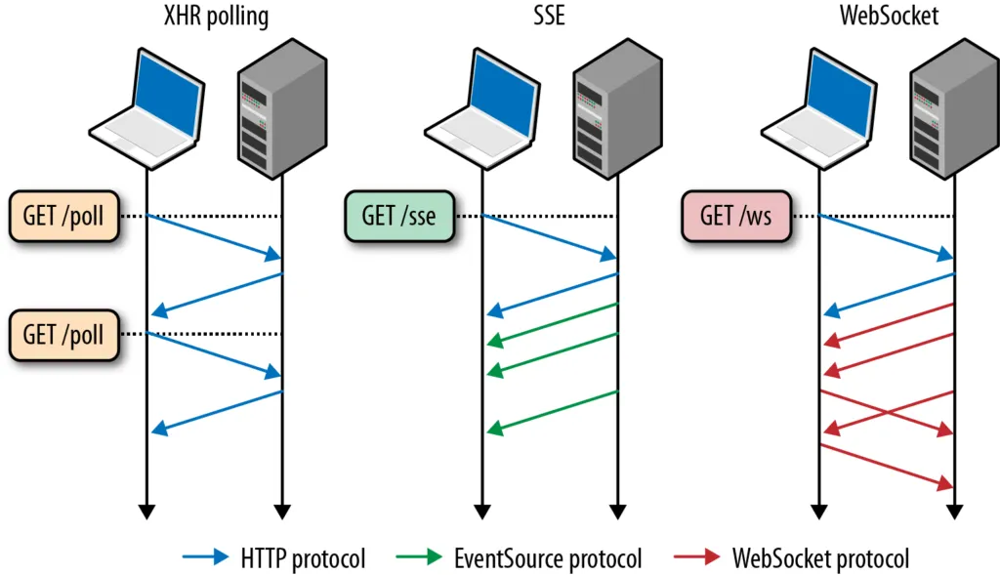
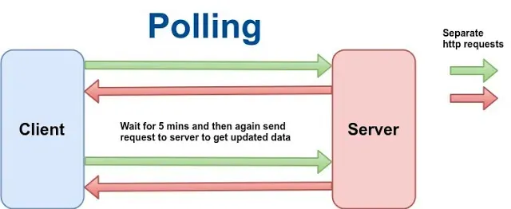
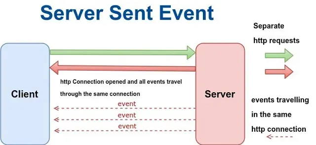
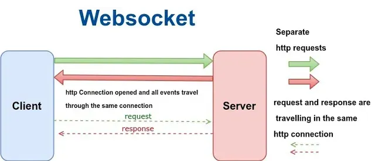
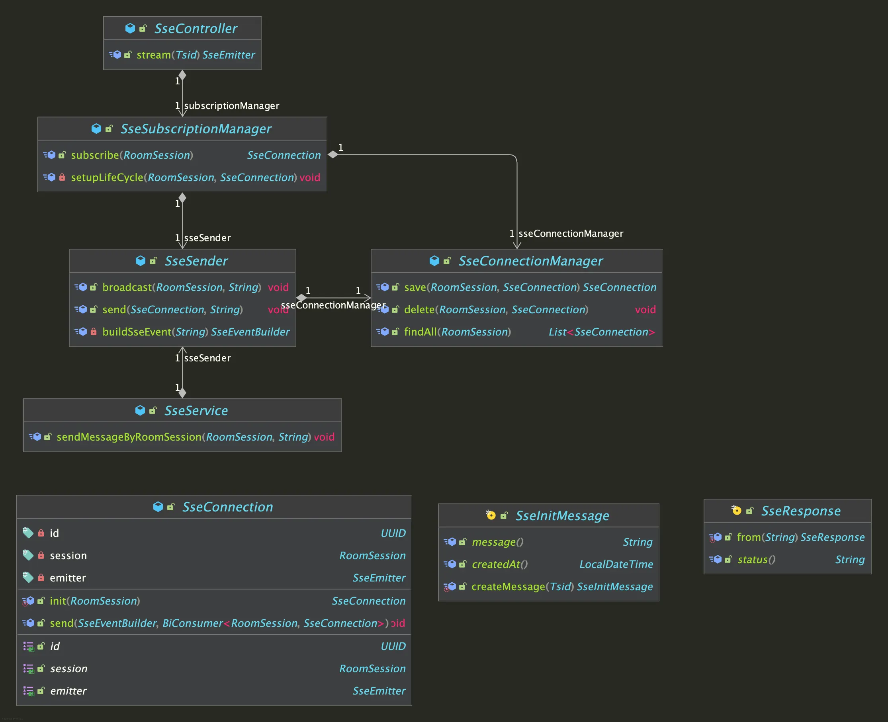

# 실시간 웹 통신 기술: Polling, SSE, WebSocket

## 들어가며

실시간 채팅, SNS 새 댓글 알림, 문서를 수정하는 협업 툴, 주식 시세 창까지. 이 모든 경험의 중심에는 '**실시간**(**Real-time**)'이라는 공통된 키워드가 있다. 이제 사용자는 정보를 얻기 위해 F5 키를 누르는 대신, 데이터가 발생하는 바로 그 순간, 화면에 자연스럽게 반영되는 것을 당연하게 여긴다.

이러한 사용자 경험을 현실로 구현해야하는 개발자에게는 "**어떻게 하면 서버와 클라이언트 간의 실시간 통신을 효율적이고 안정적으로 구현할까?**"라는 의문이 자연스럽게 생긴다. 이 질문에 대한 '유일한 정답'은 없다. 서비스의 성격, 데이터의 흐름, 시스템의 제약 조건에 따라 최적의 해법은 달라지기 때문이다.

이 글에서는 그 해답을 찾아가는 과정을 다룬다. 실시간 통신을 구현하는 대표적인 네 가지 기술, **Polling, Long Polling, Server-Sent Events**(**SSE**)**, WebSocket**의 원리와 장단점을 파헤쳐 보고, 어떤 상황에 무엇을 선택해야 할지 비교해본다. 더 나아가 **아인슈타임 프로젝트**에서 특정 요구사항을 해결하기 위해 **어떻게 SSE를 도입하고 안정적인 구조를 구축했는지**, 그 고민과 경험을 공유한다.

---

## 실시간 데이터 전송 기술 4가지

### 1. Polling

**폴링**(**Polling**)은 실시간 통신을 구현하는 가장 고전적이고 직관적인 방법이다. 클라이언트가 주기적으로, 예를 들어 2초마다 한 번씩, 서버에게 "**혹시 새로운 데이터 있나요?**"라고 계속해서 HTTP 요청을 보내는 방식이다. 서버는 새로운 데이터의 유무와 상관없이 매번 요청에 대한 응답을 반환힌다.

이 방식의 가장 큰 **장점**은 구현이 매우 간단하며 HTTP 요청/응답이라는 웹의 가장 기본적인 모델을 따르기 때문에 아주 오래된 브라우저를 포함한 거의 모든 환경에서 완벽하게 동작한다는 것이다. 하지만 그 단순함은 명백한 **단점**을 동반한다. 실제 데이터의 변경이 없는 대부분의 시간에도 클라이언트는 불필요한 요청을 계속해서 보내야 한다. 이는 네트워크 대역폭을 낭비하고, 서버는 끊임없이 들어오는 요청을 처리하느라 상당한 리소스를 소모하게 된다. 또한 데이터가 발생한 시점과 다음 폴링 주기가 돌아오는 시점 사이에 필연적으로 **지연**(**latency**)이 발생해 진정한 의미의 실시간성을 제공하기 어렵다.

### 2. Long Polling

**롱 폴링**(**Long Polling**)은 기본 폴링의 비효율성을 개선하기 위해 등장한 방법이다. 클라이언트는 폴링과 마찬가지로 서버에 데이터를 요청하지만 여기서 핵심적인 차이가 발생한다. 서버는 새로운 데이터가 발생할 때까지 즉시 응답하지 않고 **연결을 열어둔 채로 기다린다.** 그러다 마침내 서버에서 새로운 이벤트가 발생하면 그제야 클라이언트에게 응답을 보내 연결을 종료한다. 클라이언트는 응답을 받는 즉시 새로운 요청을 다시 서버로 보내 다음 이벤트를 기다리는 과정을 반복한다.

이 방식은 불필요한 요청-응답 주기를 대폭 줄여주므로 폴링에 비해 훨씬 효율적이다. 또한 일반적인 HTTP 프로토콜 위에서 동작하기 때문에 방화벽이나 프록시 서버로 인해 연결이 막힐 가능성이 적다. 하지만 이 역시 **한계**가 존재한다. 수많은 클라이언트가 동시에 연결을 유지하고 대기해야 하는 상황이라면 서버의 부담이 기하급수적으로 늘어날 수 있으며, 데이터 변경이 매우 빈번하게 일어나는 환경에서는 사실상 폴링과 다를 바 없는 동작을 보일 수 있다.

### 3. Server-Sent Events (SSE)

**서버-전송 이벤트**(**Server-Sent Events, SSE**)는 이름에서 알 수 있듯이 **서버에서 클라이언트로 데이터를 밀어주는**(**push**) **단방향 스트리밍 기술**이다. 클라이언트가 최초에 한 번 연결을 요청하면 서버는 그 연결을 계속 유지하면서 필요할 때마다 클라이언트에게 데이터를 스트림 형태로 전송한다. 마치 라디오 방송국이 청취자에게 계속해서 방송을 송출하는 것과 같다.

SSE의 가장 큰 **장점**은 WebSocket에 비해 훨씬 구현이 간단하고 가볍다는 점이다. 기존 HTTP 프로토콜을 그대로 사용하며 클라이언트는 브라우저에 내장된 [`EventSource`](https://developer.mozilla.org/en-US/docs/Web/API/EventSource) API를 통해 단 몇 줄의 코드로 서버 이벤트를 구독할 수 있다. 또한 네트워크 문제 등으로 연결이 일시적으로 끊어졌을 때 자동으로 재연결을 시도하는 표준 메커니즘이 내장되어 있어 안정성 확보에 유리하다.

하지만 명백한 **단점**도 존재한다. 데이터 흐름이 오직 서버에서 클라이언트로만 향하는 **단방향**(**one-way**) **통신**이다. 클라이언트가 서버로 데이터를 보내려면 별도의 HTTP 요청(POST)을 사용해야 한다. 또한 Internet Explorer(IE)와 같은 일부 구형 브라우저에서는 지원되지 않는다는 호환성 제약이 있다.

### 4. WebSocket

**웹소켓**(**WebSocket**)은 실시간 통신 기술의 '끝'으로 불리는 기술로, 서버와 클라이언트 간의 **완전한 양방향 전이중**(**Full-Duplex**) **통신 채널**을 제공한다. 최초 연결 시에는 HTTP 프로토콜을 통해 "이 연결을 웹소켓으로 전환하고 싶다"라는 신호를 보내는 핸드셰이크(handshake) 과정을 거친다. 일단 연결이 성공적으로 수립되면 통신 프로토콜은 HTTP에서 독립적인 웹소켓 프로토콜(`ws://` 또는 `wss://`)로 업그레이드된다.

이렇게 수립된 채널을 통해 서버와 클라이언트는 마치 전화 통화를 하듯, 필요할 때마다 서로에게 메시지를 자유롭게 보낼 수 있다. 이 방식은 HTTP 헤더와 같은 불필요한 오버헤드가 거의 없어 매우 적은 데이터로 통신이 가능하며 **대량의 트래픽을 처리**하고 **지연을 최소화**하는 데 효과적이다. 이러한 특성 덕분에 실시간 채팅, 멀티플레이어 온라인 게임, 구글 독스와 같은 공동 편집 애플리케이션 등 가장 까다로운 실시간 요구사항을 가진 서비스에 최적화되어 있다.

물론 **단점**도 있다. 기존 웹 인프라와 다른 별도의 프로토콜을 사용하므로 서버 및 방화벽, 로드밸런서 등의 인프라 구성에 추가적인 고려가 필요하며, 구현의 **복잡도**가 다른 기술들에 비해 높은 편이다.

---

### 한 눈에 기술 비교하기

| **구분**       | **Polling**             | **Long Polling** | **Server-Sent Events (SSE)** | **WebSocket**           |
| ------------ | ----------------------- | ---------------- | ---------------------------- | ----------------------- |
| **연결 방식**    | 비연속적 연결                 | 비연속적 연결 (대기)     | 단일 지속적 연결                    | 단일 지속적 연결               |
| **방향성**      | 클라이언트 → 서버              | 클라이언트 → 서버       | **서버 → 클라이언트 (단방향)**         | **양방향**                 |
| **프로토콜**     | HTTP                    | HTTP             | HTTP                         | WebSocket (ws/wss)      |
| **브라우저 지원**  | 모든 브라우저                 | 모든 브라우저          | 대부분 (IE 미지원)                 | 대부분의 최신 브라우저            |
| **구현 난이도**   | 쉬움                      | 쉬움               | 보통                           | 다소 복잡                   |
| **서버 부담**    | 높음                      | 보통               | 낮음                           | 낮음 (연결 수립 후)            |
| **주요 활용 사례** | 간단한 상태 업데이트, 레거시 시스템 호환 | 실시간 알림 (구형)      | 실시간 알림, 뉴스 피드, 로그 스트리밍       | 채팅, 온라인 게임, 협업 툴, 금융 시세 |

---

### 언제 무엇을 선택할까?

그렇다면 이 다양한 기술들 중 우리는 무엇을 선택해야 할까? 정답은 '**서비스의 요구사항**'에 있다.

- **Polling**은 실시간성이 그다지 중요하지 않고 몇 분 단위의 **간단한 주기적 데이터 확인**이 필요하거나(5분마다 날씨 정보 업데이트 등) 오래된 브라우저와의 **레거시 호환성**이 최우선 순위일 때 고려할 수 있는 최후의 보루다.
- **Server-Sent Events** (**SSE**)는 **서버에서 발생하는 이벤트를 클라이언트로 밀어주는 기능**이 핵심일 때 도입을 고려할 수 있다. 예를 들어 새로운 댓글이나 '좋아요' 알림, 최신 뉴스 기사 피드, 실시간 서버 로그 전송과 같이 클라이언트의 개입 없이 서버가 주도적으로 정보를 전달하는 시나리오에 적합히다. WebSocket의 복잡성을 피하면서 효율적인 단방향 푸시를 구현하고 싶을 때 적절하다.
- **WebSocket**은 클라이언트와 서버가 **끊임없이 정보를 주고받아야 하는** 고도의 상호작용이 필요할 때 사용해야 한다. **실시간 채팅**, 사용자의 모든 움직임이 즉각적으로 다른 플레이어에게 전달되어야 하는 **멀티플레이어 게임**, 여러 사용자가 동시에 하나의 문서를 편집하는 **공동 편집 툴**과 같이, 지연에 극도로 민감하고 양방향 통신이 필수적인 서비스를 개발한다면 선택해야 한다.

---

## 아인슈타임 프로젝트에 SSE 적용하기

[아인슈타임 프로젝트 GitHub Repo](https://github.com/woowacourse-teams/2025-estime)

아인슈타임 프로젝트에서는 '특정 세션(방)에 참여한 사용자들에게 갱신된 투표 현황을 실시간으로 알려주는 기능'이 필요했다. 이 요구사항을 분석한 결과, 데이터의 흐름이 대부분 서버에서 클라이언트로 향하는 **단방향**이었고, 클라이언트가 서버로 보내는 데이터는 기존의 **RESTful API**(HTTP POST/PUT 등)로 충분히 처리 가능했다. 이를 바탕으로 WebSocket의 양방향 통신은 오버엔지니어링이고, 가볍고 안정적인 HTTP 기반의 SSE가 적절하다고 판단했다.

### 1. 실시간 통신 기술: SSE

SSE는 앞서 설명했듯 서버에서 클라이언트로의 단방향 데이터 푸시를 위한 기술이다. 클라이언트는 브라우저의 `EventSource` API를 통해 특정 엔드포인트를 '구독'하고, 서버는 `Content-Type`을 `text/event-stream`으로 지정한 응답을 통해 연결을 계속 유지하며 원할 때마다 이벤트를 전송한다.

이 단순한 원리 뒤에는 안정적으로 운영 하기 위해 해결해야 할 문제들이 존재한다. 예를 들어 수많은 클라이언트 연결을 어떻게 효율적으로 관리할 것인가? 클라이언트의 연결이 비정상적으로 끊겼을 때 서버의 리소스 누수를 어떻게 막을 것인가? 데이터베이스 트랜잭션과 SSE 이벤트 전송의 시점은 어떻게 동기화할 것인가? 이 문제들을 **‘역할과 책임의 분리**'라는 객체 지향의 기본 원칙을 통해 해결했다.

### 2. SSE 아키텍처: 역할과 책임의 분리

SSE 관련 로직을 `com.estime.common.sse` 패키지 내에서 여러 컴포넌트로 분리해 각 컴포넌트가 오직 자신의 책임에만 집중하도록 설계했다.

#### 주요 컴포넌트와 역할

- **Presentation**
  - **`SseController`**
      - HTTP 요청을 받아 SSE 구독 흐름을 시작시킨다.
      - `GET /api/v1/sse/rooms/{session}/stream` 엔드포인트를 통해 클라이언트의 구독 요청을 받고, 실제 구독 처리는 `SseSubscriptionManager`에게 위임한 뒤 반환된 `SseEmitter` 객체를 클라이언트에 전달하는 역할만 수행한다.

- **Application**
  - **`SseSubscriptionManager`**
      - 구독 프로세스의 전체적으로 관리한다.
      - 클라이언트의 구독 요청이 들어왔을 때 새로운 `SseConnection` 객체를 생성하고 `SseConnectionManager`에 저장을 요청하는 등, 구독에 필요한 모든 절차를 조율한다. 또한 초기 연결이 성공했음을 클라이언트에게 알리기 위해 `SseSender`를 통해 "connected" 이벤트를 전송한다.
      - 가장 중요한 책임 중 하나는 `SseEmitter`의 생명주기(`onCompletion`, `onTimeout`, `onError`) 콜백을 설정하는 것이다. 이 콜백들은 어떤 이유로든 연결이 종료될 경우, `SseConnectionManager`에서 해당 연결 정보를 안전하게 삭제하도록 하여 메모리 누수를 원천적으로 방지한다.

  - **`SseConnectionManager`**
      - 활성화된 연결들의 저장소 역할을 한다. 
      - 내부적으로 `Map<RoomSession, Map<UUID, SseConnection>>` 형태의 `ConcurrentHashMap`을 사용하여 수많은 연결들을 스레드-안전(thread-safe)하게 관리한다.
      - 연결들을 `RoomSession` 별로 그룹화하여 특정 방에 속한 모든 클라이언트에게 메시지를 보내는(broadcast) 연산을 효율적으로 처리할 수 있다. 또한 연결이 삭제될 때 만약 해당 `RoomSession`에 더 이상 활성 연결이 없다면 외부 Map에서 `RoomSession` 키 자체를 삭제하여 불필요한 리소스를 완전히 정리한다.

  - **`SseSender`**
      - 이벤트 발송 책임을 담당한다.
      - `send()`: 단일 `SseConnection`에 메시지를 보낸다. 메시지 전송 중 `IOException`이 발생하면(클라이언트 연결 끊김 등) 즉시 저장소에서 해당 연결을 삭제하는 로직(`sseConnectionManager::delete`)을 실패 시 콜백(`onFailure`)으로 전달한다. 이를 통해 죽은 연결(dead connection)에 불필요한 메시지를 보내려는 시도를 막고 리소스를 즉각 회수힌다.
      - `broadcast()`: 특정 `RoomSession`에 속한 모든 연결을 `SseConnectionManager`에서 찾아 각각에 대해 `send()`를 호출한다.

  - **`SseService`**
      - 외부에서 사용할 수 있는 인터페이스(Facade)를 제공한다. 
      - SSE 모듈 외부의 다른 서비스(`RoomApplicationService`)는 인터페이스를 통해 상호작용한다. 다른 서비스는 SSE의 복잡한 내부 구조를 전혀 알 필요 없으며 `SseService.sendMessageByRoomSession(...)` 메서드 호출 하나만으로 특정 방에 있는 모든 클라이언트에게 이벤트를 보낼 수 있다.

- **Domain**
  - **`SseConnection`**
      - SSE 연결 하나를 추상화한 도메인 객체다. 
      - 고유 ID(UUID), 소속된 `RoomSession`, 그리고 실제 통신 주체인 `SseEmitter`를 상태로 가진다. `send()` 메서드는 `try-catch` 로직을 내부에 캡슐화하여 예외 발생 시 외부에서 주입받은 `onFailure` 콜백을 실행하는 구조를 가진다.

### 3. 트랜잭션과 예외 처리

#### 예외 및 생명주기 관리

연결이 시작될 때부터 끝날 때까지 발생할 수 있는 모든 예외 상황을 고려했다. `SseSubscriptionManager`가 등록한 생명주기 콜백(`onCompletion`, `onTimeout`, `onError`)은 정상적인 종료든, 타임아웃이든, 에러로 인한 종료든 어떤 경우에도 연결 리소스가 반드시 정리됨을 보장한다. 또한 `SseSender`와 `SseConnection`의 협력을 통해 데이터 전송 실패가 감지되면 해당 연결을 즉시 저장소에서 제거하여 시스템이 죽은 연결에 불필요한 리소스를 낭비하지 않도록 한다.

#### 트랜잭션 동기화를 통한 데이터 정합성 보장

SSE를 프로젝트에 도입하며 겪었던 문제 중 하나는 '언제' 이벤트를 보내야 하는가였다. 예를 들어 사용자가 투표를 수정하고, DB에 수정된 투표를 저장하는 트랜잭션이 아직 커밋되지 않았는데 다른 사용자에게 "투표 현황이 갱신되었습니다."라는 SSE 이벤트를 먼저 송신하면, 클라이언트는 갱신 이전 데이터를 수신하게된다.

이러한 데이터 불일치 문제를 해결하기 위해 스프링 프레임워크가 제공하는 `TransactionSynchronizationManager`를 활용했다. 이 매니저를 사용하면 현재 진행 중인 데이터베이스 트랜잭션의 생명주기에 동기화되는 콜백을 등록할 수 있다. `afterCommit` 콜백을 사용하여, **데이터베이스 트랜잭션이 성공적으로 커밋되었음이 확인된 후에만** `SseSender`를 통해 이벤트를 발송하도록 구현했다. 이로써 클라이언트에게 전송되는 모든 실시간 이벤트가 항상 영속화된 데이터와 일치함을 보장할 수 있었다.

---

## 마치며

지금까지 실시간 웹 기능을 구현하기 위한 네 가지 대표적인 기술을 살펴보고, 프로젝트의 구체적인 SSE 적용 사례까지 들여다보았다. Polling의 단순함부터 WebSocket의 양방향성까지, 각 기술마다  분명한 장단점이 있다. 완전한 기술이란 존재하지 않으며, **기능의 요구사항**과 시스템이 처한 **기술적 제약 조건**을 종합적으로 고려하여 최적의 도구를 선택해야 한다.

프로젝트에 SSE를 도입하며 얻은 교훈은 처음부터 가장 복잡하고 강력한 기술을 도입하기 보다는, **요구사항의 본질을 파악하고 가장 단순하고 적합한 기술부터 시작해야 한다는 것**이었다. 그리고 그 기술을 도입한다면 발생할 수 있는 예외 상황과 엣지 케이스를 고려해 안정적인 구조를 만들어 나가는 것이 중요하다는 것을 배웠다.

---

## 참고 자료

- [MDN Web Docs: Server-Sent Events](https://developer.mozilla.org/en-US/docs/Web/API/Server-sent_events)
- [MDN Web Docs: WebSocket](https://developer.mozilla.org/en-US/docs/Web/API/WebSockets_API)
- [MDN Web Docs: EventSource](https://developer.mozilla.org/en-US/docs/Web/API/EventSource)
