## 무중단배포 도입기

서비스를 배포하는 동안에도 사용자는 기존처럼 서비스를 이용할 수 있어야 합니다.
과거에는 서비스가 잠시 중단되면 ‘점검 중입니다.’와 같은 UI를 띄워 사용자를 대기시켰습니다.
이를 **‘중단 배포’**라고 부르는데요, 이제는 이런 다운타임 없이도 사용자가 배포 사실을 눈치채지 못하도록 만드는 것이 목표입니다.
많은 서비스가 UX 향상을 위해 **무중단 배포(Zero Downtime Deployment)**를 선택하는 이유가 여기에 있습니다.

## 우리 서비스가 선택한 무중단 배포 전략

### 1. 잦은 배포와 하위 호환성 문제

봄봄 프로젝트는 아직 개발 단계에 있고, 기능 변경과 업데이트가 잦습니다.
Rolling update나 Canary 방식은 구버전과 신버전이 동시에 요청을 처리하게 됩니다.
단일 RDS를 사용하는 우리의 경우, DB 스키마나 애플리케이션 간 불일치가 발생할 수 있으며,
이를 모두 고려하려면 추가적인 리소스와 개발 비용이 발생할 수밖에 없습니다.

반면 Blue-Green 전략은 항상 하나의 버전만 요청을 처리하게 되어,
하위 호환성을 최소한만 고려하면서 구버전과 신버전을 완전히 분리할 수 있습니다.
따라서 봄봄 서비스에는 Blue-Green 전략이 가장 적합했습니다.

### 2. 빠른 롤백

운영 배포 중 문제가 발생했을 때 빠르게 대응하는 가장 쉬운 방법은 롤백입니다.
Blue-Green 배포에서는 문제가 생기면 단순히 이전 버전(Blue)의 컨테이너를 다시 올리면 되므로
롤백 또한 매우 간편합니다.

이러한 이유로, 봄봄 서비스는 Blue-Green 전략으로 무중단 배포를 구현하기로 결정했습니다.

## 봄봄에 Blue-Green 무중단배포 적용하기

봄봄 서비스의 인프라 구성을 요약하자면 다음과 같습니다.

- 사용 인스턴스:
  - `t4g-small`, `t4g-micro`
  

- 두 인스턴스 모두 동일한 애플리케이션 컨테이너(blue/green)를 운영


- 포트 구성:
  - 8080 : 메인 API 요청 처리
  - 8081 : Prometheus 모니터링 및 헬스체크 포트


- 트래픽 분배 정책 (HAProxy):
  - 인스턴스별 가중치(weight)를 통해 트래픽 비율 조정
  - t4g-small : t4g-micro = 2 : 1
  - 더 높은 사양의 t4g-small 인스턴스에 더 많은 요청 처리량을 배분


현재 봄봄 서비스는 HAProxy를 사용해 로드밸런싱을 하고있습니다.
HAProxy config 설정은 아래와 같습니다.

```yaml
# 실제 서비스는 80, 헬스체크만 8081, 트래픽 2:1 분배 (main 성능이 더 좋기 때문)
server prod-main ${main_server_ip}:80 check inter 3000 rise 2 fall 2 port 8081 weight 2
server prod-sub ${sub_server_ip}:80 check inter 3000 rise 2 fall 2 port 8081 weight 1
```

- `server prod-XXX ${server_ip}:80` : 실제 클라이언트 요청이 여기로 전달됩니다.
- `check` : 이 서버에 대해 헬스체크를 활성화 합니다.
- `inter 3000` : 3000ms(3초)마다 서버 상태를 점검합니다.
- `rise 2`  : 2번 연속으로 헬스체크가 성공하면 UP 상태로 간주합니다.
- `fall 2` : 2번 연속으로 헬스체크가 실패하면 DOWN 상태로 간주합니다.
    - DOWN 상태가 된 서버는 HAProxy가 자동으로 요청 대상에서 제외합니다.
- `port 8081` : 헬스체크 요청(ex: /actuator/health)을 보낼 포트는 8081로 열어둡니다.
- `weight N` : 해당 서버의 트래픽 분배 비율을 N으로 설정합니다.

### Blue-Green 무중단배포 흐름도

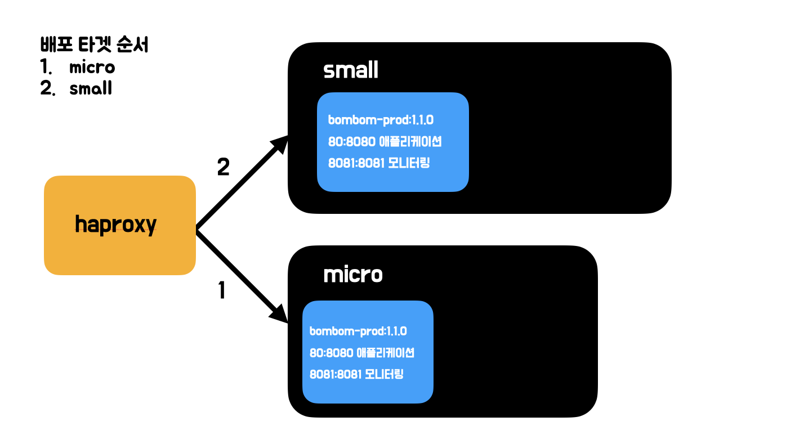

현재 HAProxy는 두 개의 인스턴스에 대해 small : micro = 2 : 1 가중치로 요청을 처리하고 있습니다.  

더 성능이 좋은 small 인스턴스에 더 많은 요청을 보내기 위해서입니다.  
즉, 트래픽이 서버 성능에 맞춰 자연스럽게 분산되도록 설정한 것입니다.


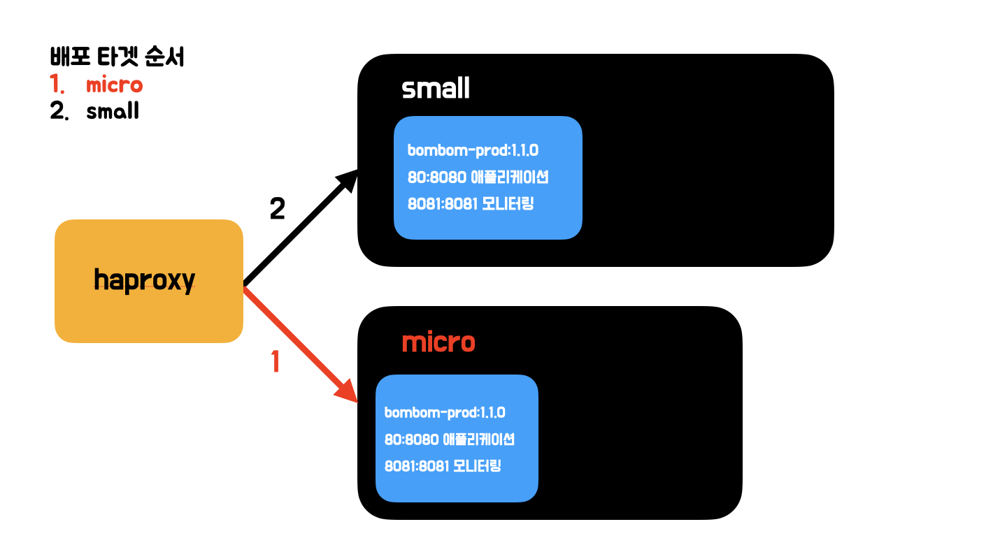

배포를 먼저 처리하는 대상은 **micro 인스턴스**입니다.

처음 micro를 선택한 이유는, 배포 실패 시 영향 범위가 상대적으로 적기 때문입니다.  
만약 이 시점에서 문제가 생기더라도, small 인스턴스가 나머지 요청을 안정적으로 처리할 수 있습니다.  
또한 작은 스펙에서 배포가 성공하면, 성능이 더 좋은 small 인스턴스에서는 문제가 발생할 확률이 낮다는 점도 고려했습니다.

### 1. micro의 트래픽 이동

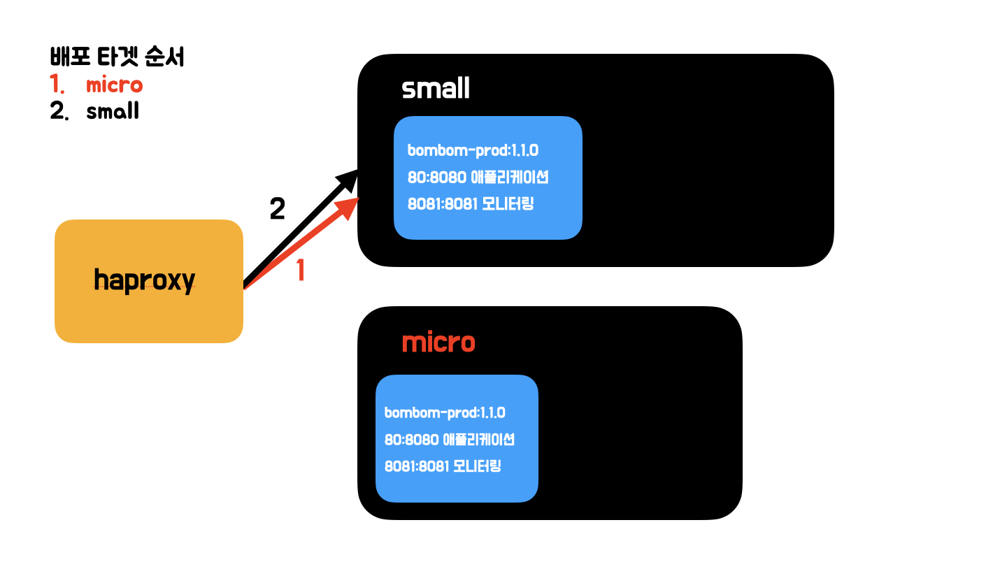

먼저 micro 인스턴스(prod-sub)의 트래픽을 모두 small(prod-main)로 이동시킵니다. 

HAProxy에서 prod-sub 서버를 서버 풀에서 제외시키면, 실제 요청은 prod-main으로만 전달됩니다.  
이 과정을 통해 배포 중에도 기존 트래픽 처리는 안정적으로 유지됩니다.

### 2. blue 컨테이너의 graceful shutdown

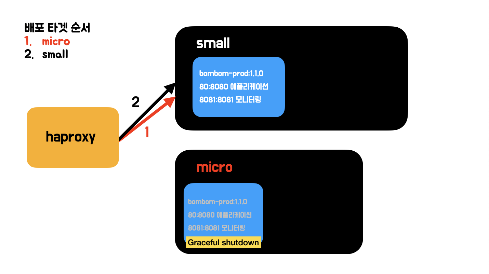

micro에서 기존 blue 컨테이너는 **graceful shutdown**을 적용합니다.  
즉, 현재 처리 중인 요청은 마무리하고, 새 요청은 받지 않는 방식으로 시스템을 종료합니다.

- Docker 레벨에서 shutdown 명령을 제어할 수도 있고
- Spring Boot 애플리케이션에서 종료 이벤트를 활용할 수도 있습니다.

이 과정을 통해 트래픽이 없는 상태에서 안전하게 컨테이너를 종료할 수 있습니다.

### 3. green 컨테이너 build

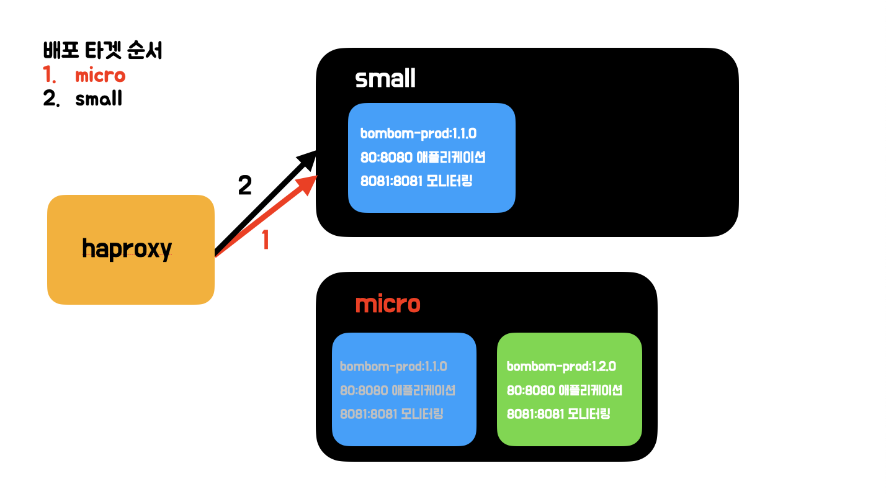

이제 새 버전인 Green 컨테이너를 배포합니다.  

이때 기존 Blue와 같은 설정을 유지하며, 단지 애플리케이션 버전만 새롭게 바뀌게 됩니다.

### 4. green 컨테이너에 대한 health check

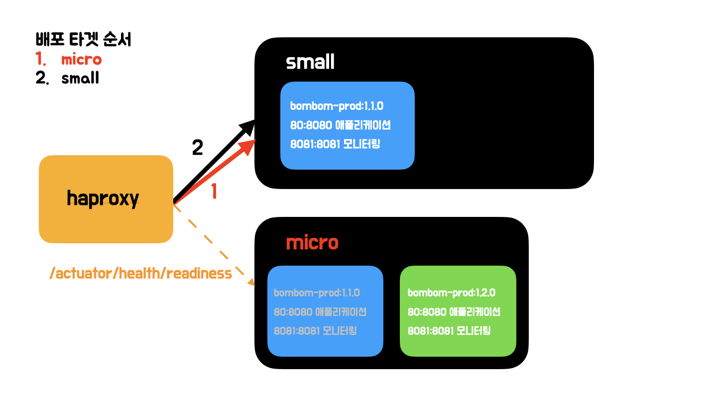

Green 컨테이너를 올렸으면, `/actuator/health/readiness`로 헬스체크를 진행합니다.

이 과정에서, 해당 docker 컨테이너가 정상적으로 up 된 것 뿐 만 아니라, 컨테이너 내에서 restart가 반복적으로 이뤄지고 있는건 아닌지 확인할 필요가 있습니다.

현재 flyway를 사용하고 있는 상황이므로, 컨테이너의 재시작은 충분히 발생할 수 있기 때문에 내부에서 Spring 애플리케이션이 정상적으로 요청 받을 준비가 됐는지 확인해야 하는데요,

Springboot에서는 actuator/health 엔드포인트를 활용할 수 있습니다.

- **liveness**: 컨테이너가 죽었는지 여부 확인 (/actuator/health/liveness)
- **readiness**: 애플리케이션이 요청 처리 가능한 상태인지 (/actuator/health/readiness)

Flyway 같은 마이그레이션 실패까지 반영하려면 **readiness 상태를 확인**하는 것이 적합합니다.

Flyway가 성공적으로 완료되어 DB 마이그레이션이 끝나야 readiness가 UP이 됩니다.

봄봄에서 도입한 헬스체크 정책은 아래와 같습니다.

- `interval=10s`: 10초마다 검사
- `timeout=3s`: 3초 안에 응답이 없으면 실패
- `retries=10`: 10번(≈100초) 연속 실패하면 unhealthy 판정

즉, 100초동안 10번의 `/actuator/health/readiness` 요청이 모두 healthy로 와야 정상적으로 up 됨으로 판단합니다.

### 5. green 컨테이너의 헬스체크 성공

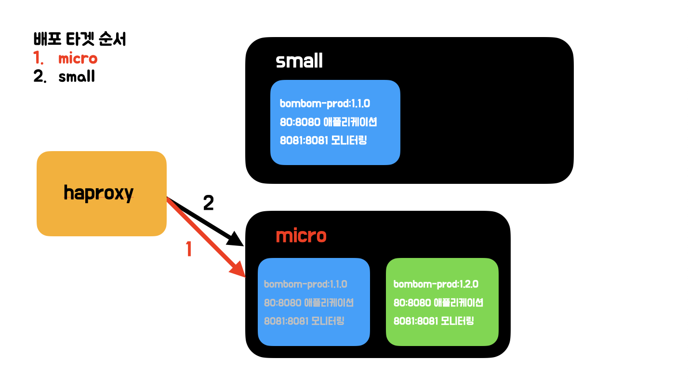

Green 컨테이너가 준비되면, HAProxy에서 트래픽을 다시 micro 인스턴스로 이동시킵니다.

이때 small 인스턴스의 트래픽도 함께 micro를 향하도록 조정합니다.  
이 과정을 통해 구버전과 신버전이 동시에 요청을 처리하는 상황을 방지할 수 있습니다.

### 6. 나머지 인스턴스에 대해 위 과정 반복

다음 배포 대상인 small 인스턴스에도 동일한 과정을 적용합니다.

- 기존 blue 컨테이너는 graceful shutdown 적용
- 새 Green 컨테이너 배포
- Health check 진행

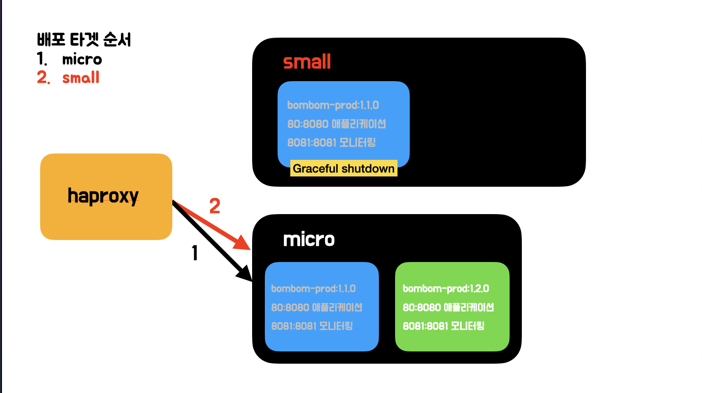
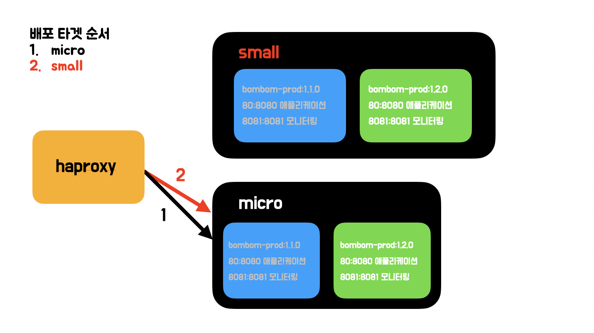
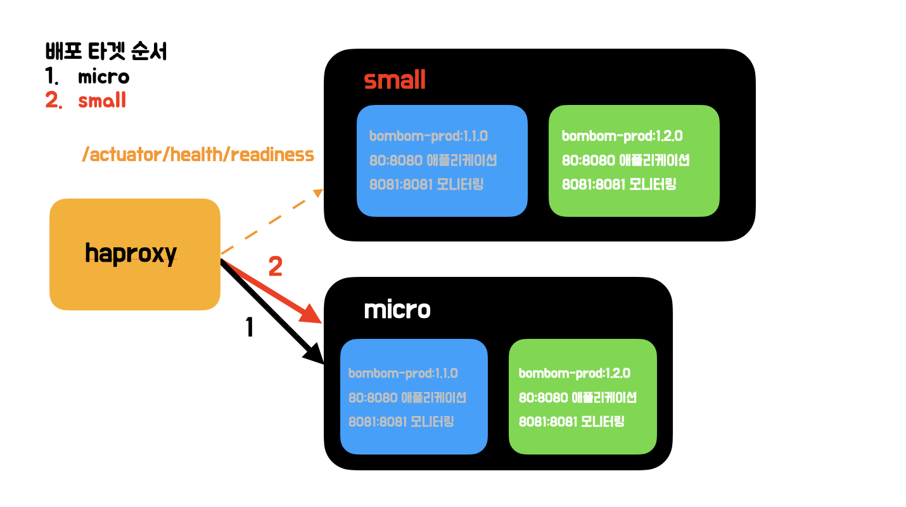

### 7. 트래픽 원상복구

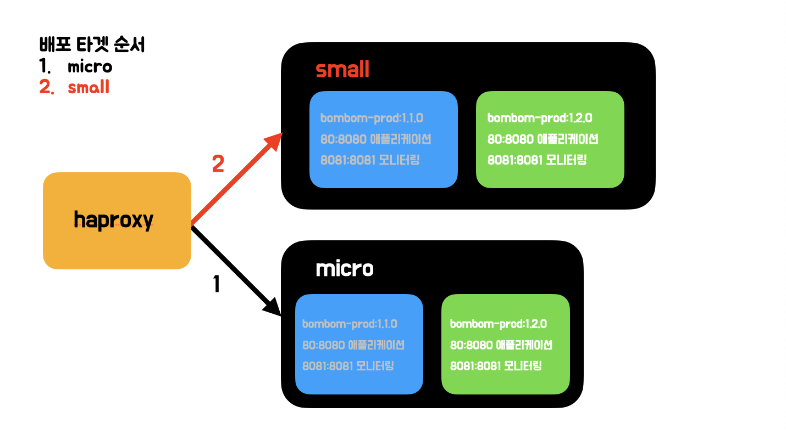

small 인스턴스에서도 Green 컨테이너가 ready 상태가 되면,  
기존 weight=2의 트래픽을 다시 small 인스턴스로 되돌립니다.

이로써 두 인스턴스 모두 새로운 버전으로 안정적으로 배포 완료가 이루어집니다.

---

## ❓Rolling update 방식이랑 차이가 무엇인가요?

지금의 Blue-Green 방식을 설계하고, '인스턴스별로 순차 버전업을 하는 것 같은데, 그렇다면 이건 Rolling update 방식이 아닐까?' 싶은 고민이 들었습니다.

하지만 두 방식은 **‘어떻게 새 버전을 적용하느냐’** 에서 큰 차이를 보입니다.

### Rolling update 방식
Rolling Update 방식은 기존 컨테이너를 하나씩 교체하면서 새 버전을 적용하는 방식입니다.
예를 들어 서버가 5대라면, 먼저 1대를 새 버전으로 교체하고 정상 동작이 확인되면 다음 1대를 교체하는 식으로 점진적으로 진행됩니다.
이렇게 하면 한 번에 전체 서버가 다운되는 일은 없지만, 배포 중에는 **구버전과 신버전이 동시에 서비스 중**인 상태가 됩니다.

이는 봄봄 서비스의 구조처럼 단일 RDS를 사용하는 환경에서는 문제가 될 수 있습니다.
새 버전의 코드가 DB 스키마를 변경하거나, 하위 호환되지 않는 엔티티를 수정하는 경우
**신버전과 구버전이 동시에 DB를 공유하면서 충돌이 발생**할 수 있기 때문입니다.

### Blue-Green 방식
반면 Blue-Green 배포는 말 그대로 두 개의 완전히 독립된 환경(Blue와 Green)을 운영합니다.
새 버전은 기존 버전과 완전히 분리된 상태에서 준비되고, 트래픽 전환 시점에만 Blue → Green으로 한 번에 전환됩니다.
즉, 서비스 중에는 항상 하나의 버전만이 요청을 처리하게 되므로 DB나 API 간 불일치로 인한 문제 가능성이 적습니다.

결과적으로, Rolling update 방식은 요청이 들어왔을 때 **구버전과 신버전 모두에게 요청이 갈 수 있지만**, Blue-Green 방식은 **구버전 또는 신버전 하나로만 요청이 향하는 것**입니다.
따라서 지금의 무중단배포 전략은 Rolling update와는 다르다고 할 수 있습니다.

---

## ⚙️ HAProxy를 사용한 동적 트래픽 제어

Blue-Green 배포의 핵심은 단순히 “컨테이너 두 개를 띄운다”가 아니라,
트래픽을 어떤 시점에 어디로 보낼지 제어하는 것입니다.
봄봄 서비스에서는 이를 위해 HAProxy를 사용했습니다.

HAProxy는 고성능 TCP/HTTP 로드밸런서로,
특정 서버에 장애가 발생했을 때 트래픽을 자동으로 다른 서버로 우회시키거나,
특정 조건에 따라 가중치를 조정해 트래픽 분배 비율을 조절할 수 있습니다.

### HAProxy Runtime API 활용하기

현재의 무중단배포 전략의 핵심은 “언제, 어떻게 트래픽을 전환할 것인가”입니다.
봄봄 서비스에서는 HAProxy의 Runtime API를 이용해
배포 중 트래픽을 유연하게 제어하고 있습니다.

이 방법을 사용하면, HAProxy 설정 파일(haproxy.cfg)을 수정하거나 재시작하지 않고도
실행 중인 HAProxy 프로세스에 직접 명령을 보내 실시간으로 트래픽을 제어할 수 있습니다.

### HAProxy Runtime API란?

HAProxy Runtime API는 HAProxy 프로세스가 소켓 파일을 통해 명령을 받을 수 있게 해주는 인터페이스입니다.
이 API를 통해 다음과 같은 작업을 실시간으로 수행할 수 있습니다.
- 특정 서버의 트래픽 비활성화 / 활성화
- 서버 weight 조정 (트래픽 비율 변경)
- 백엔드 상태 조회 (show servers state)
- 요청 수, 세션 수, 연결 상태 등 모니터링

봄봄에서는 /var/run/haproxy.sock 소켓을 사용하도록 설정해두었고, 이를 이용해 런타임 중 트래픽을 제어합니다.


**🧩 사용 예시 — 특정 서버 트래픽 비활성화**

기존 HAProxy의 로드밸런싱 설정은 아래와 같습니다.

```yaml
# 실제 서비스는 80, 헬스체크만 8081, 트래픽 2:1 분배 (main 성능이 더 좋기 때문)
server prod-main ${main_server_ip}:80 check inter 3000 rise 2 fall 2 port 8081 weight 2
server prod-sub ${sub_server_ip}:80 check inter 3000 rise 2 fall 2 port 8081 weight 1
```

다음은 위 환경에서 prod-sub 서버(= micro 인스턴스)의 트래픽을 일시적으로 차단하는 명령입니다.

```bash
echo "disable server app_servers/prod-sub" | sudo socat stdio /var/run/haproxy.sock
```
- app_servers : HAProxy 설정 파일에서 정의된 backend 이름
- prod-sub : backend 내의 실제 서버 이름
- disable server : 해당 서버로의 트래픽을 비활성화
- socat stdio /var/run/haproxy.sock : 표준 입력을 통해 명령을 HAProxy 소켓으로 전송

이 명령이 실행되면 prod-sub은 즉시 “MAINT” 상태로 변경되고,
HAProxy는 더 이상 해당 서버로 요청을 보내지 않습니다.

즉, 클라이언트의 모든 요청은 자동으로 prod-main 서버로만 전달됩니다.

트래픽을 복구할 땐 다음과 같이 사용할 수 있습니다.

```bash
echo "enable server app_servers/prod-sub" | sudo socat stdio /var/run/haproxy.sock
```

prod-sub가 다시 트래픽을 받을 수 있는 상태가 되며, HAProxy가 자동으로 트래픽을 분산하기 시작합니다. 

이렇게 동적으로 트래픽을 제어하는 과정은 Github Actions 스크립트 내에서 실행되고, 개발자가 수동으로 HAProxy를 재가동하거나 config 파일을 수정할 필요가 없습니다.   
