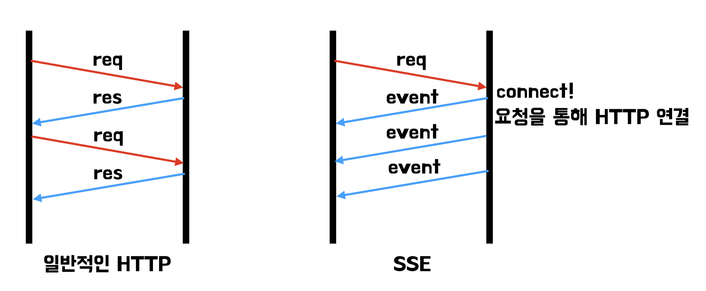
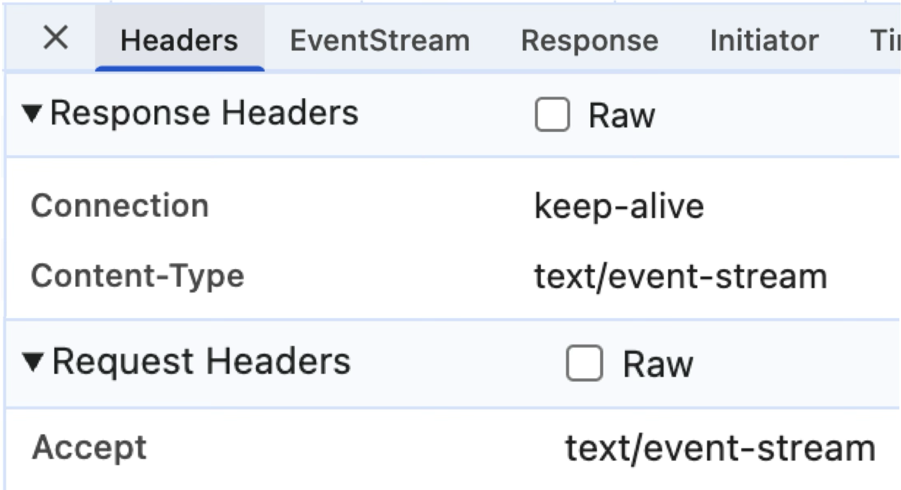
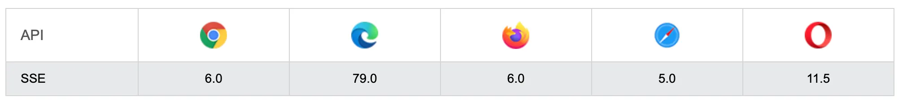
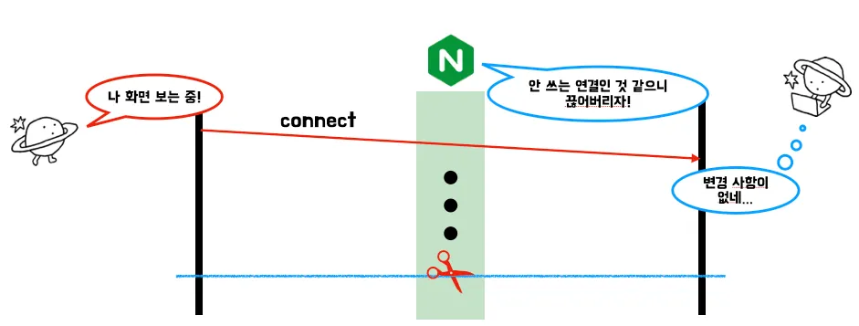
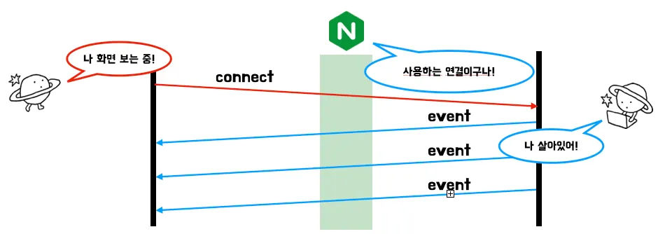
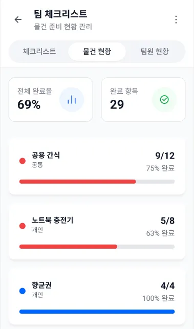
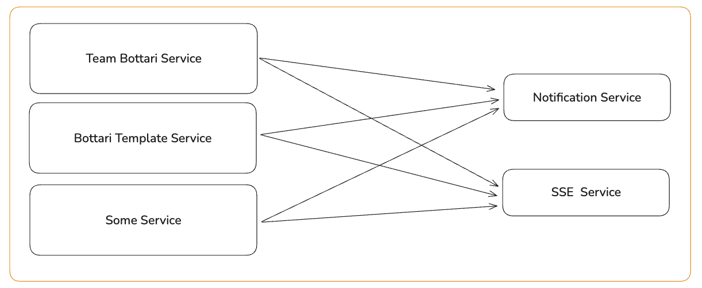
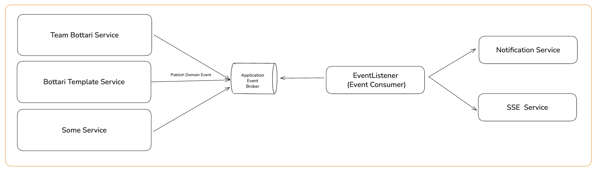
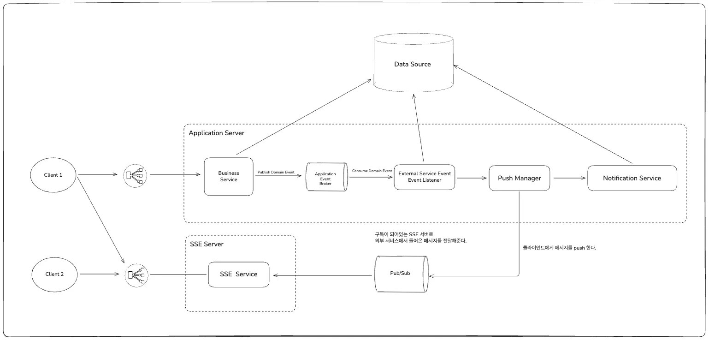

# 실시간으로 서버에서 알려주기: Server-Sent Event(SSE)

**대상 독자**

SSE(Server-Sent Event)라는 기술에 대해 잘 알지 못하지만,
Java Spring Boot를 사용해 본 경험이 있고 실시간 동기화 기능에 관심이 있는 독자

영상으로 보고 싶으신 분들은 [[10분 테코톡] 훌라의 SSE Server-Sents Event](https://www.youtube.com/watch?v=R9RVc8YAtqE&t=2s)를 참고해주세요.

⸻

## 들어가며

카카오톡으로 메시지를 보냈을 때, 상대방이 읽으면 즉시 '읽음' 표시가 뜹니다. 배달 앱을 켜면 라이더의 위치가 실시간으로 움직입니다. 구글 독스에서는 여러 사람이 동시에 문서를 편집하면 다른 사람의 커서가 실시간으로 보입니다.

그런데 개발자 입장에서는 이게 생각보다 쉽지 않습니다. HTTP는 기본적으로 **요청하면 응답한다**는 구조입니다. 클라이언트가 물어봐야 서버가 답하죠. 그런데 실시간 기능은 거꾸로입니다. 서버에서 변화가 생기면 클라이언트에게 **먼저** 알려줘야 합니다.

이 문제를 해결하기 위해 여러 방법들이 나왔습니다. 주기적으로 서버에 물어보는 Polling, 한 번 물어보고 오래 기다리는 Long Polling, 아예 양방향 통신을 하는 WebSocket...

그중에서 **Server-Sent Events(SSE)** 는 가장 단순한 방법입니다.
"서버에서 클라이언트로 데이터를 보내는 것"만 필요하다면, HTTP 연결 하나로 충분합니다.
별도의 프로토콜도 필요 없고, 복잡한 설정도 필요 없습니다.

이 글에서는 SSE가 어떻게 동작하는지, Spring Boot에서 어떻게 구현하는지, 그리고 실제 프로젝트에 적용하며 겪었던 시행착오와 해결 과정을 공유합니다.

## Server-Sent Event란?

### Server-Sent Event(SSE)의 정의

Server-Sent Events(SSE) 는 클라이언트가 하나의 HTTP 연결을 열어 놓은 상태에서 서버로부터 자동 업데이트를 지속적으로 수신하는 [서버 푸시 기술](https://ko.wikipedia.org/wiki/%ED%91%B8%EC%8B%9C_%EA%B8%B0%EB%B2%95)입니다. 서버 푸시는 클라이언트의 추가 요청 없이 서버가 데이터를 능동적으로 전송하는 방식을 의미합니다.

### 일반적인 HTTP 통신과 다른 점

일반적인 HTTP 통신은 ‘Keep-Alive’ 헤더를 사용하여 TCP 연결을 오랜 시간 유지할 수 있습니다. 그러나 일반적인 HTTP 통신은 한 번의 요청은 한 번의 응답만 가능합니다. 반면 SSE는 한 번의 요청으로 SSE 연결을 맺은 후, 서버에서 클라이언트에게 여러 번 응답을 전송할 수 있습니다.



### SSE의 동작 원리: text/event-stream

SSE는 `text/event-stream` 미디어 타입을 사용합니다. `text/event-stream` 미디어 타입이 지정되면 클라이언트는 지속적으로 응답을 받을 준비 상태를 유지합니다. `text/event-stream` 미디어 타입 덕분에 한 번의 요청으로 여러 번의 응답이 가능합니다.

`text/event-stream` 미디어 타입은 ‘텍스트 기반의 DOM 이벤트를 연결을 끊지 않고 전송한다.’라는 의미입니다. DOM 이벤트란 브라우저에서 발생하는 키보드 입력, 버튼 클릭과 같은 이벤트’를 뜻합니다. DOM 이벤트 형태로 전달하기 때문에 SSE가 ‘이벤트’라는 명칭이 붙는다는 것을 알 수 있습니다.


*실제 크롬 개발자 도구에서 text/event-stream을 사용하는 것을 확인할 수 있다*

### SSE의 특징

SSE의 특성으로 자주 거론되는 것이 단방향성, 텍스트 기반, 내장된 재연결 기능이다.

#### 단방향성

SSE는 서버 푸시 기술로 서버에서 클라이언트로의 응답 위주입니다. WebSocket과 같은 양방향성을 띄는 기술과는 달리 단방향성이 SSE의 특징입니다.

'양방향이 안 되고, 단방향밖에 안 되면 안 좋은 거 아니야?'라고 생각할 수 있습니다. SSE는 단방향만 고려하면 되기 때문에 구조가 단순해집니다. 클라이언트의 요청은 서버에서 연결을 맺을 때만 고려하면 되므로 추가적인 구현이 필요하지 않다. 

#### 텍스트 기반

SSE는 'text/event-stream'이라는 미디어 타입에서 볼 수 있듯이 텍스트 기반의 응답만 가능합니다. JSON과 같은 텍스트 데이터만으로 기능을 구현할 수 있다면, SSE로 충분히 구현 가능합니다. 하지만, 이미지와 같은 이진 데이터 위주의 통신이 필요하다면 SSE보다 WebSocket과 같은 기술을 사용하는 것이 적합합니다. 본인의 기능이 어떤 데이터를 기반으로 통신하는지에 따라 선택하면 좋은 부분입니다.

#### 내장된 재연결 기능

SSE를 구현할 때, 클라이언트에서 사용하는 'EventSource API'에서는 재연결 기능이 내장되어 있습니다. 'EventSource API'는 연결이 끊어진다면 이를 인지하고 재연결 시도를 합니다. 연결이 끊어졌을 때를 대비한 재연결 기능이 추가 구현 없이 제공된다는 것은 큰 장점입니다.

### 효율적인 자원 사용

SSE 연결 요청이 들어오면, 스레드를 할당 받아 클라이언트와 서버 간의 연결을 맺습니다. 연결이 성공적으로 맺어진 후, 스레드를 반납합니다. 
이후, SSE 응답이 필요한 경우 서버는 스레드를 잠시 할당 받아 SSE 응답을 클라이언트에게 전달합니다. SSE 응답을 전달한 후, 다시 스레드를 반납합니다. 
SSE는 서버 자원을 계속해서 점유하지 않고 필요할 때만 할당 받아서 사용합니다.

### SSE의 한계

그러나, SSE의 한계 또한 존재합니다.

HTTP/1.1에서는 하나의 브라우저에서 **6개 이상의 SSE 연결이 불가능합니다**.

추가로, 매우 오래된 버전의 브라우저를 사용한다면 SSE를 사용할 수 없습니다.


*지원되는 브라우저 버전*

다만, 평균적으로 2010년~2011년 이후 버전의 브라우저라면 지원됩니다. 현재 우리가 사용하고 있는 브라우저에서는 무리 없이 사용 가능합니다.

---

## Spring에서는 SSE를 어떻게 사용할 수 있을까?

### SseEmitter 기본 사용법

Java Spring에서는 `SseEmitter`라는 객체를 사용합니다. 클라이언트의 연결 정보는 OS에서 소켓을 통해 유지하며, 이를 Spring에서 추상적으로 구현한 것이 `SseEmitter`입니다. `SseEmitter`는 ‘클라이언트의 연결 정보를 담고 있는 객체’, ‘SSE 응답을 보내는 객체’라고 간단하게 이해하면 좋습니다.

SseEmitter는 Spring MVC의 기본 의존성에 포함되어있습니다. SseEmitter를 사용하기 위해 별도의 의존성 추가 없이 사용할 수 있습니다.

```java
package org.springframework.web.servlet.mvc.method.annotation;

public class SseEmitter ... {
    ...
}
```

### 구현 예제

클라이언트로부터 SSE 연결 요청이 들어오면, 서버는 SseEmitter 객체를 생성하고 이를 List/Set/Map과 같은 컬렉션에 저장한 뒤 반환합니다.

```java
@RestController
public class SseController {

    @GetMapping(path = "/sse", produces = MediaType.TEXT_EVENT_STREAM_VALUE)
    public SseEmitter connect() {
        final SseEmitter sseEmitter = new SseEmitter();

        // SseEmitter 저장 in List, Set, Map . . .

        return sseEmitter;
    }
}
```

저장된 SseEmitter 객체를 사용해 이벤트를 전송할 수 있습니다.

```java
sseEmitter.send(
		SseEmitter.event()
				.name("name")
				.data("data")
);
```

---

## SSE 사용 시 주의사항

### 하트비트

웹 서버, 방화벽, 로드밸런서와 같은 네트워크 중간 계층들은 오랜 시간 응답이 존재하지 않으면 연결을 끊습니다. SSE 연결 후, 서버에 변경 사항이 없어 오랜 시간 응답이 없다면 네트워크 중간 계층에서 SSE 연결을 끊게 됩니다. 네트워크 중간 계층에서 SSE 연결을 끊은 후, 서버에 변경 사항이 발생해서 클라이언트에게 SSE 응답을 전달하려고 해도 실패합니다.


*NGINX에서 연결을 끊는 경우*

네트워크 중간 계층에서 SSE 연결을 끊지 않도록 하기 위해 `하트비트`라는 개념을 사용합니다. `하트비트`는 일정 주기로 SSE 응답을 클라이언트에게 전달하는 것입니다. 서버는 일정 주기마다 `:`로 시작하는 주석 라인을 전달합니다.


*NGINX에서 연결을 끊지 않도록 하트비트를 사용하는 경우*

[SSE 공식 문서(WHATWG)](https://html.spec.whatwg.org/multipage/server-sent-events.html#authoring-notes)에서는 비교적 짧은 타임아웃 이후에 연결을 끊는 일부 오래된 프록시 서버들을 고려해 15초 주기의 하트비트를 권장하고 있습니다.

그러나, 현대 네트워크 중간 계층은 평균적으로 60초 동안 응답이 없으면 연결을 끊기 때문에, 30초 간격의 하트비트가 권장됩니다. 실시간성이 매우 중요한 서비스라면 하트비트 주기를 더 짧게 설정할 수 있지만, 서버 부하를 고려해야 합니다.

```java
@Scheduled(fixedDelay = 30_000)
public void heartbeat() {
    emitters.values().forEach(emitter -> {
        try {
            // 주석(comment) 전송은 본문 없이 커넥션 유지에 효과적
            emitter.send(SseEmitter.event().comment("keepalive"));
        } catch (Exception e) {
            // 끊긴 커넥션 정리
            removeEmitter(emitter);
        }
    });
}
```

### 에러 처리 및 생명주기 관리

SseEmitter는 다양한 콜백을 제공하여 연결의 생명주기를 관리할 수 있습니다.
콜백에서 반드시 컬렉션에서 SseEmitter를 제거해야 메모리 누수를 방지할 수 있습니다.

```java
SseEmitter emitter = new SseEmitter(timeout);

// 타임아웃 발생 시
emitter.onTimeout(() -> {
    log.info("SSE 연결 타임아웃: {}", userId);
    cleanup(userId);
});

// 에러 발생 시
emitter.onError((e) -> {
    log.error("SSE 연결 에러: {}", userId, e);
    cleanup(userId);
});

// 정상 종료 시
emitter.onCompletion(() -> {
    log.info("SSE 연결 정상 종료: {}", userId);
    cleanup(userId);
});
```

### OSIV

SSE를 사용할 때, OSIV(open-in-view) 설정이 true로 되어 있다면 DB 커넥션이 고갈되는 심각한 문제가 발생할 수 있습니다.

SSE 연결이 맺어진 후, 연결이 끊어지기 전까지 HTTP 연결은 계속 열린 상태를 유지합니다. 만약 SSE 연결 API에서 JPA를 사용하고, OSIV가 true로 설정되어 있다면 DB 연결 또한 계속 열린 상태를 유지합니다.

문제는 오랜 시간 HTTP 연결이 DB 커넥션을 점유하고 있기 때문에 DB 커넥션이 고갈될 수 있습니다. 예를 들어 DB 커넥션 풀의 최대 크기가 10개라면, SSE 연결이 10개 맺어지는 순간 사용 가능한 DB 커넥션이 존재하지 않습니다. 이후, DB 커넥션을 사용하는 요청이 들어오게 된다면 예외가 발생한다.

따라서, SSE를 사용하는 경우 OSIV 설정을 false로 설정하는 것이 안전합니다.

```yaml
# application.yml
spring:
  jpa:
    open-in-view: false
```

### 동시성 제어

여러 스레드에서 동시에 SseEmitter 컬렉션에 접근할 수 있으므로, Thread-safe한 자료구조를 사용해야 합니다.

```java
// ❌ 잘못된 예시
private final Map<String, SseEmitter> emitters = new HashMap<>();

// ✅ 올바른 예시
private final Map<String, SseEmitter> emitters = new ConcurrentHashMap<>();
```

---

## 5. 우리는 왜 SSE를 선택했을까?

### 우리가 필요했던 기능

현재, 저희 팀은 ‘보따리’라는 프로젝트를 진행 중입니다. ‘보따리’는 준비물 체크리스트 서비스이며, 안드로이드 앱으로 제작 중입니다. 

저희는 여러 사람이 체크리스트 목록을 공유하고, 체크 현황을 실시간으로 확인할 수 있는 '팀 기능'을 구현하고자 했습니다.

**핵심 요구사항**
- 팀원이 물품을 추가, 수정, 삭제하면 다른 팀원의 화면에 실시간 반영
- 체크리스트 체크 현황의 실시간 동기화
- 서버에서 클라이언트로의 단방향 통신 위주


*팀 기능: 물건 현황 화면*

### 선택 과정

**여러 실시간 기술**
- Polling (Short-Polling, Long-Polling)
- SSE
- WebSocket

#### Polling 방식 제외

Short Polling과 Long Polling은 실시간성을 보장하기 위해 CPU나 메모리와 같은 서버 자원을 지속적으로 점유합니다. Polling을 사용하면 사용자가 많아질 경우 서버에 심각한 부하가 발생할 수 있어 제외했습니다.

#### WebSocket과의 비교

WebSocket은 가장 널리 알려진 실시간 통신 기술입니다. WebSocket은 TCP 핸드셰이크 과정에서 HTTP 프로토콜을 WS 프로토콜로 업그레이드하여, 클라이언트와 서버가 양방향으로 통신할 수 있습니다.

**WebSocket의 특징**
- 양방향 실시간 통신 지원
- 이진 데이터 전송 가능
- 더 복잡한 프로토콜과 구현

**우리의 선택: SSE**

우리 프로젝트는 다음과 같은 이유로 SSE를 선택했습니다:
- **단방향 통신으로 충분**: 서버에서 클라이언트로의 푸시만 필요
- **텍스트 데이터만 사용**: JSON으로 충분히 구현 가능
- **구현 단순성**: HTTP 기반이라 별도 프로토콜 학습 불필요
- **자동 재연결**: 클라이언트 측에서 별도 구현 불필요
- **안드로이드 앱**: 브라우저 제약사항이 문제되지 않음

---

## 우리는 SSE를 어떻게 사용했을까?

### 초기 구조

처음에는 단순한 구조로 시작했습니다.



비즈니스 서비스들이 FCM과 SSE 전송 클래스를 직접 의존하고 있었습니다. 이로 인해 비즈니스 로직과 SSE 간의 강한 결합도가 생겼습니다.

**문제점:**
- 비즈니스 로직이 푸시 알림 전송 로직에 강하게 의존
- 테스트 어려움
- 푸시 전송 방식 변경 시 비즈니스 로직 수정 필요

### 이벤트 기반으로 개선



Domain Event 패턴을 적용하여 결합도를 낮췄습니다.

```java
// 비즈니스 로직에서 이벤트 발행
@Service
public class TeamBottariItemService {
    
    private final ApplicationEventPublisher eventPublisher;
    
    @Transactional
    public void check(
            final Long itemId,
            final Long memberId
    ) {        
        // 비즈니스 로직 수행
        item.check();
        
        // 이벤트 발행
        eventPublisher.publishEvent(
            new CheckTeamItemEvent(. . .)
        );
    }
}

// Event Listener에서 SSE 전송
@Component
public class PushEventListener {
    
    private final PushManager pushManager;
    
    @Async
    @TransactionalEventListener(phase = TransactionPhase.AFTER_COMMIT)    
    public void handleCheckTeamItemEvent(CheckTeamItemEvent event) {
        // SSE 전송 로직
        pushManager.message(message)
                .to(memberIds)
                .multicast()
                .viaConnection(ChannelType.SSE)
                .send();
    }
}
```

**사용자 경험을 위한 핵심 설계**

`@TransactionalEventListener(AFTER_COMMIT)`으로 **트랜잭션 커밋 후에만 SSE를 전송**합니다. 커밋 전에 알림을 보내면 사용자 B가 알림을 받고 조회했을 때 아직 DB에 반영되지 않아 데이터 불일치가 발생합니다.

`@Async`로 **SSE 전송을 비동기 처리**하여 API 응답 속도를 개선합니다. 사용자 A는 다른 팀원들에게 알림이 전송되기를 기다릴 필요 없이 즉시 응답을 받습니다.

**개선 효과:**
- 비즈니스 로직과 푸시 전송 로직 분리
- 데이터 일관성 보장
- API 응답 속도 개선

### 서버 분리 및 최종 아키텍처



SSE는 서버에서 상태(SseEmitter)를 유지해야 하므로 수평 확장이 어렵습니다. 이를 해결하기 위해 SSE 전용 서버를 분리하고 Redis Pub/Sub을 활용했습니다. SSE 서버가 분리되면서 요청 흐름 추적이 어려워졌습니다. 이를 해결하기 위해 **Trace ID 기반 추적 시스템**을 구현했습니다.

**동작 과정**

1. **SSE 연결**: 클라이언트가 SSE 서버에 연결하면, SSE 서버는 Redis의 사용자 채널을 구독합니다.

2. **이벤트 발행**: 애플리케이션 서버에서 Domain Event를 발행합니다.

3. **메시지 전환**: Event Listener가 이벤트를 수신하여 푸시 메시지로 변환합니다.

4. **Redis 발행**: PushManager가 SSE 응답이라면 Redis Pub/Sub에 발행합니다.

5. **SSE 전송**: SSE 서버가 Redis 메시지를 수신하여 클라이언트에게 전송합니다.

#### 서버 분리의 핵심 이점

**리소스 관리 최적화**

애플리케이션 서버와 SSE 서버를 분리하여 **컴퓨팅 리소스와 커넥션 리소스를 독립적으로 관리**할 수 있게 되었습니다. 애플리케이션 서버는 CPU 집약적인 비즈니스 로직 처리에 최적화하고, SSE 서버는 많은 수의 장시간 커넥션 유지에 최적화할 수 있습니다.

**로드밸런싱 전략 차별화**

NGINX에서 서버 특성에 맞는 로드밸런싱 알고리즘을 적용했습니다:
- **애플리케이션 서버**: Round Robin 알고리즘으로 요청을 균등하게 분산
- **SSE 서버**: Least Connection 알고리즘으로 활성 연결 수가 적은 서버로 분산

SSE는 장시간 연결을 유지하는 특성상 Least Connection 방식이 더 효율적입니다.

**분산 추적 구현**

서버가 분리되면서 요청 흐름 추적이 어려워졌습니다. 이를 해결하기 위해 **Trace ID 기반 추적 시스템**을 구현했습니다.

**최종 아키텍처의 장점**
- SSE 서버를 독립적으로 확장 가능
- 애플리케이션 서버는 상태를 유지하지 않아 자유롭게 확장
- 각 서버 특성에 맞는 리소스 관리 및 로드밸런싱
- Redis를 통한 느슨한 결합
- Trace ID 기반의 명확한 요청 추적
- 장애 격리: SSE 서버 장애가 비즈니스 로직에 영향 없음

---

## 앞으로의 개선 계획

현재 SSE 구조는 안정적으로 운영되고 있지만, 
여전히 개선할 부분들이 남아있습니다:

- **모니터링 강화**: SSE 연결 수, 하트비트 실패율, 평균 연결 시간 등의 메트릭을 수집하고 알람을 설정할 예정입니다.
- **연결 상태에 따른 fallback**: 네트워크 상태에 따른 fallback 로직 구현을 검토하고 있습니다. (네트워크 유실 시, FCM 전송)
- **부하 테스트**: 대규모 동시 접속 상황에서의 성능과 안정성을 검증할 계획입니다.

처음 SSE를 도입할 때, 생각보다 단순해보였습니다. 그러나 실제 서비스에 적용하며 여러 엣지 케이스를 고려하게 되었습니다. 생각보다 골치 아픈 문제들도 겪어보았지만, 재미있게 적용할 수 있었습니다.

---

## 참고 자료

- [HTML Standard - Server-Sent Events](https://html.spec.whatwg.org/multipage/server-sent-events.html)
- [서버 푸시 기술 - Wikipedia](https://ko.wikipedia.org/wiki/%ED%91%B8%EC%8B%9C_%EA%B8%B0%EB%B2%95)
- [Spring에서 Server-Sent-Events 구현하기 - Tecoble](https://tecoble.techcourse.co.kr/post/2022-10-11-server-sent-events/)
- [SSE 이벤트 푸쉬로 불필요한 Polling 제거하기 - Toss SLASH 24](https://toss.im/slash-24/sessions/12)
