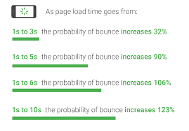
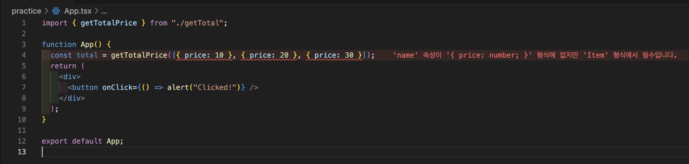

# **React 프로젝트에 TypeScript를 도입하며 느꼈던 경험과 컴포넌트 설계에서 TS가 주는 안정성과 한계**

## **왜 TypeScript였을까?**

React로 프로젝트를 진행하면서 가장 많이 겪은 문제는 **런타임 에러**였다. Props 이름을 잘못 넘기거나, undefined 상태의 값을 접근하는 사소한 실수가 실제 배포 후 오류로 이어졌다. 또한, 컴포넌트 간 전달되는 데이터의 구조가 복잡해질수록 "이 props에 어떤 필드가 있더라?"를 자주 확인해야 했다.

예를 들자면 다음과 같다.


다음과 같이 **Props 이름에 오타가 있거나 필수 Props를 전달하지 않아도**

JavaScript에서는 **에러 없이 실행**된다.



하지만 TypeScript에서는 **컴파일 단계에서 오류를 잡아준다.**

이런 경험이 누적되면서, **정적 타입 시스템**의 필요성을 절실히 느꼈다.

결국 우리는 TypeScript를 도입하기로 했다.

---

## **TypeScript 도입의 목표**

| **목표**             | **기대 효과**                                                  |
| -------------------- | -------------------------------------------------------------- |
| 타입 안정성 확보     | 컴파일 타임에 버그를 조기에 발견하여 런타임 에러 최소화        |
| 협업 효율성 향상     | Props, API 구조를 명확히 정의하고 팀 간 커뮤니케이션 비용 절감 |
| 리팩토링 자신감 확보 | IDE 자동완성, 타입 추론으로 안전한 코드 변경과 리팩토링 가능   |

---

## **도입 과정에서 마주친 주요 이슈**

### **타입 정의의 범위: 어디까지 명시해야 할까?**

처음엔 모든 변수, 함수의 반환값까지 전부 명시했다.

```tsx
const add = (a: number, b: number): number => {
  return a + b;
};
```

하지만 이런 과도한 명시는 **생산성을 떨어뜨렸다**.

결국 나는 “**타입 추론을 신뢰하자**”는 원칙을 세웠다.

**원칙:** 명시가 불필요한 경우엔 TS의 추론에 맡기고, 외부에서 사용되는 함수나 컴포넌트의 경계에만 타입을 명시하자

---

### **타입 추론 vs 명시**

예를 들어, 내부에서만 사용하는 util 함수라면 다음과 같이 작성했다.

```tsx
function sum(values: number[]) {
  return values.reduce((a, b) => a + b, 0);
}
```

반면, 다른 모듈에서 사용하는 함수는 반환 타입을 명시했다.

```tsx
export function getTotalPrice(items: Item[]): number {
  return items.reduce((acc, item) => acc + item.price, 0);
}
```

이렇게 **외부에서 쓰는 함수는 타입으로 사용법을 확실히 정해주고, 내부 함수는 추론에 맡겨서 코드가 복잡해지지 않게 한다.**

---

### **React 컴포넌트에서의 Props 정의**

처음엔 Props 타입을 다음처럼 단순하게 선언했다

```tsx
interface ButtonProps {
  label: string;
  onClick: () => void;
}
```

하지만 컴포넌트가 복잡해지고, 상태나 스타일 옵션이 늘어나면서 점점 아래처럼 바뀌었다

```tsx
interface ButtonProps {
  label: string;
  onClick?: () => void;
  disabled?: boolean;
  size?: "sm" | "md" | "lg";
  variant?: "primary" | "secondary";
}
```

처음엔 단순히 속성을 추가하는 일처럼 보였지만, 이 과정에서 **“어떤 Props가 필수인지, 선택인지”를 구분하는 기준**이 중요하다는 걸 깨달았다.

예를 들어 `label`처럼 버튼의 핵심 역할에 꼭 필요한 값은 필수로 지정하고, `disabled`나 `variant`처럼 부가적인 동작이나 스타일을 조정하는 속성은 옵셔널로 두면 된다.

이렇게 구분하면 컴포넌트를 사용할 때 **“꼭 넣어야 하는 값”과 “선택적으로 넣을 수 있는 값”이 명확해진다.**

---

## **컴포넌트 설계와 TypeScript**

### **Props 타입 설계 원칙**

**필수 / 선택 Props 구분**

```tsx
interface InputProps {
  value: string;
  onChange: (value: string) => void;
  placeholder?: string;
}
```

- 필수: 컴포넌트의 동작에 반드시 필요한 값
- 선택: UI의 부가적 요소

### **유틸 타입 활용**

- Pick, Omit, Partial 등을 적극 활용했다.

1. **Pick - 필요한 속성만 선택해서 쓰기**

- `Button`과 `IconButton`이 비슷한 속성을 공유하지만 일부만 사용하고 싶을때 사용한다.

```tsx
interface BaseButtonProps {
  size: "sm" | "md" | "lg";
  variant: "primary" | "secondary";
  disabled?: boolean;
  label: string;
  onClick: () => void;
}
```

`IconButton`은 `label` 대신 `icon`만 사용하고 싶다면, 굳이 모든 속성을 복사할 필요 없이 **`Pick`으로 필요한 부분만 선택**하면 된다.

```tsx
interface IconButtonProps
  extends Pick<BaseButtonProps, "size" | "variant" | "onClick"> {
  icon: React.ReactNode;
}
```

➡️ 이렇게 하면 **공통 속성은 그대로 재사용하면서**, 필요한 속성만 선택해서 새로운 타입을 만들 수 있다.

---

1. **Omit - 특정 속성만 제외하기**

`Pick`의 반대 개념으로, **제외하고 싶은 속성만 제거하는 방식**

```tsx
interface TextButtonProps extends Omit<BaseButtonProps, "disabled"> {
  underline?: boolean;
}
```

➡️ 기존 `BaseButtonProps`의 모든 속성을 상속받되,`disabled`만 제거하고 새 속성(`underline`)을 추가한다.

---

**3. Partial - 모든 속성을 선택적으로 바꾸기**

`Partial<T>`는 타입의 모든 속성을 **옵셔널(`?`)로 변환한다**.

폼 작성 중에는 사용자가 일부만 입력했을 수도 있다. 이때 모든 필드가 필수가 아닌 상태(`undefined` 가능`)로 관리되어야 한다면` Partial`을 씁니다.

```tsx
interface FormValues {
  name: string;
  email: string;
  password: string;
}
```

```tsx
const [formValues, setFormValues] = useState<Partial<FormValues>>({});
```

➡️ `formValues.name`, `formValues.email`은 전부 **옵셔널**로 추론되어 아직 값이 없는 상태도 안전하게 처리할 수 있다.

---

**4. 조합해서 쓰기 - 현실적인 React 패턴**

일부 속성만 선택적으로 받고 싶을때 실무에서는 종종 `Pick` + `Partial`을 함께 쓴다고 한다.

```tsx
interface User {
  id: number;
  name: string;
  email: string;
  age?: number;
}

// ProfileCard 컴포넌트는 일부 정보만 표시 가능
type ProfileCardProps = Partial<Pick<User, "name" | "email" | "age">>;
```

➡️ 즉, `User` 타입의 `name`, `email`, `age`만 사용하되, 모두 **선택적으로 받을 수 있도록** 처리한다.

---

## **제네릭 훅 설계로 재사용성 확보하기**

React에서 입력값을 검증할 때, 종종 **“이전에 확인한 값과 지금 입력된 값이 같은지”** 비교해야 할 때가 있다.

예를 들어, 비밀번호 재입력, 인증코드 확인, 이메일 주소 확인 등의 시나리오가 그렇다.

이때 단순히 string 만 처리하는 훅을 만든다면 매번 새로 작성해야 하지만, **제네릭 타입을 적용하면 어떤 타입의 값이든 동일한 로직으로 처리할 수 있다.**

---

### ✅ 제네릭 훅 구현 예시

```tsx
import { useState } from "react";

/**
 * useSubmitGuardWithConfirm<T>
 * - 특정 값(T)이 이전에 확인(Confirm)된 값과 일치하는지 검사하는 훅
 * - 제네릭 T를 사용하여 string, number, object 등 어떤 타입이든 대응 가능
 */
const useSubmitGuardWithConfirm = <T,>(value: T) => {
  const [lastConfirmedValue, setLastConfirmedValue] = useState<T | null>(
    value ?? null
  );
  const [matchConfirmed, setMatchConfirmed] = useState(true);

  // 사용자가 값을 확인(Confirm)했을 때 호출
  const confirm = () => {
    setLastConfirmedValue(value);
    setMatchConfirmed(true);
  };

  // 현재 값이 이전 확인값과 일치하는지 여부
  const isMatchedValue = value === lastConfirmedValue;

  // 일치하지 않으면 제출 차단
  const shouldBlockSubmit = () => {
    if (!isMatchedValue) {
      setMatchConfirmed(false);
      return true;
    }
    return false;
  };

  return {
    confirm,
    matchConfirmed,
    shouldBlockSubmit,
  };
};

export default useSubmitGuardWithConfirm;
```

---

### 💡 제네릭이 주는 장점

이 훅은 타입 매개변수 <T>를 사용했기 때문에, 아래와 같이 다양한 데이터 타입에서 동일한 로직을 재사용할 수 있다.

```tsx
// ✅ 문자열 인증코드 확인용
const { confirm: confirmCode, shouldBlockSubmit: shouldBlockSubmitByCode } =
  useSubmitGuardWithConfirm("123456");

// ✅ 숫자 기반 단계 검증용
const { confirm: confirmStep, shouldBlockSubmit: shouldBlockSubmitByStep } =
  useSubmitGuardWithConfirm(3);

// ✅ 객체 기반 데이터 확인용
const {
  confirm: confirmProfile,
  shouldBlockSubmit: shouldBlockSubmitByProfile,
} = useSubmitGuardWithConfirm({ name: "Luna", age: 27 });
```

→ 제네릭을 적용하지 않았다면, 이 훅을 string, number, object 버전으로 각각 만들어야 했을 것이다.

하지만 <T> 하나로 타입 안정성을 보장하면서도 **완전한 재사용성**을 얻을 수 있다.

### **제네릭의 강력함과 복잡성**

하지만 제네릭은 복잡성을 동반한다. 실제로 프로젝트가 커지면서 다음과 같은 문제가 발생했다.

- 제네릭이 중첩될수록 **IDE 자동완성이 느려짐**
- 에러 메시지가 지나치게 길고 복잡해짐
- 팀 내 초보자 입장에서 코드의 의도를 이해하기 어려움

---

## 결론

### **실제 느낀 효과**

자동완성과 경고 표시가 자연스러운 문서 역할을 하며 코드 읽기가 훨씬 쉬워졌다. 특히 Props나 API 응답 구조가 타입으로 정의되어 있다 보니, 팀원들이 컴포넌트를 이해하는 속도가 크게 빨라졌다. 별도의 문서를 참고하지 않아도 IDE만 열면 어떤 데이터가 오가는지 바로 파악할 수 있었고, 함수의 인자나 반환값 또한 코드 안에서 즉시 확인할 수 있었다. “이 함수는 어떤 타입을 반환하지?” 같은 의문이 자연스럽게 줄어들었다.

또한 TypeScript 덕분에 리팩토링에 대한 심리적 부담도 크게 줄었다. 변수명이나 구조를 변경하더라도 TypeScript가 의존하는 모든 부분을 경고로 알려주기 때문에, “이 부분 수정해도 괜찮을까?”라는 불안감 없이 안심하고 코드를 정리할 수 있었다.

마지막으로, 협업 과정에서 커뮤니케이션 비용이 눈에 띄게 줄었다. 이전에는 “이 props는 string인가요, number인가요?” 같은 기본적인 질문이 자주 오갔지만, 이제는 타입 정의를 통해 각자의 의도를 명확히 공유할 수 있었다. TypeScript가 팀의 공통 언어이자 실시간 문서 역할을 하면서, 개발자 간의 소통 효율이 확실히 높아졌다.

### **생산성과 안정성의 균형**

TypeScript는 완벽한 해결책이 아니었다. “타입 안전성”을 위해 작성한 코드가 실제 기능 구현보다 오래 걸릴 때도 있었다. 그래서 나는 **타입은 목적이 아니라 수단**이라는 점을 다시 되새길 수 있었다..

**정리하자면**

- TS는 버그를 줄이지만, 생산성을 담보하지는 않는다.
- 타입 설계는 명확함을 목표로 해야 한다.
- 불필요한 복잡성은 결국 개발 전체의 속도를 늦춘다.

---

## **마무리**

TypeScript는 완벽한 해결책은 아니지만, 결과적으로 **협업 효율과 코드 안정성을 모두 높여주는 도구**였다.

React 프로젝트에 TS를 도입하는 과정은 단순히 문법을 바꾸는 일이 아니라, **코드를 더 명확하고 예측 가능하게 만드는 방식으로 개발 문화를 바꿔가는 과정**이었다.
