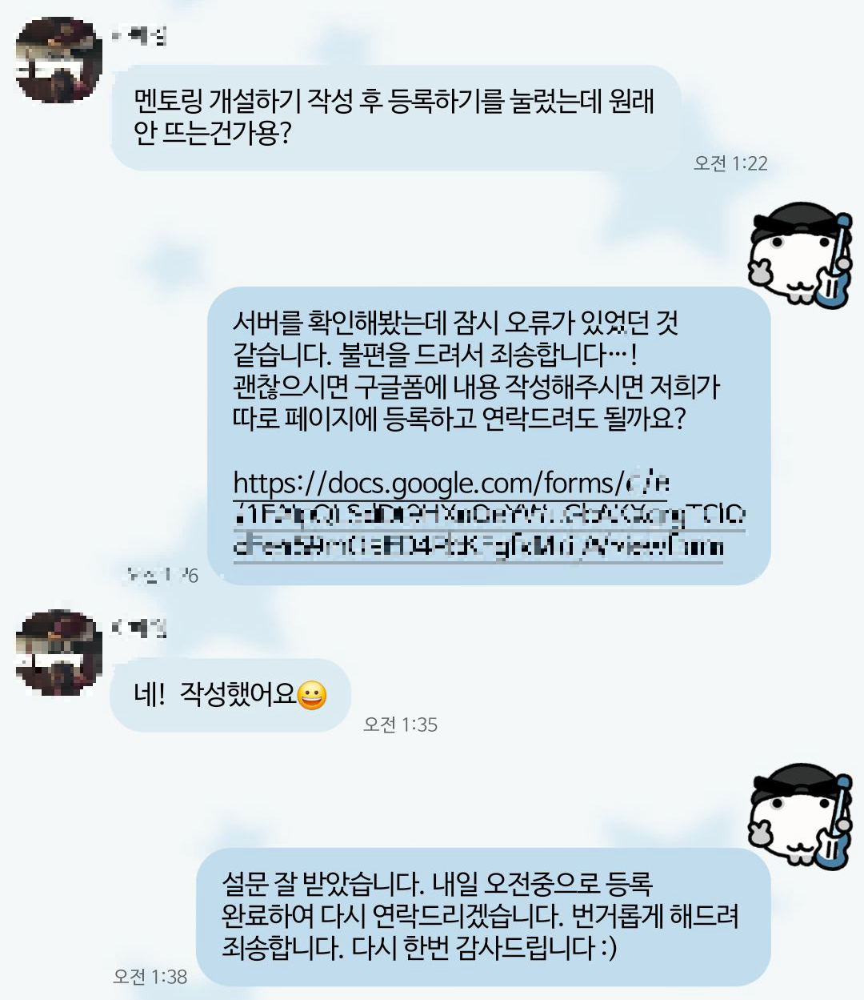

# 이미지 업로드 안정화 여정

## 서론

[핏토링](http://www.fittoring.com)은 피트니스 멘토링을 중개하는 **중개 플랫폼**입니다. 따라서 운영 초기에 많은 멘토들을 모아 멘토링을 개설하는 것이 중요했습니다. 그런데 실제 트레이너를 섭외하여 멘토링을 등록하는 과정에서 아래와 같이 OOM(Out Of Memory)가 발생했습니다.

```
...
"message" : "Handler dispatch failed: java.lang.OutOfMemoryError: Java heap space",
"normalizedUri" : "/mentorings",
...
```

  
고객 서비스를 처리하는 몇 분 동안 피가 차갑게 식는 경험을 했습니다.




## 왜 발생했을까?

먼저, 서버에서 멘토링 개설 요청을 받았을 때 **조회 성능을 높이기 위해서 요청으로 들어온** **이미지를 가공**하고 있었습니다. S3에 이미지를 업로드하기 전에 이미지 리사이징, 썸네일 생성, 확장자 변환 등 다양한 로직을 서버에서 직접 수행했습니다.

한 요청 당 전체 10MB, 개별 파일에 대해 5MB로 파일 크기에 제한을 걸고 있어서 메모리에 문제가 없을거라고 생각했습니다. 실제로 로컬 환경에서는 문제없이 동작했습니다.

그러나 원본 파일의 용량이 작아도 **이미지 압축을 풀고 byte 배열로 처리하는 과정에서 크기가 몇 십 배까지 커질 수 있습니다.**

**이미지의 썸네일을 생성하는 과정에서 이미지 압출이 풀리고, byte 배열이 반복적으로 생성되며 메모리 사용량이 폭발적으로 늘어나는 문제가 발생하게 된 것입니다.**

## 어떻게 해결했을까?

### 1. Heap size 조절
우선 급한 불을 끄기 위해 힙 크기를 조정했습니다.  
JVM은 기본적으로 시스템 메모리의 **1/4**을 힙으로 할당합니다. 당시 서버는 총 2GiB 메모리를 가진 인스턴스였고, 약 512MB만 힙으로 사용 중이었습니다. 이를 점차 늘려 **1GiB**까지 확장하자 일시적으로는 OOM이 줄었지만, 근본적인 해결책은 아니었습니다.

### 2. 이미지 압축 해제 방식 개선 (서브샘플링)
이후 이미지 압축 해제 방식을 변경했습니다.  
전체 이미지를 메모리에 올리는 대신, 필요한 영역만 읽는 **서브샘플링(subsampling)** 방식을 적용했습니다.  
이로써 단일 처리 시 메모리 사용량은 크게 줄었지만, 여러 요청이 동시에 들어오면 여전히 불안정했습니다.  

결국 서버에서 직접 이미지를 처리하는 구조로는 한계가 명확했습니다.

## presigned-url 도입으로 OOM 벗어나기

그래서 **이미지 처리를 애플리케이션 서버에서 완전히 분리**하기로 결정했습니다.  
AWS SDK를 이용해 **Presigned URL 기반 업로드 방식**으로 전환했습니다.

기존에는 클라이언트 → 서버 → S3 순서로 업로드가 이루어졌습니다.  
이제는 **클라이언트가 서버를 거치지 않고 직접 S3에 업로드**하며, 서버는 Presigned URL을 발급하는 역할만 담당합니다.

이 변경으로 서버의 CPU, 메모리 부하가 모두 사라졌고, 한 번에 수십 장의 이미지를 업로드해도 문제가 발생하지 않았습니다.

## Lambda로 썸네일 생성하기

하지만 새로운 문제가 발생했습니다.  
이미지를 클라이언트가 직접 업로드하게 되면서, 서버는 더 이상 **썸네일 생성이나 포맷 변환을 직접 수행할 수 없게 된 것**입니다.

이를 해결하기 위해 **AWS Lambda**를 도입했습니다.  
S3에 이미지가 업로드되면, **S3의 ObjectCreated 이벤트**가 Lambda를 트리거하여 자동으로 실행됩니다.  
Lambda는 업로드된 이미지를 받아 리사이징하고 `.avif` 포맷으로 변환한 뒤, 다시 S3에 저장합니다.  
이로써 서버는 이미지 처리에서 완전히 해방되고, Lambda가 독립적으로 이를 담당하게 되었습니다.


### 비동기 처리의 그림자
그러나 Lambda의 동작은 **비동기적**입니다.  
즉, 멘토링이 등록되는 시점과 썸네일이 생성되는 시점이 일치하지 않았습니다.  
예를 들어, 사용자가 멘토링을 개설할 때 이미지를 업로드하면 Lambda는 그제야 썸네일을 만들기 시작합니다. 하지만 서버는 이미 멘토링 정보를 DB에 저장한 상태입니다.  
결과적으로 **썸네일이 생성되기 전까지는 원본 이미지가 계속 조회**되는 문제가 생겼습니다.  
> 썸네일이 완성되어도 서버는 그 사실을 알 방법이 없었습니다.

일부 멘토링은 썸네일이 영구적으로 누락되었고, 이를 임시로 해결하기 위해 서버에서 전체 이미지를 주기적으로 스캔하는 **스케줄러**를 돌렸습니다. 하지만 데이터가 많아질수록 비효율적이었고, “썸네일 생성 완료 시점을 모른다”는 근본 문제가 남았습니다.

## SQS 도입
문제의 핵심은 **비동기 간의 동기화 부재**였습니다. 서버가 Lambda의 완료 시점을 인지할 수 있어야 했습니다.

이를 해결하기 위해 **Amazon SQS(Simple Queue Service)** 를 도입했습니다. Lambda가 썸네일 생성을 마치면 `"IMAGE_DERIVATIVE_READY"` 이벤트를 SQS 큐에 발행하고, 서버는 **@SqsListener** 를 통해 해당 메시지를 수신해 DB에 반영합니다.

이제 Lambda → SQS → 서버로 이벤트가 자연스럽게 전파되며, 썸네일 생성 시점이 늦더라도 서버는 항상 최신 상태를 유지할 수 있습니다.  스케줄러도 필요 없어졌고, 멘토링 생성과 이미지 업로드가 완전히 분리되었지만 일관성은 그대로 보장됩니다.

## 길었던 이미지 업로드 안정화를 마치며...

핏토링의 이미지 업로드 파이프라인을 재구축하여 다음과 같은 구조가 완성되었습니다.
(이미지 첨부)

결과적으로 멘토링 개설은 가볍고 안정적이며, 서버는 더 이상 이미지 처리로 흔들리지 않습니다.

개발을 하다 보면 “지금 당장 돌아가게 하는 방법”이 있고, “오래 버틸 수 있게 만드는 방법”이 있습니다. 처음에는 단순히 OOM을 막기 위해 시작했던 조치가, 결국엔 시스템의 **책임 분리**와 **비동기적 신뢰 구조**로 이어졌습니다.  

핏토링의 이 과정은 단지 장애 복구의 기록이 아니라, “서버가 모든 일을 할 필요는 없다”는 교훈의 기록이기도 합니다. 서버는 가벼워졌고, 각 구성요소는 자신의 역할에만 집중하게 되었습니다. 시스템이 안정화된다는 건 단지 오류가 사라지는 게 아니라, 각자의 책임이 명확해지고 신뢰할 수 있는 흐름이 만들어지는 과정이었습니다.  