# 스레드풀과 커넥션풀을 이용한 웹 서버 성능 튜닝

> 우아한테크코스 7기 BE 모다 🌱

## 서론

Spring Boot 기반 웹 서버는 내장된 Tomcat의 스레드풀(Thread Pool)과 HikariCP의 커넥션풀(Connection Pool)을 통해 스레드와 데이터베이스(DB) 커넥션을 관리합니다. 스레드풀과 커넥션풀은 스레드와 커넥션의 생성 비용을 줄이고, 유휴 상태의 객체를 적절히 관리하여 자원 낭비를 막는 효율적인 방법입니다.

하지만 기본 설정이 모든 환경에 최적화된 값은 아닙니다. 서비스의 트래픽 패턴, API의 응답 시간, 서버의 하드웨어 사양 등 다양한 요소를 고려하지 않은 기본 설정은 대규모 트래픽이 발생하는 상황에서 성능 저하의 원인이 될 수 있습니다.

이 글에서는 '기본 설정으로도 충분하다'는 생각에서 벗어나, 부하 테스트를 통해 서버의 병목 지점을 찾고 Tomcat 스레드풀과 HikariCP 커넥션풀, 그리고 Nginx의 설정을 튜닝하여 성능을 개선한 경험을 공유합니다.

---

### 글의 목표
- 성능 튜닝 전후의 차이를 K6 부하 테스트 지표를 통해 명확하게 보여줍니다.
- 서버 사양과 서비스 특성을 종합적으로 고려하여 스레드풀과 커넥션풀을 튜닝하는 방법을 소개합니다.

### 대상 독자
- 스레드풀과 커넥션풀의 이론은 알지만, 실제 운영 환경에 적용해 본 경험은 없는 개발자
- 현재 서버가 안정적으로 동작한다는 이유로 추가적인 성능 튜닝을 고려하지 않았던 개발자

---

## 1. 성능 측정: 우리 서버는 어디까지 감당할 수 있는가?

성능 튜닝의 첫 단계는 현재 시스템의 한계를 파악하는 것입니다. 저희는 부하 테스트(Load Test)를 통해 서버의 성능을 측정하고 문제점을 분석했습니다. 부하 테스트는 서버가 특정 수준의 부하를 처리할 수 있는지 확인하는 방법으로, 이를 통해 **RPS(Request Per Second, 초당 요청 수)** 와 같은 객관적인 성능 지표를 얻을 수 있습니다.

저희는 목표 사용자를 3,000명으로 설정하고, 부하 테스트 도구로는 **K6**를 선택했습니다. K6는 기존에 사용하던 Prometheus, Grafana 모니터링 환경과 쉽게 연동할 수 있고, 단일 프로세스로도 높은 부하를 생성할 수 있는 장점이 있습니다.

부하 테스트에서 확인해야 할 병목 지점은 다양합니다. 요청 실패율, 스레드풀 포화, 커넥션풀 타임아웃, CPU 사용률 등 여러 지표를 종합적으로 분석하여 시스템의 취약점을 찾아야 합니다.

#### 부하 테스트 시나리오
- **목표**: 동시 접속자 300명부터 시작하여 점진적으로 부하 증가
- **대상 API**: 서비스에서 가장 호출 빈도가 높은 메인 페이지 조회 API
- **테스트 내용**: 10분 동안 가상 사용자(Virtual User, VU) 수를 0명에서 300명까지 점진적으로 늘리며, 각 사용자는 10초에 한 번씩 메인 페이지를 새로고침합니다.

다음은 K6 부하 테스트에 사용된 스크립트입니다.
```javascript
import http from 'k6/http';
import { sleep, group } from 'k6';

export const options = {
    stages: [
        { duration: '10m', target: 300 } // 10분 동안 300명의 가상 사용자까지 증가
    ]
};

export default function () {
    group('메인 페이지 진입 시 API 일괄 호출', function () {
        // 메인 페이지 로딩에 필요한 여러 API를 동시에 호출
        http.get('https://todoktodok.com/api/v1/notifications/unread/exists');
        http.get('https://todoktodok.com/api/v1/discussions/hot?period=7&count=5');
        // ... (기타 API 호출)
    });
    sleep(10); // 10초 대기
}
```

<br> 

#### 문제 발생 지점 확인
가상 사용자가 300명일 때는 테스트가 안정적으로 성공했습니다.

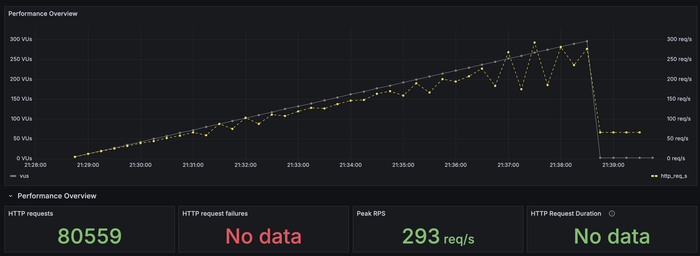
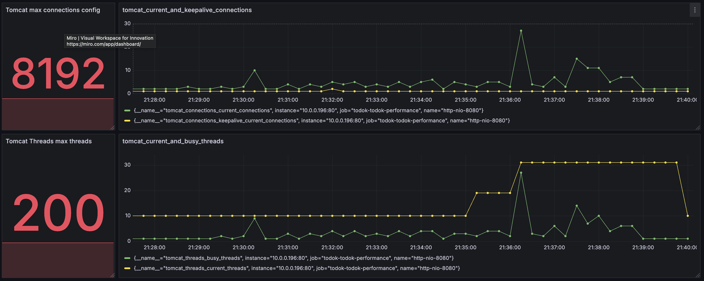
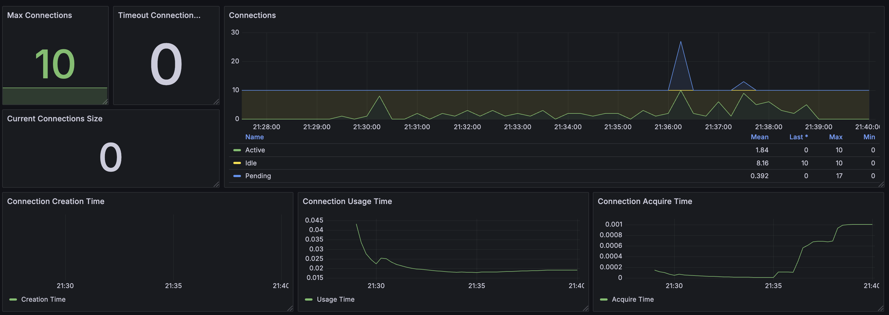
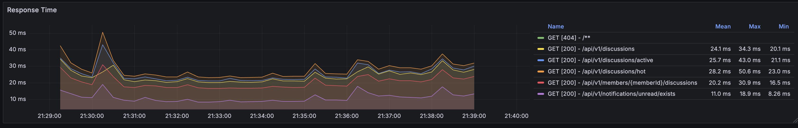
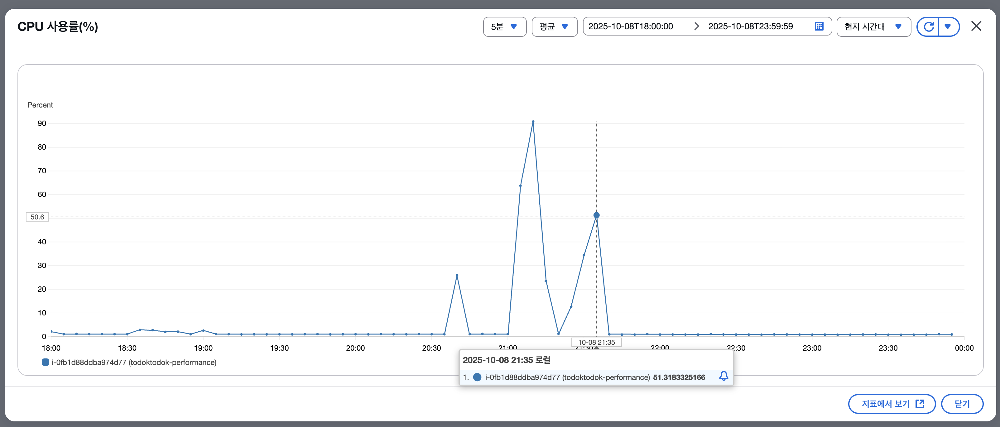

하지만 가상 사용자를 1,000명으로 늘리자 약 600명 지점부터 요청이 실패하기 시작했습니다. 실패 원인은 **`Connection reset by peer`** 오류였습니다. 이 오류는 Tomcat이나 Nginx와 같은 서버 측에서 클라이언트와의 연결을 먼저 종료할 때 발생합니다.

요청 실패가 발생하기 시작한 시점의 서버 상태는 다음과 같았습니다.
- Tomcat 활성 스레드: 200개 (최대치)
- Tomcat TCP 커넥션: 약 250개 유지
- HikariCP 활성 커넥션: 188개 + 대기(Pending) 커넥션: 10개 (총 198개)

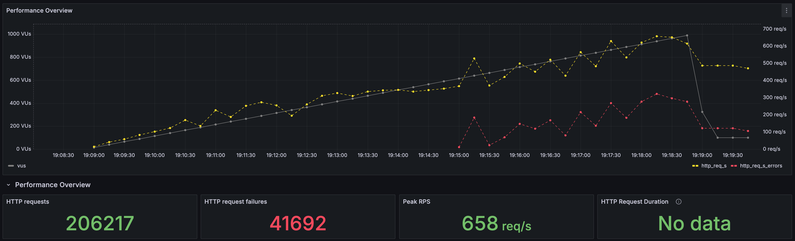
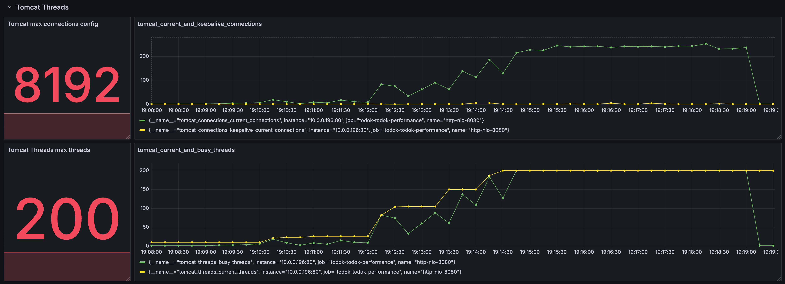
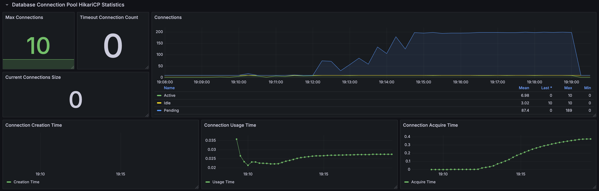
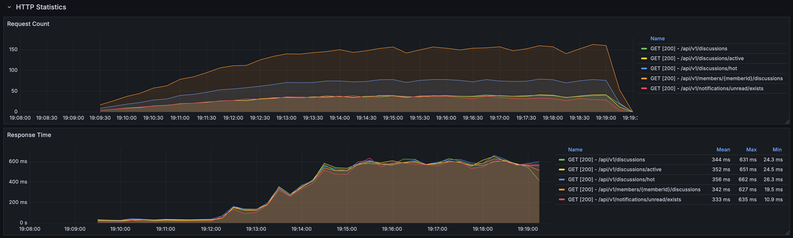

가상 사용자가 늘어나도 특정 시점부터 RPS가 더 이상 증가하지 않고 스레드풀과 커넥션풀이 최대치에 머무는 현상은 명백한 **병목**을 의미합니다. 따라서 이 지점의 설정을 튜닝하여 문제를 해결하기로 했습니다.

## 2. 성능 튜닝: 병목 지점 해결하기

서버에서 병목이 발생할 수 있는 지점은 다음과 같았습니다.

1.  Nginx Worker Connections
2.  Tomcat Thread Pool
3.  HikariCP Connection Pool

Tomcat의 `max-connections` 설정(기본값 8192)은 최대 연결 수가 250개에 불과해 여유가 있었으므로 튜닝 대상에서 제외했습니다. 또한, Tomcat의 연결 요청 대기열(OS backlog)에서도 대기 중인 연결이 발견되지 않아 병목 지점이 아니라고 판단했습니다.

<br>

#### 튜닝 1: Tomcat 스레드풀
가장 먼저 Tomcat 스레드풀의 `max-threads` 설정을 조정했습니다. 스레드 개수가 너무 많으면 잦은 컨텍스트 스위칭(Context Switching)으로 인해 오히려 성능이 저하될 수 있으며, 특히 저희가 사용한 `t4g.small` 인스턴스와 같이 CPU 코어 수가 적은 환경에서는 이 문제가 더욱 두드러집니다.

스레드풀 크기는 다음 공식을 참고하여 계산할 수 있습니다.
> MaxThreads ≈ CPU 코어 수 × (1 + (I/O 대기 시간 / CPU 사용 시간))

저희 애플리케이션은 CPU 사용 시간이 I/O 대기 시간보다 2~4배 길어 CPU Bound 작업에 가까웠습니다. 따라서 CPU 코어 수(2개)를 고려하여 `max-threads`를 `3`으로 설정했습니다.

튜닝 결과, 다음과 같은 지표가 크게 개선되었습니다.
- **CPU 사용량 및 부하 감소**: 불필요한 스레드가 줄어 컨텍스트 스위칭 비용이 감소했고, CPU 사용량과 시스템 부하(System Load)가 안정화되었습니다.
- **응답 시간 단축**: 서버의 처리 효율이 높아져 평균 응답 시간이 크게 줄었습니다.
- **자원 사용 안정화**: Tomcat 스레드와 DB 커넥션 사용량이 감소하며 안정적인 상태를 유지했습니다.

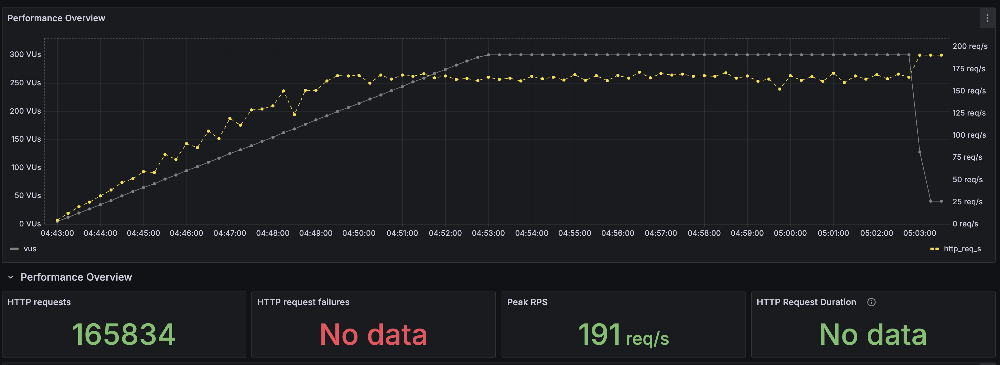

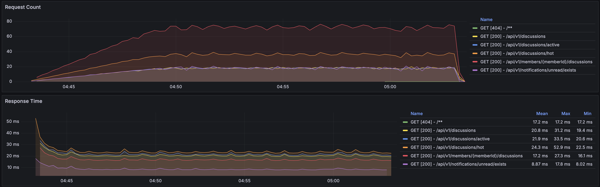
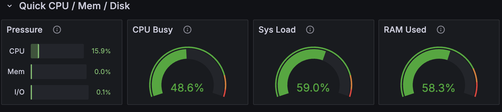

<br>

#### 튜닝 2: HikariCP 커넥션풀
다음으로 HikariCP 커넥션풀 크기를 튜닝했습니다. 일반적인 웹 애플리케이션에서는 하나의 스레드가 하나의 DB 커넥션을 사용하므로, 커넥션풀의 크기는 스레드풀의 크기와 비슷하게 설정하는 것이 좋습니다. 커넥션풀이 스레드풀보다 너무 크면 DB 서버에 과도한 부하를 줄 수 있고, 사용되지 않는 커넥션으로 인해 자원이 낭비될 수 있습니다.

저희는 `max-threads`를 `3`으로 설정했으므로, 데드락(Deadlock) 방지를 위한 최소한의 여유분을 고려하여 커넥션풀 크기를 `2`로 설정했습니다.

> 권장 Pool Size = (Max_Thread 수) × ((단일 스레드가 동시에 필요한 최대 연결 수) − 1) + 1

이 튜닝을 통해 DB 커넥션을 얻기 위해 대기하는 시간이 줄어들었고, 이는 전체적인 스레드풀의 효율성 증진으로 이어졌습니다.

<br>

#### 튜닝 3: Nginx Worker Connections
스레드풀과 커넥션풀을 튜닝한 후에도 500~600명의 가상 사용자 부하에서 여전히 `Connection reset by peer` 오류가 발생했습니다.

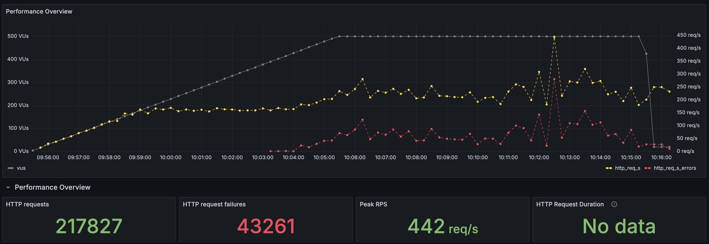

문제의 원인을 찾기 위해 요청이 가장 먼저 도달하는 Nginx로 분석 범위를 넓혔습니다. 저희 서버는 Nginx를 리버스 프록시(Reverse Proxy)로 사용하는 **WAS(Web Application Server)** 입니다. Nginx는 클라이언트의 요청을 받아 내부 애플리케이션 서버로 전달하는 역할을 하므로, Nginx에서 병목이 발생하면 전체 시스템의 성능에 영향을 미칩니다.

Nginx의 상태를 모니터링한 결과, 요청 실패가 발생하던 시점에 유휴 커넥션(Waiting Connection) 수가 0으로 떨어지는 것을 확인했습니다. 동시에 Nginx 로그에서 다음과 같은 오류 메시지를 발견했습니다.

```
512 worker_connections are not enough while connecting to upstream
```

이 메시지는 Nginx의 `worker_connections` 설정값이 부족하여 더 이상 연결을 처리할 수 없음을 의미합니다. `worker_connections`는 하나의 워커 프로세스(Worker Process)가 처리할 수 있는 최대 동시 연결 수입니다. 리버스 프록시 환경에서는 클라이언트와 서버 양쪽에 연결을 맺기 때문에, 실제 처리 가능한 동시 요청 수는 `worker_connections` 값을 2로 나눈 것과 비슷합니다.

저희 서버의 `worker_connections`는 구버전의 기본값인 `512`로 설정되어 있어, 약 250개의 동시 요청만 처리할 수 있었습니다. 이 한계를 초과하는 요청이 들어오자 Nginx가 연결을 강제로 종료했고, 이것이 `Connection reset by peer` 오류의 원인이었습니다.

이 문제를 해결하기 위해 `worker_connections`를 `1024`로 상향 조정하고, TCP 연결을 재사용하여 오버헤드를 줄이는 `keepalive` 설정을 `32`로 추가했습니다.

튜닝 이후, 500명의 가상 사용자 테스트에서 모든 요청이 성공적으로 처리되었습니다.

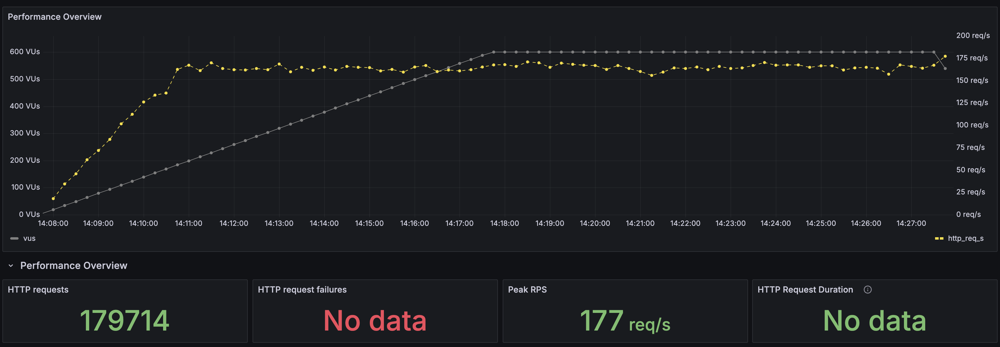
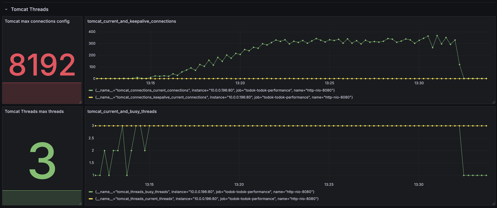

600명 테스트에서도 요청 실패는 발생하지 않았습니다. `keepalive` 설정 덕분에 약 500~550개의 커넥션만으로 600개의 동시 요청을 처리할 수 있었습니다. 다만, 커넥션 사용량이 불안정하게 변화하는 것으로 보아 이 지점이 시스템의 임계점임을 알 수 있었습니다. 예상대로 700명 테스트에서는 다시 요청 실패가 발생했습니다.

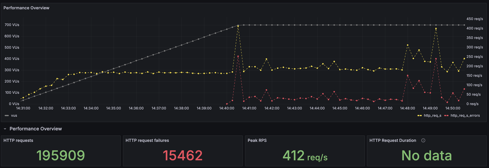

Nginx 튜닝을 통해 Nginx의 병목을 해소하고, 서버가 감당할 수 있는 동시 접속자 수를 성공적으로 늘릴 수 있었습니다.

---

## 결론

이 글에서는 K6 부하 테스트를 통해 서버의 병목 지점을 찾고, Tomcat 스레드풀, HikariCP 커넥션풀, Nginx 설정을 단계적으로 튜닝하여 성능을 개선하는 과정을 다뤘습니다.

초기 테스트에서는 Tomcat 스레드풀과 HikariCP 커넥션풀의 포화로 인해 요청이 실패하는 문제를 발견했습니다. CPU 코어 수와 작업 유형을 고려하여 스레드풀과 커넥션풀의 크기를 적절히 조절함으로써 컨텍스트 스위칭 비용을 줄이고 시스템 자원을 효율적으로 사용하도록 개선했습니다.

하지만 근본적인 문제는 요청의 진입점인 Nginx에 있었습니다. `worker_connections` 설정값이 낮아 발생한 병목을 해결하고 나서야 서버가 처리할 수 있는 동시 사용자 수가 크게 증가했습니다.

#### 이 글의 기술적 의의

1.  **데이터 기반의 체계적인 튜닝 방법론 제시**: '기본 설정이 최적일 것'이라는 가정에서 벗어나, 부하 테스트를 통해 얻은 데이터를 기반으로 병목 지점을 정확히 진단하고 개선하는 체계적인 접근법을 보여줍니다.
2.  **End-to-End 최적화의 중요성 강조**: 성능 문제는 단일 시스템이 아닌 여러 시스템의 상호작용에서 발생하는 경우가 많습니다. 이 글은 애플리케이션 서버(Tomcat), DB 커넥션풀(HikariCP)뿐만 아니라 리버스 프록시(Nginx)까지 전체 요청 흐름을 종합적으로 분석해야 근본적인 문제를 해결할 수 있음을 보여줍니다.
3.  **제한된 리소스 환경에서의 실질적인 튜닝 가이드 제공**: `t4g.small`과 같은 저사양 환경에서 각 설정값이 시스템에 미치는 영향을 구체적인 지표를 통해 설명합니다. 이는 비슷한 환경의 개발자들이 자신의 서버 특성에 맞게 설정을 최적화할 때 참고할 수 있는 실질적인 가이드를 제공합니다.