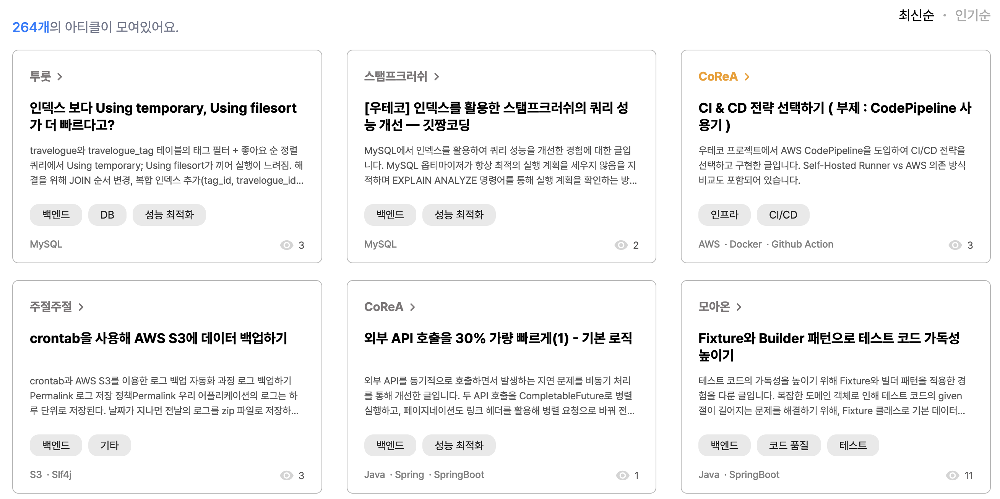
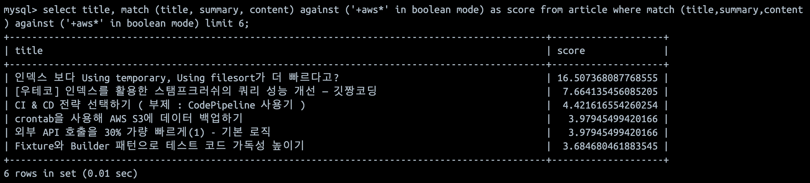
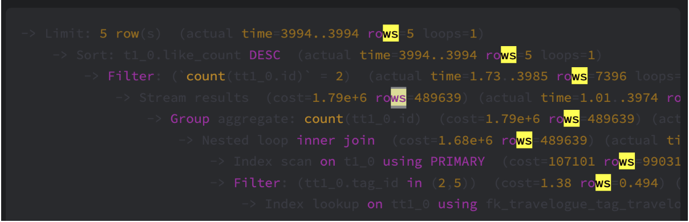
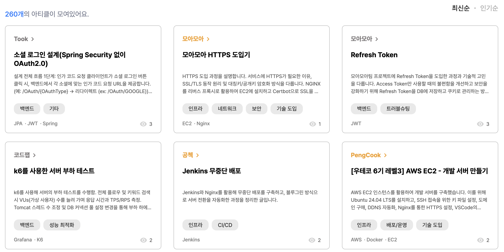
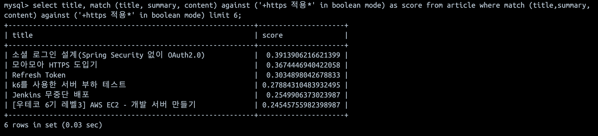
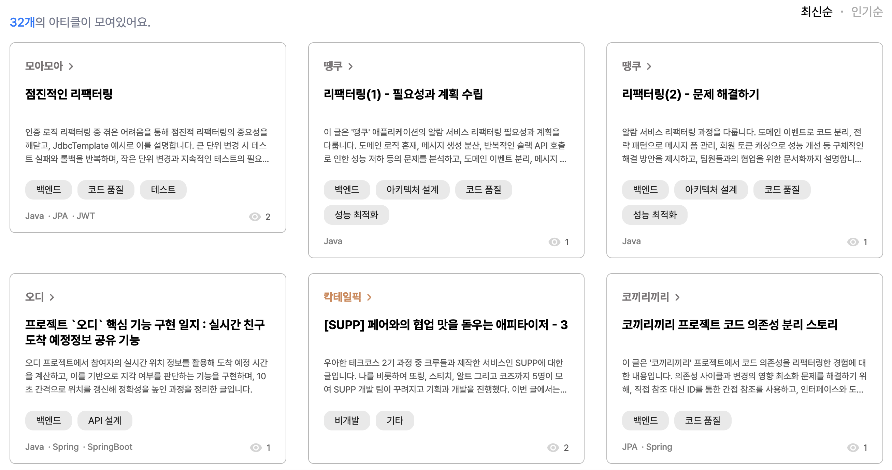
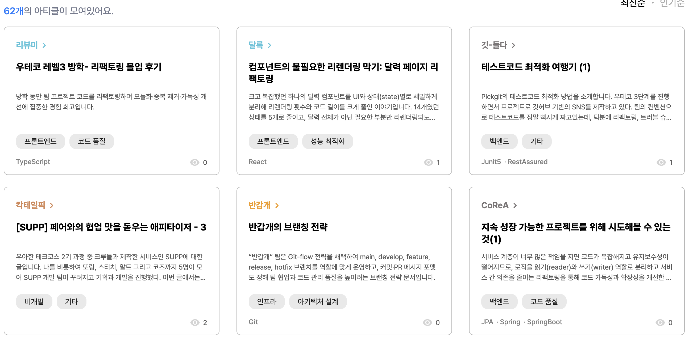

# 검색 품질 향상시키기 (Elasticsearch)

> **더 나은 검색 경험을 구축한 기록**

## 대상 독자

- 관계형 DB의 `LIKE` 검색 또는 `전문(Full-Text)`검색보다 더 높은 품질의 검색 기능을 만들고싶은 개발자 
- 검색 시 원하는 결과가 상위에 노출되지 않아 고민인 서버 개발자

## 서비스 배경

모아온은 프로젝트라는 맥락 안에서의 기술적 인사이트를 제공하는 서비스입니다. 따라서 핵심 페르소나는 기술적 인사이트를 얻고싶어 하는 사용자였습니다. 사용자가 원하는 정보를 찾기 위해서는 검색, 필터, 정렬 등의 기능이 핵심이었습니다.

또한 사용성 테스트에서도 절반에 가까운 사용자는 원하는 정보를 얻기위해 **검색**을 가장 먼저 수행했습니다.

결국 검색은 모아온의 핵심 기능으로, 서비스의 가치에 막대한 영향을 미치는 중요한 기능입니다.

이 글에서는 MySQL의 `LIKE` 기반 검색에서 `Full-Text Search`를 거쳐 `Elasticsearch`로 전환하면서, 검색 품질을 향상시킨 경험을 설명합니다.

### 기존 검색 시스템: MySQL Full-Text Search

초기에는 단순히 MySQL의 `LIKE` 기능을 활용했습니다. 입력한 검색어와 완전히 일치하는 것만 검색되는 것이 올바르다고 생각했기 때문입니다.

하지만 테스트 과정에서 한계가 드러났습니다.
`“스프링 CORS”`라고 검색했을 때, `“스프링 환경에서 CORS를 다루는 글”`은 검색되지 않았습니다.
**완전 일치 방식으로는 유연한 검색이 불가능**했기 때문입니다.

그래서 유연한 검색을 위해 MySQL의 `Full-Text Search` 기능을 활용했습니다. 2-gram 파서를 이용해 단어를 두 글자 단위로 색인했고, 매칭되는 토큰 수에 비례해 점수를 매겼습니다.
매칭되는 토큰의 수에 비례해 점수화하는 기능 덕분에 정확도가 있었습니다.

이로써 단순 `LIKE`보다 유연한 검색이 가능해졌지만, 곧 새로운 한계를 만났습니다.

### MySQL Full-Text Search의 문제

불만족스러운 검색 결과를 마주치는 상황이 많았습니다.

#### 1. 관련 없는 문서가 많이 검색됩니다.

아래는 `“aws”`에 대한 검색 결과입니다.





`“aws”` 검색 시 `“aw”`, `“ws”`로 분절되어 전혀 관계없는 문서가 상위에 노출되었습니다.  
2-gram 기반 점수화는 단어 빈도에만 의존하기 때문입니다.

첫 번째 게시글의 경우 아래 사진과 같이 `“ws”`가 많이 매칭되어서 최고 점수를 받았음을 알 수 있습니다.



2-gram을 사용하지 않고 유의미한 토큰을 추출하기 위해서는 형태소 분석이 필요했습니다.
`“로드밸런서”`와 같이 복합명사들을 쪼개지 않도록 사전도 필요했습니다.

#### 2. 세밀한 점수화가 불가능합니다.

아래는 `“HTTPS 적용”`에 대한 검색 결과입니다.





첫 번째를 비롯한 다른 주제의 글들이 상위에 있는 이유는 `“HTTPS”` 또는 `“적용”`이라는 단어가 많이 등장했기 때문입니다.

1위 문서인 `소셜 로그인 설계`의 경우 글의 내용에 `https://...`형태의 URL이 많아서 가장 높은 점수를 받았습니다. 

즉 단어의 빈도만으로는 아티클의 관련도가 높다고 볼 수 없습니다.

#### 3. 같거나 유사한 의미의 다른 단어로 검색 시 검색되지 않습니다.

많은 사람들이 `“리팩터링”`과 `“리팩토링”`을 구분 없이 사용합니다.
둘은 같은 의미임에도 불구하고 검색 결과는 달랐습니다.

다음은 `“리팩터링”`에 대한 결과(위)와 `“리팩토링”`에 대한 결과(아래)입니다.





전혀 다른 결과가 검색됨을 알 수 있습니다.

결과적으로 같은 내용을 담은 문서가 검색되지 않는 문제가 발생했습니다.

## 검색 품질을 결정짓는 세 가지 축

**관련도 높은 문서**들이 **상위**에 **많이** 노출될 때 검색 품질이 좋다고 할 수 있습니다.
따라서 검색 품질은 아래 세 가지 요소에 의해 결정됩니다.

1. **형태소 분석 및 사용자 사전** – 사용자의 검색어에서 유의미한 단어를 추출  
2. **동의어 사전** – 같은 의미의 다른 단어를 연결  
3. **스코어링** – 관련도 높은 문서를 상위로 노출

### 형태소 분석

문장에서 **의미있는 단위를 추출**하기 위해 형태소 분석을 진행합니다.  
예: `“리팩터링을 진행합니다.”` → `“리팩터링”` 

이 과정을 통해 검색엔진은 단순 문자열이 아닌 **의미 단위로 색인**할 수 있습니다.

### 사용자 사전

형태소 분석 과정에서 **복합 명사**를 분리하기도 합니다. **사용자 사전(User Dictionary)** 은 복합 명사를 분해하지 않고 하나의 단위로 인식하도록 합니다.   

예를들어 `“로그아웃”`을 `“로그”`, `“아웃”`으로 분리하면 의미가 훼손되므로, 사용자 사전을 통해 `“로그아웃”`을 **분리되지 않는 하나의 단어**로 등록해야 합니다.

### 동의어 사전

사용자는 같은 의미의 단어를 제각기 사용합니다. 이런 변형을 인식하기 위해 **동의어 사전(Synonym Dictionary)** 을 구축합니다.

| 사용자 입력 | 실제 문서 표현 |
|--------|----------|
| 리팩토링   | 리팩터링     |
| docker | 도커       |
| CI/CD  | 배포 자동화   |  

이를 통해 `리팩토링 = 리팩터링`, `migration = 마이그레이션`처럼 단어를 연결할 수 있습니다.

### 스코어링

앞의 예시로 볼 수 있듯이 단어가 많이 나온 문서가 사용자가 찾는 문서는 아닙니다.

검색 의도에 부합하는 문서가 상위에 위치해야 하며, 이를 위해 단순 빈도보다 문맥적 가중치를 고려해야 합니다.

간단한 예시로 아래와 같이 점수를 평가할 수 있습니다.
- 검색어가 제목에 있는 경우 점수 ↑
- 검색어가 여러 개인 경우 문서에서 검색어들이 가까이 있을 수록 점수 ↑
- `“설계”`, `“구현”`과 같은 상대적으로 비결정적이고 흔한 단어는 점수 ↓

## 구현

Elasticsearch를 이용해 위 세 가지를 구현했습니다. 자세한 구현 방법은 아래 링크를 참고하시기 바랍니다.

- [nori tokenizer : 한글 형태소 분석 및 사용자 사전](https://esbook.kimjmin.net/06-text-analysis/6.7-stemming/6.7.2-nori)
- [Search with synonyms : 동의어 사전](https://www.elastic.co/docs/solutions/search/full-text/search-with-synonyms)
- [Multi-match Query : 다중 필드 검색 API](https://www.elastic.co/docs/reference/query-languages/query-dsl/query-dsl-multi-match-query)

### 형태소 분석

[nori tokenizer](https://esbook.kimjmin.net/06-text-analysis/6.7-stemming/6.7.2-nori)를 커스텀하여 사용했습니다.
어미, 조사, 감탄사 등 핵심과 무관한 단어를 색인하지 않도록 했습니다.

예를들어 `"Flyway는 오픈소스 마이그레이션 툴이다"` 라는 문장은 다음과 같이 분석됩니다.
```json
{
  "tokens": [
    {
      "token": "flyway",
      "type": "word"
    },
    {
      "token": "오픈",
      "type": "word"
    },
    {
      "token": "소스",
      "type": "word"
    },
    {
      "token": "마이",
      "type": "word"
    },
    {
      "token": "그레이",
      "type": "word"
    },
    {
      "token": "션",
      "type": "word"
    },
    {
      "token": "툴",
      "type": "word"
    }
  ]
}
```

### 사용자 사전

앞서 본 예시에서 `"오픈소스"`는 `"오픈"`, `"소스"`로, `"마이그레이션"`은 `"마이"`, `"그레이"`, `"션"`으로 분리되었습니다.

하지만 `"마이그레이션"`은 그 자체로 의미를 가지는 단어이며, 쪼개진 형태는 아무런 의미를 갖지 않습니다.

이처럼 **의미 단위가 분리되지 않도록** 형태소 분석 전에 사용자 사전을 정의해야 합니다.


```text
// dictionary
오픈소스
마이그레이션
...
```

사전 정의 이후 `"Flyway는 오픈소스 마이그레이션 툴이다"` 라는 문장은 다음과 같이 분석됩니다.
```json
{
  "tokens": [
    {
      "token": "flyway",
      "type": "word"
    },
    {
      "token": "오픈소스",
      "type": "word"
    },
    {
      "token": "마이그레이션",
      "type": "word"
    },
    {
      "token": "툴",
      "type": "word"
    }
  ]
}

```

### 동의어 사전

언어에는 수많은 동의어들이 존재할 수 있습니다. 모아온과 같은 개발 도메인에서는 다음과 같은 예시가 있습니다.
- 데이터베이스, DB
- 로드밸런서, 로드밸런싱, 로드밸런스

또한 사용자는 같은 단어를 한글과 영어로 혼용하기도 합니다. 
예를들어 `"마이그레이션"` 대신 `"migration"`으로 검색해도 동일한 결과가 노출되어야 합니다.

```text
// synonyms
마이그레이션, migration
로드밸런서, 로드밸런싱, 로드밸런스
...
```

동의어 사전 정의 이후 `"Flyway는 오픈소스 마이그레이션 툴이다"` 라는 문장은 다음과 같이 분석됩니다.

```json
{
  "tokens": [
    {
      "token": "flyway",
      "type": "word"
    },
    {
      "token": "오픈소스",
      "type": "word"
    },
    {
      "token": "migration",
      "type": "SYNONYM"
    },
    {
      "token": "마이그레이션",
      "type": "word"
    },
    {
      "token": "툴",
      "type": "word"
    }
  ]
}

```

이 결과에서 `"migration"`과 `"마이그레이션"`이 같은 의미로 인식되어, 검색 결과가 더 폭넓게 확장됩니다.

### 스코어링

검색 품질의 핵심은 **의도에 부합하는 문서를 상위에 노출**하는 것입니다.
단순히 단어가 많이 등장하는 문서가 아니라, **의미 있고 가치 있는 문서가 상위**에 오르도록 해야 합니다.

이를 위해 단어의 빈도 대신 문서의 `가치`를 점수화하려 시도했습니다.
하지만 `가치`는 본질적으로 추상적인 개념이었고, 소수의 인원이 수동으로 관련도를 평가하는 방식은 객관성을 확보하기 어려웠습니다.

현재는 **검색어의 위치 기반 점수화**를 우선 적용했습니다.
예를 들어 검색어가 제목에 포함된 경우 더 높은 점수를 부여합니다.
제목은 글의 핵심 내용을 담을 가능성이 높기 때문입니다.

또한 Elasticsearch의 기본 스코어링 알고리즘인 [BM25](https://esbook.kimjmin.net/05-search/5.3-relevancy)는 단순히 단어 빈도에 정비례하지 않고,
문서 길이와 단어의 희귀도 등을 함께 고려해 맥락에 따른 가중치를 부여합니다.

이를 통해 검색어가 **글의 핵심이고**, **결정적일수록** 높은 점수를 받는 구조를 만들었습니다.

## 마무리

이번 개선을 통해 형태소 분석, 사용자 사전, 동의어 사전을 기반으로 검색 품질의 토대를 다질 수 있었습니다.

형태소 분석과 사용자 사전을 활용해 검색어에서 **의미 있는 키워드를 정교하게 추출**하고, 동의어 사전을 통해 **더 많은 문서가 검색**되도록 확장했습니다.

마지막으로 스코어링 전략을 적용해, 사용자가 찾고자 하는 문서를 보다 정확히 **상위에 노출**시킬 수 있었습니다.

## 참고

- [MySQL Full-Text Search](https://dev.mysql.com/doc/refman/8.4/en/fulltext-search.html)
- [Elasticsearch](https://www.elastic.co/kr/elasticsearch)
- [Elastic Guide Book - Relevancy](https://esbook.kimjmin.net/05-search/5.3-relevancy)
