# 1. Thread Pool 이란?
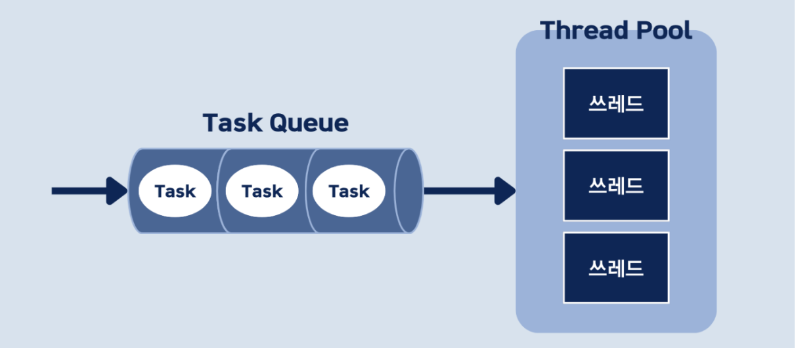

## 1.1 Tomcat Thread Pool 이해하기
Tomcat은 들어오는 요청(Task)을 처리하기 위해 Thread Pool이라는 개념을 사용합니다. 
Thread는 생성 및 컨텍스트 스위칭 비용이 비싸기 때문에 잘못하면 메모리 누수와 CPU 오버헤드가 발생할 수 있습니다. 
따라서 Thread를 미리 적정량 만들어두고 사용하게 되는데 이를 Thread Pool이라고 합니다.

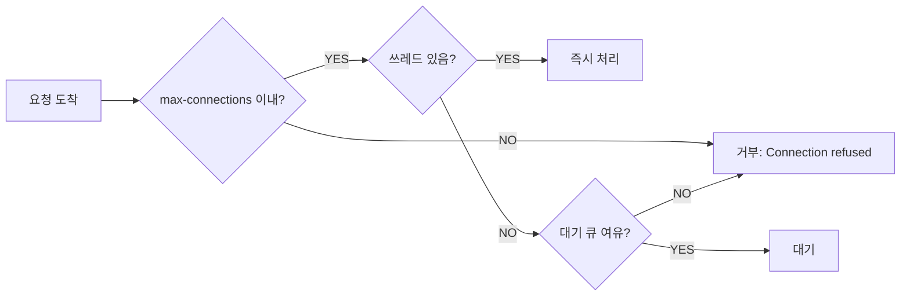

웹 요청이 들어오면 Tomcat의 Connector가 Connection을 생성하고,요청된 작업을 Thread Pool의 쓰레드에 연결합니다.
Thread에 여유가 있으면 Queue에 들어온 요청은 바로 전달되지만, 모든 Thread가 사용 중이면 새로 발생한 요청은 Queue에 쌓이면서 지연이 발생 합니다.

## 1.2 Thread Pool 설정 값 이해하기
### server.tomcat.threads.max
- 기본값 200
- 생성할 수 있는 최대 쓰레드 개수
- 동시에 처리 가능한 요청의 수를 결정
- 이 값을 넘어서면 요청은 대기 큐에 

---

### server.tomcat.threads.min-spare
- 기본값 10
- 항상 활성화(idle)되어 있는 최소 쓰레드 개수

---

### server.tomcat.accept-count
- 기본값 100
- 모든 쓰레드가 사용 중일 때 대기 큐에 넣을 수 있는 요청 개수
- 대기 큐마저 가득 차면 새로운 연결은 거부됨

---

### server.tomcat.max-connection
- 기본값 8192
- 동시에 수립 가능한 connection의 총 개수
- 실질적인 서버의 동시 처리 능력을 나타냄


## 1.3 메인 작업 종류에 따른 Thread Pool 크기 결정하기
### server.tomcat.threads.max

#### CPU-bound 작업 (애플리케이션 레벨에서의 연산)
- **권장**: CPU 코어 수 × (1~2)
- **이유**: CPU보다 많은 쓰레드는 오히려 컨텍스트 스위칭 오버헤드만 증가
- **예시**: 8코어 서버 → 약 16

#### I/O-bound 작업 (DB 조회, 외부 API 호출)
- **권장**: CPU 코어 수 × (10~25)
- **이유**: 쓰레드가 I/O 대기 중일 때 다른 쓰레드가 CPU를 사용할 수 있기 때문
- **예시**: 8코어 서버 → 약 100~200

---

### server.tomcat.threads.min-spare

#### CPU-bound 작업 (애플리케이션 레벨에서의 연산)
- **권장**: max의 1/2 정도
- **이유**: CPU 작업은 처리 속도가 빠르므로 즉시 대응 가능한 쓰레드 많이 확보
- **예시**: 8코어 서버 → 약 8

#### I/O-bound 작업 (DB 조회, 외부 API 호출)
- **권장**: max의 1/10 ~ 1/5 정도
- **이유**: I/O 대기가 많아 유휴 쓰레드를 과도하게 유지할 필요 없음
- **예시**: 8코어 서버 → 약 10~20

---

### server.tomcat.accept-count

#### CPU-bound 작업 (애플리케이션 레벨에서의 연산)
- **권장**: max × (2~3)
- **이유**: 처리 속도가 빠르므로 큰 대기 큐 불필요
- **예시**: 8코어 서버 → 약 30~50

#### I/O-bound 작업 (DB 조회, 외부 API 호출)
- **권장**: max × (0.5~1)
- **이유**: I/O 대기로 처리 시간이 길어 적절한 대기 큐 필요
- **예시**: 8코어 서버 → 약 50~200

---

### server.tomcat.max-connections

#### CPU-bound 작업 (애플리케이션 레벨에서의 연산)
- **권장**: 보수적으로 설정 (200~500)
- **이유**: CPU 집약적이므로 과도한 동시 연결은 성능 저하
- **예시**: 8코어 서버 → 약 200

#### I/O-bound 작업 (DB 조회, 외부 API 호출)
- **권장**: 넉넉하게 설정 (5000~10000)
- **이유**: I/O 대기 중인 연결들을 충분히 받아들일 수 있어야 함
- **예시**: 8코어 서버 → 약 10000

### 1.4 Thread Pool 모니터링 (추가 예정)

# 2. Connection Pool 이란?

## 2.1 Connection Pool 이해하기
DB 커넥션을 미리 만들어 두고 재사용하는 방법 입니다. 1 트랜잭션 = 1 커넥션 이며, application.yml 파일에
애플리케이션에서 DB로 연결할 수 있는 최대 갯수를 설정할 수 있습니다.

```java
@Transactional  // 트랜잭션 시작
public void transferMoney(Long fromId, Long toId, int amount) {
    // ← 여기서 커넥션 풀에서 커넥션 1개 획득
    
    Account from = accountRepository.findById(fromId);  // 같은 커넥션 사용
    Account to = accountRepository.findById(toId);      // 같은 커넥션 사용
    
    from.withdraw(amount);      // 같은 커넥션 사용
    to.deposit(amount);         // 같은 커넥션 사용
    
    accountRepository.save(from);  // 같은 커넥션 사용
    accountRepository.save(to);    // 같은 커넥션 사용
    
    // ← 여기서 커넥션 풀에 반납 (트랜잭션 종료)
}
```

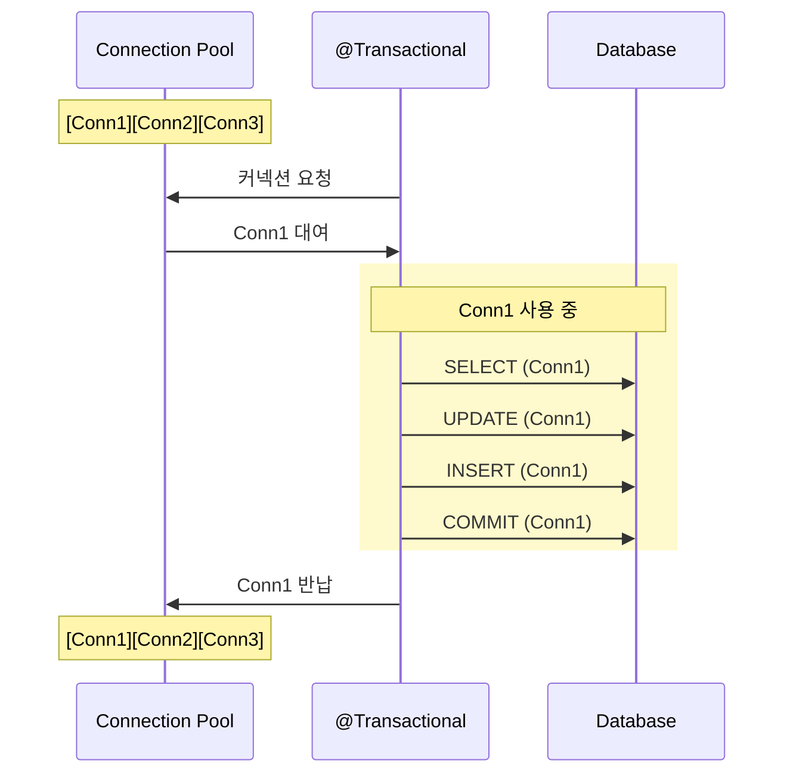
- 애플리케이션 시작 시 설정된 개수만큼 커넥션 생성
- 요청이 들어오면 풀에서 idle 상태 커넥션 대여
- 트랜잭션 완료(close) 후 커넥션 반납
- 풀에 idle 상태 커넥션이 없으면 대기하거나 새로 생성(설정에 따라)


## 2.2 Connection Pool 크기 설정 방법

```yaml
# 커넥션 풀 크기
spring.datasource.hikari.maximum-pool-size=10 # 최대 커넥션 수
spring.datasource.hikari.minimum-idle=5 # 최소 유휴 커넥션 수

# 타임아웃 설정
spring.datasource.hikari.connection-timeout=30000 # 커넥션 대기 시간 (30초)
spring.datasource.hikari.idle-timeout=600000 # 유휴 커넥션 유지 시간 (10분)
spring.datasource.hikari.max-lifetime=1800000 # 커넥션 최대 수명 (30분)
```

### spring.datasource.hikari.maximum-pool-size
- **의미**: 동시에 사용 가능한 최대 커넥션 개수
- **기본값**: 10
- **주의** : 너무 크면 DB 서버 부하, 너무 작으면 대기 발생

### spring.datasource.hikari.minimum-idle
- **의미** : 항상 유지할 최소 유휴 커넥션 수
- **기본값** : maximum-pool-size와 동일
- **주의** : minimum-idle < maximum-pool-size 설정 시 동적으로 크기 조정

### spring.datasource.hikari.connection-timeout
- **의미** : 커넥션을 얻기 위해 대기하는 최대 시간
- **기본값** : 30000(30초)
- **주의** : 너무 짧으면 불필요한 에러, 너무 길면 응답 지연

### spring.datasource.hikari.idle-timeout
- **의미** : 유휴 커넥션이 풀에 유지 되는 시간
- **기본값** : 600000(10분)
- **주의** : minimum-idle를 제외한 커넥션만 정리됨

### spring.datasource.hikari.max-lifetime
- **의미** : 커넥션의 최대 수명
- **기본값** : 1800000(30분)
- **주의** : 0으로 설정 시 무제한 (권장하지 않음)


## 2.3 Connection Pool 모니터링
```yaml
spring:
  datasource:
    hikari:
      minimum-idle: 10
      maximum-pool-size: 10
      connection-timeout: 30000
```
Hikari 설정은 위와 같은 상황일 때, 실제 grafana 모니터링을 확인하면 아래와 같습니다.
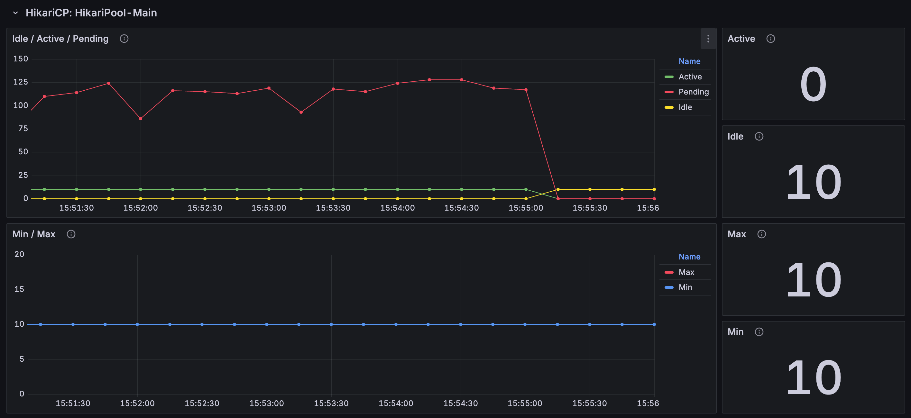
max = 10으로 설정되어 있으므로 요청이 들어왔을때 Connection은 최대 10개까지만 생성됩니다. 따라서 수많은 요청이 들어왔을때, 
커넥션은 최대 10개까지 생성되고 추가로 커넥션이 필요한 경우에는 Pending 상태로 대기하게 됩니다. 이때 커넥션 풀에서 사용 가능한 커넥션이 반환될 때까지 기다리며, 설정된 타임아웃 시간(connection-timeout) 내에 커넥션을 획득하지 못하면 SQLException이 발생합니다. 


# 3. Thread Pool, Connection Pool 조율 하기 with 부하테스트

## 부하테스트 시나리오
```javascript
import http from 'k6/http';
import { check, sleep } from 'k6';
import { Trend } from 'k6/metrics';
import {
  ORGANIZATION_UUIDS,
  PROCESS_STATUS,
  SORT_OPTIONS
} from '../../utils/common.js';
import { BASE_URL } from '../../utils/secret.js';

export const batchResponseTime = new Trend('batch_response_time');

export const options = {
  scenarios: {
    normal_load: {
      executor: 'ramping-vus',
      startVUs: 1,
      stages: [
        { duration: '1m', target: 150 },
        { duration: '3m', target: 150 },
        { duration: '1m', target: 1 },
      ],
    },
  },
  thresholds: {
    http_req_duration: ['p(95)<500'],
    http_req_failed: ['rate<0.1'],
  },
};

export default function () {
  const orgUuid = 'b624e7f3-1993-41df-975f-eb48448e18f0';
  const size = 10;
  const sortBy = SORT_OPTIONS[Math.floor(Math.random() * SORT_OPTIONS.length)];
  const status = Math.random() > 0.5
    ? PROCESS_STATUS[Math.floor(Math.random() * PROCESS_STATUS.length)]
    : '';
  const cursorId = Math.random() > 0.7 ? Math.floor(Math.random() * 633) + 1 : '';

  let queryParams = `size=${size}&sortBy=${sortBy}`;
  if (status) queryParams += `&status=${status}`;
  if (cursorId) queryParams += `&cursorId=${cursorId}`;

  const startTime = new Date().getTime();

  const responses = http.batch([
    ['GET', `${BASE_URL}/organizations/${orgUuid}`, null, {
      headers: { 'Content-Type': 'application/json', 'Accept': 'application/json' },
      tags: { name: 'GetOrganization' },
    }],
    ['GET', `${BASE_URL}/organizations/${orgUuid}/feedbacks?${queryParams}`, null, {
      headers: { 'Content-Type': 'application/json', 'Accept': 'application/json' },
      tags: { name: 'GetFeedbacks' },
    }],
    ['GET', `${BASE_URL}/organizations/${orgUuid}/statistic`, null, {
      headers: { 'Content-Type': 'application/json', 'Accept': 'application/json' },
      tags: { name: 'GetStatistic' },
    }],
  ]);

  check(responses[0], {
    '[Organization] status is 200': (r) => r.status === 200,
    '[Organization] response time < 500ms': (r) => r.timings.duration < 500,
    '[Organization] has valid data': (r) => {
      try {
        const body = JSON.parse(r.body);
        return (
          body.status === 200 &&
          body.data &&
          body.data.hasOwnProperty('organizationName') &&
          body.data.hasOwnProperty('categories')
        );
      } catch {
        return false;
      }
    },
  });

  check(responses[1], {
    '[Feedbacks] status is 200': (r) => r.status === 200,
    '[Feedbacks] response time <= 500ms': (r) => r.timings.duration <= 500,
  });

  check(responses[2], {
    '[Statistic] status is 200': (r) => r.status === 200,
    '[Statistic] response time <= 500ms': (r) => r.timings.duration <= 500,
  });

  const batchElapsedTime = new Date().getTime() - startTime;
  batchResponseTime.add(batchElapsedTime);

  check(null, {
    'batch status all 200': () =>
      responses[0].status === 200 &&
      responses[1].status === 200 &&
      responses[2].status === 200,
    'batch response time <= 500ms': () => batchElapsedTime <= 500,
  });

  const elapsedTime = batchElapsedTime / 1000;
  const remainingTime = 0.7 - elapsedTime;
  if (remainingTime > 0) sleep(remainingTime);
}

```

부하 테스트 시나리오 스크립트는 위와 같습니다. 이를 하나하나 이해할 필요는 없고, 간단하게 아래와 같은 상황이라고 인지하시면 됩니다.
- 최대 150명의 가상 사용자(VU) 가 동시에 접속
- 각 사용자는 약 0.7초 간격으로 요청 수행
- 한 번에 3개의 API를 동시에 호출

## 기본값 설정

```yaml
spring:
  datasource:
    hikari:
      minimum-idle: 10                    # 기본값
      maximum-pool-size: 10               # 기본값
      connection-timeout: 30000           # 30초 (기본값)
      idle-timeout: 600000                # 10분 (기본값)
      max-lifetime: 1800000               # 30분 (기본값)

server:
  tomcat:
    threads:
      max: 200                            # 최대 스레드 수 (기본값)
      min-spare: 10                       # 최소 유지 스레드 수 (기본값)
    accept-count: 100                     # 대기 큐 크기 (기본값)
    max-connections: 8192                 # 최대 연결 수 (기본값, BIO는 maxThreads와 동일)
    connection-timeout: 20000             # 20초 (기본값)
```

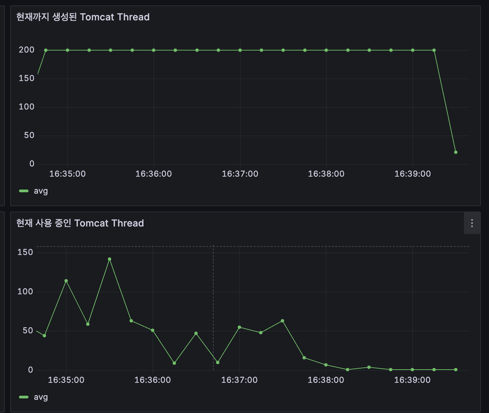
- Tomcat Thread가 최대 200개까지 생성됨

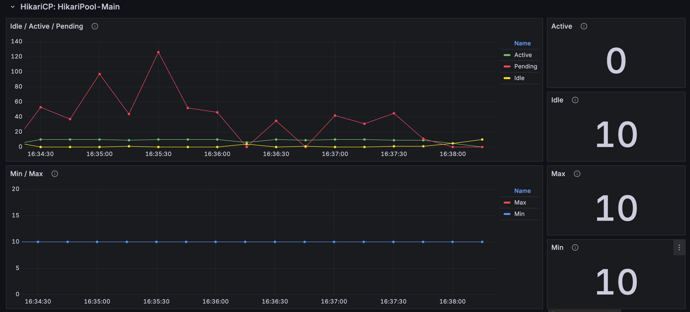
- Connection은 10개 모두 사용

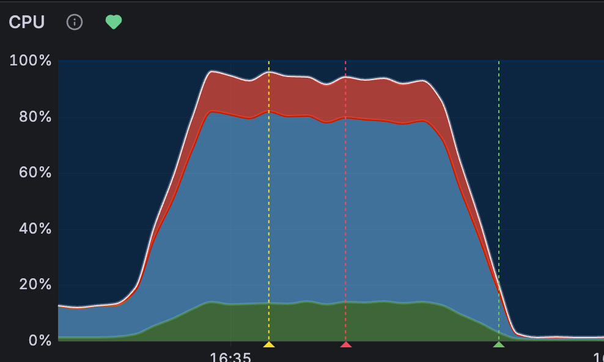
- 서버 CPU 사용률 90% 이상

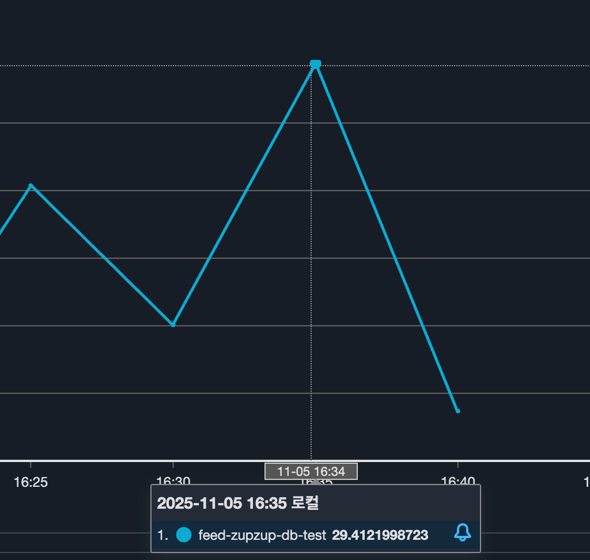
- RDS CPU 사용률 약 30% 이상

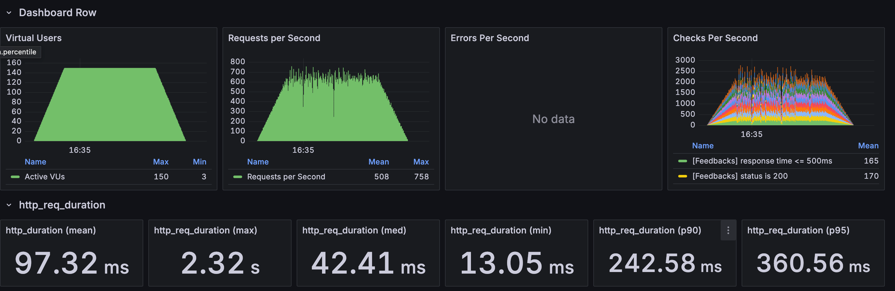
- rps : 508
- p95 : 360ms

위 상황의 분석 결과는 다음과 같습니다.

**커넥션 풀 증가 필요 (10 → 50)**
- DB가 여유로우므로 더 많은 커넥션 활용 가능
- 커넥션 대기 시간 감소 → p95 개선
- DB의 유휴 리소스 활용

**Tomcat 스레드 감소 필요 (200 → 50)**
- 커넥션보다 훨씬 많은 스레드는 무의미 (대기만 함)
- 서버 CPU 사용률 감소 (컨텍스트 스위칭 오버헤드 감소)
- 메모리 사용량 감소 (각 스레드는 스택 메모리 사용)


## Tomcat 스레드 = 50, 커넥션 풀 = 50
```yaml
spring:
  datasource:
    hikari:
      minimum-idle: 20                    # 10 → 20 (증가)
      maximum-pool-size: 50               # 10 → 50 (증가)
      connection-timeout: 30000           # 30초 (유지)
      idle-timeout: 600000                # 10분 (유지)
      max-lifetime: 1800000               # 30분 (유지)

server:
  tomcat:
    threads:
      max: 50                             # 200 → 50 (감소)
      min-spare: 10                       # 10 (유지)
    accept-count: 100                     # 100 (유지)
    max-connections: 8192                 # 8192 (유지)
    connection-timeout: 20000             # 20초 (유지)
```
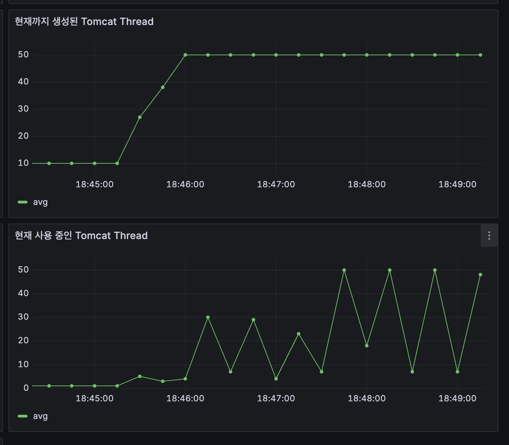
- Tomcat Thread가 50까지 생성됨

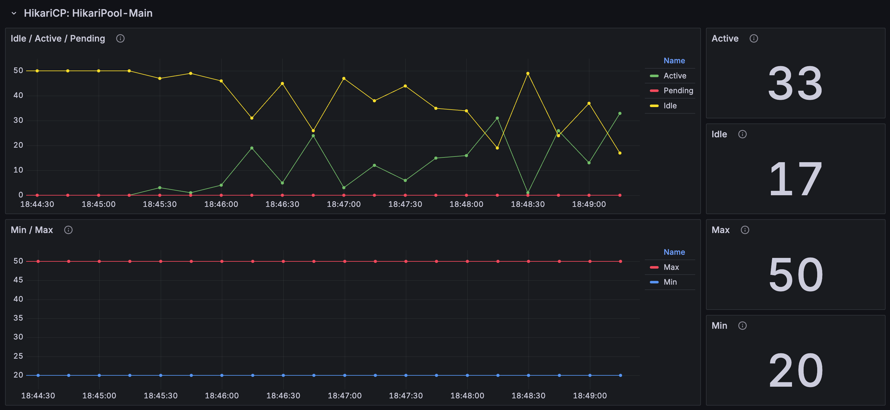
- Connection은 50개 중 33개 사용  

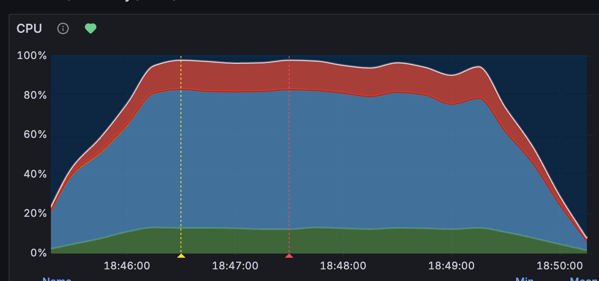
- 서버 cpu 90%이상 사용

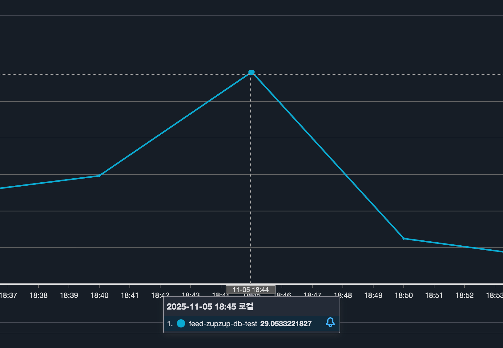
- rds cpu 29% 사용

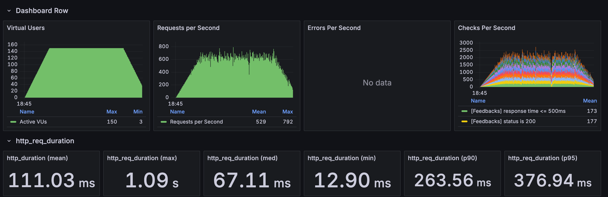
- rps : 529
- p95 : 376ms

## 문제 분석

Tomcat 스레드와 커넥션 풀을 조절해도 성능(부하)에 큰 변화가 없는걸 알 수 있습니다. 이는 CPU 코어 수와 관련이 있습니다.

현재 서버는 t4g.micro로 CPU 코어가 2개뿐입니다. CPU 코어는 동시에 실행 가능한 작업의 물리적 한계를 결정하는데, 2개의 코어는 한 시점에 정확히 2개의 스레드만 실행할 수 있습니다. 즉, Tomcat 스레드를 50개로 설정하든 200개로 설정하든, 실제로 동시에 RUNNING 상태로 실행되는 스레드는 최대 2개에 불과합니다.

운영체제 스케줄러는 Ready Queue에 있는 나머지 스레드들을 Time Slice(보통 10ms)마다 코어에 할당하며, 이 과정에서 Context Switch가 발생합니다. Context Switch는 현재 스레드의 레지스터 상태를 저장하고 다음 스레드의 상태를 복원하는 과정으로, 약 1~10μs의 오버헤드가 발생합니다. 스레드 수가 많을수록 Context Switch 빈도가 증가하여 실제 작업보다 스레드 전환에 CPU 시간이 소모되는 비효율이 발생합니다.

처리량(Throughput)은 "min(총 스레드 수, 코어 수) / 평균 처리 시간"으로 계산되는데, 분자가 코어 수로 상한선이 고정되어 있기 때문에 스레드나 커넥션 수를 늘려도 처리량이 증가하지 않습니다. 예를 들어, 요청 처리 시간이 100ms일 때 2 Core 시스템의 이론적 최대 처리량은 2 / 0.1초 = 20 RPS로 고정됩니다.

현재 서버 CPU 사용률 90% 이상, DB CPU 사용률 29%라는 지표는 병목이 데이터베이스가 아닌 애플리케이션 서버의 CPU 코어 수에 있음을 명확히 보여줍니다. 커넥션 풀이 33/50만 사용되고 있다는 점 역시 DB 접근이 아닌 애플리케이션 로직 실행 단계에서 대기가 발생하고 있다는 증거입니다.

## 해결 방안: 스케일 아웃 (Scale-Out)

단일 서버의 CPU 코어 수가 물리적 병목이 되고 있으므로, 성능 개선을 위해서는 스케일 아웃(Scale-Out) 전략이 필요합니다. 현재 1대의 t4g.micro(2 Core)로는 최대 약 20 RPS만 처리 가능하지만, 동일한 스펙의 서버를 3대로 확장하고 로드밸런서를 통해 트래픽을 분산하면 이론적으로 60 RPS까지 처리할 수 있습니다. 각 서버가 독립적으로 2개 코어를 활용하므로, 총 6개 코어(2 Core × 3대)가 병렬로 작동하여 전체 시스템의 처리 용량이 선형적으로 증가합니다.

스케일 아웃의 장점은 단일 장애점(Single Point of Failure)을 제거하고 가용성을 높일 수 있다는 점입니다. 한 대의 서버가 장애가 발생해도 나머지 서버가 트래픽을 처리하여 서비스 중단을 방지할 수 있으며, Auto Scaling Group을 구성하면 트래픽 증가에 따라 자동으로 인스턴스를 추가하여 탄력적으로 대응할 수 있습니다. 또한 DB CPU가 29%로 여유로운 상황이므로, 애플리케이션 서버만 확장해도 병목 없이 성능을 개선할 수 있습니다.
