# 포게더가 일하는 방법

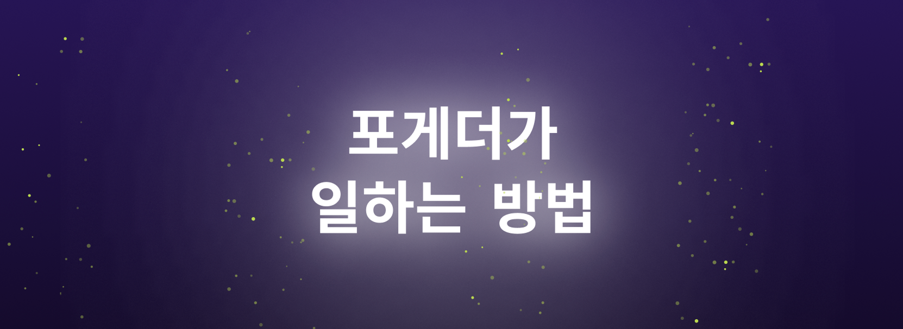

### 웹 프론트엔드 7기 루나

## 📌 목차 

> **[들어가며](https://github.com/ShinjungOh/woowa-writing/blob/184a263c56e973836d5630d0de1bee6452ed3207/technical-writing.md#%EB%93%A4%EC%96%B4%EA%B0%80%EB%A9%B0)**  
> **[1. 맥락을 공유하는 소통법](https://github.com/ShinjungOh/woowa-writing/blob/184a263c56e973836d5630d0de1bee6452ed3207/technical-writing.md#1-%EB%A7%A5%EB%9D%BD%EC%9D%84-%EA%B3%B5%EC%9C%A0%ED%95%98%EB%8A%94-%EC%86%8C%ED%86%B5%EB%B2%95)**  
>  CSS(Context Synchronize Session)   
>  슬랙 업무보고 채널  
> **[2. 팀워크를 높이는 소프트 스킬 문화](https://github.com/ShinjungOh/woowa-writing/blob/184a263c56e973836d5630d0de1bee6452ed3207/technical-writing.md#2-%ED%8C%80%EC%9B%8C%ED%81%AC%EB%A5%BC-%EB%86%92%EC%9D%B4%EB%8A%94-%EC%86%8C%ED%94%84%ED%8A%B8%EC%8A%A4%ED%82%AC-%EB%AC%B8%ED%99%94)**    
> 데일리 스크럼  
> 익명 피드백    
> **[3. 한 주를 돌아보는 주간 회고](https://github.com/ShinjungOh/woowa-writing/blob/184a263c56e973836d5630d0de1bee6452ed3207/technical-writing.md#3-%ED%95%9C-%EC%A3%BC%EB%A5%BC-%EB%8F%8C%EC%95%84%EB%B3%B4%EB%8A%94-%EC%A3%BC%EA%B0%84%ED%9A%8C%EA%B3%A0)**  
> 감정 회고  
> 작업 방식 점검    
> **[4. 프로젝트 점검을 위한 행사](https://github.com/ShinjungOh/woowa-writing/blob/184a263c56e973836d5630d0de1bee6452ed3207/technical-writing.md#4-%ED%94%84%EB%A1%9C%EC%A0%9D%ED%8A%B8-%EC%A0%90%EA%B2%80%EC%9D%84-%EC%9C%84%ED%95%9C-%ED%96%89%EC%82%AC)**  
> 이벤트스토밍  
> QA    
> **[마치며](https://github.com/ShinjungOh/woowa-writing/blob/184a263c56e973836d5630d0de1bee6452ed3207/technical-writing.md#%EB%A7%88%EC%B9%98%EB%A9%B0)**

 

## 들어가며

이 글에서는 포게더 프로젝트를 진행하며 우리 팀에서 적용한 **다양한 협업 방식**을 소개하려 한다.

포게더는 우리 팀 이름이자 서비스의 이름이다. 
헷갈림을 방지하고자 글의 제목에서와 같이 '포게더'를 단독으로 사용하면 팀을 가리키고, 서비스를 지칭할 때는 '포게더 서비스'라고 한다.

포게더는 다양한 배경을 가진 팀원 8명으로 시작했다. 
우리 팀에는 팀플 경험이 많으며 실사용자가 있는 서비스를 운영 중인 팀원, 팀플이 처음이라 아무것도 모르는 팀원 등이 섞여있었다.
4개월 내에 기획부터 프로덕트 출시까지 해야 했던 우아한테크코스(이하 우테코) 환경 속에서 우리 팀은 최적의 협업 방식을 찾아야 했다. 
빠르게 다양한 시도를 하고, 시행착오 끝에 완성된 포게더의 협업 방식을 소개한다.

각자의 업무 맥락을 공유하는 방법, 팀원의 사기와 동료애를 높이는 소프트 스킬 문화, 프로젝트가 올바른 방향으로 진행되고 있는지 확인하는 방법 등을 담고 있다.

다음의 사항에 해당하는 사람에게 이 글을 추천한다.

> **예상 독자**
> - 팀 프로젝트를 효율적으로 진행하는 방법을 알고 싶은 분
> - 팀원 모두가 같은 맥락을 공유하는 소통 방식과 스프린트 방법에 관심 있는 분
> - 팀워크를 향상시키는 다양한 소프트 스킬 문화가 궁금한 분

  

## 1. 맥락을 공유하는 소통법

_'이건 언제 결정된 거지?'  
'분명 난 이 사항에 대해 전달받지 못했는데...'_

팀플을 하다보면 팀원 간 공유하는 맥락이 달라 흐름을 이해할 수 없고, 
누구에게 어디서부터 질문해야 할지 막막한 상황이 있다. 
**팀원이 같은 맥락을 공유**하는 것은 불필요한 의사소통을 줄이고 생산성을 높이며, 모두의 의견을 참고할 수 있어 매우 중요하다.

모든 팀원이 프로젝트에 동일한 맥락을 갖기 위해 포게더가 고안한 소통 방법을 소개한다.

### CSS(Context Synchronize Session)

CSS는 우리 팀원들이 만든 명칭으로, 팀원들 간의 **맥락을 동기화하기 위한 설명회**다.
코드 구현자는 PR 리뷰가 시작되기 전에, 구현 내용을 칠판에 적으며 팀원들에게 설명한다. 
어떤 구조로 설계했고, 구현 과정에서 고민되는 점은 무엇이었고, 팀원에게 의견을 구하고 싶은 부분은 무엇인지 공유하며 기술적 토론이 자연스럽게 일어난다. 
설명회는 화이트보드, 칠판, 노트 등이 있을 때 훨씬 효과가 좋다.

처음에는 백엔드 팀원끼리 CSS를 시작했으나, 모든 팀원의 이해를 같은 수준으로 끌어올린다는 장점을 확인하고 프론트 팀원들도 도입했다. 
나아가 분야 간 소통이 부족하다고 느껴져, 작업 방식 점검 회고를 거친 후 백엔드와 프론트엔드 간에도 CSS를 하게 됐다. 
이 과정에서 API 스펙이 결정되거나 개발 방향이 잡힌다.

CSS의 장점은 설명하는 입장에서 자신의 생각을 논리적으로 펼칠 기회가 생긴다는 점이다. 
혼자만 알고 있는 것에서 그칠지, 팀원을 이해시킬 정도로 본인이 이해했는지 점검할 수 있다. 
듣는 입장에서도 새로운 구조를 접하거나 다른 사람의 논리 흐름을 간접 경험할 수 있어 유익하다.

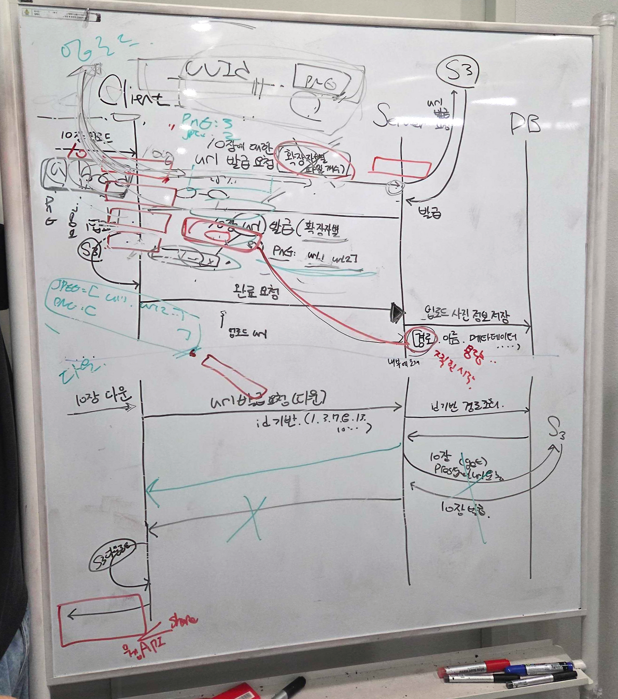

프론트엔드-백엔드 간 CSS

 

### 슬랙 업무보고 채널

우리 팀의 협업 플랫폼은 **노션과 슬랙, 디스코드**가 있다. 모든 문서와 회의는 노션에 정리하고, 주 메신저는 슬랙을 이용한다. 
슬랙에도 허들 기능이 있지만, 무료 버전을 사용하고 있어 2명 이상일 때는 허들을 이용할 수 없다. 단체로 원격 회의를 진행할 경우에는 디스코드를 이용한다.

우테코 내부 채널이 아닌 별도의 팀 슬랙을 사용하고 있어서 우리가 채널을 마음대로 생성하고 운영할 수 있다는 장점이 있다. 
업무보고 채널은 **의사결정 내용, 업무 상황**을 실시간으로 공유하는 채널이다. 
백엔드와 프론트엔드가 공통으로 사용하며, 사소한 내용이라도 부담 없이 맥락을 공유할 수 있도록 공지 채널보다는 가벼운 무게감을 가진다.

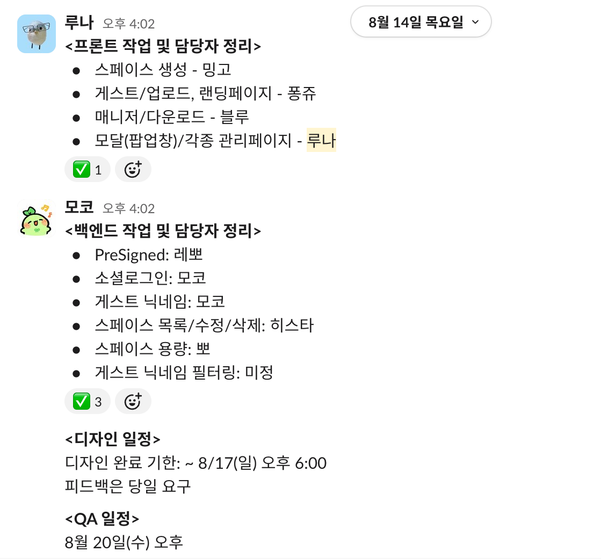
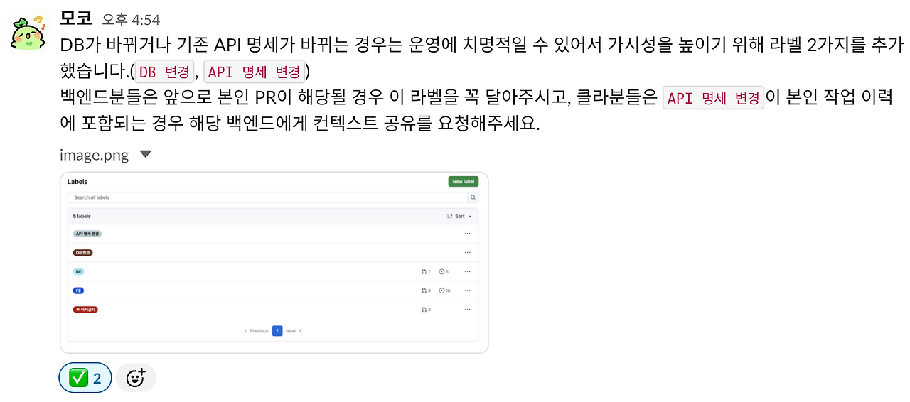

업무보고 메시지

업무보고 채널은 '주간 회고 - 작업 방식 점검' 시간에 생겼다. 
프론트엔드와 백엔드 팀원 간의 소통이 부족해 API 구조를 바꿔야 하는 등 비효율적인 작업이 종종 일어났다. 
분야마다 누가 어느 업무를 담당하고 있는지 모르고 있었고, 개발이 얼마나 진행됐는지 알 수 없어서 **팀 내 전반적인 소통이 부족**한 상태였다.

업무보고 채널은 '공지만큼의 중요도를 가지는 것은 아니고, 그렇다고 잡담도 아닌 메시지를 어느 채널에 보내야 할지 모르겠다'는 문제점에서 시작됐다. 
팀원들은 본인의 작업에 대해 다른 팀원들이 알아야 하지만 회의를 잡기에는 사소한 사안이고, 
모든 팀원이 알아야 하는 공지라고 하기엔 분류가 맞지 않다는 생각을 가지고 있었다.

데일리 스크럼 시간에 공유할 수도 있지만 우리는 차별점을 두고 싶었다. 데일리 스크럼과 업무보고 채널의 다른 점은 다음과 같다. 
보고가 아침에만 국한되지 않으며, 실시간으로 공유가능한 점, 
매번 노션의 데일리 스크럼 문서를 들어가지 않고도 일자별로 아카이빙 된 기록을 확인할 수 있다는 점에서 슬랙을 선택했다.

이로써 간단한 방법으로 빠르고 즉각적인 맥락 공유가 가능해졌다. 모든 팀원이 주인의식을 가지고 본인의 업무와 프로젝트 관련 사항을 언제든 공유하게 되었다.

  

## 2. 팀워크를 높이는 소프트스킬 문화

_'고마웠던 마음을 전달하고 싶어.'  
'피드백을 기분 나쁘지 않게 전달할 방법은 없을까?'_

포게더는 데일리 스크럼을 단순한 작업 현황 공유를 넘어, 팀원의 컨디션을 체크하고 고마움을 전하는 시간으로 만들었다. 
나의 개선점을 알고 싶은데 대놓고 물어보자니 솔직한 답변을 얻지 못할 것 같고, 피드백을 주고 싶은데 불편할까 봐 말하지 못하는 경우가 있다. 
이를 위해 개선할 점을 메타인지하고 실천할 수 있는 익명 피드백을 마련했다.

팀원이 서로를 진심으로 생각하고 **심리적 안전감**을 얻을 수 있도록 하는 우리 팀만의 문화를 소개한다.

### 데일리 스크럼

우리 팀은 매일 데일리 스크럼을 진행한다. 데일리 스크럼은 오전 10시에 진행하는 전날 업무 보고 및 하루 계획 공유 시간이다.
매일 랜덤 추첨으로 그날의 데일리 스크럼을 진행할 **데일리 마스터**를 뽑는다.

우리 팀은 본격적으로 데일리 스크럼을 시작하기에 앞서 **체크인**을 진행한다. 
체크인 점수로 아침의 기분을 0에서 10 사이의 숫자로 표현하고 건강, 수면 등의 특이사항을 적으며 팀원의 컨디션을 체크할 수 있다. 
-(마이너스) 점수도 있는데 이 경우는 매우 드물지만, 이 점수를 남긴 사람에게는 하루동안 세심하게 배려해주기로 약속했다.

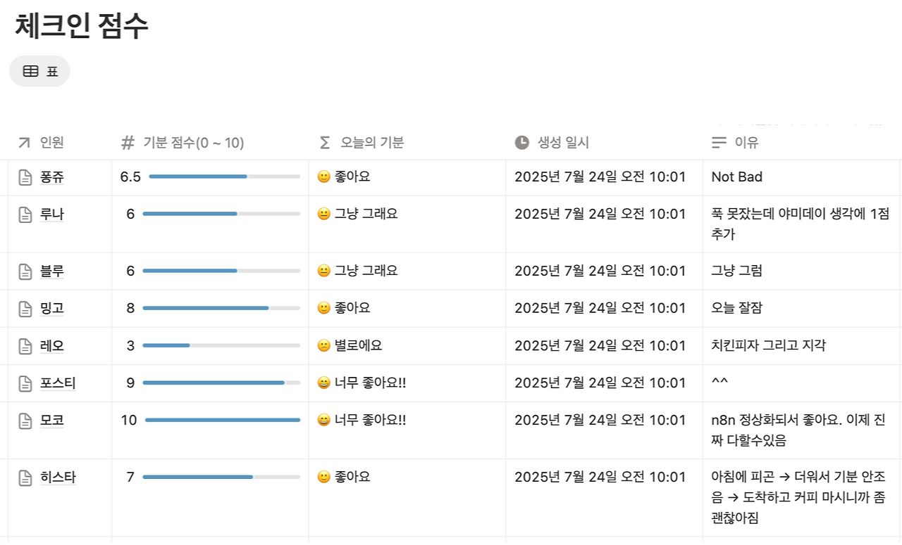

체크인 점수

체크인이 끝나면 **어제 한 일과 오늘 할 일**을 공유한다. 
특히 프론트엔드와 백엔드 각 분야가 어떤 작업을 했는지 서로에게 알리는 것을 중점으로 한다. 
이외에 프로젝트에 논의사항이 있으면 같이 얘기를 나눈다. 이 시간에 점심 메뉴를 정하기도 한다.

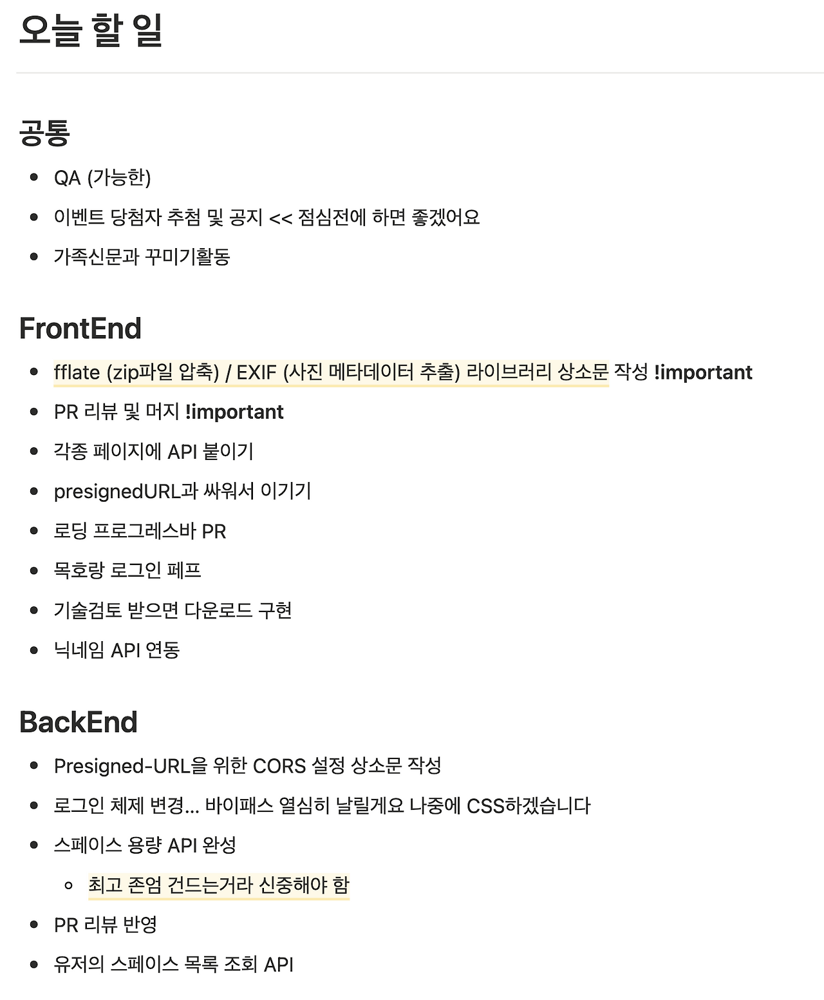

오늘 할 일 공유

데일리 스크럼의 마지막 시간에는 **칭찬하기**가 있다. 고마운 일이 있었던 팀원을 공개적으로 칭찬하며 하루를 기분 좋게 시작하는 시간이다. 
이 시간에는 서로의 노고와 기여를 인정하고 박수를 치는데, 단순히 칭찬을 넘어 나의 어떤 점을 팀원들이 좋게 봤는지 피드백을 들을 수 있는 기회이기도 하다. 
테코톡 발표를 준비하거나 전날 밤늦게까지 작업한 팀원이 있으면 '샤라웃(Shout out)' 형식으로 고생했다고 격려하기도 한다.

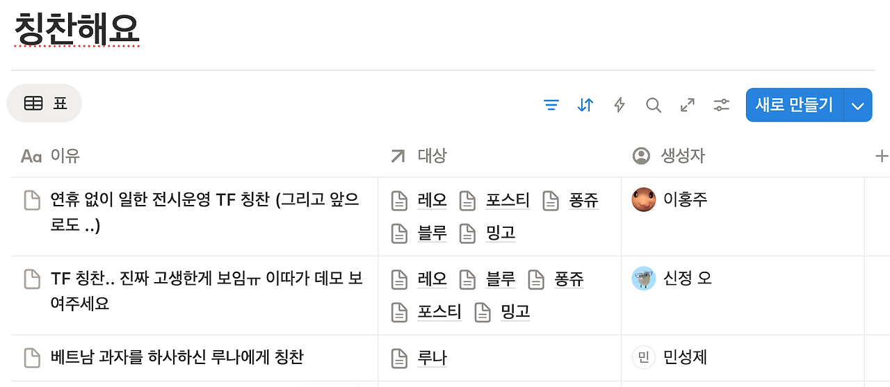

칭찬하기

 

### 익명 피드백

포익피피라고 부르는 익명 피드백은 '포게더 익명 피어 피드백'의 줄임말이다. 
우리 팀은 제비 뽑기로 피드백 대상을 결정하고, 2주마다 익명의 피드백을 주는 문화를 가지고 있다. 
팀원이 발전할 수 있도록, 평소에 말하기 어려웠던 상대의 단점과 개선 방법을 따뜻하게 전달한다.

포게더가 정한 **<우리의 성장을 위한 건강한 피드백 가이드>** 에는 이런 내용이 담겨있다.

> **<우리의 성장을 위한 건강한 피드백 가이드>**
> - **🙌 칭찬할 점은 이렇게**
>   - 구체적인 상황을 함께  
> - **💌 개선할 점은 이렇게**
>   - 구체적인 상황을 함께
>   - 명확한 근거와 함께
>   - 개선 방안과 함께

다른 사람의 개선할 점을 언급하는 것은 조심스러운 일이다. 그렇지만 보완할 점을 마주해야만 모자란 부분을 채우고 발전할 수 있다. 
그래서 우리는 추가적인 규칙을 정했다. 개선할 점을 언급할 때는 '비난이 아닌, **진심 어린 개선 포인트**를 제시하기'로 했다. 
그동안의 경험을 바탕으로 어떻게 해야 부드럽게 상대방에게 피드백을 전할 수 있을지 의논한 결과, '**개선 방법을 함께 제시**해 주니 정말 나를 위한다는 느낌이 들었다'는 의견이 많았다.

예시로 내가 작성한 피드백을 공개한다.

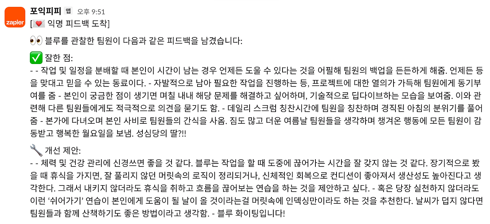

포익피피 피드백

나는 팀원과 얘기할 때 경청하는 태도를 보여주면 좋겠다는 피드백을 받았다. 
기존의 나는 할 말을 잊어버릴까 봐 메모해 두거나, 대화에서 나온 내용을 검색하는 등, 상대를 바라보는 대신 노트북 화면을 바라보는 습관이 있었다. 
피드백을 받고 나니 그동안의 내 모습이 떠올라 부끄러웠지만 이 기회에 확실히 습관을 고치게 됐다. 
이제 노트북을 덮고 상대를 바라보며 대화하고, 맞장구를 치고, 내가 이해한 바가 맞는지 확인하기 위해 상대의 말을 정리해 되묻기도 한다.

익명 피드백은 가까운 팀원들이 바라본 나를 알게 되며, 스스로 깨우쳐서 개선하는 것보다 훨씬 효과가 좋다. 솔직하고 따뜻한 피드백이 주는 힘을 체감할 수 있다.

  

## 3. 한 주를 돌아보는 주간회고

_'회의 시간에 내 의견이 무시당한 것 같아서 기분이 좋지 않았어.'  
'일하는 방식이 너무 비효율적인 것 같아. 어떻게 개선하면 좋을까?'  
'이런 얘기를 꺼내면 날 안 좋게 생각하진 않을까?'_

팀의 생산성을 높이려면 팀워크가 좋아야 한다. 
우리는 일하는 기계가 아니라 감정을 가진 사람이므로, 적절한 감정 해소도 필요하다. 
건강한 팀 문화는 팀 분위기를 열어준다. 열려있는 팀은 어떤 문제가 발생해도 **건강하게 소통하고 문제를 해결**할 수 있다. 
너무 늦기 전에 팀원들과 솔직한 마음을 털어놓고 가까워질 수 있도록, 포게더는 주간 회고를 진행한다.

### 감정 회고

매주 금요일 오후, 이번 주도 잘 달려왔는지 잠시 멈추고 점검하는 시간을 가진다. 간단하게는 회의실에서 진행하고, 
기분전환이 필요할 때는 찻집에서 다도를 하거나 카페에서 디저트를 먹으며 회고를 하기도 한다. 
1~2시간 동안 속에 있는 이야기를 꺼내며 회고하다 보면 이전보다 가까워진 팀원들을 발견할 수 있다.

감정 회고는 이번 주에 들었던 주요 감정과 고민을 솔직하게 털어놓는 자리다. 매주 회고를 진행하기 때문에 각자의 이야기가 병렬적으로 이어진다. 
이전에 어떤 문제로 어려움을 겪고 있었다면, 이번에는 그 문제가 해결된 이야기를 듣기도 한다. 이렇게 점점 성장해 가는 팀원의 모습을 보는 것이 주간 회고의 묘미다.

한 명씩 이번 주에 **중점적으로 든 감정이 무엇인지, 왜 그랬는지** 털어놓는 시간을 가진다. 
말할 내용이 적다면 짧게 끝내도 된다. 매주 돌아가며 누군가는 길게 말하고 싶을 때가 있다. 일반적인 감정 회고 외에 **감정 카드**를 활용하기도 한다. 
무작위로 카드를 뒤집고, 해당 질문에 답변하면 다른 팀원들이 꼬리질문을 해주는 형식이다. 일상, 가치관 등 여러 테마의 감정 카드가 있으니 끌리는 덱을 선택하면 된다.

    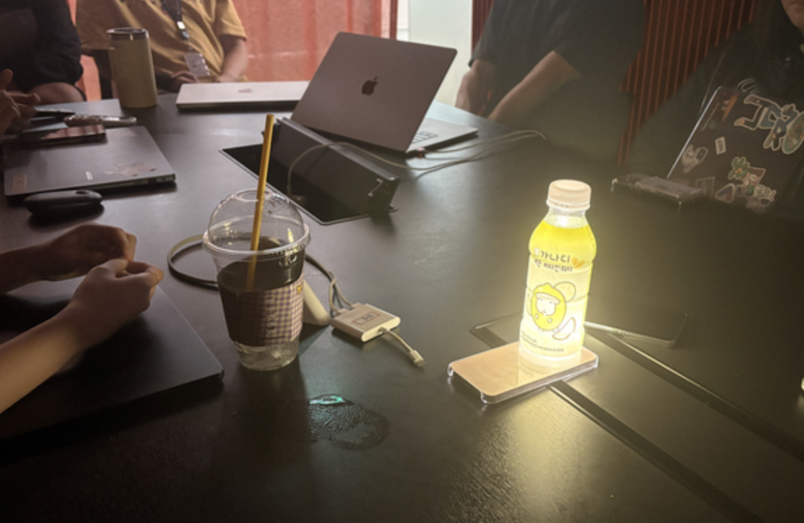
    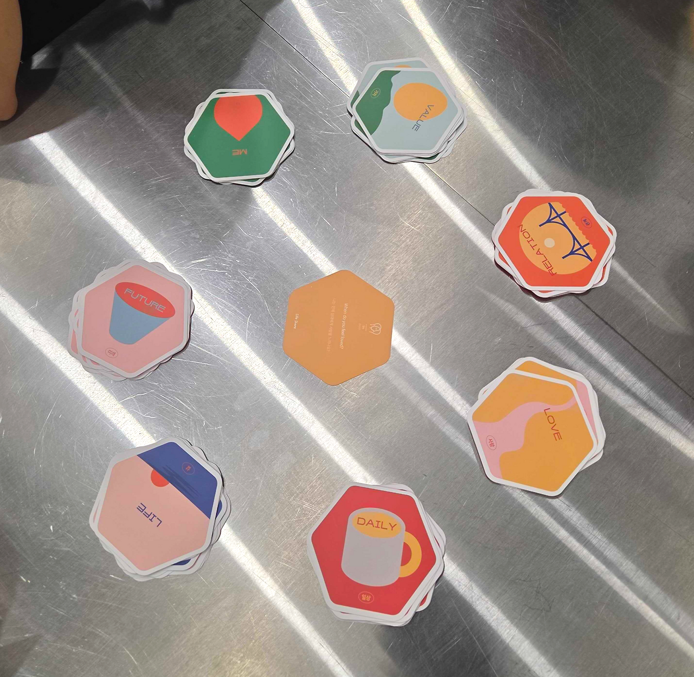

다양한 방식의 회고

팀원을 '한 사람으로서' 알아가는 과정에서 서로의 이해가 깊어지고 존중하는 마음이 피어난다. 
이렇게 자라난 심리적 안전감은 팀원을 하나로 모으고, 팀원이 문제를 겪고 있을 때 나의 일처럼 나서서 돕는 마음을 만든다. 
'다른 사람의 일' 대신 '**우리 팀의 일**'로 인식이 전환된다. 
결과적으로 팀워크는, 여러 사람을 하나의 팀으로 뭉치게 함으로써 개발 효율을 더욱 높인다.

 

### 작업방식 점검

작업 분배, 스프린트 일정, 소통 과정 등 문제가 있었던 부분을 꼬집고 **대안을 모색**하는 시간이다. 
주간 회고를 거듭할수록 감정 회고는 짧아지고 작업방식 점검 시간이 길어지는 양상을 띠었다. 
서로의 마음과 원하는 것을 점점 잘 알게 되면서 더 **효과적이고 효율적으로 일하는 방법**을 찾아가는 모습이다. 
앞서 소개한 CSS 맥락 공유회와 슬랙 '업무보고 채널'도 작업방식 점검 시간에 탄생했다.

작업방식을 점검하면 여러 사람이 공통적으로 겪고 있는 문제가 수면 위로 드러난다. 
팀이 당면한 문제가 무엇인지 밝혀진 후에는 다들 적극적으로 해결 방법을 내놓는다. 
포게더 팀원들은 적극적으로 개선하고 실천하려는 자세를 가지고 있다. 
회고 직후부터 바로 피드백을 반영한 모습으로 달라지는데, 즉각적인 변화 덕분에 이전과의 차이가 확연하게 두드러지고 어떤 효과가 있는지 느껴진다는 장점이 있다.

  

## 4. 프로젝트 점검을 위한 행사

_'우리 잘 달려온 걸까? 어떻게 확인할 수 있을까?'  
'같은 용어인데 팀원들마다 해석이 달라. 정리할 필요가 있겠어.'_

몰입해서 달려온 프로젝트이지만, 프로젝트에서 한 발짝 떨어져 객관적으로 살펴봐야 할 때가 있다. 
무엇보다 사용자 입장에서 서비스가 잘 돌아가는지, 어떻게 느껴질지 점검해야 한다. 
포게더가 프로젝트의 기획 방향을 설정하고, 개발 현황을 점검하기 위해 진행한 팀 내 주요 이벤트를 소개한다. 기존에 있던 방법을 우리 팀만의 방법으로 각색시켰다.

### 이벤트스토밍

이벤트스토밍(EventStorming)은 프로젝트 도메인에서 무슨 일이 일어나고 있는지 빠르게 알아내는 워크숍이다. 
알베르토 브란돌리니가 도메인 주도 설계(DDD) 맥락에서 고안했다. 
프로젝트의 모든 참여자가 모두 참여하며, 도메인 용어를 통일하고 프로젝트의 발전 방향과 현재 기획을 점검하는 방식이다.

이벤트스토밍을 진행할 시점에 우리 팀은 용어 정리가 되어있지 않아 각자 생각하는 것이 달랐다. 
예를 들어 '업로드 완료'를 누군가는 '브라우저에 첨부'하는 것으로 해석하고, 다른 팀원은 '서버에 전송 완료'라고 해석하는 것처럼 **용어가 통일되지 않아 문제**가 있었다. 
한창 회의를 진행하다가 '그런데 어떤 시점을 얘기하는 거야?' 되물어야 했고, 알고 보니 동상이몽이었던 적이 많았다. 
또한 스프린트별 MVP 설정에도 각자 생각이 달라서 팀이 나아가야 할 방향을 정리해야 할 필요가 있었다. 이를 위해 포게더는 이벤트스토밍을 시도했다.

**준비물**로 커다란 종이, 다양한 색상의 포스트잇, 테이프, 펜, 타이머, 당 보충을 위한 간식을 마련했다. 
본격적인 시작에 앞서, 다양한 아이디어를 도출하기 위해 포스트잇에 사용자 시나리오를 작성하고 벽면에 붙이는 작업을 진행했다.

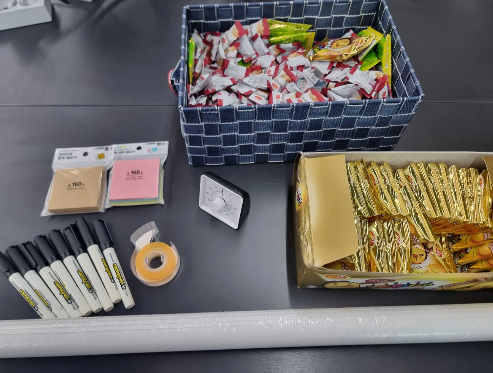

이벤트스토밍 준비물

#### 1단계: 도메인 이벤트 도출

이해관계가 엮일만한(도메인) 분류를 종이로 구분한다. 우리 팀의 경우에는 게스트, 호스트, 기타로 나눴다. 
게스트와 호스트 플로우에서 일어날만한 이벤트를 '**~할 때, ~하면**'의 형태로 적는다. 본격적인 논의를 시작하기에 앞서 제한 없이 마음껏 의견을 펼치는 과정이다.

아직 분류 전이므로 통일된 색상의 포스트잇(갈색)을 사용했다. 처음에는 다들 막막해했는데 한 두 개 써보고 나니 다양한 시나리오를 적어내려 갔다. 
200장의 포스트잇을 준비했는데 30분 만에 소진됐다. '스페이스를 생성했다', '사진이 업로드된 이후에 첨부한 사진을 삭제했다' 등 사용자 입장에서 일어나는 다양한 플로우를 떠올렸다.

#### 2단계: 타임라인 적용

1단계에서 작성한 도메인 이벤트를 시간 순으로 정리하고 중복 이벤트를 제거한다. 
시간은 왼쪽에서 오른쪽으로 흐르고, 위에서 아래로는 평행 시간을 표현한다. 타임라인을 정리할 때는 **페어 프로그래밍**처럼 드라이버와 내비게이터로 역할을 나눈다.

우리 팀은 돌아가며 1명씩 드라이버를 맡고, 나머지 팀원은 해당 이벤트가 어디에 속하는지 토론을 진행했다. 
스피드 퀴즈처럼 한 번에 같은 대답이 나오는 명확한 이벤트도 있는 반면, 짧은 논의로는 결론이 나지 않아 보류한 이벤트도 있었다. 
보류하는 경우에는 빨간색 포스트잇으로 논의점을 적어뒀다. 모든 이벤트를 분류하는 동안 30분 진행, 10분 휴식을 2차례 반복했다.

2단계: 타임라인 적용

포스트잇의 색상은 **문제 해결**이 필요한 경우 빨간색, **용어 정의**가 필요한 경우 파란색, 다른 무언가가 필요하다면 초록색으로 구분했다.

포게더 서비스에는 게스트가 사진을 공유하면, 호스트에게 'n명이 n장을 공유했어요'라는 메시지가 뜬다. 
이 메시지를 어느 시점에 보여줄 것인가에 대해 명확한 기획이 없었다. 시점(When)에 대한 안건을 빨간색 포스트잇으로 표시했다.

팀원들 각자가 생각하는 '첨부'와 '업로드' 단어의 정의가 달라서 이를 조율하는 과정에는 파란색 포스트잇을 사용했다. 
포게더 서비스에서 업로드하는 사용자가 사진을 선택하면 '첨부', 서버에 완전히 올라가면 '업로드'라고 우리 팀의 용어 사전을 만들었다.

이벤트스토밍

#### 3단계: 플로우 차트 재정의

이벤트스토밍이 끝난 후에는 타임라인을 기반으로 플로우 차트를 다시 정리했다. 
이벤트스토밍을 진행하기 전에 정한 MVP가 정말 우선순위에 맞는지 고민해 보며, 레벨3 런칭 페스티벌 이후의 확장 방향성에 대해 고민했다.

새로 정한 MVP를 바탕으로 다 같이 와이어 프레임(페이지에 들어갈 콘텐츠)을 정의했다. 
구체적인 UI를 구상하기보다는 사용자 플로우에서 '이 부분에서는 어떤 내용을 입력받고 출력해야 한다'를 위주로 진행했다.

우리 팀의 **이벤트스토밍 결과**를 표로 정리했다.

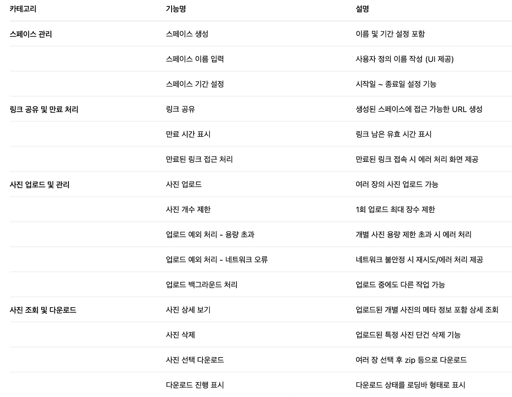

이벤트스토밍 결과

팀원들이 적극적으로 의견도 많이 내준 덕에, 계획했던 시간보다 길어져서 장장 5시간에 걸쳐 이벤트스토밍이 진행됐다. 
머리 쓰고 움직일 일도 많아 재밌었다. 한 팀원이 포게더에 도입해보고 싶다고 제안한 워크숍이었는데, 
덕분에 우리 프로젝트의 기획이 한층 탄탄해졌고 모두의 머릿속 **도메인 개념을 일치**시키는 계기가 되었다.

 

### QA

QA는 품질 보증(Quality Assurance)의 약자로, 서비스가 요구사항을 충족하는지 확인하고 출시 전 품질을 보장하는 체계적인 활동이다. 
우리 팀은 스프린트 사이클의 마지막에 QA를 진행했다. MVP 기능이 문제없이 개발됐고 잘 동작하는지, 사용성에 문제는 없는지 점검하는 시간이다.

모든 팀원이 모여, 1시간 동안 서비스의 다양한 기능을 사용해 보며 흐름이 어색한 부분이나 버그를 찾는다. 
**QA 문서**에는 개선이 필요한 이슈의 설명과 사진을 첨부해 모두가 이해할 수 있도록 기록한다. 
특정 기기나 특정 상황에서만 발생하는 이슈도 있기 때문에 해당 상황을 재연하기 위해서는 꼼꼼한 설명이 필요하다.

각 문서에는 개발 분야(FE/BE), 브라우저 환경, 플랫폼을 **태그**로 등록해 필터링하기 쉽도록 했다.

    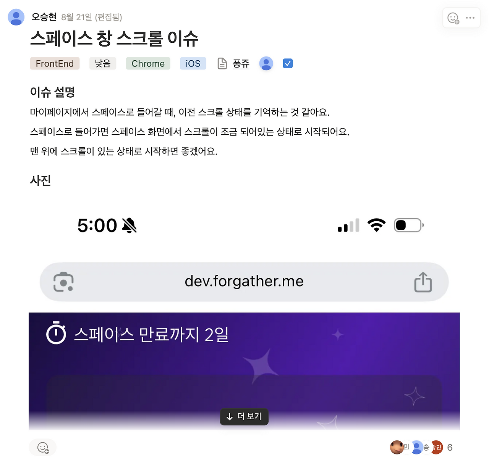
    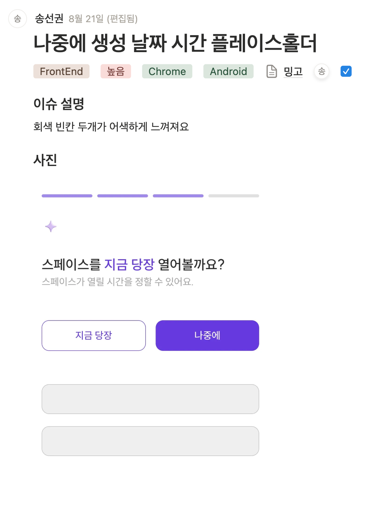

QA 문서

QA가 끝나면 이슈를 해결하는 과정이 필연적으로 따른다. QA 문서를 정리하며 **우선순위와 담당자 태그**를 붙인다. 
기존에 각자가 구현한 기능과 맥락이 이어지도록 이슈를 반영할 담당자를 정하고, 각 이슈의 우선순위에 따라 빠르게 해결한다.

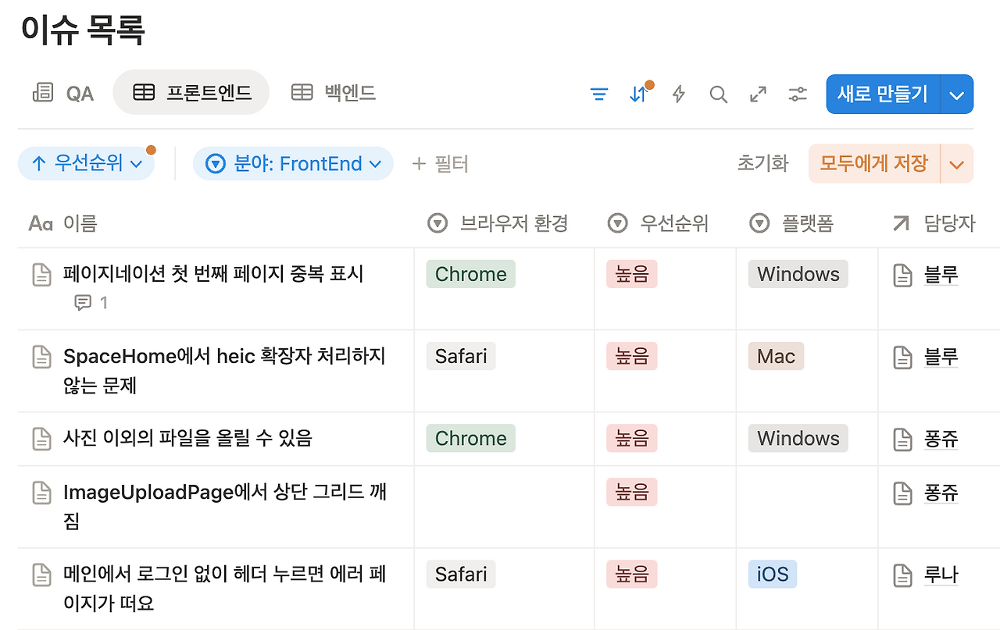

QA 이슈

개발하며 계속 화면을 보느라 익숙해진 프론트를 대신해 백엔드 크루들이 적극적으로 QA를 해줬다. 
포게더 서비스는 모바일 최적화 서비스인데 다행히 우리 팀에는 이를 테스트하기 위한 안드로이드, iOS 기기 사용자가 골고루 있었다. 
다양한 기기로 여러 환경에서 시도하니 생각지 못했던 이슈를 많이 발견했다.

다 같이 QA에 참여하며 프로젝트의 완성도를 높였다. 
대신 데모 하루 이틀 전보다는 좀 더 넉넉하게 기간을 두고 이슈 해결하는데 시간을 썼으면 좋았겠다는 아쉬움이 남았다. 
개발에 쫓기다 보니 QA 일정이 점점 밀렸고, 결국 데모 전날 오후가 다 되어서야 할 수 있었다. 
개발이 완벽하게 끝나지 않았더라도 QA는 일정대로 진행하는 것이 낫겠다는 교훈을 얻었다.

  

## 마치며

지금까지 포게더가 일하는 방법을 살펴봤다. 
우리 팀만의 색을 녹여낸 방법이었으므로, 참고하고자 하는 사람은 각자의 팀에 맞게 각색해서 적용하면 될 것이다.

글의 내용을 요약하면 다음과 같다.

> 📌 **[맥락 공유 소통법]** **CSS**로 각자의 개발 과정과 트러블 슈팅을 공유한다. 팀원 모두가 주인의식을 가지고 **업무보고**를 하며 비동기 소통에 익숙해진다.
> 
> 📌 **[소프트 스킬 문화]** 아침은 컨디션 체크와 업무 공유, 칭찬 시간이 있는 **데일리 스크럼**으로 시작한다. 팀원의 발전을 위한 따뜻한 피드백을 **익명 피드백**으로 전달한다.
> 
> 📌 **[주간 회고]** 그동안 참고 쌓아둔 감정이 없는지 **감정 회고**에서 솔직하게 공유한다. **작업 방식 점검**으로 불편했던 협업 사이클을 찾고 대안을 제시한다.
> 
> 📌 **[프로젝트 점검 행사]** **이벤트스토밍**으로 프로젝트의 방향을 정하고 모호한 용어를 일치시킨다. **QA**로 프로젝트가 올바르게 개발됐는지 확인한다.

포게더 팀원들은 각자의 색깔이 강한 사람들이다. 
이들이 모여 어떻게 하나의 팀으로 융화됐는지, 경쟁자가 아닌 동료로서 함께 자라기 위해 어떤 노력을 했는지 4개월 간의 과정을 한 편의 글로 담았다.

프로젝트를 진행하며 가장 중요한 것은 '개발 실력'보다도 '**솔직한 소통**'이었다. 
나의 목표는 무엇인지, 내가 어떤 감정을 가졌는지, 뭘 하고 싶은지 공유할수록 모두가 성장할 기회가 생겼다. 
팀원의 마음도 모르는데 사용자의 마음을 어떻게 알 수 있을까?

우리 팀원들은 세심하고 눈치가 빠르다. 다른 사람의 기분이 어떤지 금방 알아채고, 팀원을 다정하게 챙긴다. 장난스럽게 분위기를 풀어나가는 것에도 능숙하다. 
개발 실력과 상관없이 이런 태도는 일할 때도 큰 도움이 된다. 여기서 중요한 것은 얼마나 마음을 열고 팀원을 받아들이냐에 있다. 
같은 경험을 했으므로, 우리 팀원들은 이제 어딜 가도 함께 일하기 좋은 동료라고 생각한다.

이 모든 것의 바탕에는 배려와 이해, 내가 조금 고생하더라도 팀원을 돕고자 하는 마음, 상대방을 존중하는 태도가 있었다.

그것이 **모두가 빛나는 팀**을 만들고, 결국 **더 나은 서비스**를 만든다.

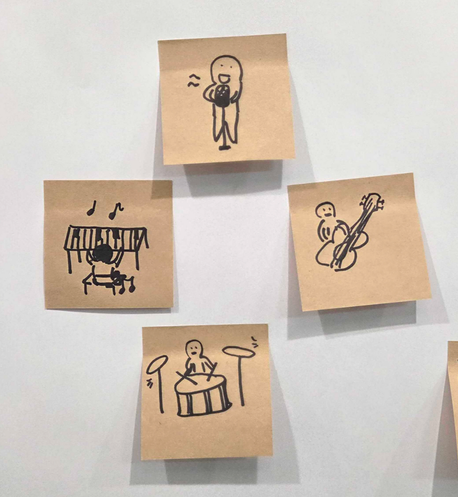

포게더

 
