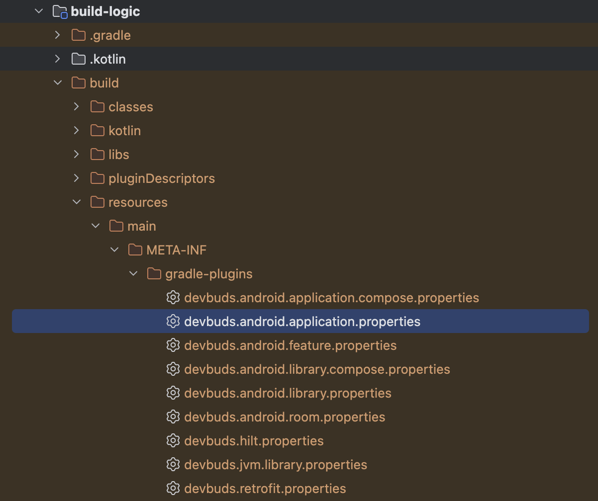

# 🧱 Android Build-Logic - 멀티모듈 프로젝트에서 공통 빌드 설정 관리하기

프로젝트의 기능이 확장되면서 모듈 구조의 복잡도가 급격히 높아졌다.  
초기에는 단일 모듈(:app)로 시작했지만 기능별 책임을 분리하기 위해 멀티모듈 구조로 리팩터링을 진행했다.  
그러나 시간이 지날수록 공통 빌드 설정이 여러 모듈에 중복되면서 관리 포인트가 늘어나는 문제가 발생했다.

```
Stacko/
 ├── app/                        # Entry point (Application)
 ├── feature/
 │   ├── home/                   # 홈 화면
 │   ├── search/                 # 검색 기능
 │   ├── detail/                 # 상세 화면
 │   └── settings/               # 설정 화면
 ├── core/
 │   ├── designsystem/           # Compose 기반 디자인 시스템
 │   ├── data/                   # Repository 및 DataSource 계층
 │   ├── domain/                 # UseCase 계층
 │   ├── network/                # Retrofit 기반 네트워크 모듈
 │   ├── database/               # Room 기반 로컬 DB
 │   └── testing/                # 테스트 유틸리티 및 Fixture
 ├── build-logic/                # 공통 빌드 로직 관리 (BuildLogic)
 ├── build.gradle.kts
 ├── settings.gradle.kts
 └── gradle/
     └── libs.versions.toml      # 버전 카탈로그
```

<br>

각 모듈은 역할에 따라 잘 분리되어 있었지만, `build.gradle.kts`의 코드 중복이 심했다.
모든 모듈이 동일한 설정(android, plugins, dependencies 등)을 반복 선언하고 있었고, 새로운 모듈을 추가할 때마다 기존 설정을 복사해 붙여넣는 비효율적인 과정이 반복됐다.

### build.gradle.kts (:feature:home)
```kotlin
plugins {
    alias(libs.plugins.android.library)
    alias(libs.plugins.jetbrains.kotlin.android)
    ...
}

android {
    namespace = "com.devbuds.feature.home"
    compileSdk = libs.versions.projectCompileSdkVersion.get().toInt()

    defaultConfig {
        minSdk = libs.versions.projectMinSdkVersion.get().toInt()
        ...
    }
    ...
}

dependencies {
    ...
}
```

### build.gradle.kts (:feature:detail)
```kotlin
plugins {
    alias(libs.plugins.android.library)
    alias(libs.plugins.jetbrains.kotlin.android)
    ...
}

android {
    namespace = "com.devbuds.feature.detail"
    compileSdk = libs.versions.projectCompileSdkVersion.get().toInt()

    defaultConfig {
        minSdk = libs.versions.projectMinSdkVersion.get().toInt()
        ...
    }
    ...
}

dependencies {
    ...
}
```

이 글에서는 이런 **반복되는 Gradle 설정, 버전 불일치, 새로운 모듈 추가의 부담**을 해결하기 위해 도입한 Build-Logic 모듈의 설계와 적용 과정을 다룬다.

<br>

## 문제 원인 분석

프로젝트가 모듈화되면서 코드 레벨에서는 책임이 명확해지고 유지보수가 쉬워졌다.  
하지만 빌드 설정 수준에서는 각 모듈이 `build.gradle.kts`가 독립적으로 존재하게 되면서 오히려 복잡도가 증가했다.

예를 들어 대부분의 모듈이 다음과 같은 공통 항목을 반복 선언하고 있었다.
- Android SDK 버전 (compileSdk, minSdk, targetSdk)
- Compose 관련 설정
- 코드 스타일 및 정적 분석 도구 설정
- 테스트 관련 의존성
- ...
  
<br>

이런 중복은 단순히 보기 불편한 수준을 넘어 실제 문제를 유발했다.
- 동일한 의존성을 여러 곳에서 관리하면서 버전 불일치와 충돌 위험 증가
- 새로운 모듈을 추가할 때마다 기존 설정을 복사, 붙여넣는 비효율적인 작업 반복
- ...

<br>

결국 문제의 본질은 **모듈 구조는 정리됐지만 빌드 로직은 여전히 분산**되어 있다는 점이다.

<br>

## 해결 과정

### 1️⃣ Build-Logic 모듈 생성
먼저, 프로젝트 루트에 **build-logic 모듈**을 생성했다.

이 모듈은 다른 모듈과 달리 앱 코드가 아닌 **Gradle 설정을 관리하는 전용 모듈**이다.  
여기서는 **Custom Plugin(또는 Convention Plugin)을 정의**해 공통 빌드 설정을 한 곳에서 관리한다.

**settings.gradle.kts(프로젝트 루트)**
```kotlin
enableFeaturePreview("TYPESAFE_PROJECT_ACCESSORS")

pluginManagement {
    includeBuild("build-logic")
    ...
}
```
Gradle이 일반 Kotlin 모듈과 Build Logic 모듈을 구분할 수 있도록 `includeBuild("build-logic")`을 작성해야 한다. 

<br>

### 2️⃣ Build-Logic 모듈 설정

**build.gradle.kts(Included build: :build-logic)**
```kotlin
plugins {
    `kotlin-dsl`
}

group = "com.devbuds.buildlogic"

dependencies {
    compileOnly(libs.android.gradlePlugin)
    compileOnly(libs.android.tools.common)
    compileOnly(libs.kotlin.gradlePlugin)
    ...
}
```
Convention Plugin으로 정의할 관련 의존성을 추가한다.  
build-logic에서 생성되는 플러그인은 컴파일 중에만 사용되기 때문에 `implementation` 대신 `compileOnly`를 사용한다.

<br>

### ️3️⃣ Version Catalog 참조
build-logic 내부에서도 `libs.version.toml`을 그대로 참조하도록 설정했다.  
이를 통해 모든 모듈이 동일한 버전 카탈로그(libs)를 사용할 수 있다.

**settings.gradle(:build-logic)**
```kotlin
versionCatalogs {
    create("libs") {
        from(files("../gradle/libs.versions.toml"))
    }
}
```

**Extensions.kt**
```kotlin
internal val Project.libs: VersionCatalog
    get() = extensions.getByType<VersionCatalogsExtension>().named("libs")
```

<br>

### 4️⃣ Convention Plugin 구조 설계

> 새로운 모듈을 추가할 때, build.gradle.kts 파일에 플러그인 한 줄만 추가하면 끝나도록 하자.

각 모듈이 어떤 성격을 가지는지에 따라 공통 설정을 자동으로 해주는 **Convention Plugin**을 설계했다.  
예를 들어, Application, Feature, Core, Testing 등으로 나누면 다음과 같은 형태가 된다.

```
build-logic/
 ├── build.gradle.kts
 ├── settings.gradle.kts
 └── src/main/kotlin/
     ├── AndroidApplicationConventionPlugin.kt // Entry point (Application ID, Signing, Compose 등)
     ├── AndroidFeatureConventionPlugin.kt // 공통 Android UI 설정 (Compose, ViewModel, Navigation 등)
     ├── AndroidTestConventionPlugin.kt // 테스트 환경 설정 (JUnit, Kotest, Mockk 등)
     └── Extensions.kt
```
각 플러그인은 Gradle의 Plugin<Project> Interface를 구현하며,  
플러그인 적용 시 자동으로 필요한 설정(android, plugins, dependencies)을 주입한다.

<br>

### 5️⃣ Convention Plugin 플러그인 구현 (Application)

```Kotlin
internal fun Project.configureKotlin() {
    extensions.configure<JavaPluginExtension> {
        sourceCompatibility = ApplicationConfig.JavaVersion
        targetCompatibility = ApplicationConfig.JavaVersion
    }

    extensions.configure<KotlinProjectExtension> {
        jvmToolchain(ApplicationConfig.JavaVersionAsInt)
    }
}
```

```kotlin
internal fun Project.configureAndroid(commonExtension: CommonExtension<*, *, *, *, *, *>) {
    commonExtension.apply {
        compileSdk = libs.findVersion("projectCompileSdkVersion").get().toString().toInt()

        defaultConfig.minSdk = libs.findVersion("projectMinSdkVersion").get().toString().toInt()

        configureKotlin()
    }
}
```

```kotlin
class AndroidApplicationConventionPlugin : Plugin<Project> {
    override fun apply(target: Project) {
        target.run {
            pluginManager.run {
                apply(plugin = "com.android.application")
                apply(plugin = "org.jetbrains.kotlin.android")
            }

            extensions.configure<ApplicationExtension> {
                defaultConfig {
                    applicationId = libs.findVersion("projectApplicationId").get().toString()
                    targetSdk =libs.findVersion("projectTargetSdkVersion").get().toString().toInt()
                    versionCode = libs.findVersion("projectVersionCode").get().toString().toInt()
                    versionName = libs.findVersion("projectVersionName").get().toString()
                }

                configureAndroid(this)

                // BuildTypes, BuildFeatures ...
            }
        }
    }
}
```

<br>

### 6️⃣ Convention Plugin 플러그인 적용 (Application)

정의한 Convention Plugin을 다른 모듈에서 사용하기 위해서는 build-logic 내부의 `resources/main/META-INF/gradle-plugins/` 경로에 각 플러그인 ID와 연결될 properties 파일이 존재해야 한다.



해당 파일은 아래 설정으로 생성할 수 있다.

**build.gradle.kts (:build-logic)**
```kotlin
gradlePlugin {
    plugins {
        register("android-application") {
            id = libs.plugins.devbuds.android.application.asProvider().get().pluginId
            implementationClass = "com.devbuds.buildlogic.plugin.AndroidApplicationConventionPlugin"
        }

        ...
    }
}
```

**build.gradle.kts (:app)**
```kotlin
plugins {
    id("com.devbuds.android.application")
}
```

<br>

## 마무리

Build-Logic 모듈과 Convention Plugin을 함께 도입하면서 멀티 모듈 환경의 복잡한 Gradle 설정을 단 한 줄로 단순화할 수 있었다.

<table>
<tr>
<td style="vertical-align:top;">

**Convention Plugin 적용 X**
```kotlin
// build.gradle.kts (:app) 
plugins {
    alias(libs.plugins.android.application)
    alias(libs.plugins.kotlin.android)
}

android {
    namespace = "com.devbuds.stacko"
    compileSdk = 36

    defaultConfig {
        applicationId = "com.devbuds.stacko"
        minSdk = 29
        targetSdk = 36
        versionCode = 1
        versionName = "1.0"
    }

    ...
}

dependencies {
    ...
}
```

</td>
<td>

**Convention Plugin 적용 O**
```kotlin
// build.gradle.kts (:app) 
plugins {
    id("com.devbuds.android.application")
}


```

</td>
</table>

이제 공통 설정은 중앙에서 일관되게 관리되고 각 모듈은 오직 자신의 역할에만 집중하면 된다.   
중복된 빌드 스크립트를 제거함으로써 유지보수성이 높아지고 새로운 요구사항에 대응하기 위한 확장성도 확보되었다.

무엇보다 큰 변화는 **새로운 모듈을 만드는 과정**이 훨씬 단순해졌다는 점이다.  
복잡한 설정 대신 명확한 규칙만 따르면 누구나 일관된 환경에서 개발을 시작할 수 있다.  
이는 단순한 설정 정리가 아니라 **프로젝트 구조 전반의 개발 경험을 개선**한 변화다.  
