## **Suspense와 비캐시 Promise가 유발하는 무한 Retry 루프 심층 분석으로 미래지향 리액트 학습하기**

본 문서는 React Client Component 환경에서 Suspense와 use() 훅을 사용하여 비동기 데이터를 처리할 때, react-router의 라우트 이동(navigate)과 관련된 **비캐시(uncached) Promise**가 무한 retry 현상을 유발했던 상황을 심층 분석하여, 그 근본적인 원인이었던 React 동시성 모드(Concurrent Mode)의 startTransition 메커니즘과 **렌더링 멱등성** 원칙에 대해 고찰한다.

탐구한 내용이 꽤 많고 깊어지는 부분이 있어, 성향에 따라 재미없고 궁금하지도 않은 그저 난해한 글처럼 느낄 독자가 꽤 있을 것 같다. 그래서 추천 대상과 여기서 다루는 학습 키워드들에 대해 간략하게 소개하고 글을 시작하고자 한다.

**추천 독자**

- React 18 이후의 동시성 렌더링(Concurrent Rendering) 메커니즘을 깊이 이해하고 싶은 개발자
- Suspense와 use() 훅을 클라이언트 컴포넌트에서 활용하려다 예기치 못한 리렌더링 문제를 경험한 개발자
- React 내부 재조정(Reconciliation) 원리와 Suspense의 Retry 메커니즘을 근본적으로 알고 싶은 개발자
- Promise 가 클라이언트 컴포넌트 내에서 생성되면 안 되는 이유를 알고 싶은 개발자
- 추가된 동시성 렌더링 매커니즘에 따라 React 라이브러리들의 점진적인 변화로 인해 겪을 수 있는 문제를 방지하고싶은 개발자

**주요 학습 키워드**

- React 18 Concurrent Mode (startTransition, TransitionLanes, RetryLanes, 긴급/비긴급 업데이트)
- Suspense 메커니즘 (Promise throw, Ping 신호, resolveRetryWakeable)
- 렌더링 멱등성과 Promise 캐싱 전략
- react-router navigate()의 비긴급 업데이트
- 비캐시 Promise로 인한 무한 retry 루프 흐름 분석

---

### **1. 문제 발생 배경과 트러블슈팅 시작**

### 1.1. **구체적인 문제 상황 소개**

클라이언트 컴포넌트내에서 React 18의 Suspense와 데이터를 읽는 use() 훅을 사용하던 중 특이한 문제 상황이 발생했다. 자기 자신으로의 라우트 이동 시에 Suspense 가 무한 retry 를 하며 **API 요청을 무한으로 보내는 심각한 버그**였다.

문제 코드는 use 훅을 사용하는 자식 컴포넌트에 부모 컴포넌트가 API 요청을 담당하는 함수(api.get())의 반환값인 **새로운 Promise 객체**를 prop으로 넘겨주는 구조였다. 이러한 컴포넌트에 ‘현재 페이지로 라우트 이동’을 하는 기능이 있던 Header 가 있었다.

해당 프로젝트 코드 구조를 단순하게 묘사해보면 다음과 같다.

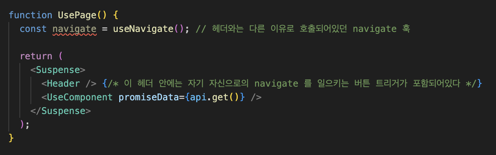
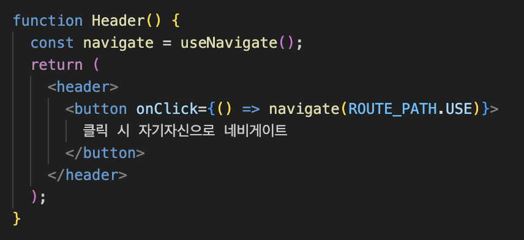
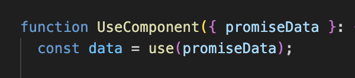

해당 코드는 문제가 많은 코드긴 하다. 문제점들에 대해서는 후술하며 문제가 되는 이유를 하나하나 뜯어볼 것이니, 먼저 단순히 이 코드에서 navigate 버튼을 클릭했을 때 어떤 문제가 일어나는지 확인해보자.

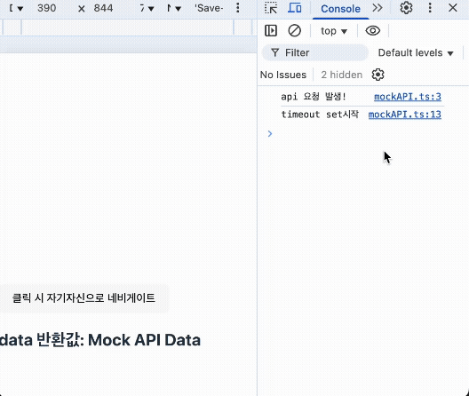

자기 자신으로의 이동을 했을 뿐인데 API 무한 요청 버그가 일어났다. 일단 해당 버그를 해결하는 방법은 크게 세 가지가 있었다.

**[해결 방법]**
1. props 로 넘기고 있는 Promise 객체를 **메모이제이션** 해주거나
2. **Suspense** 에 매 렌더링마다 값이 달라지는 **key** 를 할당해주거나
3. UsePage 컴포넌트에 의미없이 호출되어있는 **navigate 훅을 지우는 것**

위 세 가지 방법 중 하나만 수행해도 현상은 해결됐다. 1,2 번 방법은 그렇다치는데, 3번 방법은 꽤 의아하지 않은가?

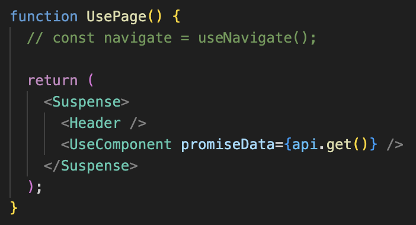

Header 컴포넌트 안의 navigate 훅과 버튼은 여전히 존재하고, promise 를 캐싱해주지도 않았는데 **무의미하게 호출되어있던 navigate 훅을 지우는 것으로도 문제가 해결된다.**

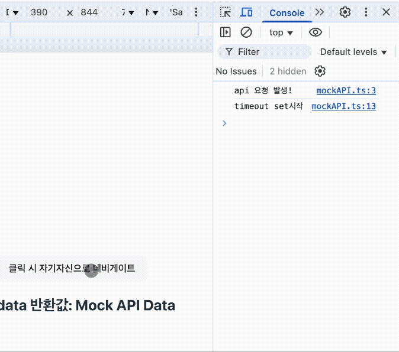

컴포넌트의 리렌더링은 일어났는데 Suspense 의 fallback UI 가 다시 렌더링되지도 않고, 무한 API 요청이 발생하지 않는 점도 신기하다.

문제를 발견했던 당시에는 프로젝트의 스프린트 마감이 다가오고 있었으므로 cached promise로 문제를 해결하고 넘어갔었지만, 3번의 해결법이 꽤 호기심을 자극했던지라 이런 현상이 ‘왜’ 발생하는지 정확한 이유와 흐름을 찾고 싶었던 나는 해당 스프린트 종료 후 탐구를 시작하게 되었다. 

해결법도 다 알았으니 원인을 찾는 일은 간단하게 마무리될 줄 알았던 나는 이 문제를 생각보다 꽤 오래 붙잡고 있어야했고, 그 과정에서 정말 많은 학습을 할 수 있었다.

따라서, 이 간단해보이는 트러블 슈팅이 점점 깊어졌던 과정을 함께하면 리액트의 흐름과 동작을 이해하고 리액트가 추구하는 앞으로의 점진적 변화까지 탐구하는 것에 도움이 될 것이라고 생각한다.

### **1.2. 발견과 가설 수립**

먼저 문제 상황을 명확히 정리해보았다.

### 1.2.1. 문제 발생 시점과 증상
  
**[시점]**

- navigate 함수를 통해 **현재 페이지로 다시 이동했을 때**,
  

**[문제]**

- **API 가 무한 요청된다**.

**[추가 특이점]**

- 리렌더링임에도 **Suspense 의 fallback UI 가 표시되지 않는다**.
    - 일반적인 **state 업데이트로 인한 리렌더링에서는 fallback UI 가 정상적으로 표시된다**.
- 개발자 도구 **profiler 탭에서 리렌더링 커밋이 잡히지 않는다**.

**[문제가 해결되는 상황]**
- props 로 넘기고 있는 Promise 객체를 **메모이제이션** 해준다
- **Suspense** 에 매 렌더링마다 값이 달라지는 **key** 를 할당해준다
- UsePage 컴포넌트에 의미없이 호출되어있는 **navigate 훅을 지운다**

navigate 함수를 통해 현재 페이지로 다시 이동했을 때, API 호출 함수인 api.get()이 **무한으로 반복 실행**되는 현상이 정확한 문제 상황이었다. 또 눈여겨볼만한 증상은 일반적인 리렌더링과는 다르게 Suspense의 **fallback UI가 전혀 표시되지도, 컴포넌트 리렌더링 커밋이 잡히지도 않고** 조용히 API 요청만 무한 반복되었다는 점이다. (이 때 네트워크 탭을 열지 않고 무한 요청이 가고있는지도 모른 채 계속 작업했더라면…아찔하다.)

### 1.2.2. 가설 수립

**가설 1. state 변화로 인한 업데이트는 리렌더링이고 자기 자신으로 이동하는  navigate의 라우터 업데이트는 '재마운트'일 것이다**

초기에는 state 변화로 인한 리렌더링과 navigate로 인한 리렌더링의 차이가 '재마운트(remount)' 여부에 있을 것이라고 가설을 세웠다.

하지만, useEffect 실험 결과 이는 **사실이 아니었다**. 자기 자신으로 navigate를 하더라도 컴포넌트가 완전히 언마운트 후 재마운트 되는 것이 아니라 **그냥 리렌더링**되는 것으로 확인됐다.

> 💡 **검증된 point.**
현재 페이지로의 라우터 이동에 따른 UI 업데이트는 '리렌더링' 으로 처리된다.

그런데, 같은 리렌더링이라면 남는 의문점이 있다.

useState 의 state 업데이트로 인한 리렌더링은 Suspense의 fallback UI 도 표시되고, 컴포넌트의 리렌더링 커밋이 추적되었는데, 왜 navigate의 자기자신으로 라우트 이동은 fallback UI 도 표시되지 않고 컴포넌트 리렌더링 커밋도 추적되지 않는 것일까?

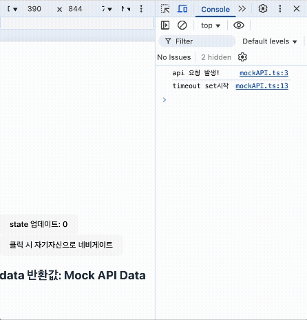

**가설 2. state 업데이트로 인한 리렌더링과 라우터 이동이 일으키는 리렌더링은 다른 방식의 리렌더링이다**

위 이미지에서 확인할 수 있다시피 state 변화는 문제가 없는데 navigate로 인한 리렌더링만 문제이므로, 라우터 관련 동작에 특이점이 있을 것이라고 추론했다.

그렇다면 정확히 state 리렌더링과 router 리렌더링 시 다른 현상을 보이고 있는 주체는 누구일까? 바로 **Suspense** 이다. 

같은 리렌더링임에도 두 동작 간에 Fallback UI 의 표시 유무에 차이가 있었다.

**가설 3. 무한 렌더링을 시도하는 실질적인 주체는 Suspense이며, Promise가 resolve될 때마다 retry를 하는 메커니즘이 비정상적으로 반복되고 있다**

클라이언트 컴포넌트에서 Suspense와 use를 사용하여 정상적으로 렌더링을 하는 흐름을 간략하게 표현해보면 다음과 같다.

---

1. 부모 컴포넌트는 Suspense 에 감싸져 있고, Suspense 는 자식을 렌더링하지 않고 fallback UI 를 렌더링하고 있는다.

2. 그동안 Suspense 의 자식인 부모 컴포넌트가 백그라운드에서 렌더링을 시도하며 Props 로 자식에게 promise 를 넘긴다.

3. promise props를 받은 자식은 use(promise) 로 pending 상태의 promise 를 throw 한다.

4. 부모 컴포넌트를 감싸고 있는 Suspense 가 던져진(throw) Promise 를 잡아 resolve 가 되면 fallback UI 를 치우고 다시 컴포넌트 렌더링을 시도한다(retry)

---

위의 정상적인 흐름과 현재의 문제 상황의 차이는 Fallback UI 를 표시하지 않는 것과 Promise 생성과 해결이 무한으로 반복되고 있다는 것이다.

use() 훅은 Promise 를 받았을 때 resolve 된 상태가 아니라면 위로 throw 하는 역할 밖에 하지 않는다.

따라서 트리거가 router 이동일지언정, 실제로 문제를 일으키는 범인은 retry 함수를 가진 Suspense 로 좁혀볼 수 있을 것이다.

> 💡 **검증된 point.**
- Suspense 컴포넌트에 **key Prop**을 추가해주거나, api.get() 호출을 useMemo로 감싸 캐싱하면 문제가 해결된다.
- Suspense에 key를 추가하는 행위는 fallback UI가 표시되지 않는 문제를 해결하기 위한 리액트 공식 권장 사항이었다.

하지만 아직 내 의문이 제대로 해소된 점은 아무 것도 없었다.

_- ‘state 업데이트로 인한 리렌더링과 자기자신으로의 라우터 이동에 의한 리렌더링은 무엇이 다르지?’_
_- ‘Promise는 왜 메모이제이션해야하지?’_
_- ‘Suspense의 retry의 트리거가 무엇이길래?’ …_

오히려 의문만 꼬리에 꼬리를 물고 이어졌다. 그래도 첫 번째 의문인 두 리렌더링의 차이를 정확히 알게된다면, 나머지 의문들도 해소될 수 있을 것 같았다. 

결국 가설 2번과 3번을 실험하고 검증하기 위해 react-router 라이브러리의 내부 구현 코드를 살펴보았다.

### 1.2.3. 가설 탐구

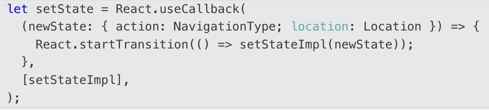

이 과정에서 알게된 건, 라우터는 자기자신으로의 이동이든 다른 라우터로의 이동이든 동일하게 해당 매커니즘을 사용하고 있었다. 그런데 여기서 처음보는 훅이 있었다. 바로 state의 setter를 감싼 **React.startTransition**이다. 아마 이게 일반적인 state의 업데이트와 차이점을 만들어내는 단서인 것 같았다.

해당 **startTransition** 훅은 React 18 버전에 등장하여, 기존의 동기적이고 멈출 수 없었던 리액트의 렌더 과정을 중단 가능하게 만들고 긴급하지 않은 업데이트를 낮은 우선순위로 스케쥴링할 수 있도록 하는 “동시성 렌더링” 구현 방식의 핵심 API 이다.

이러한 동시성 렌더링의 도입으로 리액트는 이제 중요한 사용자 입력 반응을 유지하면서, 데이터 로딩이나 페이지 전환과 같은 긴 작업을 백그라운드에서 처리할 수 있게 되었다.

그리고 일반적인 state의 업데이트의 경우 긴급 업데이트로 분류되고 startTransition 의 경우 비긴급 업데이트로 분류된다는 사실을 알았다.

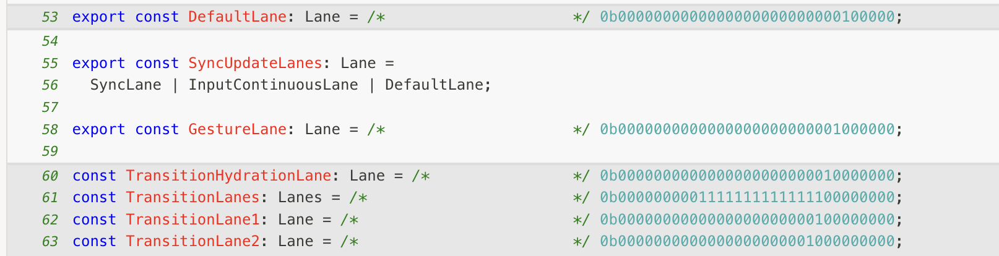

▲우선순위가 높은 DefaultLane 을 사용하는 state 업데이트 setter와 더 낮은 TransitionLane 을 사용하는 startTransition

그렇다면, 첫 번째 의문인 일반적인 state 업데이트와 startTransition 으로 감싼 state의 업데이트에는 “우선순위”에 있어 차이가 있다는 것을 알 수 있다.

따라서 react-router가 라우트 변경을 처리할 때 **React.startTransition API**를 사용하여 비긴급 업데이트를 수행하는 것과, 컴포넌트 렌더링 주기 내에서 **캐싱되지 않은 Promise**를 생성하는 것이 충돌의 핵심 원인일 것으로 의심되었다.

하지만 아직 의심이고 추론일 뿐이지, Suspense의 retry 와 정확히 어떤 충돌을 일으켜 이런 버그를 발생시키는지는 아직 설명할 수 없다. 여기까지 알고싶다면 이제 Suspense의 동작 원리까지 탐구해봐야할 단계였다.

---

### **2. React Suspense의 동작 원리 정리**

### **Suspense의 기본 동작 방식(비동기 처리, fallback UI, Promise 추적)**

Suspense는 비동기 작업이 완료될 때까지 불필요한 상태 없이 **fallback UI**를 보여줌으로써 사용자 경험을 개선하는 React의 메커니즘이다.

살펴본 Suspense의 비동기 처리 흐름은 다음과 같았다.

1. **최초 렌더링 시작:** Suspense는 바로 fallback UI를 대신 보여준다.
2. **자식 컴포넌트 렌더링 시도:** 내부 컴포넌트 렌더링을 시도한다. 내부 컴포넌트가 모두 렌더링 완료될 때까지 리액트의 렌더 트리에는 fallback UI 가 대신 들어가있기 때문에 이 작업은 백그라운드에서 실행되고 있다고 생각해도 좋다.
3. **Promise Throw:** 자식 컴포넌트 내에서 use() 훅이 Promise를 인자로 받아 아직 resolve되지 않은 상태라면, React의 렌더링 스택을 끊기 위해 **Promise를 던진다 (throw)**. 약간 흥미로운 사실은 자바스크립트는 Error 뿐만 아니라 무엇이든 던질 수 있고(throw), 무엇이든 잡을 수 있다(catch)는 것이다.
4. **Promise 추적:** Suspense Boundary는 던져진 Promise를 잡고 상태를 추적 관찰한다. React 내부 플래그(DidCapture 등)를 통해 현재 상태(대기 중인지 여부)를 관리한다.
5. **Retry 신호(Ping):** Promise가 resolve되면, React는 내부적으로 **Ping 신호**를 보내 해당 컴포넌트를 다시 렌더링하라는 명령을 예약한다. 이 Ping 신호는 resolveRetryWakeable 함수를 통해 최종적으로 처리된다.
6. **정상 렌더링 완료:** 재렌더링 시도가 무사히 완료되면, Suspense는 fallback UI 상태를 정상 컴포넌트 렌더링 상태로 전환하여 fallback UI를 화면에서 지운다. 참고할 점은, Suspense는 자신의 모든 자식 컴포넌트들이 렌더링될 준비가 완료됐을 때 fallback UI 를 지우고 한 번에 화면에 나타나는 것을 보장한다.

### **Suspense가 비동기 작업을 감지하고 처리하는 기본 메커니즘**

비동기 작업의 감지 및 처리는 **Fiber 아키텍처**와 **thenable 추적 시스템**을 통해 이루어진다. React는 각 렌더링 시도마다 사용된 Promise들을 **인덱스 기반으로 추적**하는 trackUsedThenable 함수를 사용한다. **이 메커니즘은 컴포넌트가 멱등성을 가진다는 React의 기본 가정에 기반한다.**

Promise가 resolve되면, attachSuspenseRetryListeners 함수가 해당 wakeable(Promise)에 대해 retry 리스너를 등록하고, Promise가 resolve되거나 reject될 때 resolveRetryWakeable이 호출되어 boundary를 다시 렌더링하도록 예약한다.

---

### **startTransition이 Suspense fallback UI 처리에 미치는 영향**

startTransition을 사용하여 업데이트를 수행할 때 Suspend가 발생하면, **Suspense**는 일반 업데이트와 다르게 동작한다.

- **일반 업데이트:** Suspend 발생 시 **즉시 fallback UI를 표시**한다. Fallback이 커밋되면 원래 컴포넌트는 렌더링되지 않는다. 위에서 언급했듯, 렌더 트리에 포함되지 않는다는 말이다.
- **Transition 업데이트:** Suspend 발생 시 **fallback을 즉시 보여주지 않고** 이전 UI를 유지하면서 백그라운드에서 계속 렌더링을 시도한다.

Transition 업데이트는 내부적으로 shouldRemainOnPreviousScreen() 함수를 통해 fallback 표시를 건너뛴다. 이로 인해 **매 retry마다** Promise를 던진 컴포넌트가 계속 렌더링되는 환경이 조성된다. 그런데 위에서 설명했듯, **Suspense**는 Promise가 resolve 될 때 retry 를 예약한다.

자. 문제를 찾은 것 같다. 정확히 무한 루프가 되는 흐름을 설명해보면 다음과 같다.

**무한 retry 루프 시나리오:**

1. **Transition 트리거:** navigate (StartTransition으로 래핑된 업데이트)가 호출된다.
2. **Fallback 미노출:** Transition 업데이트이므로 shouldRemainOnPreviousScreen()이 true를 반환, Suspense는 **fallback UI를 커밋하지 않고 이전 UI를 유지한다**.
3. **새 Promise 생성:** 컴포넌트가 리렌더링되며 api.get()이 호출되어 **새로운 Promise A가 생성**되고 use()에 의해 throw된다.
4. **Ping 리스너 등록:** Suspense는 Promise A를 추적하고 resolve 시 retry를 위한 Ping 리스너를 등록한다.
5. **Promise A resolve 및 Retry:** Promise A가 resolve되면 Ping이 발생하고 prepareFreshStack이 호출되어 Root부터 다시 렌더링된다. 문제는 이 시점에 fallback UI 로 커밋되지 않았으므로 해당 컴포넌트는 **마운트되지 않은 상태라는 것이다.**
6. **루프 재시작: 마운트가 완료되지 않은** 컴포넌트가 다시 렌더링되며 **새로운 Promise B**를 생성한다. React는 trackUsedThenable에서 Promise A를 재사용하려 하지만, 지금 새로 생성된 Promise B 역시 독립적인 Ping 리스너를 등록한다. 결국 컴포넌트가 마운트되기 전에 미해결된 Promise가 또 생성되었고 이 때문에 계속 컴포넌트가 마운트되지 않아 여전히 UI에는 어떤 업데이트도 없다.
7. **Promise B resolve 및 Retry...:** Promise B가 resolve되면 또 다른 Ping이 발생하고 Root부터 다시 렌더링된다. 이렇게 UI는 아무 변화도 일어나지 않은 채 뒤에서 조용히 이 과정이 무한히 반복된다.

아. 이제 명확해졌다. 어디서부터 꼬여서 어떻게 그런 끔찍한 버그를 낸 건지 흐름을 찾아냈다.

개운해진 마음으로 리액트의 테스트 코드에서도 내가 겪은 문제를 재현한 코드를 발견할 수 있었다. transition 중에 캐시되지 않은 promise를 생성하면 무한 retry 가 된다는 테스트 코드였다. 이미 리액트도 해당 문제를 인지하고 있었다. 아래는 그 코드에서 가져온 경고 문구이다.

---

"_A component was suspended by an uncached promise. Creating promises inside a Client Component or hook is not yet supported, except via a Suspense-compatible library or framework._".

“컴포넌트가 캐시되지 않은(uncached) 프로미스에 의해 서스펜드(suspend)되었습니다. 클라이언트 컴포넌트나 훅 내부에서 프로미스를 직접 생성하는 것은 아직 Suspense 호환 라이브러리나 프레임워크를 통해서만 지원됩니다.”

---

번외로, 그렇다면 이제 처음에 언급한 문제를 해결하는 세 가지 방법 중 한 가지인 Promise 를 메모이제이션(캐싱)하는 것도 왜 하나의 해결책이 되는지 설명할 수 있을 것이다. 비긴급 업데이트로 인해 Suspense의 fallback UI 가 커밋되지 않아, 마운트되지 않은 채 다음 UI를 백그라운드에서 준비하더라도 useMemo 로 고정되어 같은 참조값의 Promise가 생성되므로, trackUsedThenable에서 Promise 를 정상적으로 재사용할 수 있는 것이다.

**prop으로 넘기는 promise를 캐싱해줬을 때**

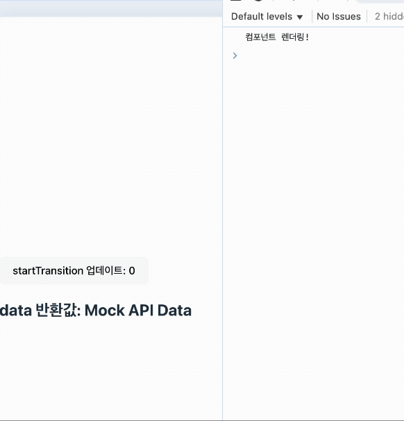

그래서 위 이미지처럼, promise를 캐싱해줬을 때는 fallback UI 는 뜨지 않고 리렌더링이 일어남을 확인할 수 있다.

그렇다면 마지막 하나의 방법인, Suspense에 렌더링마다 새로운 key 를 부여하는 것으로도 왜 해결이 될까? fallback UI 의 커밋이 일어나지 않아 마운트되기 전에 새 Promise가 계속 생성된다면 새로운 Suspense인 건 상관이 없을텐데 말이다. 해답은 리액트의 테스트 코드 주석에서 찾을 수 있었다.

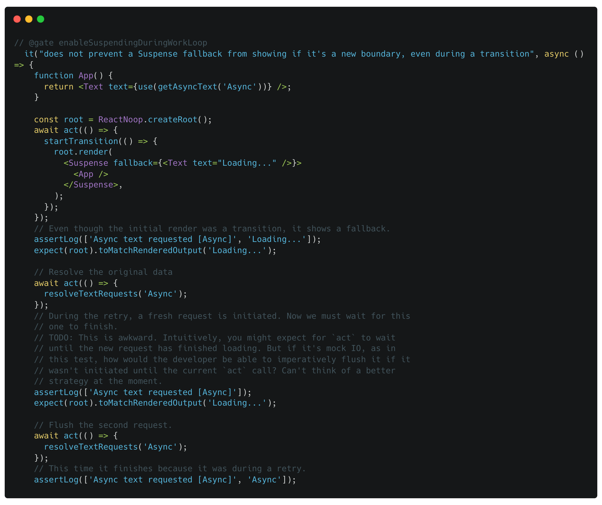

‘초기 렌더링이 transition(비긴급 업데이트)이었음에도 불구하고, fallback UI가 표시된다’

그렇다. transition 중이더라도 새로운 Suspense라면 fallback UI 를 그냥 보여줘버린다.

**Suspense에 새로운 key 값을 줬을 때**

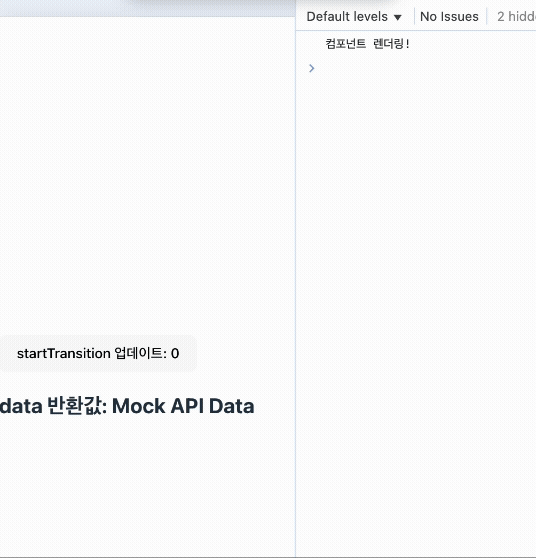

마지막에 더 나은 방법이 아직 생각나지 않는다는 주석에서 왠지 개발자의 표정이 괜히 상상된다.

---

### **3. 글 마무리**

마지막으로 위의 내용이 맞다면, navigate 훅을 사용하지 않아도 리렌더링을 일으키는 원인이 transition 일 때 같은 버그를 확인할 수 있을 것이다.

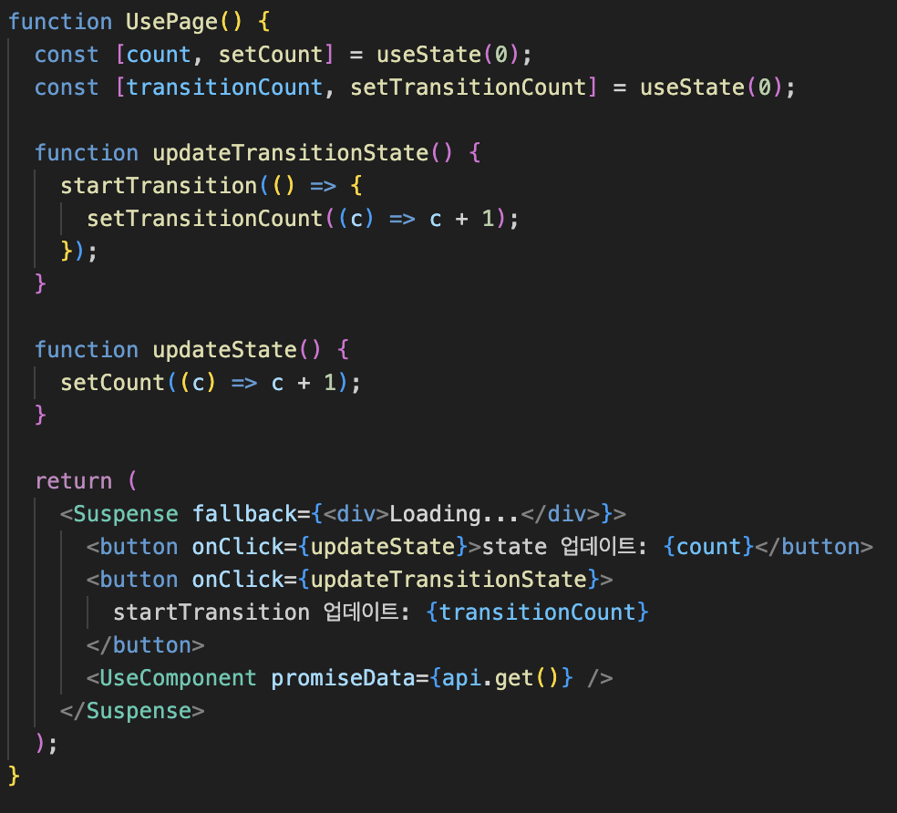

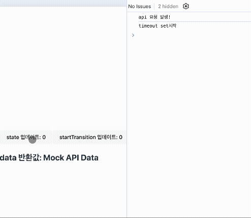

이 문제 해결 과정 자체가 **React Concurrent Mode**와 관련된 내부 메커니즘을 이해하는 것이 중요하다는 점을 보여준다고 생각한다. 물론 최신 리액트 버전을 사용하고, Suspense와 use 등의 비교적 최신 훅을 사용했기 때문에 해당 트러블 슈팅을 겪은 것도 맞다.

하지만 React Reconciler는 **Concurrent Features**를 지원하기 위해 지속적으로 개선되고 있다. react-router와 같이 주요 라이브러리에 startTransition 과 같이 점진적으로 적용하기로했던 동시성 렌더링의 핵심 훅을 기본으로 사용한 것이 리액트가 앞으로 꾸준히 동시성 모드를 미래지향점으로 잡고 개발해나갈 것을 시사한다고 생각한다.

실제로, 이번에 배포된 React v19.2.0 버전에서는 크롬의 성능 탭에서 스케쥴러를 확인할 수 있는 탭도 추가되었는데, 이 덕분에 긴급/비긴급 업데이트의 흐름을 더 쉽게 추적할 수 있게 되었다.

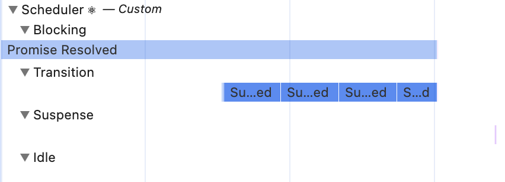

또한, 리액트의 업데이트는 분명 필요에 의한 업데이트일 것이다. 실제로 나는 프로젝트를 진행하면서 (캐싱과 최적화때문에 이제 곧 도입할 예정이긴 하지만) tanstack-query 도 사용하지 않고 불필요한 로딩 및 에러 상태를 만들지 않으면서 Errorboundary 와 Suspense를 이용해 선언적인 경계를 만드는 것에 좋은 UX/DX 개선을 느꼈다.

최근 리액트는 10년 간의 노력이 담겼다며 react compiler 를 정식 릴리즈하였는데, 이렇듯 더 나은 DX로 더 좋은 UX를 쉽게 구현하기 위해 노력하는 리액트의 업데이트를 놓치지 않고 잘 따라간다면 선진적으로 개발자와 사용자 모두에게 좋은 경험을 제공하는 개발자가 될 수 있을 것이라고 생각한다.
