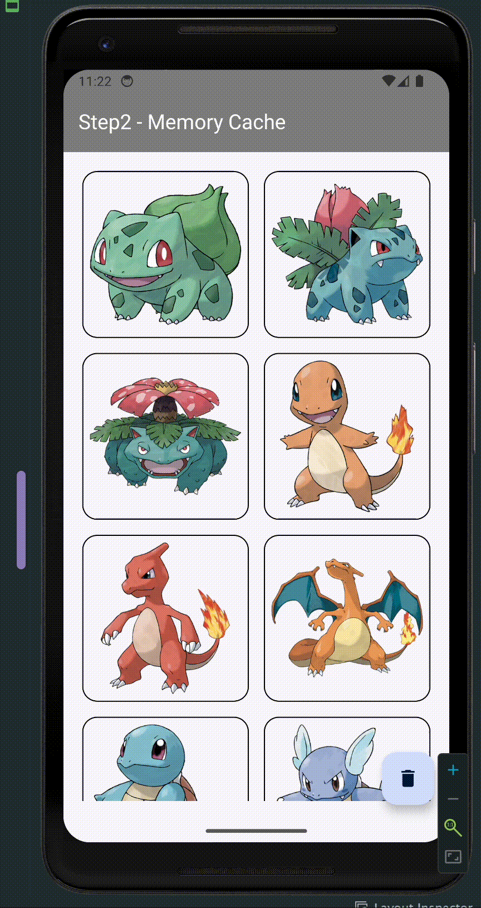

# 안드로이드 캐시: 빠르고 효율적인 데이터 로드

 빠르고 효율적인 데이터 로드를 위해 반드시 알아야 할 `캐시`에 대해 알아본 후,
 안드로이드 이미지 캐시 실습 예제를 통해 캐시를 구현하는 방법을 알아보겠습니다. 

- 목차 


- [1. 캐시의 개념과 중요성](#1-캐시의-개념과-중요성)
  - [캐시란 무엇일까?](#캐시란-무엇일까)
  - [캐시의 중요성](#캐시의-중요성)
- [2. 캐시 방법](#2-캐시-방법)
  - [이미지 메모리 캐시](#이미지-메모리-캐시)
  - [캐시 관리](#캐시-관리)

- [3. 실습 - 이미지 캐시](#3-실습---이미지-캐시)
  - [네트워크 통신](#네트워크-통신)
  - [메모리 캐시 적용](#메모리-캐시-적용)
  - [디스크 캐시 적용](#디스크-캐시-적용)

- [4. 캐시 관리 방법](#4-캐시-관리-방법)
  - [캐시 오버 플로우](#캐시-오버플로우)
  - [캐시 교체 알고리즘](#캐시-교체-알고리즘)
- [결과]
  - [캐시 사용 전후 성능 비교]
- [Glide, Coil 등에서 적용 방법]

# 1. 캐시의 개념과 중요성

## 캐시란 무엇일까?
  

저장 장치는 CPU 와의 거리에 따라 계층 구조를 형성합니다.
CPU에 가까울수록 데이터 접근 속도가 빠르고, 멀수록 느려집니다.
아무리 CPU 의 처리 속도가 빠르더라도 메모리 접근 속도가 느리면 시스템 전체 성능이 저하될 수밖에 없습니다.  

이러한 접근 속도 차이를 보완하기 위해 `캐시 메모리`가 도입되었습니다.
캐시 메모리는 `자주 사용하는 데이터를 임시로 저장`하여 CPU 가 더 빠르게 접근할 수 있도록 함으로써 연산 속도를 최적화합니다.

이러한 개념에서 `캐시`라는 용어가 유래되었습니다. `캐시`는 `데이터를 더 빠르게 접근`할 수 있도록 돕는 `임시 저장소`입니다.

## 캐시의 중요성


현재 포켓몬 리스트를 화면에 불러오고 있습니다. 서버에서 이미지를 받아오는 데 시간이 오래 걸랴, 사용자는 로딩 화면을 계속 보고 있어야 하는 불편함을 겪게 됩니다. 
이는 사용자 경험에 부정적인 영향을 줄 수 있으며, 사용자는 해당 화면에 다시 접근하는 것을 꺼리게 될 수 있습니다.

이 문제를 해결하기 위해 캐시를 적용할 수 있습니다.😁  
처음 이미지를 불러올 때 해당 이미지를 캐시에 저장해두면, 다음 번에는 캐시에서 이미지를 바로 불러올 수 있어 로딩 속도가 크게 개선됩니다.


확실히, 캐시에 저장해둔 이미지를 불러오는 것이 훨씬 빠르네요.
즉, 매번 네트워크 통신을 통해 이미지를 불러오는 것이 아닌 캐시된 데이터를 활용함으로써 앱의 성능을 향상시키고 사용자에게 더 나은 경험을 제공할 수 있습니다.

그럼 이제 캐시 방법에 대해 알아보고 실습을 통해 이미지 캐시를 구현해보겠습니다.

# 2. 캐시 방법


캐시는 저장 위치에 따라 `메모리 캐시`와 `디스크 캐시`로 나뉩니다.


| 특징       |           메모리 캐시           |           디스크 캐시            |
|----------|:--------------------------:|:---------------------------:|
| 저장 위치    | RAM (Random Access Memory) |     디스크 (하드 디스크, SSD 등)     |
| 데이터 유지	  |   `앱이 실행 중`일 때만 데이터 유지	    |      `앱 종료 후`에도 데이터 유지      |
| 속도	      |             빠름             |             	느림             |
| 용량	      |           제한적 	            |       더 많은 데이터 저장 가능        |
| 사용 목적	   |         `자주 사용될 때`         | 	`장기 저장 및 네트워크 요청을 줄일 때 사용` |
| 적용 사례	   |   자주 재사용되는 이미지, 저용량 데이터	   | 대용량 데이터, 앱 재시작 시 재사용되는 데이터  |

위와 같이 메모리 캐시와 디스크 캐시는 각각의 특징에 따라 사용 목적이 다릅니다.
메모리 캐시는 자주 사용되는 데이터를 빠르게 로드할 때 사용하고, 디스크 캐시는 대용량 데이터를 저장하거나 앱 재시작 시 재사용되는 데이터를 저장할 때 사용합니다.

 기기의 용량에 따라 캐시 방법이 달라질 수도 있습니다.
만약, RAM 용량이 적은 기기에서는 메모리 캐시를 과도하게 사용하는 것은 매우 비효율적입니다.

그럼 이제, 실습을 통해 두가지 캐시 방법을 모두 사용하여 이미지 캐시를 구현해보겠습니다.

# 3. 실습 - 이미지 캐시

자세한 코드는 [실습 깃허브 주소](아직 push 안함!)에서 확인할 수 있습니다!

## 네트워크 통신
```kotlin
class PokemonImageService {

    suspend fun pokemons(size: Int): List<Bitmap> = withContext(Dispatchers.IO) {
        List(size) {
            val url = pokemonImageUrl(it.toLong() + 1)
            val connection = URL(url).openConnection() as HttpURLConnection
            connection.run {
                doInput = true
                connect()
                inputStream.use { input ->
                    BitmapFactory.decodeStream(input)
                }
            }
        }
    }
}
```
size 에 해당하는 만큼의 포켓몬 이미지를 불러오는 네트워크 통신 코드입니다.  
`HttpURLConnection`을 활용하여 이미지를 불러온 후, Bitmap 으로 변환하여 반환합니다.
IO 작업은 메인 스레드를 블로킹 시킬 수 있으므로 `withContext(Dispatchers.IO)`를 사용하여 IO 작업을 백그라운드 스레드에서 처리하도록 했습니다 😁

```kotlin
class PokemonImageLoader(
    private val pokemonImageService: PokemonImageService
) {
    suspend fun pokemons(size: Int): List<Bitmap> {
        return pokemonImageService.pokemons(size)
    }
}
```

`PokemonImageLoader` 에서 `PokemonImageService` 를 호출하여 포켓몬 이미지를 불러오는 작업을 수행합니다.  
이제 해당 이미지 로더를 통해 UI 단에서 이미지를 불러올 수 있습니다!  


다만, 로딩이 너무 오래걸리네요.. 이를 개선하기 위해 이미지 캐시를 적용해보겠습니다!

## 메모리 캐시 적용

```kotlin
class PokemonImageLoader(
    private val pokemonImageService: PokemonImageService
) {
    private val cachedImages: MutableMap<Int, Bitmap> = mutableMapOf<Int, Bitmap>()

    suspend fun pokemons(size: Int): List<Bitmap> {
        val keys = 1..size
        if (cachedImages.keys.containsAll(keys.toSet())) {
            return keys.map { requireNotNull(cachedImages[it]) }
        }
        return pokemonImageService.pokemons(size).also { cacheImages(keys, it) }
    }

    private fun cacheImages(keys: IntRange, images: List<Bitmap>) {
        keys.forEachIndexed { index, key ->
            cachedImages[key] = images[index]
        }
    }
}
```
이번에는 Map 자료구조를 활용하여 이미지를 캐시합니다.

1)  이미지가 캐시되어 있는지 확인한 후, 캐시되어 있으면 캐시된 이미지를 반환
2) 그렇지 않으면 네트워크 통신을 통해 이미지를 불러온 후, 캐시에 저장

위와 같은 방식으로 이미지를 캐시하면, 해당 화면을 다시 불러올 때 이미지를 빠르게 로드할 수 있습니다!

// TODO 화면을 refresh 할 경우 재로드하는 gif 추가 


그러나, 앱을 재시작하면 캐시된 이미지가 다시 날라간다는 문제점이 있습니다..😵  
이를 해결하기 위해 디스크 캐시를 적용해보겠습니다!

## 디스크 캐시 적용

```kotlin
class PokemonImageSaver(context: Context) {
    private val cacheFolder by lazy {
      File(context.cacheDir, "photos").also {
        if (it.exists().not()) it.mkdir()
      }
    }
  
    suspend fun pokemonImages(size: Int): List<Bitmap> {...}

    suspend fun hasPokemonImage(id: Long): Boolean {...}

    suspend fun savePokemonImage(id: Long, bitmap: Bitmap) {...}
      ...
```

안드로이드 내부 저장소를 활용하여 `PokemonImageSaver` 클래스에 이미지를 저장하고 불러오는 기능을 추가했습니다.

```kotlin
class PokemonImageLoader(
    private val pokemonImageService: PokemonImageService,
    private val pokemonImageSaver: PokemonImageSaver
) {
    private val cachedImages: MutableMap<Int, Bitmap> = mutableMapOf<Int, Bitmap>()

  suspend fun pokemons(size: Int): List<Bitmap> {
    val keys = 1..size
    if (isMemoryCached(size)) { // 1. 메모리 캐시 확인
      return keys.map { requireNotNull(cachedImages[it]) }
    }
    if (isDiskCached(size)) { // 2. 디스크 캐시 확인
      return pokemonImageSaver.pokemonImages(size).also { cacheImages(keys, it) }
    }

    return pokemonImageService.pokemons(size)
      .also { // 3. 디스크 캐시 저장
        it.forEachIndexed { index, bitmap ->
          pokemonImageSaver.savePokemonImage(index.toLong() + 1, bitmap)
        }
      } 
      .also { cacheImages(keys, it) } // 4. 메모리 캐시 저장
  }
  ...
```
이제 PokemonImageLoader 에서 메모리 캐시와 디스크 캐시를 모두 활용하여 이미지를 불러옵니다.

1) 메모리 캐시에 이미지가 존재하는지 확인
2) 디스크 캐시에 이미지가 존재하는지 확인
3) 네트워크 통신을 통해 이미지를 불러온 후, 디스크 캐시, 메모리 캐시에 저장

위 조건 순서대로 이미지를 불러오도록 캐시 로직을 구현했습니다.
이제 앱을 재시작해도 디스크된 이미지를 불러와 빠르게 화면을 로드할 수 있습니다!


🚨 그런데 잠깐! 만약, 메모리나 디스크가 가득 차게 되면 어떻게 될까요?  
캐시가 가득 찰 경우 기존 데이터를 삭제하고 새로운 데이터를 저장해야 합니다.  
어떤 데이터부터 삭제 해야할꺼요? 🤔

# 4. 캐시 관리 방법

## 캐시 오버플로우

그런데, 만약 캐시에 저장된 데이터가 너무 많아져서 캐시의 크기를 초과하게 되면 어떻게 될까요?  
아마 캐시에 저장된 데이터 중 일부는 삭제되어야 할 것입니다. 이를 `캐시 오버플로우(Cache Overflow)`라고 합니다.

그럼 어떤 데이터를 먼저 삭제할지 고민이 됩니다. 이때 사용되는 것이 `캐시 교체 알고리즘`입니다.

## 캐시 교체 알고리즘

- 1) LRU(Least Recently Used): 가장 오래 사용되지 않은 데이터를 삭제하는 방식
- 2) LFU(Least Frequently Used): 가장 적게 사용된 데이터를 삭제하는 방식

두 캐시 교체 알고리즘이 가장 많이 사용되는데요, 이미지 캐시 교체에서는 `LRU 알고리즘`을 주로 사용합니다.
그 이유는 보통 사용자가 최근에 본 이미지가 다시 불러와질 가능성이 높기 떄문입니다.

참고) LFU 알고리즘 같은 경우는 특징 데이터가 다른 데이터에 비해 더 자주 사용되는 경우에 적합합니다.

그럼 이제 LRU 알고리즘을 실습에 적용해보겠습니다.