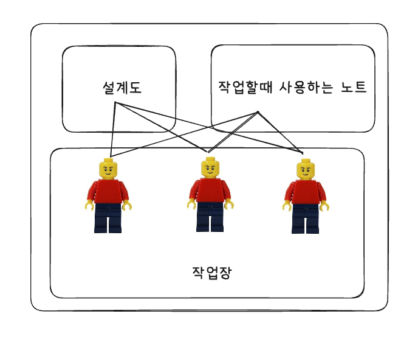
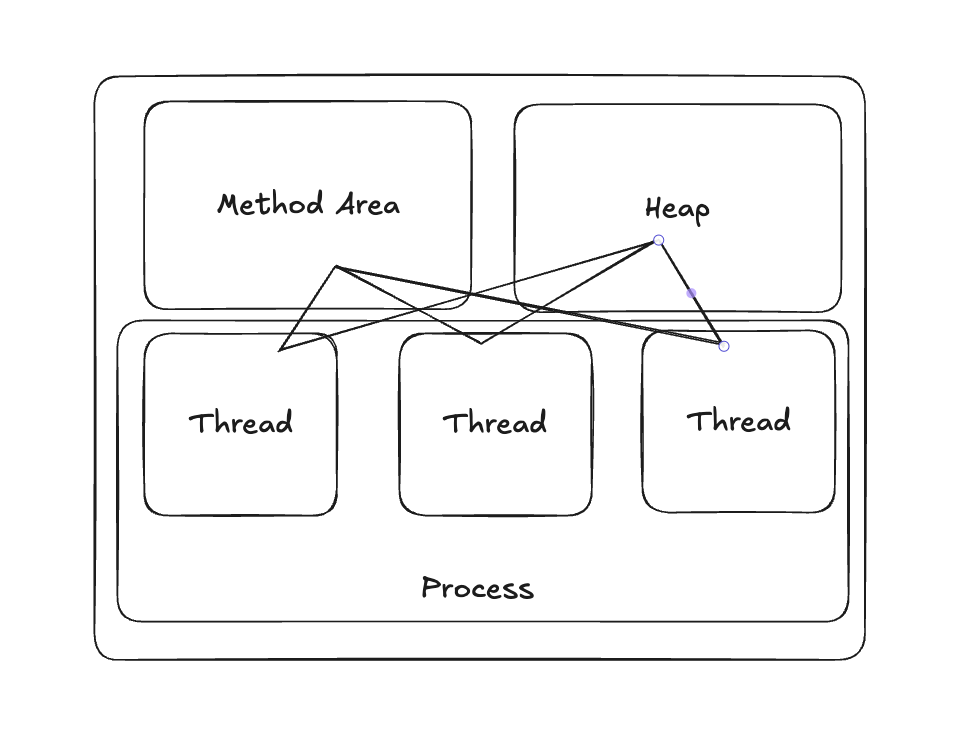
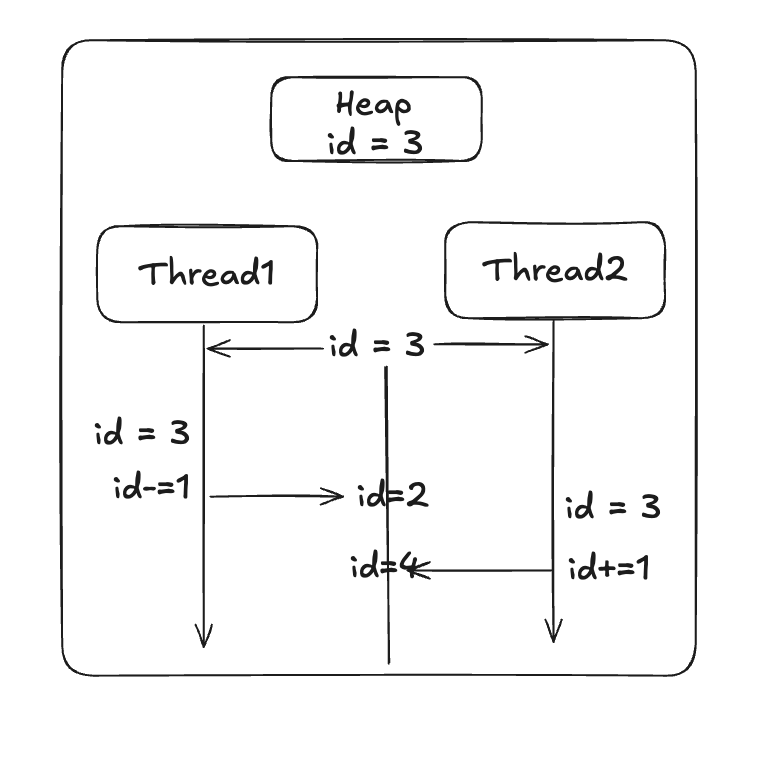
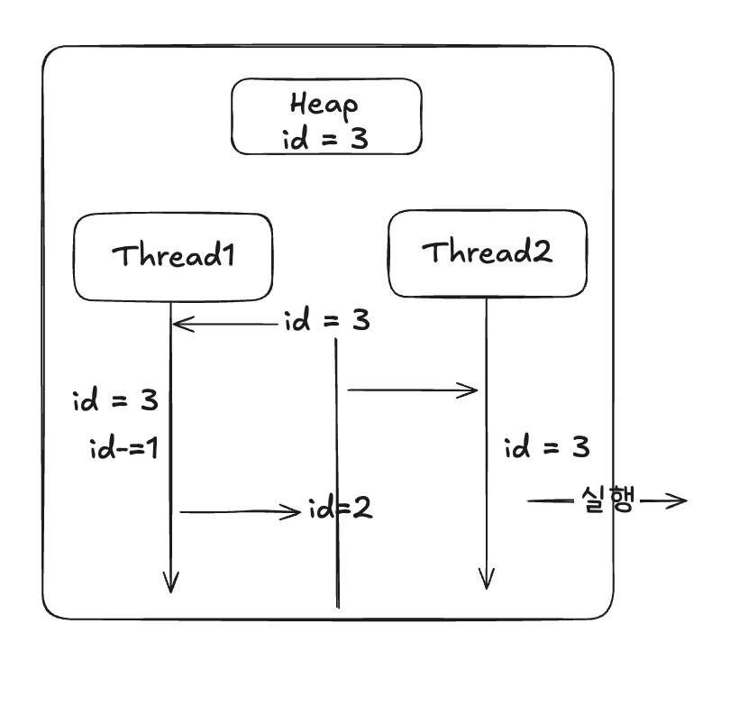
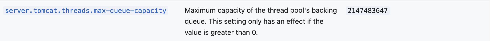

# 모니터링은 열심히 하지만 스레드는 모르는 당신을 위하여.

많은 트래픽이 몰릴 때, 원인을 분석하거나 병목 지점을 찾으려 하면 반드시 마주치게 되는 개념이 바로 스레드(Thread)입니다. 이번 글에서는 이 스레드의 기본 개념부터, 실제 서비스에서 병목을 해결하기 위한 활용까지 차근차근 살펴보겠습니다.
스레드에 대한 개념을 잘 이해하고 활용한다면 실제 서비스에서의 병목지점 중 하나를 해결할 수 있습니다.

# 스레드

## 스레드란 무엇일까요?

> **스레드**는 어떠한 프로그램 내에서, 특히 [프로세스](https://ko.wikipedia.org/wiki/%ED%94%84%EB%A1%9C%EC%84%B8%EC%8A%A4 "프로세스") 내에서 실행되는 흐름의 단위를 말한다. [(wikipedia)](https://en.wikipedia.org/wiki/Thread_(computing))

라고 정의되어 있습니다.  한 문장으로만 본다면 이해가 어려울 수 있으니 예시를 들어보겠습니다.

하나의 일터 안에서 여러 작업자들이 각자의 작업을 맡아 일을 진행하고 있는 상황이라고 생각할 수 있습니다.



각각의 작업자들은 설계도를 보고 각자 맡은 일을 작업할 수 있습니다. 각자 작업을 진행하다 공유해서 알아야하는 일이 생기면 노트가 있는 곳으로 가 내용을 읽거나 내용을 변경할 수 있습니다. 노트를 보며 작업을 진행할 수 있지만 서로의 작업에는 관심이 없습니다.

이제 예시의 상황을 더 구체적으로 살펴보겠습니다.

* 작업자 - 스레드
* 설계도 - Method Area
* 작업할때 사용하는 노트 - Heap



각 스레드들은 하나의 프로세스 안에서 Method Area와 Heap 메모리를 공유합니다.
각각의 stack에 있는 데이터는 공유되지 않습니다. 스레드끼리는 서로 작업에 영향을 주지 않습니다.

* Method Area - 런타임 상수 풀,필드 및 메서드 데이터 , 메서드 및 생성자 코드 데이터들이 담겨있습니다.
* Heap - 인스턴스 , 배열 데이터가 담겨있습니다.
* JVM Stack - 지역 변수, 매개변수, 리턴주소 등이 담겨있습니다.

## 스레드가 왜 필요할까요?

하나의 프로세스의 작업을 스레드라는 단위로 나누어 작업을 하고 있습니다. Process가 동시에 작업을 1개만 하여도 문제가 없다면 스레드는 필요하지 않을 것입니다. 하지만 어플리케이션에서는 동시에 여러 작업을 해야하는 상황이 생길 수 있습니다. 즉 하나의 프로세스에서 동시에 여러 작업을 하기 위해서 스레드가 필요해진 것입니다.

## Heap 메모리를 공유하게 되면서 생긴 문제

앞선 설명에서 Heap 메모리를 공유하고 있다고 설명드렸습니다. 하나의 인스턴스나 배열을 사용하게 되면서 발생하는 몇 가지 문제들이 있습니다. 그 중에서 대표적인 스레드 간섭(Thread Interface)과 메모리 일관성 오류(Memory Consistency Errors)를 살펴보겠습니다.

### 스레드 간섭(Thread Interface)

스레드 간섭이란 두 스레드가 같은 데이터를 **동시에 수정하려 해서 결과가 꼬이는 문제**입니다.


분명 Thread1이 작업을 진행하여 id = 2라고 업데이트를 하였지만, Thread 2가 작업한 내용으로 인해 Thread1의 작업한 내용이 사라져 버렸습니다.

이런 문제를 **스레드 간섭**이라고 합니다.

### 메모리 일관성 오류(Memory Consistency Errors)

메로리 일관성 오류는 한 스레드의 변경 내용이 **다른 스레드에게 제때 보이지 않는 문제** 입니다.




Thread1이 먼저 작업을 실행하여 id의 값을 수정하였지만 뒤늦게 실행된 Thread2는 작업내용이 적용되기 전의 id 값을 읽어와 작업을 진행하였습니다.


위 두 경우 모두 공유 된 자원을 다루면서 생긴 문제입니다. 멀티 스레드 프로그래밍에서는 위와 같은 동시성 문제를 해결해야합니다.

---

# 동시성 문제

## 동시성 문제를 해결 할 수 없을까?

동시성 문제를 해결 하기 위해서 먼저 간단한 두가지 방법을 살펴보겠습니다.

### synchronized

```java
class NotSync {
    private int count = 0;

    void increment() { count++; }

    int get() { return count; }
}
```

만약 이런 상황이라면 하나의 스레드가 increment()를 실행하고 있을 때 다른 스레드에서도 increment() 메서드를 실행하게 된다면 앞에서 설명한 스레드 간섭이 생길 수 있습니다.

이때 `synchronized` 를 메서드 앞에 붙혀주게 된다면 해당 메서드는 1개의 스레드만 사용이 가능하게 됩니다. `synchronized` 를 사용하게 된다면 해당 객체에서 사용되는 같은 락(lock)수준의 메서드를 동시에 실행할 수 없게 됩니다.

```java
class Sync {
    private int count = 0;

    synchronized void increment() { count++; }

    int get() { return count; }
}
```

따라서 `synchronized`를 적용한 후 한 스레드가 increment()를 실행중일때 다른 스레드들은 대기를 하게 되어 스레드 간섭을 해결 할 수 있습니다.

그럼 이제 문제가 없을까요? 메모리 일관성 오류 상황에서 확인했듯이 누군가 increment()를 진행중일때  get()을 하게 된다면 변경 내용이 적용되지 않은 `count`값을 사용하게 됩니다.

따라서 이를 해결하기 위해서 get() 메서드에도 `synchronized`를 적용한다면 같은 인스턴스의 락 수준의 메서드가 되게 하여 이를 막을 수 있습니다.

```java
class Sync {
    private int count = 0;

    public synchronized void increment() { count++; }
 
    public synchronized int get() { return count; }
}
```

`sychronized` 라는 강력한 장치로 저희는 동시성 문제를 해결해보았습니다. 하지만 원자성을 보호하기 위해서 모든 메서드에 락을 걸게 된다면 스레드의 장점인 동시에 여러 작업을 하는 것이 어려워지게 됩니다. 여러 스레드가 다른 스레드를 기다리고 있으면 점점 스레드가 대기하게 되어 전체 작업이 느려지게 될 것입니다.

메서드 전체에 `synchronized` 를 적용하는 것이 아닌 값을 변경시키는 특정 부분만 작게 메서드를 분리하여 적용시키는 방법등으로 락을 잠궈 걸리는 시간을 최소화 할 수 있습니다.


```java
class PartialSync {

    private int balance;

    void deposit(int money) {
        synchronized (this) {
            balance += money;
        }
    }
}
```


### Atomic 클래스

여러 스레드 간에서 원자성을 보장하기 위해서 Atomic 클래스들을 활용할 수 있습니다. 이들은 CPU 하드웨어 명령을 통해 락 없이도 원자성을 보장할 수 있습니다.

```java
public class RequestCounter {
    private static final AtomicLong totalRequests = new AtomicLong();

    public static void onRequest() {
        totalRequests.incrementAndGet();
    }

    public static long getTotal() {
        return totalRequests.get();
    }
}
```

Atomic을 사용하는 경우에는 락을 사용하지 않아 스레드의 성능이 저하되지 않습니다.
따라서 단일 변수의 원자적 연산에는 Atomic을 사용하는 것이 훨씬 빠릅니다. 하지만 여러 변수를 다뤄 원자적 연산에는 `synchronized`를 사용해야하는 경우도 있습니다.

앞선 예시들을 바탕으로 원자성을 해결하였지만 과도하게 사용할 경우 스레드의 성능을 일부 포기해야했습니다.

동시성 문제를 해결하기 위한 방법은 위의 내용 외에도 `ConcurrentHashMap` 등 다양하게 나와 있으니 상황에 맞는 해결법으로 최소한의 리스크를 찾는 것이 중요해보입니다.


동시성 문제는 간단한 테스트 코드로 동시성 문제를 확인할 수 어려울 수 있습니다. 따라서 동시성 문제를 놓친다면 실제 서비스를 운영하였을 때 발생할 수 있습니다. 확률이 적어 동시성 문제가 중요하지 않은 도메인이라면 크게 고려하지 않을 수 있지만 동시성 문제가 중요한 금융과 같은 도메인에서는 최대한 사전에 방지해야합니다.


# 스레드 풀

지금까지 스레드와 스레드에서 생길 수 있는 동시성 문제들에 대해서 간단하게 알아보았습니다.
그럼 스레드들을 더 잘 활용하기 위한 스레드 풀에 대해서 설명드리겠습니다.

## 스레드 풀이란?

**스레드 풀(Thread Pool)** 은 **미리 만들어둔 스레드들을 재사용하는 구조**입니다. 즉, 매번 새롭게 스레드를 생성하는 대신 **이미 만들어져 있는 스레드를 빌려 쓰고** 작업이 끝나면 다시 풀로 돌려보내는 방식입니다.

스레드를 새로 만드는 데에는 적지 않은 컴퓨터 자원이 필요합니다. 스레드 1개를 생성하면 **스택 메모리, CPU 스케줄링 정보, 컨텍스트 전환(Context Switching)** 등 운영체제 레벨의 자원 비용이 발생합니다.
따라서 이런 과정을 반복적으로 수행하면 **서버 부하와 성능 저하**로 이어질 수 있습니다.
스레드 풀은 이러한 비효율을 해결하기 위해 **미리 일정 개수의 스레드를 만들어두고 재활용하는 구조**를 제공합니다. 이렇게 하면 스레드 생성·소멸에 드는 비용이 줄어들고 서버의 자원을 안정적으로 제어할 수 있습니다.

## 스레드 풀의 작동 방식

스레드 풀 내부에는 **대기 중인 스레드들**과 **작업 큐(Work Queue)** 가 존재합니다.

1. 새로운 작업이 들어오면 우선 작업 큐에 저장됩니다.

2. 대기 중인 스레드 중 하나가 그 작업을 꺼내 실행합니다.

3. 작업이 끝나면 해당 스레드는 다시 풀로 돌아와 다음 작업을 기다립니다.

즉, 스레드는 한 번 만들어진 뒤 여러 작업을 순차적으로 수행하며 재사용됩니다.
이 덕분에 스레드 생성 오버헤드가 제거되고, CPU와 메모리 사용 효율이 극대화됩니다.

스레드 풀을 너무 작게 설정하면 대기 시간이 늘어나고 너무 크게 설정하면 오히려 **CPU 과부하나 컨텍스트 스위칭 비용 증가**로 이어질 수 있습니다. 따라서 시스템 특성(CPU 코어 수, I/O 비율 등)에 맞게 적절한 크기를 조정하는 것이 중요합니다.

## tomcat에서의 스레드 풀

springboot 내장에서 사용하는 Tomcat은 요청을 처리하기 위해 내부적으로 **Thread Pool** 을 운영합니다. HTTP 요청을 하나의 스레드(Worker Thread) 가 처리합니다.

spring에서 tomcat의 스레드를 설정할 수 있는 몇가지 요소들이 있습니다. [공식 문서](https://docs.spring.io/spring-boot/appendix/application-properties/index.html#appendix.application-properties.server)에서 제공하는 내용을 바탕으로 설명드리겠습니다.

* server.tomcat.threads.max

**Tomcat 스레드 풀의 최대 스레드 개수**를 설정합니다. Spring Boot의 기본값은 **200개**입니다. 요청이 늘어나 현재 대기 중인 스레드로 처리할 수 없을 경우 Tomcat은 점진적으로 새로운 스레드를 생성합니다. 이때 생성할 수 있는 **최대 스레드 수의 상한선**을 설정할 수 있습니다.


* server.tomcat.threads.min-spare

이 설정은 **Tomcat 스레드 풀에서 항상 유지해야 하는 최소 대기(유휴) 스레드 개수**를 설정합니다. 요청이 없더라도 Tomcat은 지정된 개수만큼의 스레드를 미리 생성해 대기 상태로 유지합니다. 기본값은 10입니다.


* server.tomcat.threads.max-queue-capacity
  이 설정은 **요청이 스레드 풀에서 처리되기 전까지 대기할 수 있는 최대 요청(작업) 수**를 설정합니다. 활성 스레드가 모두 사용 중일 때, 새로 들어온 요청은 먼저 이 대기 큐에 저장됩니다.
  큐가 가득 차면 이후 요청은 거부되며, 클라이언트는 **HTTP 503 (Service Unavailable)** 응답을 받을 수 있습니다.




기본적으로 제공되는 3가지 설정(`threads.max`, `threads.min-spare` 등) 외에도, **톰캣의 스레드 설정을 더 세밀하게 커스터마이징**하는 방법이 있습니다.

[tomcat 공식문서](https://tomcat.apache.org/tomcat-11.0-doc/config/http.html#Standard_Implementation)

Spring Boot에서 제공하는 **`WebServerFactoryCustomizer`**를 이용하면, 내장 톰캣의 상세 설정에 직접 접근할 수 있어요. 예를 들어, **`minSpareThreads` 이상으로 생성된 추가 스레드가 요청이 없을 때 얼마나 오랫동안 유지될지(`threadsMaxIdleTime`에 해당)** 같은 세부적인 동작 시간을 직접 설정하여 제어할 수 있습니다.


## 요청 처리 방식

**스레드 풀(Thread Pool)에 대기 중인 스레드는 순서나 우선순위 없이 요청을 처리합니다.**

웹 서버(예: 톰캣)에 새로운 요청이 들어오면, 이 요청은 스레드 풀에 전달됩니다. 이때, 풀 안에 **사용 가능한(Idle) 상태**로 대기하고 있는 스레드 중 **아무거나 하나**가 이 요청을 할당받아 처리하게 됩니다.

이러한 방식은 다음과 같은 장점이 있습니다.

- **공평성 (Fairness)**: 먼저 생성된 스레드라고 해서 반드시 먼저 요청을 처리해야 할 의무가 없으며, 요청 처리가 끝난 스레드는 즉시 풀로 돌아가 대기하며 다음 요청을 받을 준비를 합니다.

- **성능 최적화**: 어떤 스레드가 가장 빨리 준비되는지에 따라 유연하게 작업이 분배되므로, 요청을 가장 효율적으로 처리할 수 있는 스레드가 즉시 투입되어 전체적인 처리 속도를 높이는 데 유리합니다.


요약하자면, 스레드 풀은 **"준비된 스레드가 먼저 일한다"**는 원칙에 따라 동적으로 요청을 처리합니다.


# 마무리하며

지금까지 **스레드**의 기본적인 개념부터 시작해, 스레드가 공유 자원을 다룰 때 발생하는 **동시성 문제(스레드 간섭 및 메모리 일관성 오류)**, 그리고 이를 해결하기 위한 **`synchronized`와 Atomic 클래스**의 활용법까지 살펴보았습니다. 또한, 스레드 관리를 최적화하여 성능을 극대화하는 **스레드 풀**의 작동 원리와, Spring Boot 내장 **Tomcat 스레드 설정**을 통해 서비스의 부하를 제어하는 구체적인 방법들까지 정리했습니다.

결국 트래픽이 몰리는 상황에서 병목 지점을 찾고 안정적인 서비스를 유지하는 핵심은, 스레드가 동시에 작업을 처리하는 **멀티스레딩 환경을 정확히 이해**하고 **공유 자원에 대한 동시성 문제를 효율적으로 제어**하는 데 달려있습니다.

스레드 풀 설정이 너무 작거나 크면 오히려 성능 저하를 초래할 수 있듯이, 개발자는 서비스의 특성과 하드웨어 자원(CPU 코어 수, I/O 부하 등)을 면밀히 분석하여 **가장 적절한 균형점**을 찾아야 합니다.

이 글이 도움이 되셨길 바랍니다. 읽어주셔서 감사합니다.
