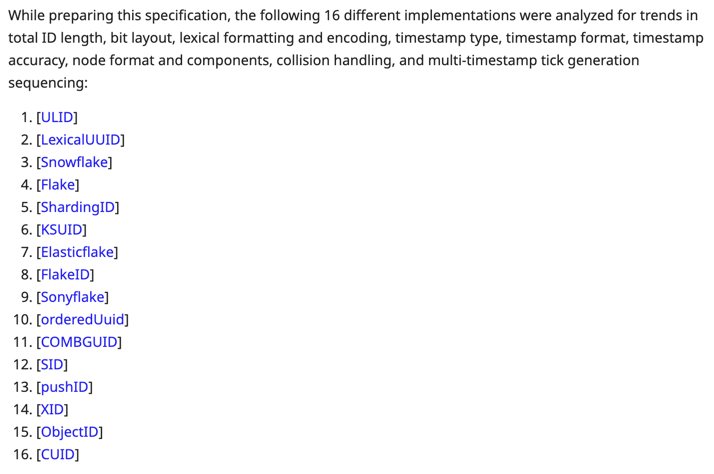

# Time-based Sortable ID - 시계가 거꾸로 갈 때.

---

## [TSID](https://github.com/f4b6a3/tsid-creator?tab=readme-ov-file#tsid-structure)

```
                                            adjustable
                                           <---------->
|------------------------------------------|----------|------------|
       time (msecs since 2020-01-01)           node       counter
                42 bits                       10 bits     12 bits

- time:    2^42 = ~69 years or ~139 years (with adjustable epoch)
- node:    2^10 = 1,024 (with adjustable bits)
- counter: 2^12 = 4,096 (initially random)

Notes:
The node is adjustable from 0 to 20 bits.
The node bits affect the counter bits.
The time component can be used for ~69 years if stored in a SIGNED 64 bits integer field.
The time component can be used for ~139 years if stored in a UNSIGNED 64 bits integer field.
```

## [Snowflake](https://github.com/twitter-archive/snowflake/tree/updated_deps?tab=readme-ov-file#solution)

```
id is composed of:
time - 41 bits (millisecond precision w/ a custom epoch gives us 69 years)
configured machine id - 10 bits - gives us up to 1024 machines
sequence number - 12 bits - rolls over every 4096 per machine (with protection to avoid rollover in the same ms)
```

Snowflake와 TSID의 비트 구조다.
상위 비트가 시간으로 구성되어 시간 순으로 정렬할 수 있다.

---

[아인슈타임](https://github.com/woowacourse-teams/2025-estime)은 핵심 도메인의 외부 식별자로 TSID를 사용했다.
Snowflake, TSID 외에도 nanoID, ULID, UUID(v4, v7) 등 선택지에 오른 것은 많았지만, 이에 대해서는 
[팀원 제프리의 테크니컬 라이팅](https://github.com/woowacourse/woowa-writing/blob/078ec258250366592e9953afad950c7d20c4d365/key-generation-strategy2.md)
에서 상세히 다루고 있다.

TSID를 사용하면서 문득 궁금해졌다. TSID가 영감을 받은 Snowflake와 비교하면 어떤 차이가 있을까?
겉보기에는 둘 다 `시간 + 노드 + 카운터` 형태로 거의 비슷해 보였고,
비트 배분, counter(sequence) 초기값 같은 디테일만 다를 것이라고 예상했다.

그런데 실제 구현 코드를 뜯어보니, 본질적인 차이가 있었다.

---

[Snowflake 코드](https://github.com/twitter-archive/snowflake/blob/b3f6a3c6ca8e1b6847baa6ff42bf72201e2c2231/src/main/scala/com/twitter/service/snowflake/IdWorker.scala)를 먼저 확인해보자.

```scala
protected[snowflake] def nextId(): Long = synchronized {
    var timestamp = timeGen()                    // 현재 시각

    if (timestamp < lastTimestamp) {             // 시계 역행
      exceptionCounter.incr(1)                   // 역행을 예외로 처리
      log.error("clock is moving backwards.  Rejecting requests until %d.", lastTimestamp);
      throw new InvalidSystemClock("Clock moved backwards.  Refusing to generate id for %d milliseconds".format(
        lastTimestamp - timestamp))
    }

    if (lastTimestamp == timestamp) {            // 동일 시각
      sequence = (sequence + 1) & sequenceMask   // 시퀀스 증가
      if (sequence == 0) {                       // 오버플로우 (버킷 용량 초과)
        timestamp = tilNextMillis(lastTimestamp) // 다음 ms까지 대기 (spin-wait)
      }
    } else {
      sequence = 0
    }

    lastTimestamp = timestamp
    ((timestamp - twepoch) << timestampLeftShift) |
      (datacenterId << datacenterIdShift) |
      (workerId << workerIdShift) | 
      sequence
  }
```

- 시계 역행을 ID 시스템이 해결할 수 없는 상황으로 여긴다.
- 해당 ms에 시퀀스가 버킷 용량을 초과했다면, 다음 ms까지 대기한다.

[TSID 코드](https://github.com/f4b6a3/tsid-creator/blob/master/src/main/java/com/github/f4b6a3/tsid/TsidFactory.java#L254)도 살펴보자.

```java
private long getTime() {
    long time = timeFunction.getAsLong();               // 현재 시각

    if (time <= this.lastTime) {                        // 동일/역행 시각
        this.counter++;                                 // 카운터 증가
        int carry = this.counter >>> this.counterBits;  // 오버플로우 (버킷 용량 초과) 검사 (0/1)
        this.counter = this.counter & this.counterMask;
        time = this.lastTime + carry;                   // 현재 시각 보정 
    } else {
        this.counter = this.getRandomCounter();
    }

    this.lastTime = time;

    return time - this.customEpoch;
}
```

- 시계 역행을 문제 상황으로 여기지 않는다.
- 해당 ms에 카운터가 버킷 용량을 초과했다면, 대기하지 않고 시각을 1ms 증가시킨다.

Snowflake와 정반대의 접근이다.

왜 TSID는 시계가 역행해도 예외를 던지지 않고,
버킷이 가득 차도 대기하지 않는,
시간을 보정하는 설계를 한걸까?

---

이를 이해하기 위해서 시계 역행 상황과 단조성에 대해 먼저 살펴보자.

## 시계 역행
 
- [NTP(Network Time Protocol)](https://en.wikipedia.org/wiki/Network_Time_Protocol): 시스템 시계가 실제 시간과 차이가 클 때, 설정/상황에 따라 NTP는 시계를 과거 시점으로 조정할 수 있다. [Chrony](https://chrony-project.org/doc/3.4/chrony.conf.html) 같은 최신 구현체도 마찬가지다. (참고: [Linux man-pages: clock_gettime](https://man7.org/linux/man-pages/man2/clock_gettime.2.html))
- VM 일시정지: 가상 머신이 일시정지되었다가 재개되면 시계가 뒤처질 수 있다. (참고: [Timekeeping best practices for Linux guests](https://knowledge.broadcom.com/external/article?legacyId=1006427), [Timekeeping within ESXi](https://blogs.vmware.com/cloud-foundation/2018/07/11/timekeeping-within-esxi/))
- 윤초(Leap Second): 가장 최근의 윤초는 2016년 12월 31일 23:59:60이다. (참고: [AWS의 2016년 윤초 대응](https://aws.amazon.com/ko/blogs/korea/look-before-you-leap-december-31-2016-leap-second-on-aws/))

시스템 시계는 우리가 생각하는 것만큼 정확하지도, 연속적이지도 않다.

## 단조성

[Monotonicity](https://en.wikipedia.org/wiki/Monotonic_function), 값이 한 방향으로만 변하는 성질이다.

함수가 단조성을 가진다는 것은 계속 증가하거나, 계속 감소한다는 의미다.
ID 생성기는 이 중 **단조 증가**(monotonically increasing)가 필요하다.

---

본론으로 돌아와보자.
시계 역행 상황에서의 단조 증가, Snowflake와 TSID는 서로 다른 접근을 내놓는다.

**Snowflake**
- 시계 역행 → 예외 발생 
- 부정확한 시각 기록 거부
- 트레이드오프: 가용성 희생

**TSID**
- 시계 역행 → 시각 보정 
- 대략적 시각이라도 계속 생성
- 트레이드오프: 시각 오차 허용

혹시 정답이 있는 문제일까?  
그저 두 시스템의 철학이 달랐던 걸까?

RFC를 찾아보자.

---

## [RFC 9562](https://www.rfc-editor.org/rfc/rfc9562.html)

[6.2. Monotonicity and Counters](https://www.rfc-editor.org/rfc/rfc9562.html?#name-monotonicity-and-counters)에서 관련 정보를 찾을 수 있었다.

> Monotonicity (each subsequent value being greater than the last) is the backbone of time-based sortable UUIDs.

해당 섹션은 단조 증가를 Time-based sortable ID의 핵심으로 정의하며 시작한다.

이후 동일 ms 내 단조성 보장 방법 등 여러 내용을 다루지만, 우리는 시계 역행/카운터 오버플로우 대응만 살펴보자.

### Counter Rollover Handling

> freeze the counter and wait for the timestamp to advance

> increment the timestamp ahead of the actual time and reinitialize the counter.

카운터 롤오버(오버플로우)가 발생하면, 
- 타임스탬프 증가를 기다리거나(Snowflake) 
- 타임스탬프를 실제 시간보다 증가시키고 카운터를 초기화(TSID)  


### Monotonic Error Checking

> such as clock rollbacks, leap second handling, and counter rollovers

> they should at least report an appropriate error.

> reuse the previous timestamp and increment the previous counter method.

시계 역행, 윤초, 카운터 롤오버 등이 발생하면, 
- 적절한 오류를 보고하거나(Snowflake)
- 이전 타임스탬프를 재사용하고, 카운터를 증가(TSID)

---

[6.1. Timestamp Considerations](https://www.rfc-editor.org/rfc/rfc9562.html?#name-timestamp-considerations)에서도 관련 내용을 찾아볼 수 있었다.

### Error Handling

> can return an error or stall the UUID generator until the system clock catches up

> MUST NOT knowingly return duplicate values due to a counter rollover.

시스템 시계가 따라잡을 때까지 ID 생성기를 대기하거나 에러를 반환할 수 있지만, 카운터 롤오버 상황에서 중복된 값을 반환 금지함.

### Altering, Fuzzing, or Smearing

> This specification makes no requirement or guarantee about how close the clock value needs to be to the actual time.

시계 값이 실제 시간에 얼마나 가까워야 하는지에 대한 요구 사항이나 보장이 없음 -> 보정 전략의 정당성

결론적으로, RFC 9562에서는 두 접근 모두 허용하며 Snowflake는 정확성을, TSID는 가용성을 우선시했음을 이해할 수 있다.

---

## 추세

RFC가 두 전략을 동등하게 허용한다면, 실제 구현체들은 어떤 선택을 했을까?



### [Google UUID v7 (Go)](https://github.com/google/uuid/blob/master/version7.go)

Google의 UUID v7은 증가 전략을 사용한다.

```go
func getV7Time() (milli, seq int64) {
	timeMu.Lock()
	defer timeMu.Unlock()

	nano := timeNow().UnixNano()
	milli = nano / nanoPerMilli
	// Sequence number is between 0 and 3906 (nanoPerMilli>>8)
	seq = (nano - milli*nanoPerMilli) >> 8
	now := milli<<12 + seq
	if now <= lastV7time {   // 시계 역행 (혹은 동일 시각)
		now = lastV7time + 1 // 증가 전략 사용
		milli = now >> 12
		seq = now & 0xfff
	}
	lastV7time = now
	return milli, seq
}
```

### [Monotonic-ULID (Java)](https://github.com/azam/ulidj/blob/main/src/main/java/io/azam/ulidj/MonotonicULID.java)

Monotonic-ULID도 증가 전략을 사용한다.

```java
private void mutate() {
    long now = this.clock.millis();
    if (now < ULID.MIN_TIME || now > ULID.MAX_TIME)
      throw new IllegalStateException("Time is out of ULID specification");
    if (now <= this.lastTimestamp) { // 시계 역행 (혹은 동일 시각)
      byte[] previousEntropy = new byte[ULID.ENTROPY_LENGTH];
      System.arraycopy(this.lastEntropy, 0, previousEntropy, 0, ULID.ENTROPY_LENGTH);
      boolean carry = true;
      for (int i = ULID.ENTROPY_LENGTH - 1; i >= 0; i--) {
        if (carry) {
          byte work = this.lastEntropy[i];
          work = (byte) (work + 0x01); // 증가 전략 사용
          carry = this.lastEntropy[i] == (byte) 0xff;
          this.lastEntropy[i] = work;
        }
      }
      if (carry) { // 오버플로우 (1ms 내 2^80회 증가, 현실적으로 불가능)
        System.arraycopy(previousEntropy, 0, this.lastEntropy, 0, ULID.ENTROPY_LENGTH);
        throw new IllegalStateException("ULID entropy overflowed for same millisecond"); // 예외
      }
    } else {
      this.lastTimestamp = now;
      this.random.nextBytes(this.lastEntropy);
    }
  }
```

### [Sonyflake (Go)](https://github.com/sony/sonyflake/blob/master/v2/sonyflake.go)

Sonyflake는 증가 전략과 대기 전략을 병행한다.

```go
func (sf *Sonyflake) NextID() (int64, error) {
	maskSequence := 1<<sf.bitsSequence - 1

	sf.mutex.Lock()
	defer sf.mutex.Unlock()

	current := sf.currentElapsedTime()
	if sf.elapsedTime < current {
		sf.elapsedTime = current
		sf.sequence = 0
	} else { // 시계 역행 (혹은 동일 시각)
		sf.sequence = (sf.sequence + 1) & maskSequence // 시퀀스 증가
		if sf.sequence == 0 { // 오버플로우
			sf.elapsedTime++ // 증가 전략 사용
			overtime := sf.elapsedTime - current
			sf.sleep(overtime) // 대기 전략 사용
		}
	}

	return sf.toID()
}
```

이들의 공통점은 시계 역행 상황에서 예외를 던지기보다, 단조성을 지키며 계속 발급을 이어가려고 한다.  
다만 각자의 설계 목표나 철학에 따라 다른 트레이드 오프를 택했을 뿐이다.

---

## 마치며

겉보기엔 비슷해 보였던 시간 정렬형 ID 시스템들.
단조성을 지키기 위해 표준이 허용하는 범위 안에서 서로 다른 해결책을 내놓았다.

같은 문제를 두고도 해법은 다를 수 있다.
그 차이가 곧 그 시스템이 세상을 바라보는 방식이 아닐까.

당신의 서비스는 무엇을 우선시하는가?

---

## 참고 자료
[More considerations for the clustering key](https://www.sqlskills.com/blogs/kimberly/more-considerations-for-the-clustering-key-the-clustered-index-debate-continues/)

[Analyzing New Unique Identifier Formats](https://blog.scaledcode.com/blog/analyzing-new-unique-id/)

[Lamport: Time, Clocks, and the Ordering of Events in a Distributed System](https://lamport.azurewebsites.net/pubs/time-clocks.pdf)
