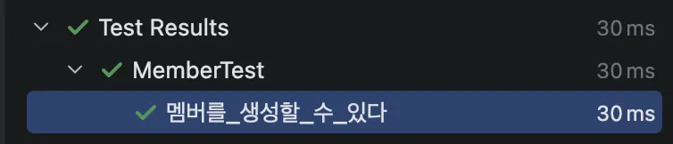
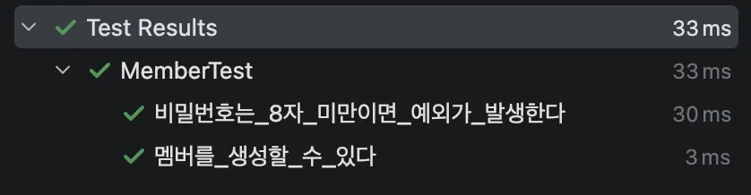
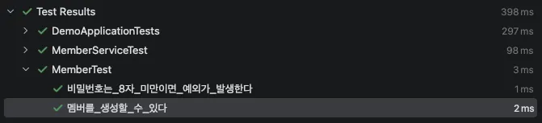
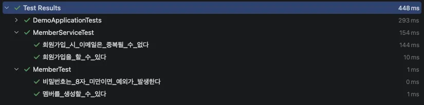

# 실습을 통한 테스트 주도 개발(TDD)

## 들어가며

안녕하세요. 우아한테크코스의 백엔드 7기 율무입니다. 저는 우아한테크코스에서 처음 테스트 주도 개발에 대해서 접하게 되었는데요. 당시에는 테스트 주도 개발이 오히려 객체지향적 설계의 방향성을 제시하지 못하며, 요구사항을 만족하는 코드를 작성하는 속도를 늦춘다고 생각했습니다. 하지만 이런 생각을 바꾸게 된 계기가 있는데요. 바로 우아한테크코스 레벨 1 미션 ‘장기’였습니다.

해당 미션에서 장기 보드와 기물과 사이의 관계를 구현하면서 테스트 주도 개발을 실천해보았는데, 오히려 테스트 주도 개발이 설계의 방향성을 잡아주고 책임의 명확한 분리를 유도했습니다. 여전히 테스트를 작성하는 속도는 느리긴 했습니다만 테스트 작성 과정에서 분석과 설계를 함께 하고 있었던 것입니다.

켄트 벡은 테스트 주도 개발에서 테스트 작성에 드는 시간의 일부는 ‘필요 낭비’라고 했습니다. 이 중 분석과 설계에 쓰이는 시간은 진정한 가치를 만들어내지만, 순수하게 테스트 코드를 작성하는 시간은 언젠가 제거할 수 있는 낭비라는 뜻이죠. 하지만 많은 개발자들이 말하듯이, 코딩 실력이 향상되면 테스트 없이도 같은 품질을 달성할 수 있을 것입니다. 물론 그 수준에 도달하기까지는 많은 연습이 필요하겠지요.

이러한 경험을 통해 테스트와 객체지향에 대해 관심이 깊어졌습니다. 그래서 테스트 주도 개발에 대해 모르시거나, 알지만 그 가치에 체감해보지 못한 분들을 위해 해당 글을 작성하게 되었습니다.

## 테스트 주도 개발은 무엇인가?

테스트 주도 개발(Test-Driven Development, TDD)는 켄트 벡(Kent Beck)이 1999년 익스트림 프로그래밍에서 제안한 개발론입니다. 이는 소프트웨어 요구사항을 만족하는 코드를 작성하기 전에 해당 코드를 테스트하는 코드를 먼저 작성하는 것입니다. 간혹 테스트 주도 개발을 좋은 설계 기법 중 하나로 보기도 하지만, 켄트 벡은 '**설계 피드백**'이라고 표현합니다. 즉, 테스트 주도 개발은 현재 설계의 품질을 평가하고 개선 방향을 알려주는 도구인 것입니다.

테스트를 작성하기 어렵다면 설계에 문제가 있다는 신호이며, 이를 통해 우리는 설계를 개선할 수 있습니다. 하지만, 테스트 주도 개발 자체가 좋은 설계를 자동으로 만들어주진 않습니다. 모든 설계에 대한 결정은 개발자 본인에게 있는 것이죠.

켄트 벡은 론 제프리즈의 말인 ‘**작동하는 깔끔한 코드(clean code that works)**’ 이 한마디가 바로 테스트 주도 개발의 궁극적인 목표라고 말했습니다. 테스트 주도 개발을 하나의 설계 피드백으로 잘 활용한다면 이러한 궁극적인 목표를 잘 달성할 수 있습니다. 테스트 주도 개발에서는

- 테스트가 실패할 경우에만 새로운 코드를 작성한다.
- 중복을 제거한다.

이 두 가지의 단순한 규칙만 따릅니다. 그리고 이러한 규칙을 통해 테스트 주도 개발의 핵심인 ‘**Red-Green-Refactor**’ 사이클이 결정됩니다. 해당 사이클은 다음과 같은 순서로 이루어집니다.

1. Red ㅡ 실패하는 작은 테스트를 작성한다.
2. Green ㅡ 최대한 빠르게 테스트를 통과하는 코드를 작성한다.
3. Refactor ㅡ Red-Green 과정에서 생겨난 중복 코드를 제거한다.

여기서 주목해야 할 것은 ‘**작은 테스트**’와 ‘**최대한 빠르게**’입니다. 이를 켄트 벡은 용기라고 표현하는데요. 완벽한 설계를 한 번에 만들어야 한다는 부담에서 벗어나, 작은 단계부터 나아가는 용기입니다. 이것이 프로그래밍을 하며 나타나는 불확실성에 대한 두려움을 이겨내는 방법입니다.

이정도의 설명이면 테스트 주도 개발에 대한 전반적인 철학에 대한 설명은 끝이 난 것 같습니다. 지금부터는 회원가입 API를 테스트 주도 개발로 구현하는 예제를 함께 보겠습니다.

## 테스트 주도 개발 실습 - 회원가입 API

간단하게 스프링을 통한 회원가입 API를 만드는 요구사항을 할당 받았다고 하겠습니다.

**요구사항**

- 사용자는 이메일과 비밀번호로 회원가입 할 수 있다.
- 이메일은 중복될 수 없다.
- 비밀번호는 8자 이상이어야 한다.

### 1단계 - Red 🛑

```java
public class MemberTest {

    @Test
    void 멤버를_생성할_수_있다() {
        // given
        var email = "member@email.com";
        var password = "password";

        // when
        var member = new Member(email, password);

        // then
        assertThat(member.getEmail()).isEqualTo(email);
        assertThat(member.getPassword()).isEqualTo(password);
    }
}
```

가장 작은 단위인 Member 엔티티를 생성하는 것부터 시작해보겠습니다.

현재 어떠한 객체도 없이 테스트 코드만 작성했기에 컴파일 에러가 발생합니다. 하지만, 켄트 벡은 컴파일 에러 또한 Red의 과정으로 보고 있습니다. 그럼 이제 이를 빠르게 성공하도록 구현해봅시다.

### 2단계 - Green 🟢

```java
public class Member {
    
    private final String email;
    private final String password;

    public Member(String email, String password) {
        this.email = email;
        this.password = password;
    }

    public String getEmail() {
        return email;
    }

    public String getPassword() {
        return password;
    }
}
```


멤버 객체를 빠르게 구현해서 성공했습니다. 그럼 이제 리팩터링을 해야 할까요? 현재는 리팩터링 해야할 코드가 보이지 않습니다. 그러면 해당 과정을 건너뛰고 다시 테스트를 작성해보겠습니다.

여기서 두 개의 요구사항 중 어떤 것을 테스트로 작성할 수 있을까요? 이메일은 중복될 수 없는 요구사항은 Member 객체만으로는 판단할 수 없습니다. 하지만, 비밀번호는 8자 이상이어야 한다는 요구사항은 Member 객체만으로 판단할 수 있겠네요. 이를 테스트 코드로 작성해봅시다.

### 3단계 - Red 🛑

```java
@Test
void 비밀번호는_8자_미만이면_예외가_발생한다() {
    // given
    var email = "member@email.com";
    var password = "pw";
    
    // when - then
    assertThatThrownBy(() -> new Member(email, password))
        .isInstanceOf(IllegalArgumentException.class);
}
```

사실 8자 이상이면 멤버가 생성된다는 테스트는 첫 Red에서 작성되었습니다. 비밀번호로 주어진 값이 이미 8자 이상이기 때문입니다. 그래서 8자 이상이어야 한다는 조건의 반대인 8자 미만인 경우를 테스트 하도록 하겠습니다.

8자 미만인 비밀번호로 Member 객체 생성 시 예외가 던져질 수 있겠죠. 여기서 적절한 예외는 IllegalArgumentException이라 생각해 테스트를 이렇게 작성했습니다. 해당 테스트를 실행시켜보면 실패하는 것을 확인할 수 있습니다.

다음 단계는 빠르게 작동하는 코드를 만드는 것입니다.

### 4단계 - Green 🟢

```java
public class Member {

    private final String email;
    private final String password;

    public Member(String email, String password) {
		    if (password.length() < 8) {
            throw new IllegalArgumentException();
        }
        this.email = email;
        this.password = password;
    }

    public String getEmail() {
        return email;
    }

    public String getPassword() {
        return password;
    }
}
```


전체 테스트가 잘 성공한 모습을 확인할 수 있습니다. 이제 리팩터링 단계로 넘어가도 될 것 같습니다. 그 이유는 Member 생성자 로직에서 if문으로 되어있는 부분을 메서드로 분리해볼 수 있을 것 같기 때문입니다.

### 5단계 - Refactor ⚙️

```java
public class Member {

    public static final int PASSWORD_LENGTH = 8;
    
    private final String email;
    private final String password;

    public Member(String email, String password) {
        validatePasswordLength(password);
        this.email = email;
        this.password = password;
    }

    private void validatePasswordLength(String password) {
        if (password.length() < PASSWORD_LENGTH) {
            throw new IllegalArgumentException();
        }
    }

    public String getEmail() {
        return email;
    }

    public String getPassword() {
        return password;
    }
}
```

Member 객체에서 암호의 길이를 검증하는 부분을 메서드로 분리하였으며, 매직 넘버였던 암호의 길이를 상수로 분리하였습니다. 이정도면 Member 객체가 잘 리팩터링 되었다고 판단되는데요. 이제 다른 요구사항인 ‘이메일은 중복될 수 없다.’를 테스트 해보겠습니다.

### 6단계 - Red 🛑

```java
@SpringBootTest(webEnvironment = WebEnvironment.NONE)
public class MemberServiceTest {

    @Autowired
    private MemberService memberService;
    @Autowired
    private MemberRepository memberRepository;

    @Test
    @Transactional
    void 회원가입_시_이메일은_중복될_수_없다() {
        // given
        var email = "member@email.com";
        var password = "password";
        var member1 = new Member(email, password);
        memberRepository.save(member1);

        // when - then
        assertThatThrownBy(() -> memberService.register(email, password))
            .isInstanceOf(IllegalArgumentException.class);
    }
}

```

앞서 언급했듯이, 이메일 중복 여부는 Member 객체만으로는 판단할 수 없습니다. 따라서 자연스럽게 도메인 객체를 넘어, 상위 레이어로 확장할 필요가 있습니다. 이를 위해 회원가입을 수행하는 MemberService에 대한 테스트를 작성했고, 내부에서 회원 정보를 저장할 MemberRepository를 함께 포함했습니다.

이 역시도 아직 클래스 자체를 만들진 않았기 때문에 컴파일 에러가 발생합니다. 이제 빠르게 작동하는 코드를 작성해 그린으로 만들어보겠습니다.

### 7단계 - Green 🟢

```yaml
spring:
  datasource:
    driver-class-name: org.h2.Driver
    url: 'jdbc:h2:mem:test;MODE=MySQL'
    username: username
    password:

jpa:
  database-platform: org.hibernate.dialect.H2Dialect
  hibernate:
    ddl-auto: create
  properties:
    hibernate:
      dialect: org.hibernate.dialect.H2Dialect

```

```java
@Entity
public class Member {

    public static final int PASSWORD_LENGTH = 8;

    @Id
    @GeneratedValue
    private Long id;
    private String email;
    private String password;

    protected Member() {
    }

    public Member(String email, String password) {
        validatePasswordLength(password);
        this.id = null;
        this.email = email;
        this.password = password;
    }

    private void validatePasswordLength(String password) {
        if (password.length() < PASSWORD_LENGTH) {
            throw new IllegalArgumentException();
        }
    }
    
    public Long getId() {
        return id;
    }

    public String getEmail() {
        return email;
    }

    public String getPassword() {
        return password;
    }
}
```

```java
@Service
public class MemberService {

    public Member register(String email, String password) {
        throw new IllegalArgumentException();
    }
}
```

```java
public interface MemberRepository extends Repository<Member, Long> {

    Member save(Member member);
}

```


지금부턴 JPA와 코드들이 연동되면서 그린을 만들기 위한 과정이 꽤 길어졌습니다. 하지만 Member 객체에서의 변화는 JPA를 위한 연동 과정이었을 뿐이고, 테스트 하려고 했던 MemberService의 로직을 보면 여전히 최대한 빠르게 그린을 만들었다는 점을 확인할 수 있습니다.

#### DB에 실제 데이터베이스를 연동해도 될까?

현재는 데모 애플리케이션이기에 실제 DB가 존재하지는 않아 H2 인메모리 데이터베이스를 사용했지만 이 질문은 테스트 주도 개발을 떠나 테스트를 작성할 때 자주 마주치는 고민입니다. 테스트에서 실제 데이터베이스를 사용하는 것이 적절한지, 아니면 인메모리 데이터베이스나 Mock을 사용해야 하는지에 대한 논쟁은 계속되고 있습니다. 이는 넓은 관점으로 다시 보면 테스트를 두 개의 ‘파’로 나눌 수 있는데요. 하나는 ‘런던파’이고, 다른 하나는 ‘고전파’입니다.

런던파의 경우 데이터베이스도 외부 의존성으로 인식하기에 Mock으로 대체해야 한다고 말하며, 고전파는 외부 의존성이나 제어 가능한 영역이기에 실제 데이터베이스를 사용해야 한다고 말합니다. 자세한 내용은 블라디미르 코리코프의 단위 테스트 책을 읽어보면 좋을 거 같습니다.

### 8단계 - Red 🛑

```java
@Test
@Transactional
void 회원가입을_할_수_있다() {
    // given
    var email = "member@email.com";
    var password = "password";

    // when
    Member savedMember = memberService.register(email, password);

    // then
    Member findMember = memberRepository.findById(savedMember.getId());

    assertThat(savedMember.getId()).isEqualTo(findMember.getId());
    assertThat(savedMember.getEmail()).isEqualTo(findMember.getEmail());
    assertThat(savedMember.getPassword()).isEqualTo(findMember.getPassword());
}
```

```java
public interface MemberRepository extends Repository<Member, Long> {

    Member save(Member member);
    
    Member findById(Long id);
}
```

이번에는 서비스를 통해 회원 가입을 할 수 있는지 테스트를 작성해보았습니다. 빠른 진행을 위해서 findById는 미리 만들어 두었습니다. 해당 테스트는 이전에 회원가입 로직에서 예외만 던지도록 빠르게 구현했기에 실패합니다. 이를 이제 다시 모든 테스트를 만족하도록 빠르게 구현하여야 합니다.

### 9단계 - Green 🟢

```java
@Service
public class MemberService {

    @Autowired
    private MemberRepository memberRepository;

    public Member register(String email, String password) {
		    if (memberRepository.existsByEmail(email)) {
            throw new IllegalArgumentException();
        }
    
        Member member = new Member(email, password);
        return memberRepository.save(member);
    }
}
```

```java
public interface MemberRepository extends Repository<Member, Long> {

    Member save(Member member);

    Member findById(Long id);

    boolean existsByEmail(String email);
}
```


모든 테스트를 통과할 수 있도록 서비스의 register 로직을 작성했습니다. 이로써 모든 요구사항을 만족하는 코드의 작성이 끝났습니다. 이제 여기서 리팩터링 과정을 마지막으로 거쳐보겠습니다.

### 10단계 - Refactor ⚙️

```java
@Service
public class MemberService {

    @Autowired
    private MemberRepository memberRepository;

    public Member register(String email, String password) {
        validateEmailDuplication(email);

        Member member = new Member(email, password);
        return memberRepository.save(member);
    }

    private void validateEmailDuplication(String email) {
        if (memberRepository.existsByEmail(email)) {
            throw new IllegalArgumentException();
        }
    }
}
```

```java
public class MemberTest {

    @Test
    void 비밀번호는_8자_미만이면_예외가_발생한다() {
        // given
        var email = "member@email.com";
        var password = "pw";

        // when - then
        assertThatThrownBy(() -> new Member(email, password))
            .isInstanceOf(IllegalArgumentException.class);
    }
}
```

마지막으로 리팩터링 과정을 모두 끝마쳤습니다. 기존에 이메일 중복 여부 검증 로직을 메서드로 분리하였고, MemberTest에 있던 생성 성공 테스트를 삭제했습니다. 생성 성공 테스트를 삭제한 이유는 생성에 성공했다는 사실이 어떠한 정보도 주고 있지 않기 때문입니다. 이는 어느것도 테스트 하고 있지 않다는 것을 뜻합니다. 오히려 이러한 생성자 테스트는 유효하지 않은 인자 혹은 복잡한 로직이 있는 경우 테스트 하는 것이 더욱 바람직합니다. 그리고 MemberService 객체를 만들면서 MemberService에서 Member에 대한 생성 성공 테스트를 함께 수행하고 있습니다.

이 기세를 이어서 Controller까지 확장해가며 테스트 주도 개발 실습을 이어가면 좋겠지만, 분량상 제외하였습니다. 하지만 지금까지의 과정을 잘 따라오셨다면 혼자서도 충분히 확장할 수 있을거라 생각합니다.

## 실습에서 확인한 테스트 주도 개발의 이점

아주 간단한 예제였지만, 테스트 주도 개발의 재미를 느끼셨을거라 믿습니다. 이를 통해 얻을 수 있는 이점들은 다음과 같습니다.

### 인터페이스 우선 설계

앞서 MemberServiceTest에서 회원가입 관련 테스트를 작성할 때 ‘어떤 방식으로 회원가입 로직을 먼저 작성하지?’라는 고민보다 ‘어떻게 회원가입을 사용하지?’라는 고민을 먼저했습니다. 이를 통해 사용하는 클라이언트의 관점에서 API를 설계할 수 있었어요. 객체지향에서 말하는 ‘**묻지말고, 시켜라(Tell, Don’t Ask)**’를 자연스럽게 실천할 수 있는 대목이기도 합니다.

### 점진적인 복잡도 관리

주어진 요구사항을 보고 한번에 구현한다고 상상해보세요. 어디서부터 시작해야할지, 어떤 방식으로 구현해야 할지 고민하며 필요한 클래스를 여러 개 작성할겁니다. 그리고 여러 클래스들을 함께 구현하면서 점점 복잡해지겠죠. 그러다보면 흐름을 잃기 마련입니다. 코드를 작성하기 위해 다시 여러 클래스를 찾아봐야 하는 상황이 생기겠죠.

하지만, 테스트 주도 개발을 통해 요구사항을 하나씩 점진적으로 개발하면서 흐름을 쫓아가기 쉬워졌습니다.

1. Member 생성
2. 비밀번호 검증
3. 이메일 중복 검증

이렇게 각 단계별로 작동하는 코드를 작성했고, 이전의 요구사항을 만족했기에 현재 개발하는 요구사항에 집중할 수 있었습니다.

### 리팩터링 내성

간단한 예제여서 큰 이점이 아니라고 생각하실 수 있지만, 복잡한 로직을 리팩터링 한다고 상상해보세요. 테스트를 미리 작성하지 않았다면 리팩터링을 하기 무서웠을겁니다. 하지만, 선제적으로 테스트 코드를 작성하면서 두려움없이 코드 구조를 개선할 수 있겠죠.

### 빠른 피드백

실습에서 지속적으로 테스트를 실행하면서 코드가 제대로 동작한다는 확신을 얻을 수 있었습니다. 저는 이것이 테스트 주도 개발에서 가장 큰 이점이라고 생각합니다. 특히 심리적인 측면에서도 큰 도움이 됩니다. 코드를 작성하자마자 초록불이 켜지는 것을 확인하면 안도감을 느낄 수 있기 때문입니다.

그리고 테스트 코드를 작성하고, 실패하고, 성공하는 과정 자체의 이러한 리듬이 마치 게임과 같아서 스테이지를 클리어 하듯이 작은 목표를 하나씩 달성해 나가는 과정이 개발을 더 재밌게 만들어주기도 합니다.

이렇게 테스트 주도 개발의 이점만 보면 마치 개발을 잘하게 되는 마법 같습니다만 당연히 단점도 존재합니다.

## 테스트 주도 개발의 단점

### 잘못된 테스트의 함정

사실 테스트 주도 개발은 테스트를 ‘잘’ 작성해야 합니다. 테스트를 잘못 작성하면, 위의 모든 장점이 무의미해지기 때문입니다. 그래서 잘못된 테스트는 오히려 테스트 주도 개발에서 독이 될 수 있습니다. 예를 들면 구현에 과도하게 결합된 테스트가 있습니다. 해당 테스트는 내부 구현을 너무 상세하게 테스트 하는 것인데, 코드 구조를 조금만 변경해도 수많은 테스트가 깨지게 됩니다. 이런 테스트는 장점인 리팩터링 내성을 무의미하게 만듭니다.

### 유지보수 비용

테스트 코드도 결국 코드입니다. 요구사항이 변경된다면, 수많은 테스트 코드들도 함께 변경되어야 하겠죠. 이는 변화에 대한 저항으로 작용할 수 있습니다. 기존 코드를 고치는 시간과 더불어 테스트 코드의 수정도 해야하기 때문이에요. 그렇게 되면 자연스럽게 테스트 코드를 포기하게 되는 경우가 많이 생깁니다.

### 과도한 테스트의 위험

테스트 주도 개발로 진행하다보면 private 메서드까지 테스트하고 싶어지고, 커버리지를 100%로 채워버리고 싶은 마음이 들게됩니다. 하지만, private 메서드를 테스트를 위해 public으로 만드는 것은 의미없는 행동이에요. 테스트의 목적은 클라이언트 입장에서 테스트 대상이 잘 동작하는지 검증하는 것이지, 이를 해부해서 관찰하고자 하는 것은 아니기 때문입니다.

테스트 커버리지도 마찬가지입니다. 100%를 채우려고 오히려 의미없는 테스트를 만들어낼 수 있습니다. 예를 들어, 생성자가 단순히 필드 주입만 하는데에도 커버리지를 위해 테스트를 작성해야 할까요? 당연히 아닙니다. 이는 오히려 의미 없는 테스트를 양산하고 정말 비즈니스적으로 중요한 테스트를 가리게 합니다.

## 그럼에도 불구하고…

실존주의에서 ‘그럼에도 불구하고’는 인간이 불완전한 현실 속에서도 스스로의 선택과 행동으로 의미를 만들어간다는 뜻을 담고 있습니다. 완벽하지 않은 세상 속에서, 불안과 모순을 인정하면서도 스스로의 존재 이유를 찾아가는 태도이죠.

테스트 주도 개발 역시 이와 닮아 있습니다. 테스트 주도 개발은 완벽한 설계나 요구사항이 주어지지 않은 불확실한 상황에서, 작게 실패하고 다시 고쳐 나가며 더 나은 방향으로 나아가는 개발자의 실천입니다. 테스트가 항상 개발의 방향을 완벽히 보장해주지는 않지만, 우리는 테스트를 통해 불확실한 현실 속에서 조금 더 확신 있게 나아갈 수 있습니다.

결국 중요한 것은 테스트 주도 개발을 모든 상황에 강박적으로 적용하는 것이 아니라, **그 철학을 이해하고 상황에 맞게 선택하는 것**입니다. 마치 실존주의자가 주어진 본질에 순응하기보다 스스로 존재의 의미를 만들어가듯, 개발자 역시 스스로의 판단과 경험을 통해 테스트 주도 개발을 자신만의 방식으로 실천해야 합니다. 테스트 주도 개발은 완벽한 코드를 위한 도구가 아니라, 더 나은 개발자가 되기 위한 **사고의 틀**이기 때문입니다.

이번 글이 단순한 방법론의 소개를 넘어, “불완전한 현실 속에서도 더 나은 코드를 향해 나아가려는 개발자의 태도”로서 테스트 주도 개발을 다시 바라보는 계기가 되었으면 합니다.

---

## 참고자료

- [TDD 배워야 할까?](https://groups.google.com/g/ksug/c/W_4w_cNQj7Q?pli=1)
- [실전에서 TDD하기](https://tech.kakaopay.com/post/implementing-tdd-in-practical-applications)
- [TDD Isn’t Design](https://tidyfirst.substack.com/p/tdd-isnt-design)
- [Test-Driven Development: By Example](https://product.kyobobook.co.kr/detail/S000001032985)
