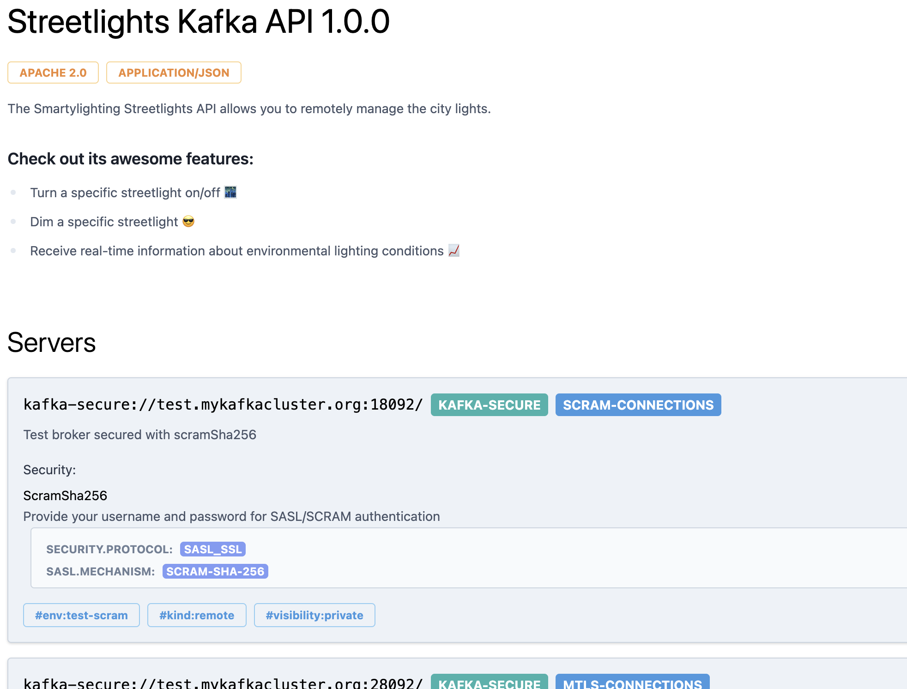
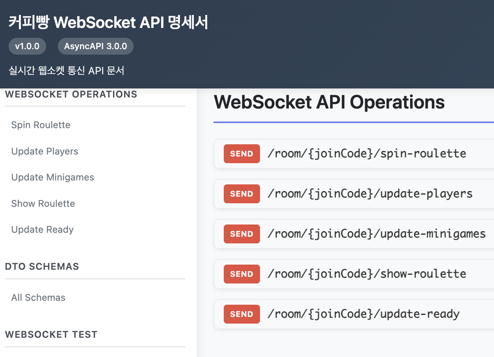
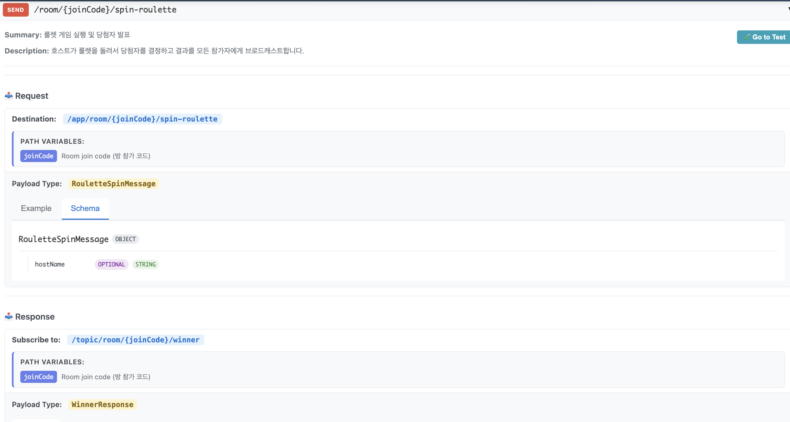
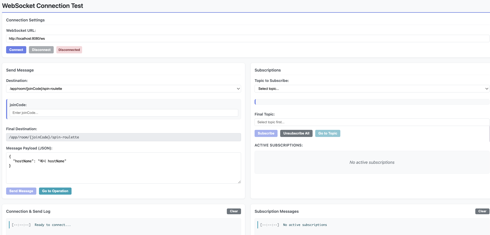

# 웹소켓 명세 자동화 - 코드가 곧 문서가 되는 방법

## 서론
> "명세서 업데이트 좀 해주세요."

오늘 세 번째 받은 슬랙 메시지다. 내일 스프린트 데모를 앞둔 상황.

코드는 이미 배포됐지만 명세서는 지난주 버전을 가리키고 있었다. 프론트엔드 개발자는 30분째 존재하지 않는 필드를 찾으며 디버깅 중이었다.

웹소켓 명세서는 왜 이렇게 관리하기 어려울까.

실시간 미니게임 서비스를 만들면서 웹소켓을 도입했다. REST API였다면 Swagger로 명세를 자동 생성할 수 있었을 것이다. 코드에 어노테이션 몇 개만 달면 알아서 API 문서가 만들어진다.

그런데 웹소켓에는 Swagger 같은 게 없었다.

정확히 말하면 웹소켓 명세 자동화의 표준이 없었다. REST API가 수십 년간 쌓아온 생태계와 달리, 웹소켓은 각자도생이었다. AsyncAPI라는 도구가 있긴 했지만, 치명적인 한계가 있었다.

YAML 파일을 수동으로 작성해야 한다는 것.

결국 Notion에 명세를 직접 작성하기 시작했다.

처음에는 괜찮았다. 이벤트 타입 5개, 개발자 3명. 이 정도는 수동으로 관리할 만했다.

그런데 프로젝트가 커지면서 문제가 터지기 시작했다.

- 필드명을 `userId`에서 `memberId`로 변경 → 명세는 여전히 `userId`
- 새로운 이벤트 타입 추가 → 명세에는 누락
- 응답 형식 변경 → 클라이언트는 옛날 형식으로 파싱 시도

기능 개발에 몰두하다 보니 명세 업데이트는 자꾸 뒷전이 됐다.

"나중에 한 번에 업데이트하지 뭐"라는 생각이 쌓이면서, 어느새 명세서는 코드와 완전히 다른 평행세계가 되어버렸다.

클라이언트 팀의 불만이 커졌다. 명세서 업데이트 요청이 하루에도 몇 번씩 날아왔다.

프론트엔드 개발자들은 웹소켓 연결을 시도할 때마다 "이 명세 믿어도 되나요?"라고 재차 확인했다.

신뢰는 바닥을 쳤다. 더 이상 수작업으로는 안 되겠다는 생각이 들었다.

코드가 곧 명세가 되어야 했다. Swagger가 REST API에 해주는 것처럼.

코드베이스에서 자동으로 명세를 생성하는 시스템. 코드가 바뀌면 명세도 바뀌는. 100% 동기화.

하지만 그런 도구는 없었다. 직접 만들어야 했다.

이 글은 웹소켓 명세 자동화를 맨땅에서 구축한 기록이다.

삽질했던 것들, 실패했던 접근들, 그리고 마침내 찾은 해법을 담았다.

---

## 본론
### 1. 기존 도구는 왜 안 될까

먼저 구글링을 시작했다. "websocket documentation tool", "websocket api spec"... 분명 누군가는 이 문제를 해결했을 거라고 생각했다.

#### AsyncAPI: YAML을 수동으로 작성하는 문제

AsyncAPI를 발견했다. 웹소켓의 Swagger를 지향하는 오픈소스 프로젝트였다.

작동 방식은 간단했다. YAML 파일로 명세를 작성하면 멋진 GUI 문서를 자동으로 생성해준다.
```yml
asyncapi: 3.0.0
channels:
  /room/{joinCode}:
    messages:
      JoinRoom:
        payload:
          type: object
          properties:
            userId:
              type: string
```

이 YAML을 AsyncAPI Generator에 넣으면 Swagger UI처럼 보기 좋은 문서가 생성된다.



"이거다!" 싶었는데, 5분 만에 실망했다.

이 YAML을 누가 작성하냐는 거였다. 수동으로 작성해야 했다. 코드에서 자동 생성이 안 됐다.

결국 원점이었다.

코드를 수정하면 YAML도 수동으로 수정해야 하고, 그러다 보면 또 불일치가 생긴다.

Notion에서 AsyncAPI로 플랫폼만 바뀌었을 뿐, 근본적인 문제는 그대로였다.

### 2. 자동화 시도: AI와 라이브러리

#### AI로 YAML 생성 시도

2025년이잖아. AI가 코딩도 하는 시대에 YAML 하나 못 만들까 싶었다.

생각해보니 간단했다. 빌드된 코드를 AI에게 읽혀서 YAML을 자동 생성하면 되는 거 아닌가.

1. 빌드된 코드를 Gemini CLI에 넣는다
2. "웹소켓 엔드포인트 찾아서 YAML 만들어줘"라고 요청한다
3. 완벽한 YAML이 나온다
4. AsyncAPI Generator로 문서를 생성한다

이론상으로는 완벽해 보였다.

그런데 실전은 달랐다.

처음에는 간단하게 물어봤다:

```bash
$ gemini-cli "이 코드에서 웹소켓 엔드포인트 찾아서 AsyncAPI YAML 만들어줘"
```

결과는 엉망이었다.

```yaml
# Gemini가 생성한 YAML
asyncapi: 2.6.0  # X 우리는 3.0.0 필요
channels:
  /room:
    schema:  # X 3.0.0에는 schema 속성 없음
      type: object
```
AsyncAPI Generator에 넣자마자 에러가 발생했다.

"프롬프트를 더 정교하게 만들면 되겠지."

`prompts.txt` 파일에 규칙을 빼곡히 적었다:

- AsyncAPI 3.0.0 버전 기준으로 작성
- schema 속성 사용 금지
- @MessageMapping 어노테이션이 달린 메서드만 읽기
- 다음 예시와 동일한 형식으로 작성

나름 완성도는 높아졌다.

그런데 문제가 있었다. 같은 코드베이스, 같은 프롬프트인데도 매번 결과가 달랐다:

- 1회 실행: 완벽한 YAML
- 2회 실행: 3.0.0 규칙 무시, 2.6.0 문법 생성
- 3회 실행: 10개 엔드포인트 중 5개만 인식
- 4회 실행: "토큰 한도 초과"

매번 결과가 달랐다. 이건 프로덕션에 쓸 수 없다.

AI로는 신뢰할 수 있는 명세 자동화가 불가능하다는 결론에 도달했다.

#### 기존 라이브러리는 없을까

AI가 안 되면 기존 라이브러리는 어떨까 싶었다.

Spring Boot에는 Swagger를 자동 생성하는 `springdoc-openapi` 같은 라이브러리가 있다. 웹소켓도 비슷한 게 있지 않을까 싶어서 찾아봤다.

결과:

- Spring WebSocket용 AsyncAPI 자동 생성 라이브러리: 없음
- Annotation Processor 기반 도구: 없음
- 수동 YAML 작성 가이드만 수백 개

GitHub에 관련 이슈들이 몇 년째 열려있었지만, 실제로 구현한 사람은 없었다.

직접 만드는 수밖에 없겠다는 생각이 들었다.

### 3. 직접 만들기: 어노테이션 기반 자동화

더 이상 외부 도구에 의존할 수 없었다. 직접 만들기로 했다.

#### Swagger의 원리를 웹소켓에 적용하기

그런데 어떻게 만들지? Swagger의 원리를 생각해봤다.

Swagger는 어떻게 코드에서 명세를 자동 생성할까? 답은 어노테이션이다.

```java
@GetMapping("/users/{id}")
public User getUser(@PathVariable Long id) { ... }
```

`@GetMapping` 어노테이션을 읽어서 엔드포인트 정보를 파악하고, 파라미터와 리턴 타입을 분석해서 OpenAPI 명세를 만드는 거다.

같은 원리를 웹소켓에 적용하면 될 것 같았다.

#### 구현 과정

3단계로 나눠서 진행했다:

1. 커스텀 어노테이션 정의
2. 리플렉션으로 어노테이션 읽기
3. AsyncAPI YAML 생성

##### 1단계: 명세 정보를 담을 어노테이션 만들기

웹소켓 엔드포인트에 필요한 정보를 어노테이션으로 표현한다. 예를 들면 이런 식이다:

```java
@MessageMapping("/room/{joinCode}/update-players")
@MessageResponse(
    path = "/room/{joinCode}",
    returnType = List.class,
    genericType = PlayerResponse.class
)
@Operation(
    summary = "플레이어 목록 업데이트",
    description = "방의 플레이어 목록을 조회하여 브로드캐스트"
)
public void updatePlayers(@DestinationVariable String joinCode) {
    // 구현부...
}
```

2개의 커스텀 어노테이션을 만들었다:

| 어노테이션              | 역할       | Swagger 대응      |
| ------------------ | -------- | --------------- |
| `@Operation`       | 엔드포인트 설명 | `@Operation`    |
| `@MessageResponse` | 응답 형식 정의 | `@ApiResponse`  |

Swagger를 써본 개발자라면 바로 이해할 수 있는 구조다. 익숙한 방식이니까 러닝 커브도 낮다.

##### 2단계: 어노테이션 정보 수집하기

애플리케이션 시작 시점에 자동으로 명세를 생성하는 구조다.

Spring Boot가 시작될 때 모든 `@MessageMapping`을 스캔한다. 그리고 각 메서드에 달린 커스텀 어노테이션 정보를 읽어온다.

이때 Reflections 라이브러리를 활용했다:
```java
public class AsyncApiGenerator {
    private final Reflections reflections;
    
    public String generateAsyncapiYml() throws IOException {
        // 1. @MessageMapping이 달린 모든 메서드 찾기
        Set<Method> methods = reflections
            .getMethodsAnnotatedWith(MessageMapping.class);
        
        // 2. 각 메서드의 어노테이션 읽기
        for (Method method : methods) {
            MessageMapping mapping = method.getAnnotation(MessageMapping.class);
            Operation operation = method.getAnnotation(Operation.class);
            MessageResponse response = method.getAnnotation(MessageResponse.class);
            
            // 3. YAML 구조 생성
            generateChannelFor(mapping);
            generateOperationFor(operation, response);
        }
        
        return convertToYaml();
    }
}
```

Reflections는 Java의 리플렉션 API를 확장한 라이브러리다. 지정한 패키지 내 모든 어노테이션을 런타임에 스캔할 수 있어서, 웹소켓 엔드포인트 정보를 자동으로 수집할 수 있다.

##### 3단계: YAML로 변환하기

수집한 정보를 AsyncAPI 3.0.0 형식의 YAML로 변환한다.

예를 들어 이런 코드가 있다면:

```java
@MessageMapping("/room/{joinCode}/start")
@MessageResponse(
    path = "/room/{joinCode}",
    returnType = GameStartResponse.class
)
@Operation(summary = "게임 시작", description = "게임을 시작합니다")
public void startGame(
    @DestinationVariable String joinCode,
    GameStartRequest request
) { ... }
```

다음과 같은 AsyncAPI YAML이 자동으로 생성된다:

```yaml
asyncapi: 3.0.0
channels:
  /app/room/{joinCode}/start:
    messages:
      GameStartRequest:
        payload:
          $ref: '#/components/schemas/GameStartRequest'

operations:
  /room/{joinCode}/start:
    action: send
    channel:
      $ref: '#/channels/~1app~1room~1{joinCode}~1start'
    summary: 게임 시작
    description: 게임을 시작합니다
    reply:
      channel:
        $ref: '#/channels/~1topic~1room~1{joinCode}'
      messages:
        - $ref: '#/components/messages/GameStartResponse'

components:
  schemas:
    GameStartRequest:
      type: object
      properties:
        difficulty:
          type: string
    GameStartResponse:
      type: object
      properties:
        sessionId:
          type: string
        startTime:
          type: string
```

코드와 완벽하게 동기화된 명세가 자동으로 만들어진다.

### 4. 구현 중 만난 문제들

여기까지는 순조로웠다. 그런데 본격적으로 구현을 시작하니 예상 못한 문제들이 튀어나왔다.

#### 문제 1: 제네릭 타입 표현

첫 번째 문제는 제네릭 타입이었다.

웹소켓 응답이 `List<PlayerResponse>` 형태라고 해보자. 이걸 어노테이션에 어떻게 표현할까?

처음에는 이렇게 하려고 했다:

```java
@MessageResponse(returnType = List<PlayerResponse>.class)  // ❌ 컴파일 에러
public void updatePlayers(...) { }
```

안 된다. Java 어노테이션에서는 제네릭 타입을 직접 명시할 수 없다. `List<PlayerResponse>.class` 같은 표현은 불가능하다.

그래서 타입을 분리했다:

```java
@MessageResponse(
    returnType = List.class,       // 외부 타입
    genericType = PlayerResponse.class  // 내부 제네릭 타입
)
public void updatePlayers(...) { }
```

`returnType`과 `genericType`을 따로 받아서 내부적으로 조합하는 방식으로 해결했다.

그런데 이 조합을 YAML 키로 만들 때도 문제가 있었다. 단순하게 `.toString()`으로 변환하면:

```java
String typeName = type.toString();
// 결과: "List<com.example.PlayerResponse>"
```

`<>` 특수문자가 들어있어서 YAML 키로 사용할 수 없다. 그래서 특수문자를 제거하는 로직을 추가했다:

```java
private String getSimpleTypeName(Type type) {
    String typeString = type.toString();

    if (typeString.contains("<")) {
        // List<PlayerResponse> → "List_PlayerResponse"
        int start = typeString.indexOf('<') + 1;
        int end = typeString.lastIndexOf('>');
        String inner = typeString.substring(start, end);
        String simpleInner = inner.substring(inner.lastIndexOf('.') + 1);
        String outer = typeString.substring(0, typeString.indexOf('<'));

        return outer + "_" + simpleInner;  // <> 대신 _ 사용
    }

    return typeString.substring(typeString.lastIndexOf('.') + 1);
}
```

`List<PlayerResponse>`를 `List_PlayerResponse`로 변환해서 YAML에서 사용 가능한 키를 만든다.

#### 문제 2: 파라미터 구분

두 번째 문제는 파라미터 구분이었다.

웹소켓 메서드를 보면 파라미터가 2종류 있다:

```java
public void method(
    @DestinationVariable String joinCode,  // ← 경로 파라미터
    PlayerRequest request                   // ← 메시지 바디
) { ... }
```

`joinCode`는 경로에 들어가는 파라미터고, `request`는 실제 메시지 본문이다.

AsyncAPI 명세에서 이 둘은 다르게 표현된다:

- **경로 파라미터** (`@DestinationVariable`) → `channel` 정의에 포함
- **메시지 파라미터** (일반 파라미터) → `payload` 스키마로 정의

어떻게 구분할까? 어노테이션으로 판별하면 된다.

```java
private boolean isDestinationVariable(Parameter parameter) {
    return Arrays.stream(parameter.getAnnotations())
        .anyMatch(ann -> ann.annotationType() == DestinationVariable.class);
}

// 사용
for (Parameter param : method.getParameters()) {
    if (isDestinationVariable(param)) {
        // channel 파라미터로 처리
    } else {
        // message payload로 처리
    }
}
```

간단하다. `@DestinationVariable` 어노테이션이 있으면 경로 파라미터고, 없으면 메시지 파라미터다.

#### 문제 3: JSON Schema 생성

세 번째 문제는 스키마 생성이었다.

응답 타입이 `PlayerResponse`라고 하자. AsyncAPI 명세에는 이 클래스의 필드 정보를 JSON Schema 형식으로 표현해야 한다.

```java
public class PlayerResponse {
    private String userId;
    private String nickname;
    private PlayerStatus status;  // Enum
}
```

이걸 다음 형식으로 변환해야 한다:

```yaml
PlayerResponse:
  type: object
  properties:
    userId:
      type: string
    nickname:
      type: string
    status:
      type: string
      enum: [READY, PLAYING, FINISHED]
```

리플렉션으로 필드를 읽어서 직접 파싱할 수도 있지만, 너무 복잡하다. 제네릭, Enum, 중첩 객체 등 고려할 게 많다.

대신 라이브러리를 활용했다.

victools의 JSON Schema Generator:

```java
SchemaGeneratorConfigBuilder configBuilder = 
    new SchemaGeneratorConfigBuilder(
        SchemaVersion.DRAFT_7, 
        OptionPreset.PLAIN_JSON
    )
    .without(Option.DEFINITIONS_FOR_ALL_OBJECTS)  // inline 스키마 생성
    .without(Option.EXTRA_OPEN_API_FORMAT_VALUES);

SchemaGenerator generator = new SchemaGenerator(configBuilder.build());

// 클래스 → JSON Schema 자동 변환
JsonNode schema = generator.generateSchema(PlayerResponse.class);
```

클래스를 넘기면 JSON Schema를 자동으로 만들어준다.

Enum도 알아서 처리하고, 직접 파싱하는 것보다 훨씬 안정적이다.

### 5. 완성: YAML에서 웹 문서까지

#### 전체 흐름

```
┌─────────────────────────────────────────┐
│  Spring Boot Application                │
│                                         │
│  @MessageMapping                        │
│  @Operation                             │
│  @MessageResponse                       │
└──────────────┬──────────────────────────┘
               │ 앱 시작 시
               ↓
┌─────────────────────────────────────────┐
│  AsyncApiGenerator                      │
│                                         │
│  1. Reflections로 어노테이션 스캔           │
│  2. 메타데이터 수집                         │
│  3. JSON 구조 생성 (Jackson)              │
│  4. YAML 변환 (jackson-dataformat-yaml)  │
└──────────────┬──────────────────────────┘
               ↓
┌─────────────────────────────────────────┐
│  asyncapi.yaml 파일 생성                  │
└──────────────┬──────────────────────────┘
               │
               │ 사용자가 /docs 접속
               ↓
┌─────────────────────────────────────────┐
│  DocsController                         │
│                                         │
│  1. YAML 파일 읽기                        │
│  2. 파싱 (Jackson YAML)                  │
│  3. Thymeleaf 템플릿에 전달                 │
└──────────────┬──────────────────────────┘
               ↓
┌─────────────────────────────────────────┐
│  웹소켓 명세 문서 렌더링 🎉                   │
│  (http://localhost:8080/docs)           │
└─────────────────────────────────────────┘
```

#### 핵심 구현 코드 구조

전체 `AsyncApiGenerator` 클래스는 500줄이지만 논리는 명확하다:

```java
public class AsyncApiGenerator {
    
    // 메타 정보 생성
    private JsonNode generateMeta() { ... }
    
    // Channel 정의 생성 (엔드포인트 경로)
    private JsonNode generateAppChannel() { ... }
    private JsonNode generateTopicChannel() { ... }
    
    // Operation 정의 생성 (send/receive 액션)
    private JsonNode generateSendOperation() { ... }
    private JsonNode generateTopicOperation() { ... }
    
    // Message 정의 생성 (payload 구조)
    private JsonNode generateMessage() { ... }
    
    // Schema 정의 생성 (DTO 클래스 구조)
    private JsonNode generateSchema() { ... }
    
    // 유틸리티
    private String getSimpleTypeName(Type type) { ... }
    private boolean isDestinationVariable(Parameter param) { ... }
}
```

각 메서드가 AsyncAPI의 한 섹션을 담당한다.

#### 결과

##### Thymeleaf로 문서 렌더링

YAML은 만들어졌다. 이제 이걸 보기 좋은 HTML 문서로 만들어야 한다.

AsyncAPI Generator CLI라는 공식 도구가 있긴 하다. 하지만 사용하지 않기로 했다.

이유는 다음과 같다:

1. **빌드 복잡도 증가**: CLI 도구는 Node.js 설치가 필요하다. Java 프로젝트에 Node.js를 추가하면 빌드 환경이 복잡해진다. 실제로 총 빌드 시간이 2분에서 3분 30초로 늘어났다.
2. **배포 환경 단순화**: 프로덕션 서버에 Node.js를 설치하고 싶지 않았다. Spring Boot만 있으면 되게 만들고 싶었다.

그래서 Thymeleaf로 직접 렌더링하기로 했다. 간단한 컨트롤러를 만들었다:

```java
@Controller
public class DocsController {

    @GetMapping("/docs")
    public String showDocs(Model model) throws IOException {
        // 1. 생성된 YAML 파일 읽기
        String yamlContent = new String(Files.readAllBytes(
            Paths.get("asyncapi.yaml")
        ));

        // 2. YAML 파싱
        ObjectMapper yamlMapper = new ObjectMapper(new YAMLFactory());
        Map<String, Object> asyncApiSpec = yamlMapper.readValue(
            yamlContent,
            new TypeReference<Map<String, Object>>() {}
        );

        // 3. Thymeleaf 템플릿에 데이터 전달
        model.addAttribute("spec", asyncApiSpec);
        return "asyncapi-docs";
    }
}
```

이제 `/docs` 경로로 접근하면 자동 생성된 명세 문서를 볼 수 있다.





Thymeleaf 템플릿은 어떻게 만들었을까?

AsyncAPI 스펙을 보면서 직접 HTML을 짜기에는 시간이 너무 오래 걸릴 것 같았다.

그래서 AI를 활용했다. Claude에게 AsyncAPI YAML 구조를 주고 "이걸 보기 좋게 렌더링하는 Thymeleaf 템플릿을 만들어줘"라고 요청했다. 기본 템플릿을 빠르게 생성하고, 세부적인 스타일링만 직접 수정했다.

AI는 명세 자동화에는 실패했지만, 이런 반복적인 작업에는 유용했다.

전체 흐름은 이렇다:

1. Spring Boot 애플리케이션 시작
2. `AsyncApiGenerator`가 자동 실행되어 코드를 스캔
3. 최신 YAML 파일 생성 (asyncapi.yaml)
4. `/docs` 접속 시 Thymeleaf가 YAML을 읽어서 HTML로 렌더링

완전 자동화됐다. 개발자는 어노테이션만 추가하면, 앱 재시작 후 `/docs`에서 최신 명세를 확인할 수 있다.

### 6. 도입 효과: 숫자로 보는 변화

명세 자동화 도입 2주 후 측정 가능한 변화가 나타났다.

#### 팀 생산성 지표

| 지표             | Before | After   | 개선율       |
| -------------- | ------ | ------- | --------- |
| **명세 업데이트 시간** | 30분/건  | 0분 (자동) | ⚡ 100%    |
| **코드-명세 불일치**  | 주 3-5회 | 0회      | ✅ 100%    |
| **클라이언트 문의**   | 하루 4건  | 주 1건 미만 | 📉 95% 감소 |
| **API 통합 시간**  | 2-3시간  | 30분     | ⏱️ 75% 단축 |


### 7. 한계와 개선 방향

현재 구현의 한계와 앞으로 나아갈 방향이다.

#### 아직 부족한 점

1. **Spring Boot 의존성**  
   - 현재 구현은 Spring WebSocket에 특화
   - 다른 프레임워크(Ktor, Express.js)는 지원 안 됨

2. **빌드 타임 생성 불가**  
   - 런타임에 리플렉션으로 생성
   - 컴파일 타임 생성(Annotation Processor)이 더 효율적

3. **복잡한 제네릭 한계**
    - `Map<String, List<User>>` 같은 중첩 제네릭은 처리 어려움
    - 현재는 2depth까지만 지원

#### 개선 계획

이 도구를 다른 팀에도 적용하려면 프레임워크 독립적인 구조로 발전시켜야 한다.

지금은 Spring Boot 기반이지만, Annotation Processor를 활용하면 더 범용적으로 만들 수 있다.

관심 있다면 [GitHub 저장소](https://github.com/20HyeonsuLee/websocket-docs-generator)를 참고하자.

## 배운 것들

### 1. 완벽한 도구를 기다리지 말 것

AsyncAPI가 완벽하길 기다렸다면 지금도 Notion에서 수동 작업 중이었을 것이다.

필요하면 만들자. 생각보다 어렵지 않다.

### 2. AI를 적재적소에 사용할 것

AI로 명세 자동화를 시도했지만 실패했다. 반면 Thymeleaf 템플릿 생성은 성공했다.

차이는 뭘까?

- **명세 자동화**: 결정론적 결과 필요. 같은 코드 → 항상 같은 YAML
- **템플릿 생성**: 초기 boilerplate 작성. 한 번 만들고 수정

AI는 정확성보다 속도가 중요한 작업에 적합하다. 핵심 로직에는 여전히 결정론적 코드가 필요하다.

### 3. 좋은 문서는 팀 전체의 생산성을 높인다

명세서 자동화는 문서 작성 시간 절약 이상의 가치가 있다.

팀 전체의 생산성과 신뢰를 회복시킨다:

- 백엔드: 명세 작성 스트레스 제거, 개발에 집중
- 프론트엔드: 확실한 명세로 빠른 통합, 디버깅 시간 단축
- QA: 명확한 스펙으로 테스트 효율 향상

좋은 개발자 경험은 결국 좋은 제품으로 이어진다.

---

## 마치며

"명세서 업데이트 좀 해주세요"

이 슬랙 메시지로 시작된 이야기가 여기까지 왔다.

지금은 이 메시지를 받지 않는다. 코드를 수정하면 명세도 자동으로 바뀐다. 프론트엔드 개발자는 명세를 믿고 개발한다.

AsyncAPI도 해결 못 한 문제, AI도 해결 못 한 문제를 직접 해결했다. 어노테이션과 리플렉션이라는 단순한 원리로.

2주 만에 MVP를 만들고, 팀 피드백으로 발전시켰다. 완벽하지 않지만 충분히 유용하다.

완벽한 도구를 기다리지 말자. 필요하면 만들면 된다. 생각보다 어렵지 않다.

---

**전체 코드:**
🔗 [github.com/20HyeonsuLee/websocket-docs-generator](https://github.com/20HyeonsuLee/websocket-docs-generator)